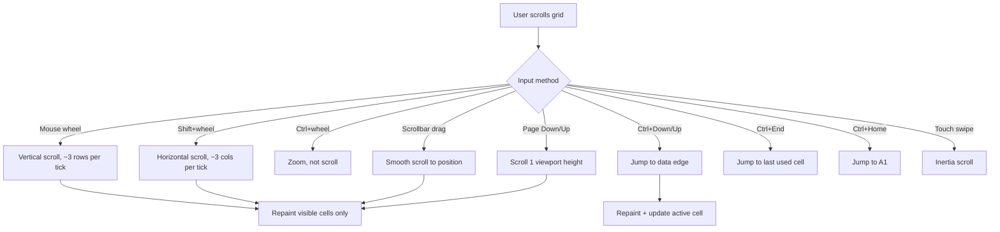
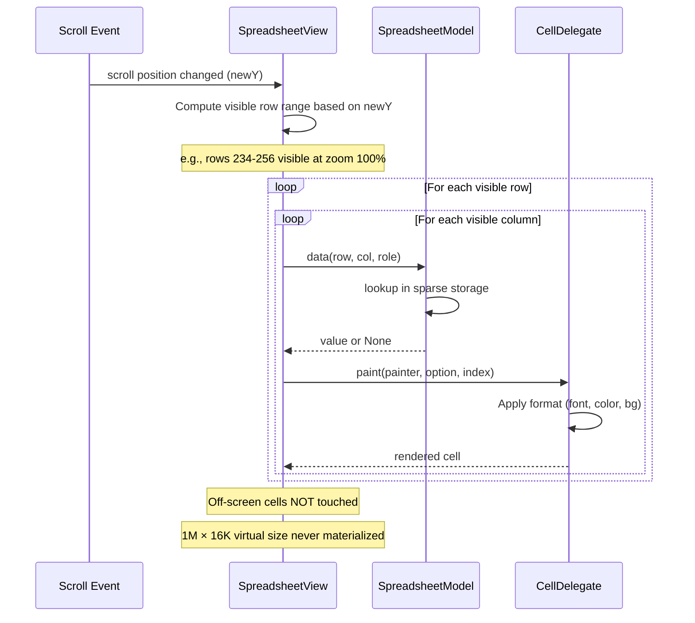

# UX Flow — Spec 01 Grid Engine

> Spec gốc: [../01-grid-engine.md](../01-grid-engine.md)

## Grid anatomy

```
┌──────────────────────────────────────────────────────────────────────────────┐
│  Name Box    │  Formula Bar                              [fx]                 │
│  [B5      ▼] │  =SUM(A1:A10)                                                  │
├──────────────┴────────────────────────────────────────────────────────────────┤
│ ╳ │  A  │   B  │   C   │   D    │   E    │   F   │   G    │  H    │ ... ⏵   │ ← Column header row
├───┼─────┼──────┼───────┼────────┼────────┼───────┼────────┼───────┤───────────┤
│ 1 │     │      │       │        │        │       │        │       │           │
├───┼─────┼──────┼───────┼────────┼────────┼───────┼────────┼───────┤           │
│ 2 │     │      │       │        │        │       │        │       │           │
├───┼─────┼──────┼───────┼────────┼────────┼───────┼────────┼───────┤           │
│ 3 │     │      │       │        │        │       │        │       │           │
├───┼─────┼──────┼───────┼────────┼────────┼───────┼────────┼───────┤           │
│ 4 │     │      │       │        │        │       │        │       │           │
├───┼─────┼──━━━━┯━━━━━━━┼────────┼────────┼───────┼────────┼───────┤           │
│ 5 │     │     ┃ active┃        │        │       │        │       │           │
├───┼─────┼─────┺━━━━━━━┼────────┼────────┼───────┼────────┼───────┤           │
│ ⋮ │     │      │       │        │        │       │        │       │           │
├───┴─────┴──────┴───────┴────────┴────────┴───────┴────────┴───────┴───────────┤
│  ◄ Scroll horizontal ►                                                         │ ← Horizontal scrollbar
├────────────────────────────────────────────────────────────────────────────────┤
│ [Sheet1][Sheet2][+]                                                            │ ← Sheet tabs
├────────────────────────────────────────────────────────────────────────────────┤
│ Ready    Count:1                                       [⊟][▦][▢]  100% [-][+]│ ← Status bar
└────────────────────────────────────────────────────────────────────────────────┘
     ▲                                                              ▲
   Select All corner                                          Vertical scrollbar
```

## Grid limits

```
Standard Excel grid (xlsx, since 2007):
- Rows:        1,048,576 (1M, 2^20)
- Columns:     16,384 (16K, 2^14, columns A through XFD)
- Cell limit:  ~17 billion cells per sheet
- Sheets per workbook: limited by available memory
- Cell content: 32,767 chars max
- Formula length: 8,192 chars
- Column width: 0-255 (chars at default font)
- Row height: 0-409 (points)

When opening older .xls (97-2003):
- Rows:        65,536
- Columns:     256 (A-IV)
- Sheets:      255 max
- Cell content: 32,767 chars (but display limit 1,024)
- Excel switches to "Compatibility Mode" — title bar shows "[Compatibility Mode]"
```

## Cell address conventions

```
A1 reference style (default):
- Columns: letters A-Z, AA-AZ, ..., XFD
- Rows: numbers 1-1048576
- Examples: A1, B27, XFD1048576

R1C1 reference style (option, File → Options → Formulas):
- Both columns and rows use numbers
- R[1]C[1] = relative offset (1 row down, 1 col right from current)
- R1C1 = absolute reference to row 1, col 1
- Toggle: tools also accept R1C1 in named range definitions

Column letter algorithm:
- A=1, B=2, ..., Z=26
- AA=27, AB=28, ..., AZ=52
- BA=53, ..., ZZ=702
- AAA=703, ..., XFD=16384
```

## Viewport scrolling



## Lazy rendering (virtualization)



## Sparse storage model

```
Underlying data structure:

cells: dict[(row, col), Cell]
  ↑
  Only cells with values stored.
  Empty cells: not in dict → returns None on lookup.

class Cell:
  value: int | float | str | bool | datetime | LinkedDataValue | None
  formula: str | None        # if formula-driven
  format: FormatDict          # font, bg, border, number_format, alignment
  
Memory: 1M empty rows × 16K empty cols = 0 bytes
Memory: 10k cells with values × ~200 bytes = ~2 MB

For dense regions, optionally upgrade to:
  pandas DataFrame backing (rows × cols numpy array)
```

## Column width / Row height

```
Default:
- Column width: 8.43 chars (~64 px at default 100% zoom)
- Row height: 15 points (~20 px)
- Font default: Aptos Narrow 11pt (modern Excel; was Calibri 11pt pre-2024)

User adjustment:
- Hover col/row border → cursor changes to ⮜⮞ (col) / ⮝⮟ (row)
- Drag → live resize
- Double-click border → AutoFit to widest cell in column
- Right-click col header → Column Width... → numeric input dialog

Stored per-sheet:
sheet.col_widths: dict[col_idx, width]   # only non-default
sheet.row_heights: dict[row_idx, height] # only non-default
```

## Frozen panes interaction

```
When freeze applied (Spec 14):
- Frozen top rows + left columns stay visible during scroll
- Visible region = frozen rows + scrolled rows × frozen cols + scrolled cols
- Repaint logic: 4 quadrants (NW frozen / NE rows scrolled / SW cols scrolled / SE scrolled both)
```

## Hidden rows/columns

```
Hidden rows/cols:
- Excluded from view (zero pixel height/width)
- Row/col number jumps in header (e.g., 5, 6, 8 — row 7 hidden)
- Header numbers show as blue when adjacent to hidden
- Hidden cells STILL participate in formulas (unless using SUBTOTAL/AGGREGATE)
- Selection extends across hidden cells (can select hidden range, formulas work)

Toggle:
- Right-click row/col → Hide / Unhide
- Ctrl+9 hide row, Ctrl+Shift+9 unhide row
- Ctrl+0 hide col, Ctrl+Shift+0 unhide col
- Filter (Spec 15) also hides rows (different mechanism — sets row_hidden_by_filter flag)
```

## Active cell rendering

```
Active cell (cursor) drawn:
1. Default state: 2px solid #217346 (Excel green) border around cell
2. Edit state: cursor blinking inside; border slightly thicker
3. Fill handle: 6×6 px square at bottom-right corner (#217346)
4. Hover cursor on fill handle: black "+" cross (vs hand cursor when over text)

Selection (multi-cell):
- Light fill #E7F1FB on all selected cells (~20% opacity blue)
- Active cell within selection: WHITE bg (highlighted within selection)
- Outer border: 2px solid #217346 around bounding rect of selection
```

## Repaint optimization

```mermaid
flowchart TD
    A[Cell data changed] --> B{Identify dirty region}
    
    B --> C[Direct change → dirty = {(r,c)}]
    B --> D[Formula changed → dirty = {(r,c)} ∪ dependents]
    B --> E[Format changed → dirty = changed cells]
    B --> F[Insert row/col → dirty = entire visible viewport (refs shift)]
    
    C --> G[Compute affected rect in viewport]
    D --> G
    E --> G
    F --> H[Full viewport repaint]
    
    G --> I[Check if rect intersects viewport]
    I -->|Yes| J[QWidget.update(dirty_rect)]
    I -->|No| K[Skip - off-screen, will repaint when scrolled to]
```

## High-DPI awareness

```
On HiDPI displays (Windows scaling 125%, 150%, 200%):

- Default cell pixel size scales up
- Fonts use Qt's automatic scaling (devicePixelRatio aware)
- Borders 1px logical → 1.25/1.5/2 physical px (anti-aliased)
- Icons in headers/buttons: use SVG or 2x bitmap fallback

QWidget configuration:
- AA_EnableHighDpiScaling attribute
- Pixmaps: QPixmap.setDevicePixelRatio()
```

## Touch & pen interaction

```
Touch device (laptop with touchscreen):
- Single tap → select cell (like mouse click)
- Long press → context menu (like right-click)
- Two-finger pinch → zoom
- Two-finger swipe → scroll
- Drag with one finger → select range
- Drag from corner of selection → extend / fill handle
- Pen hover → preview cursor; tap = click

Touch mode (View → Touch/Mouse):
- Larger ribbon buttons
- Bigger fill handle (12×12 instead of 6×6)
- Wider scrollbars
```

## Implementation hints cho Slave

- **View widget**: `QTableView` (or custom `QAbstractItemView`).
- **Model**: `class SpreadsheetModel(QAbstractTableModel)`:
  ```python
  class SpreadsheetModel(QAbstractTableModel):
      def rowCount(self, parent): return 1_048_576  # virtual
      def columnCount(self, parent): return 16_384
      
      def data(self, index, role):
          cell = self._cells.get((index.row(), index.column()))
          if role == Qt.DisplayRole: return cell.formatted_value if cell else ""
          if role == Qt.BackgroundRole: return cell.bg if cell else None
          ...
  ```
- **Delegate**: `class CellDelegate(QStyledItemDelegate)` overrides `paint()` for custom borders, fill handle, error triangles, CF.
- **Lazy load**: model.data() called only for visible cells (Qt handles by default for QTableView).
- **Column width**: `view.setColumnWidth(col, px)`; persist sparse dict in model.
- **Row height**: similarly.
- **Auto-fit**: compute max text width across column → setColumnWidth.
- **Hidden rows/cols**: `view.setRowHidden(row, True)` and `view.setColumnHidden(col, True)`.
- **Scroll**: `QScrollBar` set range to model dimensions; pixel-per-row computed from row heights.
- **Zoom**: scale `view.setStyleSheet` font-size + recompute col widths/row heights.
- **Selection model**: `view.selectionModel().select(QItemSelection, mode)`.
- **Active cell border**: in delegate, when `index == view.currentIndex()` → draw 2px QPen border.
- **Fill handle**: in delegate, draw 6×6 rect at bottom-right of active cell.
- **Touch detection**: `QInputDevice.devices()` check; toggle UI mode.
- **HiDPI**: enable `Qt.AA_EnableHighDpiScaling` in `QApplication` setup.
- **Performance benchmarks**:
  - 100% empty grid: instant scroll any direction.
  - 100k cells with formulas: scroll < 16ms (60fps).
  - 1M cells with CF: scroll < 32ms (30fps).
