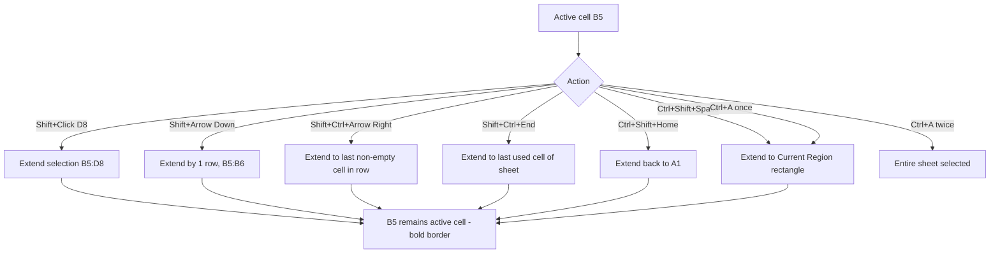
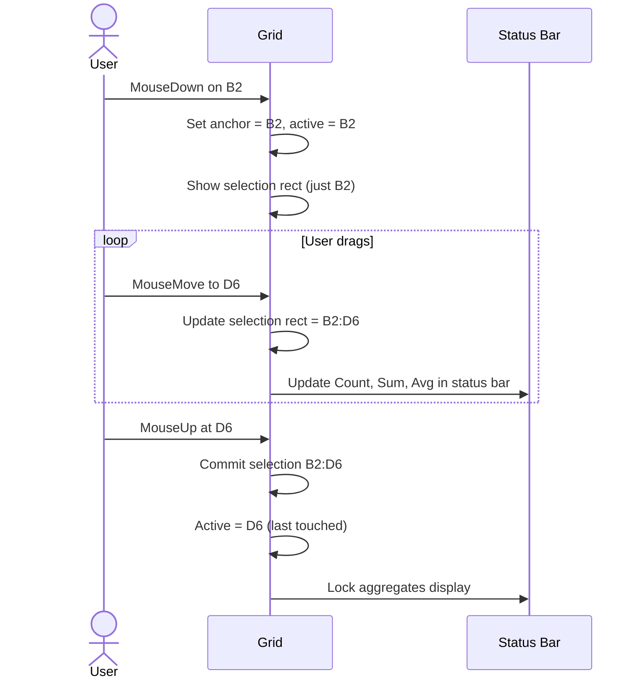
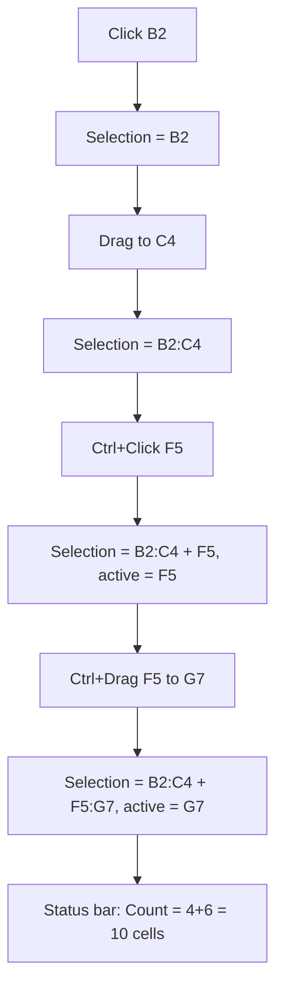
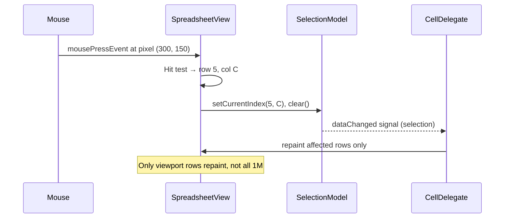

# UX Flow — Spec 02 Cell System & Selection

> Spec gốc: [../02-cell-system.md](../02-cell-system.md)

## Selection states & visual

```
1. Single active cell (READY mode):
   ┌────┬────┬────┐
   │    │    │    │
   ├────┼━━━━┼────┤
   │    ┃ B2 ┃    │ ← active cell có border xanh đậm 2px
   ├────┼━━━━┼────┤   + fill handle ▪ góc dưới phải
   │    │    │    │
   └────┴────┴────┘

2. Multi-cell contiguous range:
   ┌────┬━━━━┯━━━━┓
   │    ┃ B1 │ C1 ┃ ← active cell B1 (đậm hơn)
   ├────┃━━━━┿━━━━┃  
   │    ┃ B2 │ C2 ┃ ← rest highlighted lighter
   ├────┃━━━━┿━━━━┃
   │    ┃ B3 │ C3 ┃
   └────┺━━━━┷━━━━┛ ← fill handle góc dưới phải vùng chọn

3. Non-contiguous (Ctrl+Click):
   ┌────┬━━━━┓────┬━━━━┓
   │    ┃ B1 ┃    ┃ D1 ┃
   ├────┺━━━━┛────┺━━━━┛
   │    │    │    │    │
   ├────┬━━━━┓────┬────┤
   │    ┃ B3 ┃    │    │
   └────┺━━━━┛────┴────┘

4. Entire column (click col header):
   A  ┃━B━┃ C  D
   ━━━┃━━━┃━━━━━
   1  ┃   ┃
   2  ┃   ┃
   3  ┃   ┃
   ... ┃ all ┃ rows selected

5. Entire row (click row header):
   ━━━━━━━━━━━━━━━━━━━━━
    A   B   C   D   ...
   ━━━━━━━━━━━━━━━━━━━━━
   ┃ 5 │ 5 │ 5 │ 5 │  ┃ ← row 5 fully selected
   ━━━━━━━━━━━━━━━━━━━━━

6. Select All (Ctrl+A / corner button):
   All cells in sheet highlighted
```

## Selection extension flows



## Mouse drag selection



## Name Box selection input

```
User type "B5:D10" into Name Box, press Enter:
┌──────────────────────────────────┐
│ B5:D10           ▼ | fx | ...    │
└──────────────────────────────────┘

→ Grid selects range B5:D10, scrolls if needed, active cell = B5

User type "Sales[Revenue]" (named table column):
→ Selects all cells in Sales table's Revenue column

User type "MyRange" (named range):
→ Selects what MyRange refers to
```

## Ctrl+Click multi-range



## Current Region (Ctrl+Shift+*)

```
Data layout:
   A    B    C    D    E
1  ID   Name Qty  Price        ← header row
2  1    A    10   100
3  2    B    20   200
4  3    C    30   300
5                              ← blank row
6  4    D    40   400

User clicks B3, presses Ctrl+Shift+*:
→ Selects A1:D4 (current region surrounding B3, bounded by blanks)
→ Row 5 excluded (blank), Row 6 excluded (separate region)
```

## Copy direction during selection

```
Anchor B2, drag MouseDown→Move D5:
selection.top    = min(B2.row, D5.row) = 2
selection.left   = min(B, D)           = B
selection.bottom = max(2, 5)            = 5
selection.right  = max(B, D)            = D
→ Final selection B2:D5

Drag from D5 → B2 (reverse):
→ Same final rectangle B2:D5
→ But active cell stays where mouse currently is (D5 if just released there)
```

## Selection performance hot-path



## Implementation hints cho Slave

- **QItemSelectionModel** built-in: dùng `selectionModel.select(QItemSelection, SelectionFlag)`.
- **Multi-range support**: native Qt selection model handles disjoint ranges via `QItemSelection.merge()`.
- **Active cell vs anchor**: `currentIndex` is active (where typing goes), separate from selection. Selection anchor = first cell in selection.
- **Border drawing trong CellDelegate.paint()**:
  - Selected cells: light fill `#E7F1FB` (Excel-like).
  - Active cell: 2px solid `#217346` border.
  - Selection outer border: 2px solid `#217346` around bounding rect.
- **Fill handle**: small black/green square 6x6 px tại góc dưới phải; hit area extended 12x12 cho mouse.
- **Status bar update**: connect `selectionChanged` signal → recompute Count/Sum/Avg/Min/Max in worker thread for large selections (>10k cells).
- **Ctrl+A logic**:
  - First press: select current region (Ctrl+Shift+*)
  - Second consecutive press: select entire sheet
  - Reset counter on any other action.
- **Performance**: cho 1M × 16k cells, KHÔNG materialize selection as cell list; lưu as `list[QRect]` ranges. Iterate khi cần aggregate.
