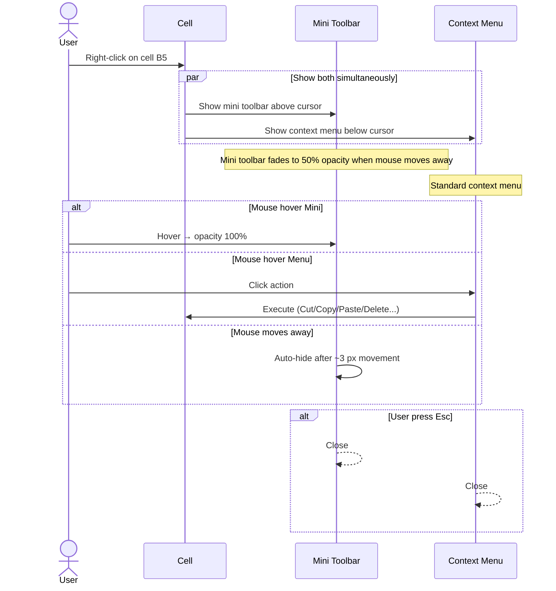
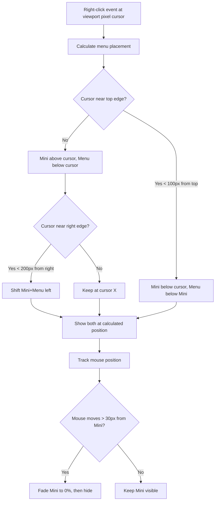

# UX Flow — Spec 06 Context Menus & Mini Toolbar

> Spec gốc: [../06-context-menus.md](../06-context-menus.md)

## Right-click flow



## Cell context menu layout

```
Right-click cell:
┌─ Mini Toolbar ──────────────────────────┐
│ [Aptos Narrow ▼][11▼] [B][I][U] [▢▢▢]  │
│ [▼Border ▼][▼Fill ▼][% , $] [↗↙↑↓]      │
└──────────────────────────────────────────┘

┌─ Context Menu ──────────────────────────┐
│ ✂  Cut                          Ctrl+X  │
│ 📋 Copy                         Ctrl+C  │
│ 📋 Paste Options:                       │
│    [📋][123][fx][T] [A][⤴][🔗][📷]      │ ← icon-bar inline
│ ── Paste Special...             Ctrl+Alt+V │
│ ──────────────────────────────────────  │
│ 🔍 Smart Lookup                          │
│ 📊 Get Data from Picture ▶              │ ← submenu
│ ──────────────────────────────────────  │
│ ➕ Insert...                             │
│ ❌ Delete...                             │
│ 🧹 Clear Contents                       │
│ ──────────────────────────────────────  │
│ ⚡ Quick Analysis      Ctrl+Q           │
│ 🔢 Sort                              ▶ │
│ 🔽 Filter                            ▶ │
│ 💬 New Comment        Ctrl+Shift+M      │
│ 📌 New Note           Shift+F2          │
│ ──────────────────────────────────────  │
│ 🎨 Format Cells...    Ctrl+1            │
│ 📏 Row Height...                        │
│ 📐 Column Width...                      │
│ 🎯 Pick From Drop-down List             │
│ 🔤 Define Name...                       │
│ 🔗 Hyperlink...       Ctrl+K            │
│ ──────────────────────────────────────  │
│ 👁 View More Cell Actions ▶             │ ← extended actions
└──────────────────────────────────────────┘
```

## Row header context menu

```
Right-click row number "5":
┌─ Mini Toolbar (compact) ────┐
│ [Font][Size][B][Fill]        │
└──────────────────────────────┘

┌─ Context Menu ──────────────┐
│ ✂  Cut                       │
│ 📋 Copy                       │
│ 📋 Paste Options             │
│ ──────────────────────────── │
│ ➕ Insert (above row 5)      │
│ ❌ Delete (entire row)       │
│ 🧹 Clear Contents             │
│ 📏 Row Height...              │
│ 👁 Hide                       │
│ 👀 Unhide                     │
│ ──────────────────────────── │
│ 🎨 Format Cells...            │
└──────────────────────────────┘
```

## Column header context menu

```
Right-click column letter "C":
┌─────────────────────────────┐
│ ✂  Cut                       │
│ 📋 Copy                       │
│ 📋 Paste Options             │
│ ──────────────────────────── │
│ ➕ Insert (left of col C)    │
│ ❌ Delete (entire column)    │
│ 🧹 Clear Contents             │
│ 📐 Column Width...            │
│ 📏 AutoFit Column Width       │
│ 👁 Hide                       │
│ 👀 Unhide                     │
│ ──────────────────────────── │
│ 🎨 Format Cells...            │
│ 🔢 Group...                   │
│ 🔓 Ungroup...                 │
└──────────────────────────────┘
```

## Sheet tab context menu

```
Right-click sheet tab "Sheet1":
┌─────────────────────────────────────┐
│ ➕ Insert...                          │
│ ❌ Delete                             │
│ 🔄 Rename                             │
│ 📋 Move or Copy...                    │
│ 👁 View Code (Office Scripts)         │
│ 🔒 Protect Sheet...                   │
│ 🎨 Tab Color                       ▶ │ ← color picker submenu
│ 👁 Hide                               │
│ 👀 Unhide...                          │
│ ──────────────────────────────────── │
│ 🔘 Select All Sheets                  │
└───────────────────────────────────────┘
```

## Hyperlink/embed object context menus

```
Right-click on hyperlink cell:
┌─────────────────────────────┐
│ 🔗 Open Link                 │
│ 📋 Copy Link                  │
│ ✏ Edit Hyperlink...          │
│ 🗑 Remove Hyperlink           │
│ ────────────────────────────│
│ (rest of standard menu)      │
└──────────────────────────────┘

Right-click on chart:
┌────────────────────────────────┐
│ Cut/Copy/Paste                  │
│ ────────────────────────────── │
│ Reset to Match Style            │
│ Change Chart Type...            │
│ Save as Template...             │
│ Select Data...                  │
│ 3-D Rotation... (3D only)       │
│ Group ▶                         │
│ Bring to Front ▶                │
│ Send to Back ▶                  │
│ Assign Macro...                 │
│ ────────────────────────────── │
│ Format Chart Area...            │
└──────────────────────────────────┘
```

## Mini toolbar position logic



## Touch / pen long-press

```
On touch device:
- Long-press (500ms) → context menu opens at touch point
- Mini toolbar replaced by larger touch-friendly version
- Touch handles bigger (44x44 px instead of 6x6)
```

## Keyboard equivalent

```
Shift+F10 or Menu key → opens context menu at active cell location
(Same menu as right-click but no Mini Toolbar)
```

## Implementation hints cho Slave

- **Context menu**: `QMenu` per context type (cell/row/col/sheet/chart). Build dynamically based on selection state.
- **Mini Toolbar**: floating `QFrame` (frameless, translucent background), child widgets = `QToolButton` for each format action.
  - Position above cursor unless < 100px from top → below.
  - Opacity animation via `QGraphicsOpacityEffect` + `QPropertyAnimation`.
  - Fade out when mouse leaves bounding box + buffer.
- **Submenus**: `QMenu` nested via `addMenu()`.
- **Inline icon-bar trong menu** (Paste Options 8 icons): use `QWidgetAction` to embed custom widget inside `QMenu`.
- **Keyboard shortcuts**: bind `Shift+F10` and `QtKey.Key_Menu` to `customContextMenuRequested` signal.
- **Touch detection**: check `QInputDevice.deviceType() == TouchScreen` → use larger touch-friendly menu variant.
- **Performance**: lazy-build menu on right-click event, not eagerly on selection change.
