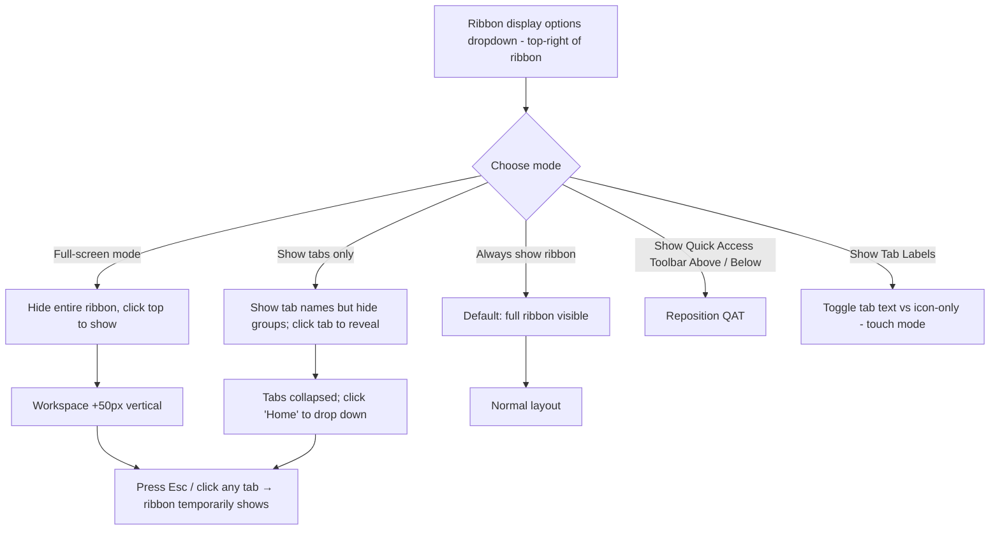
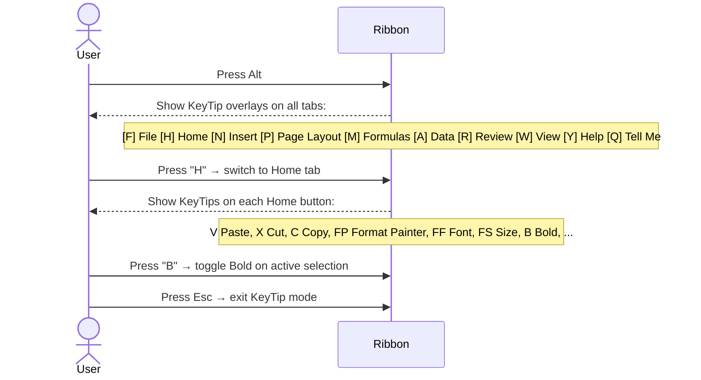
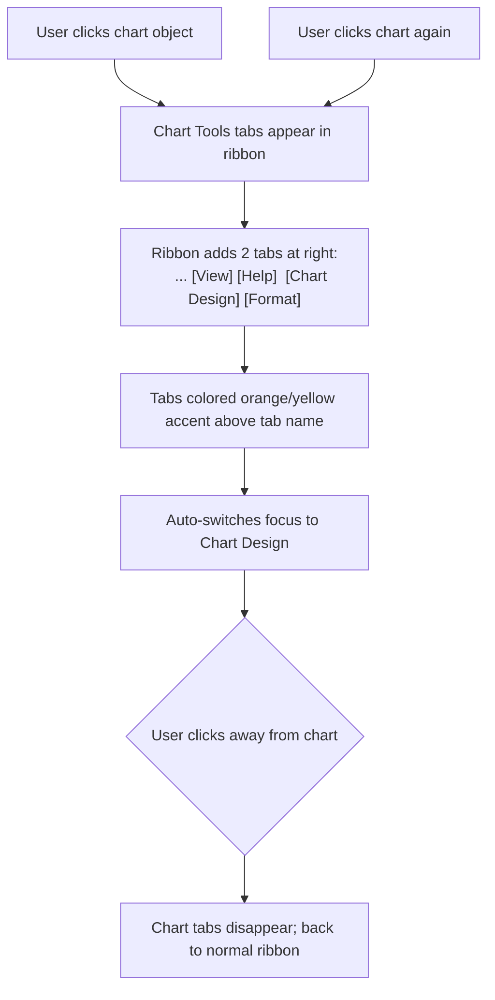

# UX Flow — Spec 07 Ribbon

> Spec gốc: [../07-ribbon.md](../07-ribbon.md)

## Full ribbon layout

```
┌─ Title Bar ──────────────────────────────────────────────────────────────┐
│ AutoSave ⬤  Sales.xlsx — Excel    🔍 [Search]    [👤 Sign in] [_][□][×]│
├────────────────────────────────────────────────────────────────────────────┤
│ [⬅] [↩↪] [📋][💾]                            (Quick Access Toolbar / QAT) │
├────────────────────────────────────────────────────────────────────────────┤
│ [File] [Home] [Insert] [Page Layout] [Formulas] [Data] [Review] [View] [Help] [Developer*] [Add-ins*]  [⬆ Collapse]│
├────────────────────────────────────────────────────────────────────────────┤
│  ┌─Clipboard─┐ ┌─Font──────────┐ ┌─Alignment─┐ ┌─Number─┐ ┌─Styles─┐ ... │
│  │ 📋 Paste  │ │[Aptos Narrow▼]│ │[≡ ≡ ≡ ≡] │ │[%,$.0]│ │[CF]    │     │
│  │ [✂][📋][🖌]│ │[11▼][B I U  ] │ │[↑↓][↕]   │ │  [▼]  │ │[Tbl]   │     │
│  │           │ │[▼Border▼Fill] │ │[Merge ▼] │ │       │ │[Cell]  │     │
│  └───────────┘ └────────────────┘ └────────────┘ └────────┘ └────────┘    │
└────────────────────────────────────────────────────────────────────────────┘
                ▼                                  ▼            ▼
              Group title (Clipboard)         Group title    Dialog launcher ⤡
```

## Tab anatomy (Home tab example)

```
┌─Home tab content──────────────────────────────────────────────────────────┐
│                                                                              │
│ ┌─Clipboard──┐ ┌─Font──────┐ ┌─Alignment─┐ ┌─Number──┐ ┌─Styles─┐ ┌─Cells─┐ ┌─Editing─┐│
│ │            │ │           │ │           │ │         │ │        │ │       │ │         ││
│ │  Large     │ │  Multi    │ │  Buttons  │ │ Format  │ │ CF /   │ │Insert │ │ Sort/   ││
│ │  Paste     │ │  rows of  │ │  for      │ │ pickers │ │ Table/ │ │Delete │ │ Filter  ││
│ │  icon w/   │ │  controls │ │  align    │ │         │ │ Styles │ │Format │ │ Find    ││
│ │  dropdown  │ │           │ │           │ │         │ │        │ │       │ │ AutoSum ││
│ │            │ │           │ │           │ │         │ │        │ │       │ │ Fill    ││
│ │ Cut Copy   │ │           │ │           │ │         │ │        │ │       │ │ Clear   ││
│ │ Painter    │ │           │ │           │ │         │ │        │ │       │ │         ││
│ │         ⤡  │ │       ⤡   │ │      ⤡    │ │   ⤡    │ │   ⤡    │ │   ⤡   │ │    ⤡    ││
│ └────────────┘ └────────────┘ └────────────┘ └─────────┘ └────────┘ └───────┘ └─────────┘│
│                                                                              │
│ ⤡ = Dialog launcher icon (opens corresponding dialog)                      │
└──────────────────────────────────────────────────────────────────────────────┘
```

## All tabs at a glance

```
┌──────────────────────────────────────────────────────────────────────────────┐
│ File         → Backstage view (Spec 51): Home, Info, New, Open, Save, ...    │
│ Home         → Most common formatting + clipboard + editing                   │
│ Insert       → Tables, Charts, PivotTable, Sparklines, Pictures, Symbols      │
│ Draw         → (touch device only) Pen, Eraser, Ink to Math                   │
│ Page Layout  → Themes, Page Setup, Scale to Fit, Print Area, Backgrounds      │
│ Formulas     → Function Library, Defined Names, Formula Auditing, Calc Opts   │
│ Data         → Get Data, Refresh, Sort/Filter, Data Tools, What-If, Outline   │
│ Review       → Spelling, Smart Lookup, Translate, Comments, Notes, Protect    │
│ View         → Workbook Views, Show, Zoom, Window, Macros, Sheet View         │
│ Help         → Help, Contact, Feedback, Show Training                         │
│ Developer*   → (opt-in) Code, Add-ins, Controls, XML                         │
│ Add-ins*     → Loaded JS add-ins surface here                                │
│ Power Pivot* │ → Data Model management (opt-in)                              │
│                                                                                │
│ Contextual tabs (appear when object selected):                                │
│ - Picture Format                                                              │
│ - Shape Format                                                                │
│ - Chart Design / Chart Format                                                 │
│ - PivotTable Analyze / Design                                                 │
│ - Table Design                                                                │
│ - Slicer / Timeline                                                           │
│ - Drawing Tools (Ink)                                                         │
│ - Header & Footer Tools                                                       │
│ - Equation Tools                                                              │
└──────────────────────────────────────────────────────────────────────────────────┘
```

## Ribbon display options



## Ribbon collapsed state

```
Show tabs only:
┌──────────────────────────────────────────────────────────┐
│ [File] [Home] [Insert] [Page Layout] [Formulas] [Data] ... │
└──────────────────────────────────────────────────────────────┘
(Only one row; no groups visible)

User clicks "Home" → drop-down ribbon panel:
┌──────────────────────────────────────────────────────────┐
│ [File] [Home] [Insert] [Page Layout] [Formulas] [Data] ... │
├──────────────────────────────────────────────────────────────┤
│  ┌─Clip─┐┌─Font─┐┌─Align─┐... [pin 📌]                   │ ← floating panel
│  └──────┘└──────┘└────────┘                                │
└──────────────────────────────────────────────────────────────┘
Click 📌 → "always show" (back to full mode)
Click outside or use another action → panel collapses again
```

## Quick Access Toolbar (QAT)

```
Top-left tiny toolbar (default position):
┌──────────────────────┐
│ [↺ AutoSave][📁][💾][↶][↷][⌧]  ▼ │
└──────────────────────────────────────┘

Dropdown ▼ = Customize QAT:
┌────────────────────────────────────┐
│ Customize Quick Access Toolbar      │
│ ☑ AutoSave                          │
│ ☑ Save                              │
│ ☑ Undo                              │
│ ☑ Redo                              │
│ ☐ New                               │
│ ☐ Open                              │
│ ☐ Email                             │
│ ☐ Quick Print                       │
│ ☐ Print Preview & Print             │
│ ☐ Spelling                          │
│ ☐ Sort Ascending                    │
│ ☐ Sort Descending                   │
│ ☐ Touch/Mouse Mode                  │
│ ──────────────────────────────────│
│ More Commands...                    │ ← opens full Customize dialog
│ Show Below the Ribbon               │
└──────────────────────────────────────┘

User can also right-click any ribbon button → "Add to Quick Access Toolbar"
```

## Customize Ribbon dialog

```
File → Options → Customize Ribbon (or right-click ribbon):

┌─ Excel Options ──────────────────────────────────────────────────────────┐
│ Customize the Ribbon                                                       │
│                                                                              │
│ Choose commands from:        Customize the Ribbon:                          │
│ [Popular Commands ▼]         [Main Tabs ▼]                                  │
│                                                                              │
│ ┌──────────────────────────┐ ┌──────────────────────────┐                  │
│ │ ☑ Borders                 │ │ ☑ Home                    │                  │
│ │ ☑ Calculate Now            │ │   ☑ Clipboard              │                  │
│ │ ☑ Center                   │ │   ☑ Font                   │                  │
│ │ ☑ Change Chart Type        │ │   ☑ Alignment              │                  │
│ │ ☑ Connections              │ │   ☑ Number                 │                  │
│ │ ☑ Copy                     │ │   ☑ Styles                 │                  │
│ │ ☑ Cut                      │ │   ☑ Cells                  │                  │
│ │ ☑ Decrease Font Size       │ │   ☑ Editing                │                  │
│ │ ☑ Delete Sheet Columns     │ │ ☑ Insert                   │                  │
│ │ ... (long list)            │ │ ☑ Page Layout              │                  │
│ └──────────────────────────┘ │ ☑ Formulas                 │                  │
│                                │ ☑ Data                     │                  │
│           [ Add >> ]           │ ☑ Review                   │                  │
│           [ << Remove ]        │ ☑ View                     │                  │
│           [ Rename... ]        │ ☑ Help                     │                  │
│           [ Reset ▼ ]          │ ☐ Developer                │                  │
│                                │ ☑ Add-ins                  │                  │
│                                │ [+ New Tab] [+ New Group] │                  │
│                                │ [⬆] [⬇]                    │                  │
│                                └────────────────────────────┘                  │
│                                                                              │
│ Keyboard shortcuts: [Customize...]              [ OK ]   [ Cancel ]        │
└──────────────────────────────────────────────────────────────────────────────┘
```

## KeyTips (Alt navigation)



## KeyTip overlay visual

```
After Alt pressed:

┌────────────────────────────────────────────────────────────────────────────┐
│ [F]ile [H]ome [N] Insert [P] Page Layout [M] Formulas [A] Data [R] Review  │
│  ▲    ▲      ▲          ▲                ▲           ▲       ▲             │
│  yellow KeyTip badges over each tab                                          │
└──────────────────────────────────────────────────────────────────────────────┘

After Alt+H → on Home tab:

┌─ Clipboard ─┐  ┌─Font─────────────┐
│ [V]Paste     │  │ [FF]Font   [FS]Sz│
│ [X]Cut       │  │ [B]Bold [I]Itl [U]Und│
│ [C]Copy      │  │ ...               │
│ [FP]Painter  │  │                   │
└──────────────┘  └────────────────────┘
```

## Contextual tab appearance



## Touch mode adjustments

```
View → Touch/Mouse Mode (or QAT button):

Mouse mode (default desktop):
- Buttons compact 24x24 px
- Tighter spacing
- Hover shows tooltips

Touch mode:
- Buttons 40x40 px
- Wider spacing between buttons
- Larger fonts in dropdowns
- Long-press = right-click
```

## Implementation hints cho Slave

- **QToolBar / QMenuBar** can implement basic ribbon, but proper ribbon needs custom widget.
- **Recommended**: use `QTabWidget` for tabs + custom `QWidget` per tab with horizontal `QHBoxLayout` of groups.
  ```python
  class RibbonTab(QWidget):
      def add_group(self, title: str) -> RibbonGroup: ...
  
  class RibbonGroup(QWidget):
      def add_button(self, action: QAction, size: Literal["small", "medium", "large"]): ...
  ```
- **Dialog launcher**: small button bottom-right of group; emit signal → open associated dialog.
- **KeyTips**:
  - On `Alt` press: enumerate visible tab actions → show overlay with `QLabel` per action.
  - Capture key events: if matches KeyTip → trigger action.
  - Esc / mouse click → hide overlay.
- **QAT**: separate `QToolBar` above or below ribbon; persist commands list in QSettings.
- **Customize Ribbon dialog**: 2-column `QTreeWidget` (left = available, right = current tabs/groups); Add/Remove/Reorder buttons.
- **Collapse/Expand**:
  - "Show tabs only" → set tab content widgets `setVisible(False)`; tab click → show as `QFrame` popup floating below tabs.
  - "Full screen" → hide entire ribbon QWidget; reserve 5px hot zone at top to re-show on hover.
- **Contextual tabs**: maintain registry of object_type → contextual_tab_definition; on selection change → add/remove tabs dynamically.
- **Persistence**: serialize custom ribbon to JSON in user prefs (per-user, not per-workbook).
- **Touch mode**: provide `touch.qss` stylesheet that increases padding/font; toggle by reloading stylesheet.
