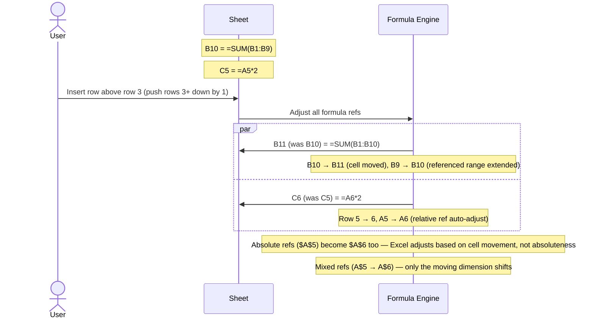
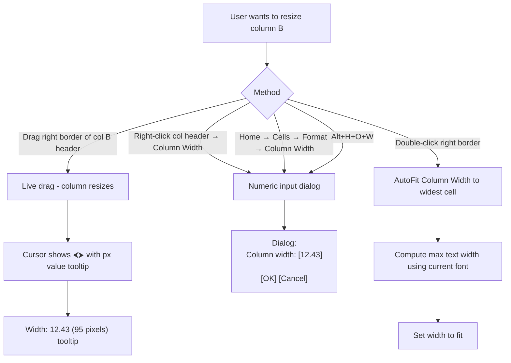
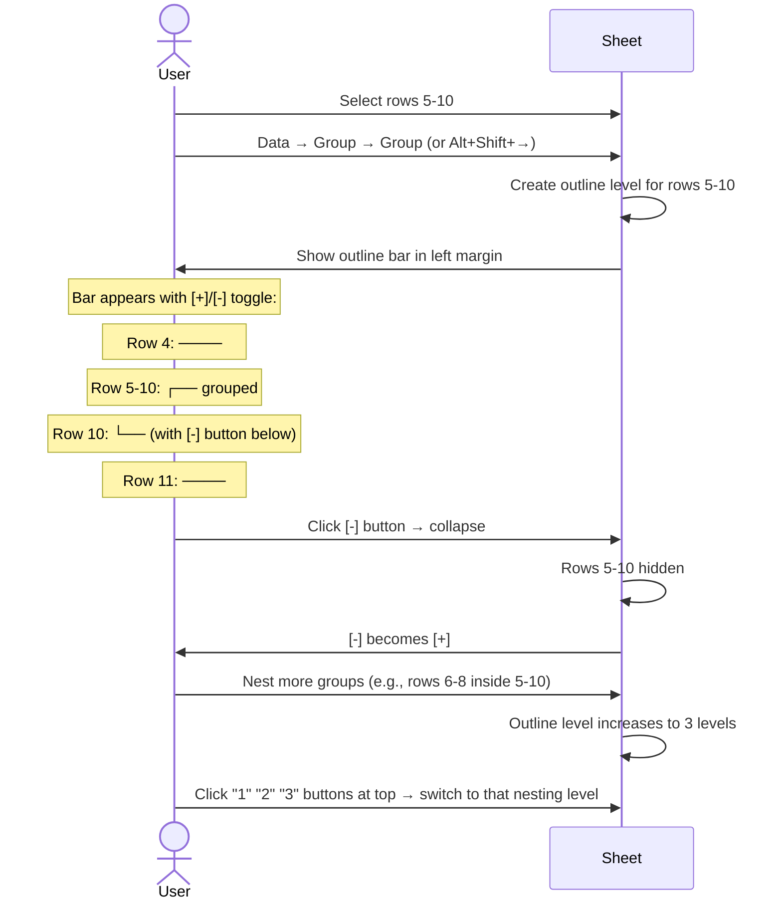

# UX Flow — Spec 09 Row & Column Operations

> Spec gốc: [../09-row-col-operations.md](../09-row-col-operations.md)

## Insert / Delete entry points

```
For ROWS:
- Right-click row header → Insert / Delete
- Home → Cells → Insert ▼ → Insert Sheet Rows
- Home → Cells → Delete ▼ → Delete Sheet Rows
- Ctrl++ (Plus): Insert dialog
- Ctrl+- (Minus): Delete dialog
- Alt+H+I+R: Insert Sheet Rows (KeyTip)
- Alt+H+D+R: Delete Sheet Rows (KeyTip)

For COLUMNS:
- Right-click col header → Insert / Delete
- Same Home/Cells menu, different submenu
- Ctrl++ when col selected: Insert
- Ctrl+- when col selected: Delete
```

## Insert dialog (single cell selected)

```
Select B5 (single cell), press Ctrl+Shift+= (or Ctrl++):

┌─ Insert ────────────────────┐
│                              │
│ Insert:                       │
│ ◯ Shift cells right            │
│ ● Shift cells down             │
│ ◯ Entire row                  │
│ ◯ Entire column               │
│                              │
│         [ OK ]   [ Cancel ] │
└──────────────────────────────┘

After "Shift cells down":
- Cell B5 inserted (empty)
- Existing B5:B∞ shifts to B6:B∞+1
- A and C columns unaffected
```

## Insert row/column visual

```
Insert row above row 5:

Before:
┌──┬─────┐
│  │  A  │
├──┼─────┤
│ 4│ 40  │
├──┼─────┤
│ 5│ 50  │  ← active row
├──┼─────┤
│ 6│ 60  │
└──┴─────┘

After Insert Sheet Row:
┌──┬─────┐
│  │  A  │
├──┼─────┤
│ 4│ 40  │
├──┼─────┤
│ 5│     │  ← new empty row (was row 5)
├──┼─────┤
│ 6│ 50  │  ← shifted down
├──┼─────┤
│ 7│ 60  │
└──┴─────┘

Smart Tag appears at the new row's location:
   ┌─────┐
   │ ⌧ ▼ │  ← Insert Options icon
   └─────┘
Click ▼:
┌──────────────────────────────────┐
│ ● Format Same As Above           │
│ ◯ Format Same As Below           │
│ ◯ Clear Formatting               │
└────────────────────────────────────┘
```

## Multi-row insert

```
Select rows 5, 6, 7 (drag across 3 row headers) → Ctrl++ (or Insert):

→ 3 empty rows inserted above row 5
→ Existing rows 5+ shift down 3
→ Number of new rows = number of selected rows

Same for columns.
```

## Insert with formula adjustment



## Delete row/column

```
Select row 5 → right-click → Delete (or Ctrl+-):

Before:
┌──┬─────┐
│ 4│ 40  │
│ 5│ 50  │ ← deleted
│ 6│ 60  │
│ 7│ 70  │
└──┴─────┘

After:
┌──┬─────┐
│ 4│ 40  │
│ 5│ 60  │ ← row 6 became 5
│ 6│ 70  │
└──┴─────┘

Formulas pointing at row 5 directly:
- =A5 (relative) → #REF! error (cell deleted)
- =SUM(A1:A10) (range) → =SUM(A1:A9) (range shrinks)
- =SUM(A1:A100) (extends past deletion) → =SUM(A1:A99) (range shrinks by 1)
```

## Delete dialog (cell-level)

```
Select B5 (single cell), press Ctrl+- :

┌─ Delete ────────────────────┐
│                              │
│ Delete:                       │
│ ● Shift cells left             │
│ ◯ Shift cells up               │
│ ◯ Entire row                  │
│ ◯ Entire column               │
│                              │
│         [ OK ]   [ Cancel ] │
└──────────────────────────────┘
```

## Column width / Row height adjust



## Width/Height dialogs

```
Row Height dialog:
┌─ Row Height ──────────────────┐
│ Row height: [15.00         ]   │
│                                  │
│              [ OK ] [ Cancel ] │
└──────────────────────────────────┘

Range: 0 to 409 points

Column Width dialog:
┌─ Column Width ────────────────┐
│ Column width: [8.43          ] │
│                                  │
│              [ OK ] [ Cancel ] │
└──────────────────────────────────┘

Range: 0 to 255 chars (at default font)

Default Width (whole sheet):
Format → Default Width...
┌─ Standard Width ──────────────┐
│ Standard column width: [8.43] │
│              [ OK ] [ Cancel ]│
└──────────────────────────────────┘
```

## AutoFit

```
Auto-fit options (Home → Format):
- AutoFit Row Height        → fit current row to tallest cell content
- AutoFit Column Width      → fit current col to widest cell content
- Hide & Unhide ▶            → submenu

For ENTIRE SHEET:
- Select all (Ctrl+A) → Home → Format → AutoFit Row Height
- Or right-click row 1 corner → Select All Rows → AutoFit Row Height

Trigger AutoFit:
- Double-click row/col border (auto)
- Menu command
- Programmatic: sheet.auto_fit_column(col_idx)
```

## Group / Outline rows



## Outline visual

```
With 2-level outline applied:

Outline:        Rows:
[1][2]          ┌──┬──────────────┐
                │  │  A             │
[─]             │ 1│ Headers        │
                ├──┼──────────────┤
[┌]             │ 5│ Subtotal Q1   │
 ┃              ├──┼──────────────┤
[┃]             │ 6│ Apple         │
 ┃              ├──┼──────────────┤
[┃]             │ 7│ Banana        │
 ┃              ├──┼──────────────┤
[┃]             │ 8│ Cherry        │
 ┃              ├──┼──────────────┤
[─]             │ 9│ Subtotal Q1   │  (top of next group)
                ├──┼──────────────┤
...

Click [1] → collapse all to level 1 (only subtotals visible)
Click [2] → expand to level 2 (all rows)
```

## Subtotal flow

```
Data → Outline group → Subtotal:

┌─ Subtotal ──────────────────────────────────┐
│ At each change in:                            │
│ [Region                              ▼]      │
│                                                │
│ Use function:                                 │
│ [Sum                                  ▼]      │
│  ├ Sum / Count / Average / Max / Min          │
│  └ Product / StdDev / Var / etc.              │
│                                                │
│ Add subtotal to:                              │
│ ┌──────────────────────────────────────┐    │
│ │ ☐ Name                                  │    │
│ │ ☐ Region                                │    │
│ │ ☑ Qty                                   │    │
│ │ ☑ Price                                 │    │
│ │ ☑ Revenue                                │    │
│ └──────────────────────────────────────┘    │
│                                                │
│ ☑ Replace current subtotals                   │
│ ☐ Page break between groups                   │
│ ☑ Summary below data                          │
│                                                │
│ [Remove All]              [ OK ]  [ Cancel ] │
└────────────────────────────────────────────────┘

Effect:
- Sort data by Region (if not already)
- Insert subtotal row after each Region group with SUM
- Insert grand total at bottom
- Apply outline so user can collapse to subtotals only
```

## Subtotal result

```
Before (sorted by Region):
┌────┬───────┬─────┐
│Region│Name  │Qty  │
├────┼───────┼─────┤
│East │Apple  │10   │
│East │Banana │20   │
│North│Apple  │15   │
│North│Cherry │25   │
└────┴───────┴─────┘

After Subtotal by Region, Sum of Qty:
┌────┬───────┬─────┐
│Region│Name  │Qty  │
├────┼───────┼─────┤
│East │Apple  │10   │
│East │Banana │20   │
│East Total│   │30  │ ← subtotal row, bold
├────┼───────┼─────┤
│North│Apple  │15   │
│North│Cherry │25   │
│North Total│  │40  │ ← subtotal row
├────┼───────┼─────┤
│Grand Total│  │70  │ ← grand total, bolder
└────┴───────┴─────┘

Outline bar at left lets you collapse/expand.
SUBTOTAL formula used (function code 9 = SUM):
=SUBTOTAL(9, Qty range for this group)
```

## Move rows/columns (drag with Shift)

```
Method 1: Cut & Paste
1. Select row 5
2. Ctrl+X (cut)
3. Select destination row 10
4. Ctrl+V (paste)
   → Row 5 content moves to row 10, row 5 becomes blank

Method 2: Drag with Shift (insert + move)
1. Select row 5
2. Hover edge until cursor changes to move cursor
3. Hold Shift + drag down between row 9 and 10
4. Release
   → Row 5 inserted between 9 and 10 (other rows shift), original row 5 removed

Method 3: Insert above + cut/paste manually
(Slower but explicit)
```

## Implementation hints cho Slave

- **Insert row/col**:
  ```python
  def insert_row(sheet, row_idx, count=1):
      # 1. Shift all rows >= row_idx down by count
      shifted = {}
      for (r, c), cell in sheet._cells.items():
          if r >= row_idx:
              shifted[(r + count, c)] = cell
          else:
              shifted[(r, c)] = cell
      sheet._cells = shifted
      
      # 2. Adjust formula refs in ALL cells
      formula_engine.shift_refs(sheet, row_offset=count, threshold_row=row_idx)
      
      # 3. Adjust merged ranges, conditional formats, data validation
      ...
      
      # 4. Push undo snapshot
  ```
- **Smart Tag "Insert Options"**: small `QToolButton` overlay anchored to newly inserted area; dropdown with format-copy options.
- **Auto-fit column**: 
  ```python
  def auto_fit_col(col):
      max_width = 0
      fm = QFontMetrics(default_font)
      for row in range(used_range_top, used_range_bottom):
          text = formatted_value(row, col)
          font = cell_font(row, col)
          max_width = max(max_width, QFontMetrics(font).horizontalAdvance(text))
      sheet.set_col_width(col, max_width + padding)
  ```
- **Group / Outline**:
  - Data model: `sheet._outlines: list[OutlineGroup]` where each = `{axis: row|col, start: int, end: int, collapsed: bool}`.
  - Render outline bar widget left of row headers (or above col headers); QSplitter-like.
  - Collapse → setRowHidden() on contained rows.
- **Subtotal**:
  ```python
  def apply_subtotal(rng, group_col, agg_func, target_cols):
      sort_by(rng, group_col)
      groups = groupby(rng, lambda row: row[group_col])
      for group_key, rows in groups:
          end_row = max(r.row for r in rows)
          insert_row(end_row + 1)
          write(end_row + 1, f"{group_key} Total")
          for tc in target_cols:
              write(end_row + 1, tc, f"=SUBTOTAL({func_code}, {rng_for_group})")
      # Grand total
      insert_row(rng.last_row + 1)
      write_grand_totals()
  ```
- **Drag move with Shift**: detect Shift modifier in `mousePressEvent` on selection border; show insertion line during drag; on drop → atomic remove+insert.
- **Width/Height live tooltip**: while dragging border, show `QToolTip` with current size near cursor.
- **Undo**: each operation pushes a `_push_undo()` snapshot of affected rows/cols before modification.
