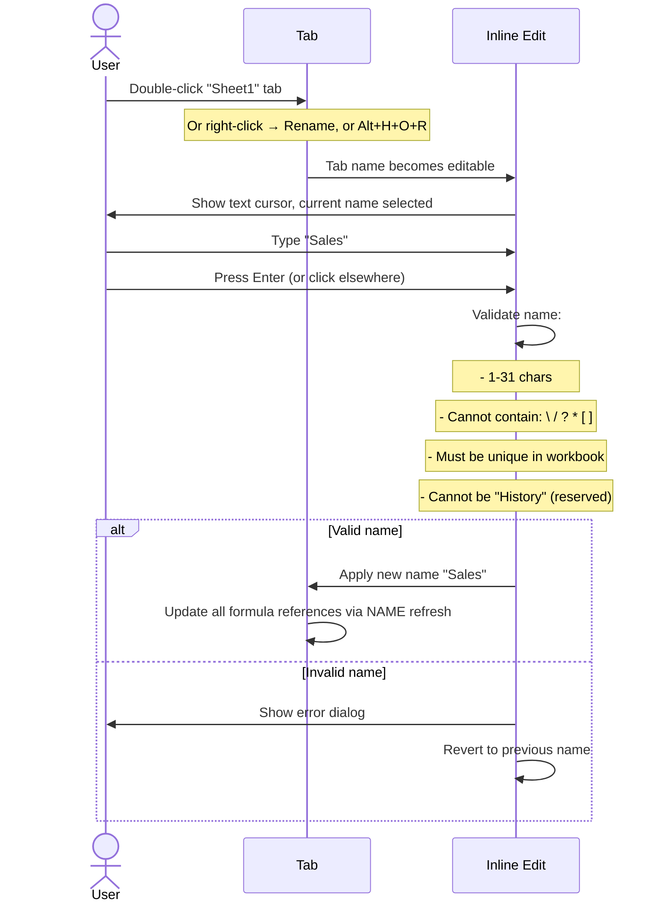
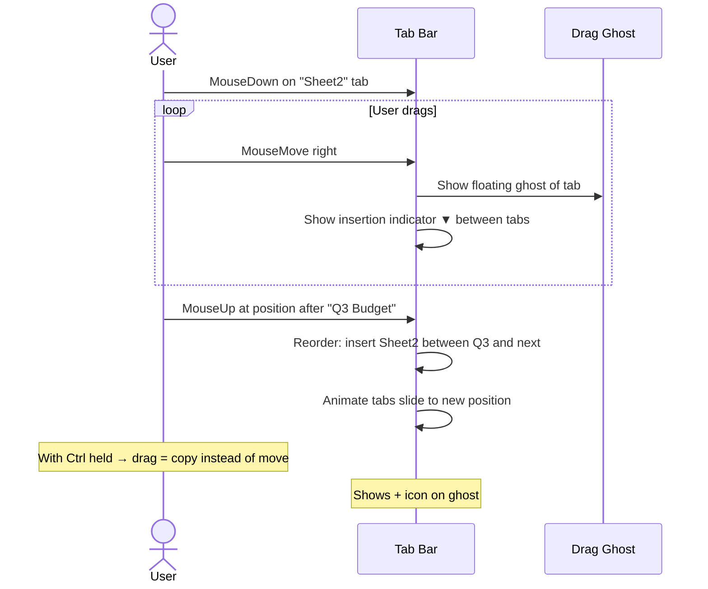
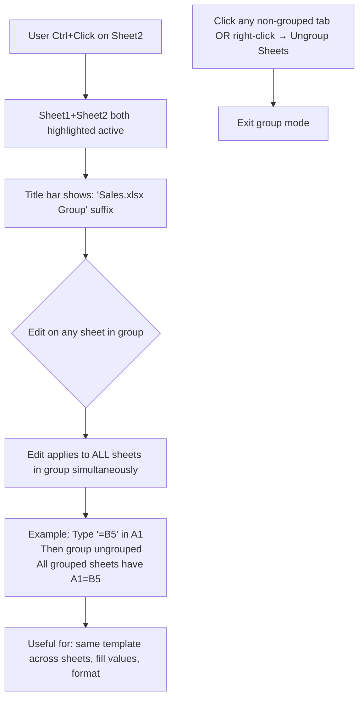

# UX Flow — Spec 10 Sheet Tabs

> Spec gốc: [../10-sheet-tabs.md](../10-sheet-tabs.md)

## Sheet tab bar layout

```
Bottom of workbook window:

┌──────────────────────────────────────────────────────────────────────────────┐
│ Grid content (current sheet)                                                  │
│                                                                                │
│                                                                                │
├──────────────────────────────────────────────────────────────────────────────┤
│ Horizontal scrollbar                                                          │
├──────────────────────────────────────────────────────────────────────────────┤
│[◀◀][◀][▶][▶▶] ‖ [Sheet1][Sheet2*][Sales][Q3 Budget][Notes] [+]  ‖  │     │
│       ▲       ▲    ▲        ▲       ▲      ▲           ▲      ▲       │
│       │       │    │        │       │      │           │      │       │
│       │       sep  active  hover  rename   tab        new   tab area│
│       │            (bold)         dialog            sheet+   resizer │
│       │                                                                │
│       Navigation arrows: First / Prev / Next / Last sheet              │
└──────────────────────────────────────────────────────────────────────────────┘

* The active tab has bold text + lighter background indicating "selected"
```

## Tab states visual

```
States:
┌─────────────┐
│ Sheet1       │ ← inactive: normal text, light gray bg
└─────────────┘

┌─────────────┐
│ Sheet2*      │ ← active: bold text, white/sheet-content bg, top border accent
└─────────────┘

┌─────────────┐
│ Sales [🔒]   │ ← protected: padlock icon
└─────────────┘

┌─────────────┐
│▓Notes▓      │ ← color-coded: custom tab color (green bar at bottom)
└──────▒▒▒▒▒──┘

┌─────────────┐
│ Hidden*      │ ← hidden: doesn't appear in bar; show via Unhide dialog
└─────────────┘
```

## Add new sheet flow

```mermaid
flowchart TD
    A[User action to add sheet] --> B{Method}
    
    B -->|Click + button after last tab| C[New "Sheet N" added right of current]
    B -->|Shift+F11| C
    B -->|Right-click tab → Insert| D[Insert dialog]
    B -->|Alt+Shift+F1| C
    
    D --> E["Insert dialog:
    Worksheet | Chart | MS Excel 4.0 Macro | Dialog
    
    Templates tab:
    - Blank Worksheet
    - Spreadsheet Solutions
    - templates from Office.com"]
    
    C --> F[Tab name auto: 'Sheet2', 'Sheet3', ... unique]
    F --> G[New sheet becomes active]
    G --> H[Tab bar scrolls right to show it]
```

## Rename sheet flow



## Tab color flow

```
Right-click tab → Tab Color:

┌─ Tab Color picker ──────────────────────┐
│ Theme Colors:                             │
│ ⬜⬛🟫🟦🟩🟨🟧🟪 (8 swatches)         │
│ + 6 tint variants per (Lighter/Darker)   │
│                                            │
│ Standard Colors:                          │
│ 🟥🟧🟨🟩🟦🟪🟫⚫⚪                     │
│                                            │
│ More Colors...     ← custom color dialog │
│ No Color           ← reset                │
└────────────────────────────────────────────┘

Applied:
- Inactive tab: thin colored bottom bar
- Active tab: full background tint (semi-transparent)
```

## Move/Copy sheet flow

```
Right-click tab → Move or Copy:

┌─ Move or Copy ──────────────────────────────┐
│ Move selected sheets                          │
│ To book: [Sales.xlsx (current)        ▼]    │
│           ├ Sales.xlsx (current)              │
│           ├ Budget.xlsx (open)                │
│           └ (new book)                         │
│                                                │
│ Before sheet:                                  │
│ ┌──────────────────────────────────────┐    │
│ │ Sheet1                                  │    │
│ │ Sheet2                                  │    │
│ │ Sales                  ← selected       │    │
│ │ Q3 Budget                                │    │
│ │ (move to end)                            │    │
│ └──────────────────────────────────────┘    │
│                                                │
│ ☐ Create a copy                                │
│                                                │
│                          [ OK ]   [ Cancel ]  │
└────────────────────────────────────────────────┘

Effect:
- Move: sheet leaves current workbook (if cross-book)
- Copy + Create a copy: original stays, new tab "Sales (2)" appears
- Cross-book: cell formulas update with full book/sheet path
```

## Drag tab to reorder



## Multi-select tabs (Group mode)



## Group mode warning

```
When user starts editing while in Group mode, status bar shows:

┌─ Status Bar ──────────────────────────────────────────┐
│ Edit  [Group: Sheet1, Sheet2, Sheet3]  Avg ...        │ ← visible reminder
└────────────────────────────────────────────────────────┘

Title bar:
Sales.xlsx — Excel [Group]
```

## Hide / Unhide sheet

```
Right-click tab → Hide:
- Sheet disappears from tab bar
- Sheet still exists; can be referenced in formulas

Right-click any tab → Unhide:
┌─ Unhide ─────────────────────────────┐
│ Unhide sheet:                          │
│ ┌──────────────────────────────────┐ │
│ │ Sheet3                              │ │
│ │ Sensitive Data                      │ │
│ │ Archive 2024                        │ │
│ └──────────────────────────────────┘ │
│                                        │
│ Hold Ctrl to select multiple           │
│                                        │
│                     [ OK ]   [ Cancel ]│
└────────────────────────────────────────┘

Note: "Very Hidden" sheets (xlSheetVeryHidden) only unhide via VBA/Office Scripts
```

## Tab area resize

```
Drag the splitter between tab area and horizontal scrollbar:
┌────────────────────────────────────┬──────────────────────────────┐
│ [Sheet1][Sheet2][Sales][Q3 Budget] ‖ horizontal scroll →          │
└────────────────────────────────────┴──────────────────────────────┘
                                      ▲
                              Drag this splitter left/right
                              → resizes how much space tabs vs scroll get
```

## Tab overflow handling

```
When tabs exceed available width:

[◀◀][◀][▶][▶▶] ‖ [Sheet1][Sheet2][Sheet3]... ← only some visible at a time
                                        ↑ overflow indicator

Right-click navigation arrows → shows sheet list:
┌──────────────────────────────┐
│ Activate                       │
│ ─────────────────────────── │
│ ● Sheet1                       │
│ ◯ Sheet2                       │
│ ◯ Sheet3                       │
│ ◯ Sales                        │
│ ◯ Q3 Budget                    │
│ ◯ Notes                        │
│ ◯ Archive2024                  │
│ ◯ Archive2023                  │
│ More Sheets...               │ ← if > 15 entries
│ ─────────────────────────── │
│ [ OK ]                         │
└────────────────────────────────┘

(Modern Excel 365: also typeable search box at top)
```

## All-sheets navigation (modern)

```
Right-click [◀◀] arrow → Activate panel:
- Type-to-search
- Recently used at top
- Color-coded matches tab colors

Keyboard shortcuts:
- Ctrl+Page Down → next sheet
- Ctrl+Page Up   → previous sheet
- Ctrl+Shift+F4  → find in entire workbook (jumps across sheets)
```

## Implementation hints cho Slave

- **Tab widget**: `QTabBar` (low-level, more flexible than QTabWidget) at bottom; emits `currentChanged`, `tabBarDoubleClicked`.
- **Tab color**: subclass `QTabBar` to override `paintEvent`; render colored bar based on stored color per tab.
- **Add tab button**: separate `QToolButton` "[+]" placed after last tab in `QHBoxLayout`.
- **Navigation arrows**: 4 `QToolButton`s `[◀◀][◀][▶][▶▶]`; emit `firstSheet`, `prevSheet`, `nextSheet`, `lastSheet` signals.
- **Rename inline**:
  - Double-click → replace tab with `QLineEdit`; on Enter/focus loss → validate + commit.
  - Validation: regex `^[^\\/?*\[\]]{1,31}$` + uniqueness check + reserved-name check.
- **Drag-drop reorder**: enable `QTabBar.setMovable(True)` for native drag; emit `tabMoved(int from, int to)`.
- **Ctrl+drag = copy**: subclass tab bar mouse handlers; if Ctrl pressed during drop → duplicate sheet instead of move.
- **Multi-select Group**:
  - Track `_selected_tabs: set[int]` (active group).
  - When any sheet edited and `len(selected) > 1` → apply edit to all selected sheets in one transaction.
  - Visual: bold all grouped tabs; title bar suffix " [Group]".
- **Hide/unhide**:
  - Maintain `sheet.visible: Literal["visible", "hidden", "very_hidden"]`.
  - Filter `QTabBar` items by visible state.
- **Move/Copy dialog**: standard `QDialog` with `QListWidget` of valid destinations.
- **Tab overflow**: when sum of tab widths exceeds available → show only visible range; right-click arrows opens `QMenu` with all sheets.
- **Performance**: tabs are lightweight (just QString labels); 1000 sheets renders fine.
