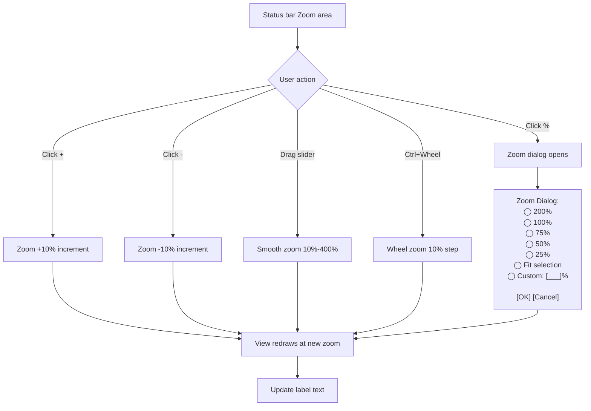
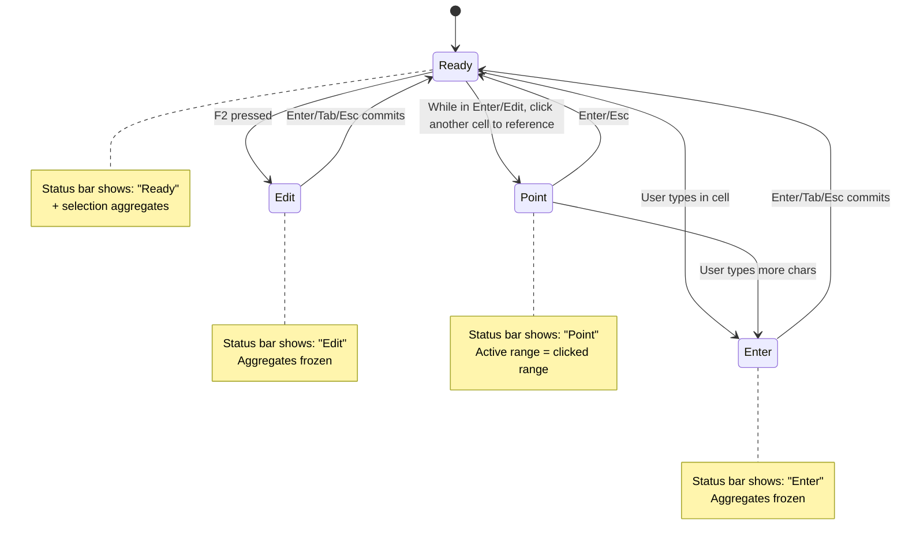

# UX Flow — Spec 11 Status Bar

> Spec gốc: [../11-status-bar.md](../11-status-bar.md)

## Status bar layout

```
┌─ Status Bar (bottom of window) ─────────────────────────────────────────────┐
│ Ready                          Average: 45.6  Count: 8  Sum: 365    ⊟ ▦ ▢  100% +  │
│ ▲                              ▲                                     ▲       ▲   │
│ Mode indicator                 Selection aggregates                  Views   Zoom │
└─────────────────────────────────────────────────────────────────────────────────────┘
```

## Sections (left → right)

```
┌── Section 1: Mode indicator (left) ──┐
│ "Ready" | "Enter" | "Edit" | "Point" │
│ Calculate (when manual recalc needed)│
└────────────────────────────────────────┘

┌── Section 2: Macro recording icon ──┐
│ ▢ (idle) | ⏺ (recording)            │
│ Click → start/stop recording macro   │
└────────────────────────────────────────┘

┌── Section 3: Accessibility check ──┐
│ "Accessibility: Investigate"         │
│ Hover → tooltip; Click → opens pane │
└────────────────────────────────────────┘

┌── Section 4: Smart Lookup status ──┐
│ shown briefly when Smart Lookup runs│
└────────────────────────────────────────┘

┌── Section 5 (CENTER): Aggregates ──┐
│ Average: X.X  Count: N  Sum: X.XX  │
│ Configurable via right-click        │
└────────────────────────────────────────┘

┌── Section 6: AutoSave + Sync state ─┐
│ "AutoSave ●" indicator              │
│ "Syncing... | Saved" cloud icon     │
└────────────────────────────────────────┘

┌── Section 7: View buttons ──┐
│ [⊟ Normal][▦ Page Layout][▢ Page Break Preview] │
└────────────────────────────────────────┘

┌── Section 8: Zoom controls ──┐
│ [-]  [100%]  [+]              │
│ Click % → Zoom dialog          │
│ Slider drag → zoom            │
└────────────────────────────────────────┘
```

## Aggregates real-time update

```mermaid
sequenceDiagram
    actor User
    participant Grid
    participant Selection
    participant StatusBar
    participant Worker as BG Thread
    
    User->>Grid: Select range B2:B100
    Grid->>Selection: selectionChanged signal
    Selection->>StatusBar: update(ranges)
    
    alt Small selection (< 10k cells)
        StatusBar->>StatusBar: Compute synchronously
        StatusBar->>User: Show Sum: 4500, Count: 99, Avg: 45.45
    else Large selection (>= 10k cells)
        StatusBar->>StatusBar: Show "Calculating..."
        StatusBar->>Worker: Async compute
        Worker->>Worker: Iterate cells, accumulate
        Worker-->>StatusBar: Result ready
        StatusBar->>User: Update display
    end
    
    Note over StatusBar: Cache last result; invalidate on data change in selection
```

## Aggregate config (right-click status bar)

```
Right-click anywhere in status bar:
┌─ Customize Status Bar ──────────────┐
│ ☑ Cell Mode                         │
│ ☑ Quick Analysis Lens   Off          │
│ ☑ Workbook Statistics                │
│ ── Selection aggregates ──           │
│ ☑ Average                ✓ visible  │
│ ☑ Count                  ✓ visible  │
│ ☐ Numerical Count                    │
│ ☐ Min                                │
│ ☐ Max                                │
│ ☑ Sum                    ✓ visible  │
│ ── Other indicators ──              │
│ ☑ Macro Recording                    │
│ ☑ Accessibility Checker              │
│ ☐ Caps Lock                          │
│ ☐ Num Lock                           │
│ ☐ Scroll Lock                        │
│ ☐ Fixed Decimal                      │
│ ☐ Overtype Mode                      │
│ ☐ End Mode                           │
│ ☑ AutoSave                           │
│ ☑ Sync Status                        │
│ ☑ View Shortcuts                     │
│ ☑ Zoom Slider                        │
│ ☑ Zoom Level                         │
└──────────────────────────────────────┘
```

## Aggregate examples

```
Selection B2:B5 = [10, 20, 30, "abc", 40]:
- Average: 25 (only numeric, 4 items)
- Count: 5 (all non-empty)
- Numerical Count: 4
- Min: 10
- Max: 40
- Sum: 100

Selection A1:A3 = ["", "", ""] (all blank):
- Average: (no display, nothing to average)
- Count: 0
- Sum: 0

Selection with single cell active:
- Status: Sum/Avg/Count NOT shown (single cell — meaningless)
- Just "Ready" displayed
```

## Zoom flow



## Sync / AutoSave indicator states

```
States cycle:
┌────────────────────────────────────────────┐
│ AutoSave: ●  ↻ Saving...                   │ ← active save
│ AutoSave: ●  ✓ Saved 2 min ago             │ ← idle, last saved
│ AutoSave: ●  ⚠ Offline — changes queued    │ ← offline mode
│ AutoSave: ○  (off, manual save mode)       │ ← AutoSave toggle off
└────────────────────────────────────────────┘

Click AutoSave toggle → on/off; if local file → prompt "Save to OneDrive to enable AutoSave"
```

## Mode indicator transitions



## Calculation mode indicator

```
When calculation mode = Manual (Formulas → Calculation Options → Manual):

Status bar shows:
┌────────────────────────────────────────────────────────┐
│ Calculate  Average: ... (cached, may be stale)         │
└────────────────────────────────────────────────────────┘

User presses F9 → recalc all → "Calculate" indicator clears
User edits cell → "Calculate" reappears (calc pending)
```

## Implementation hints cho Slave

- **QStatusBar** built-in: `mainWindow.statusBar()`.
- **Permanent widgets** (right-aligned): `statusBar.addPermanentWidget(widget)`.
- **Temporary messages** (left, auto-hide): `statusBar.showMessage("Calculating...", 2000)`.
- **Mode indicator**: `QLabel` left-most; updated by `MainWindow.set_mode("Ready"/"Enter"/...)`.
- **Aggregates widget**: custom `QWidget` with horizontal `QLabel`s; right-click context menu via `customContextMenuRequested`.
- **Async aggregate compute**: `QtConcurrent.run(compute_aggregates, ranges)` → emit `aggregatesReady(dict)` signal.
- **Cache key**: tuple of selection ranges + sheet data version hash.
- **Zoom slider**: `QSlider(Qt.Horizontal)` 10-400 range; emit zoomChanged → view.setZoom().
- **Toggle visibility per indicator**: each `QLabel` controlled by `setVisible(bool)`; persist user prefs in QSettings.
- **AutoSave indicator**: connect to `workbook.autoSaveStateChanged` signal; icon swaps based on state enum.
