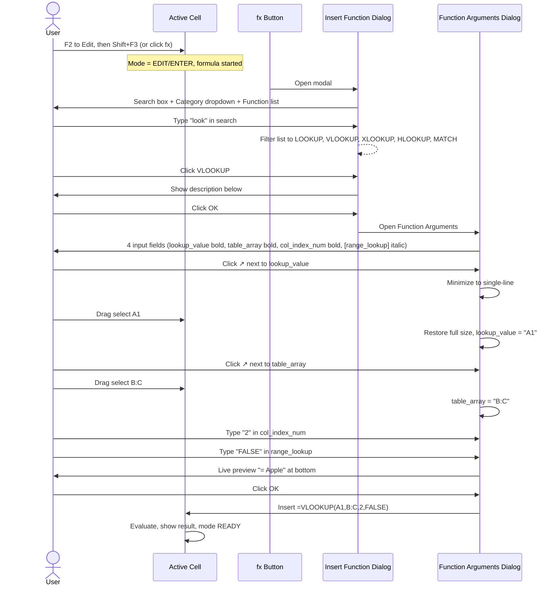
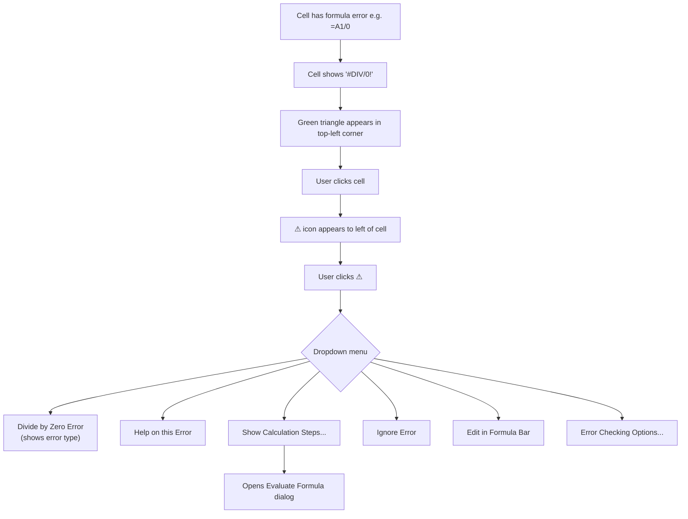

# UX Flow — Spec 12 Formula System

> Spec gốc: [../12-formula-system.md](../12-formula-system.md)

## Formula entry — full journey

```mermaid
flowchart TD
    A[Cell B5 selected, READY mode] --> B[User type '=']
    B --> C[ENTER mode, Formula Bar shows '=']
    
    C --> D{User types more}
    D -->|Type 'S','U'| E[Autocomplete dropdown appears below cell]
    E --> F[List: SUM, SUMIF, SUMIFS, ...]
    
    F --> G{User action}
    G -->|Press Tab/Click| H[Insert 'SUM(' into cell]
    G -->|Continue typing| I[Filter list]
    G -->|Escape| J[Close dropdown, keep typed text]
    
    H --> K[ScreenTip appears: SUM(number1, ...)]
    K --> L{User input args}
    
    L -->|Type A1:A10| M[Reference highlighted in different color]
    L -->|Click A1, drag to A10| N[POINT mode, range selected, formula updated]
    L -->|Type literal 5| O[Inline value]
    
    M --> P{Continue?}
    N --> P
    O --> P
    
    P -->|Type ',' for next arg| Q[Move to next arg, ScreenTip bold next]
    P -->|Type ')'| R[Close paren]
    
    R --> S[User press Enter]
    S --> T[Engine validates + evaluates]
    
    T --> U{Valid?}
    U -->|Yes| V[Show result in cell, READY mode]
    U -->|Error| W[Show error code, e.g. #VALUE!]
    
    W --> X[Smart Tag triangle appears top-left of cell]
```

## Reference colors in Edit mode

When editing `=SUM(A1:A3)+B5*C7`:

```
Cell B5 (editing):
┌────────────────────────────────────────┐
│ =SUM(A1:A3)+B5*C7|                     │
└────────────────────────────────────────┘
       ▲▲▲▲▲   ▲▲  ▲▲
       blue    red green
       
Grid highlights:
       Col A   Col B  Col C
   1  ▓blue▓   B5     C7
   2  ▓blue▓   ▓red▓  
   3  ▓blue▓                 ▓green▓
   ...
   5  (editing)
   7                  ▓green▓
```

## Function Wizard (Shift+F3 / fx button) flow



## Function Wizard dialog mockup

```
┌─ Insert Function ────────────────────────────────────────┐
│ Search for a function:                                    │
│ ┌────────────────────────────────────┐  [   Go   ]       │
│ │ vlookup                            │                    │
│ └────────────────────────────────────┘                    │
│                                                            │
│ Or select a category: [Lookup & Reference            ▼]  │
│                                                            │
│ Select a function:                                         │
│ ┌────────────────────────────────────────────────────┐   │
│ │ LOOKUP                                              │   │
│ │ VLOOKUP                                ← selected   │   │
│ │ XLOOKUP                                             │   │
│ │ HLOOKUP                                             │   │
│ │ MATCH                                               │   │
│ │ XMATCH                                              │   │
│ │ INDEX                                               │   │
│ │ INDIRECT                                            │   │
│ └────────────────────────────────────────────────────┘   │
│                                                            │
│ VLOOKUP(lookup_value,table_array,col_index_num,           │
│         [range_lookup])                                    │
│                                                            │
│ Looks for a value in the leftmost column of a table,      │
│ and then returns a value in the same row from a column    │
│ you specify. By default, the table must be sorted in      │
│ ascending order.                                           │
│                                                            │
│ Help on this function       [ OK ]   [ Cancel ]           │
└────────────────────────────────────────────────────────────┘
```

## Function Arguments dialog mockup

```
┌─ Function Arguments ────────────────────────────────────────┐
│ VLOOKUP                                                      │
│                                                              │
│ Lookup_value      [A1                          ] ↗  = 5     │
│ Table_array       [B:C                         ] ↗  = {...}  │
│ Col_index_num     [2                           ] ↗  = 2     │
│ Range_lookup      [FALSE                       ] ↗  = FALSE │
│                                                              │
│                                                  = "Apple"   │
│                                                              │
│ Looks for a value in the leftmost column of a table,        │
│ and then returns a value in the same row from a column      │
│ you specify.                                                 │
│                                                              │
│   Range_lookup is a logical value: to find the closest      │
│   match in the first column (sorted in ascending order)     │
│   = TRUE or omitted; find an exact match = FALSE.           │
│                                                              │
│ Formula result = Apple                                       │
│                                                              │
│ Help on this function                  [ OK ]   [ Cancel ]   │
└──────────────────────────────────────────────────────────────┘
```

## Error smart tag flow



## Error smart tag mockup

```
Cell A5 with error:
┌────────┐
│▲ #DIV/0│  ← green triangle top-left
└────────┘

User clicks cell, ⚠ appears:
        ┌────────┐
   [⚠]  │ #DIV/0!│  ← warning icon to left
        └────────┘

User clicks [⚠]:
   ┌─────────────────────────────────────┐
   │ Divide by Zero Error                 │
   │ ─────────────────────────────────── │
   │ Help on this Error                   │
   │ Show Calculation Steps...            │
   │ Ignore Error                          │
   │ Edit in Formula Bar                  │
   │ Error Checking Options...            │
   └─────────────────────────────────────┘
```

## Trace Precedents / Dependents arrows

```
Cell C5 = =A1+A2*B3

User clicks C5 → Formulas → Trace Precedents:

   Col A      Col B      Col C
  ┌────┐    ┌────┐     ┌────┐
1 │ 10 │ ───┐                    
  └────┘    │                    
  ┌────┐    │                    
2 │ 20 │ ───┼────┐               
  └────┘    │    │               
            │    │  ┌────┐       
3            │    │  │ 5  │ ────┐
            │    │  └────┘     │
            │    │              │
            ▼    ▼              ▼
                              ┌────┐
5                             │ 110│ ← C5 = A1+A2*B3
                              └────┘
            
Blue arrows from precedent cells to C5
```

Trace Dependents:
```
User clicks A1, then Formulas → Trace Dependents:

   Col A      Col B      Col C
  ┌────┐                           
1 │ 10 │ ──────┐                   
  └────┘      │                   
              │                   
              │  ┌────┐           
3             │  │    │           
              │  └────┘           
              ▼                   
            ┌────┐                
5           │    │ ← C5 uses A1   
            └────┘                
              │                   
              ▼                   
            ┌────┐                
8           │    │ ← C8 uses C5   
            └────┘                
              │                   
              ▼                   
            (etc.)                

Blue arrows from A1 down through dependency chain.
```

## Show Formulas toggle (Ctrl+`)

```
Before Ctrl+`:
┌────┬────┬────┐
│ A  │ B  │ C  │
│ 5  │ 10 │ 50 │  ← C1 = A1*B1 result
│ 3  │ 7  │ 21 │  ← C2 = A2*B2 result
└────┴────┴────┘

After Ctrl+`:
┌────┬────┬─────────┐
│ A  │ B  │ C       │
│ 5  │ 10 │ =A1*B1  │  ← formula visible instead of result
│ 3  │ 7  │ =A2*B2  │
└────┴────┴─────────┘

Cells widen automatically to fit formula text.
Ctrl+` again → toggle back.
```

## Evaluate Formula step-by-step dialog

```
┌─ Evaluate Formula ──────────────────────────────────────┐
│ Reference: $C$5                                          │
│ Evaluation:                                              │
│ ┌──────────────────────────────────────────────────┐    │
│ │                                                    │    │
│ │ =SUM(A1:A3)+B5*C7                                  │    │
│ │            ▔▔▔▔▔                                   │    │
│ │ (underline = next sub-expression to evaluate)      │    │
│ │                                                    │    │
│ └──────────────────────────────────────────────────┘    │
│                                                           │
│ To show the result of the underlined expression,         │
│ click Evaluate. The most recent result of the            │
│ evaluation appears in italic.                            │
│                                                           │
│ [Evaluate]  [Step In]  [Step Out]  [Close]              │
└──────────────────────────────────────────────────────────┘

After click Evaluate:
│ =6+B5*C7                                                 │
│    ▔▔▔▔▔                                                 │
(B5*C7 next)

After click Evaluate again:
│ =6+50                                                    │
│ ▔▔▔▔▔                                                    │
(final sum)

Click Restart → back to =SUM(A1:A3)+B5*C7
```

## Implementation hints cho Slave

- **Reference color highlight**: trong Edit/Point mode, parse formula text → list refs → assign rotating colors → render overlay trên grid cells.
- **Function Wizard dialog** với 2 nested dialogs (Insert Function → Function Arguments).
- **Function metadata** mỗi function trong `formula_metadata.py`:
  ```python
  {
    "VLOOKUP": {
      "category": "Lookup & Reference",
      "args": [
        {"name": "lookup_value", "type": "any", "required": True, "desc": "..."},
        {"name": "table_array", "type": "range", "required": True},
        {"name": "col_index_num", "type": "number", "required": True},
        {"name": "range_lookup", "type": "logical", "required": False},
      ],
      "desc": "Looks for a value in the leftmost column..."
    }
  }
  ```
- **Smart tag triangle**: render trong `CellDelegate.paint()` 5x5 px góc top-left khi cell có error.
- **⚠ icon**: floating `QToolButton` overlay khi cell selected có error.
- **Trace Precedents/Dependents arrows**: `QGraphicsScene` overlay trên grid; line items from precedent cell center → current cell center; arrow head.
- **Evaluate Formula dialog**: keep stack of evaluation states; "Evaluate" = pop next sub-expr + replace với result.
