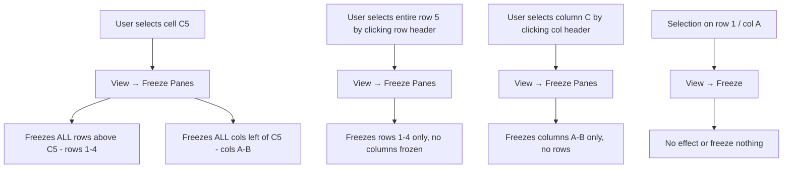
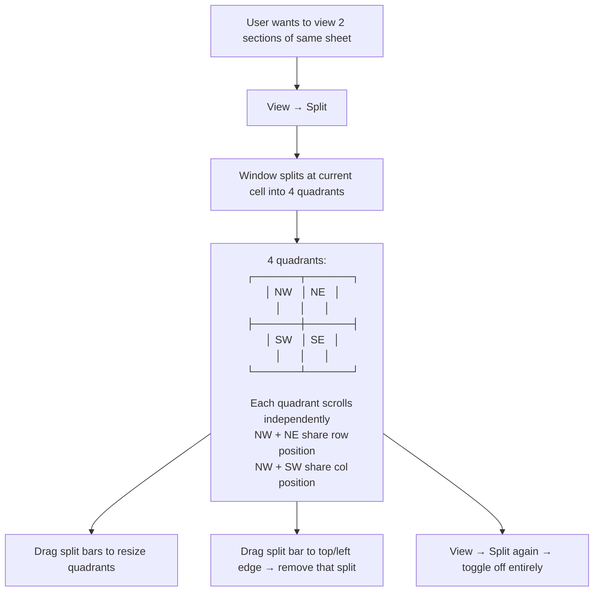
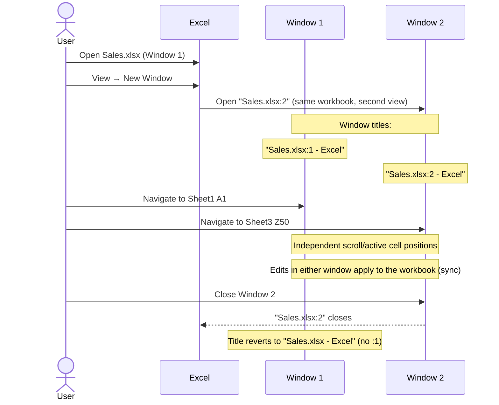

# UX Flow — Spec 14 Freeze, Split & Windows

> Spec gốc: [../14-freeze-split-views.md](../14-freeze-split-views.md)

## Freeze Panes options

```
View tab → Window group → Freeze Panes ▼:

┌──────────────────────────────────────────────┐
│ Freeze Panes                                   │
│ Keep rows and columns visible while the rest   │
│ of the worksheet scrolls (based on current     │
│ selection).                                     │
│                                                  │
│ Freeze Top Row                                  │
│ Keep the top row visible while scrolling        │
│ through the rest of the worksheet.              │
│                                                  │
│ Freeze First Column                             │
│ Keep the first column visible while scrolling   │
│ through the rest of the worksheet.              │
└────────────────────────────────────────────────┘

After freezing, menu item changes to "Unfreeze Panes"
```

## Freeze visual

```
Before freeze (normal grid):
┌──┬─────┬─────┬─────┬─────┐
│  │  A  │  B  │  C  │  D  │
│ 1│Hdr1 │Hdr2 │Hdr3 │Hdr4 │
│ 2│ 10  │ 20  │ 30  │ 40  │
│ 3│ 50  │ 60  │ 70  │ 80  │
│ 4│ 90  │ ... │     │     │
└──┴─────┴─────┴─────┴─────┘

Click B2 → View → Freeze Panes:
Freezes row 1 + column A (rows above and cols left of selection).

After freeze:
┌──┬═════╤═════╤═════╤═════╗
│  │  A  │  B  │  C  │  D  ║  ← row 1 frozen (thick border below)
│ 1│Hdr1 │Hdr2 │Hdr3 │Hdr4 ║
╞══╪═════╧═════╧═════╧═════╝
│ 2│ 10  │ 20  │ 30  │ 40  │  ← scrollable area
│ 3│ 50  │ 60  │ 70  │ 80  │
│  ║                          │
│  ║  ↑ col A frozen          │
└──╨─────────────────────────┘
  thick border right of frozen col

User scrolls down:
┌──┬═════╤═════╤═════╤═════╗
│  │  A  │  B  │  C  │  D  ║  ← still visible
│ 1│Hdr1 │Hdr2 │Hdr3 │Hdr4 ║
╞══╪═════╧═════╧═════╧═════╝
│ 50│Hdr5│ ... │  far away │  ← scrolled to row 50
│ 51│ ...│     │           │
└──╨─────────────────────────┘
```

## Freeze decision flow



## Split Window flow



## Split visual

```
After Split with active cell C5:

   Col A B  | C  D E F G
  ┌──┬──┬──╫──┬──┬──┬──┐
1 │..│..│..║..│..│..│..│
2 │..│..│..║..│..│..│..│   ← NW quadrant   |   NE quadrant
3 │..│..│..║..│..│..│..│
4 │..│..│..║..│..│..│..│
══╪══╪══╪══╬══╪══╪══╪══   ← horizontal split bar (drag handle)
5 │..│..│..║..│..│..│..│   ← SW quadrant   |   SE quadrant
6 │..│..│..║..│..│..│..│
  └──┴──┴──╨──┴──┴──┴──┘
              ▲
              vertical split bar (drag handle)

Each pane has its own scrollbar.
NW scrolls only affect NW + NE (same row position) or NW + SW (same col position).
SE is the "global" scroll position viewer.
```

## Hide rows/cols vs Filter vs Freeze

```
Three different "hide" mechanisms:

1. Hidden rows/cols (Spec 09):
   - Manually hidden by user/code
   - Persists in saved file
   - Visual: row/col number missing in header
   - Use: privacy, decluttering

2. Filter (Spec 15):
   - Hidden because of filter criteria
   - Auto-revealed when filter cleared
   - Visual: row numbers shown in blue
   - Use: temporary data exploration

3. Freeze (this spec):
   - NO cells are hidden; just stays visible during scroll
   - Locks rows/cols at top/left
   - Visual: thick black line at freeze boundary
   - Use: header always visible while scrolling
```

## New Window flow (multiple views of same workbook)



## Arrange Windows dialog

```
View → Window group → Arrange All:

┌─ Arrange Windows ──────────────────────────┐
│ Arrange                                      │
│ ● Tiled                                       │
│ ◯ Horizontal                                  │
│ ◯ Vertical                                    │
│ ◯ Cascade                                     │
│                                                │
│ ☐ Windows of active workbook                  │
│   (if checked, only arrange windows of        │
│    current workbook, not all open workbooks)  │
│                                                │
│                          [ OK ]   [ Cancel ] │
└────────────────────────────────────────────────┘

Arrangements visualized:
┌─────────┬─────────┐
│ Win1    │ Win2    │   Vertical (side-by-side)
└─────────┴─────────┘

┌──────────────────┐
│ Win1             │
├──────────────────┤   Horizontal (stacked)
│ Win2             │
└──────────────────┘

┌────────┬────────┐
│ Win1   │ Win2   │
├────────┼────────┤   Tiled (2x2 grid for 3-4 windows)
│ Win3   │ Win4   │
└────────┴────────┘

  ┌──────────────┐
 ┌┴──────────────┴┐   Cascade (offset stack)
┌┴────────────────┴┐
│ Win3             │
│                   │
└───────────────────┘
```

## View Side by Side flow

```mermaid
flowchart TD
    A[Open 2 workbooks: A.xlsx and B.xlsx] --> B[View → Window → View Side by Side]
    B --> C{More than 2 windows open?}
    
    C -->|Yes| D[Dialog: 'Compare Side by Side with...'
    Pick which workbook to compare with active]
    C -->|No| E[Auto-pair the 2 windows]
    
    D --> F[Side by Side activated]
    E --> F
    
    F --> G[Two extra commands appear:
    - View → Window → Synchronous Scrolling (☑)
    - View → Window → Reset Window Position]
    
    G --> H[User scrolls in A.xlsx → B.xlsx scrolls same amount sync]
    G --> I[Click Synchronous Scrolling → toggle off → scrolls independently]
```

## Side by Side use case

```
Comparing two budget versions:

  Workbook A (left)          |    Workbook B (right)
  Budget2025.xlsx            |    Budget2026.xlsx
  ┌──────────────────┐       |    ┌──────────────────┐
  │ Q1 Revenue 50000  │       |    │ Q1 Revenue 65000  │
  │ Q1 Cost   30000  │       |    │ Q1 Cost   35000  │
  │ Q1 Profit 20000  │       |    │ Q1 Profit 30000  │
  │ Q2 Revenue 60000  │       |    │ Q2 Revenue 75000  │
  │ ...               │       |    │ ...               │
  └──────────────────┘       |    └──────────────────┘
  
With Synchronous Scrolling ON:
- Scroll down in A → B also scrolls down same amount
- Easy line-by-line comparison
```

## Workbook view modes

```
View tab → Workbook Views group:

┌────────────────────────────────────────┐
│ [⊟ Normal] [▦ Page Layout] [▢ Page Break] [Custom Views]│
└──────────────────────────────────────────┘

Normal (default):
- Continuous grid, no page breaks visible
- Status bar shortcut: [⊟] button

Page Layout:
- Shows pages as they will print
- Header/footer editable directly
- Margins visible
- Rulers at top + left
- Status bar shortcut: [▦] button

Page Break Preview:
- Zoomed-out view showing all page breaks
- Blue dashed lines = auto page breaks
- Blue solid lines = manual page breaks (drag to adjust)
- Status bar shortcut: [▢] button

Custom Views:
- Save current view config (selection, scroll, hidden rows/cols, filter, print settings)
- Switch back later: View → Custom Views → pick saved view
- Note: NOT same as Sheet View (Spec 56) — Custom Views = global per workbook
```

## Custom Views dialog

```
View → Custom Views:

┌─ Custom Views ──────────────────────────┐
│ Views:                                     │
│ ┌──────────────────────────────────────┐ │
│ │ My Audit View                          │ │
│ │ Print Layout 1                          │ │
│ │ Filtered North Only                     │ │
│ └──────────────────────────────────────┘ │
│                                              │
│ [Show] [Close] [Add...] [Delete]            │
└──────────────────────────────────────────────┘

Add Custom View:
┌─ Add View ──────────────────────────────┐
│ Name: [Q3 Review                     ]    │
│                                             │
│ Include in view:                            │
│ ☑ Print settings                            │
│ ☑ Hidden rows, columns and filter settings  │
│                                             │
│                       [ OK ]   [ Cancel ] │
└─────────────────────────────────────────────┘

Note: Cannot save Custom Views if workbook has Tables (modern restriction)
```

## Zoom flow

```
Multiple zoom controls:

1. Status bar zoom slider (bottom-right): 10% — 400% drag, +/- buttons
2. View tab → Zoom group → Zoom button → opens dialog
3. Ctrl + mouse wheel → zoom incrementally
4. View → Zoom to Selection → auto-zooms to fit selection in viewport

Zoom dialog:
┌─ Zoom ──────────────────────────────┐
│ Magnification                          │
│ ◯ 200%                                 │
│ ◯ 100% (default)                       │
│ ◯ 75%                                  │
│ ◯ 50%                                  │
│ ◯ 25%                                  │
│ ◯ Fit selection                        │
│ ● Custom: [125]%                       │
│                                          │
│                  [ OK ]   [ Cancel ]  │
└──────────────────────────────────────────┘
```

## Implementation hints cho Slave

- **Freeze Panes**: model `sheet.freeze: (frozen_rows: int, frozen_cols: int)`.
  - Render 4 quadrants by clipping painter regions; offset scroll for SE quadrant only.
  - Qt approach: subclass `QTableView`, override `paintEvent` to draw thick black freeze border lines.
  - Or simpler: use 4 nested `QTableView` instances with shared model + synchronized scroll signals.
- **Freeze persistence**: save `<sheetView><pane state="frozen" topLeftCell="C5" .../>` in xlsx.
- **Split**: similar to freeze but split bars are draggable; widgets connect via `QSplitter` orientation H + V.
  - Each split pane = independent `QTableView` on same model.
  - Sync horizontal scroll between NW+NE; sync vertical between NW+SW; SE is independent on both axes.
- **Split bar drag handles**: `QSplitterHandle` with custom styling (3D line).
- **New Window**: `MainWindow.new_window()` opens additional `MainWindow` pointing at same `Workbook` instance.
  - Sync: workbook is shared; any edit emits `dataChanged` → all windows repaint.
  - Title: append `:N` suffix when N > 1 windows on same workbook.
- **Arrange Windows**: iterate `QApplication.topLevelWidgets()` → filter Excel-like windows → compute QRect for each → call `setGeometry`.
- **View Side by Side**: connect scrollbar signals between 2 windows; on master scroll → other follows by same delta.
- **Page Layout view**: switch model to "paged" mode showing page boundaries as overlays; allow header/footer editing inline.
- **Page Break Preview**: rendered at fixed zoom (40-60%); show dashed/solid lines; allow drag to reposition manual breaks.
- **Custom Views**: serialize sheet state snapshot (zoom, scroll, hidden rows/cols, filter, print area) to workbook XML; restore on Show.
- **Zoom**: scale model font sizes + cell widths/heights by factor; redraw.
