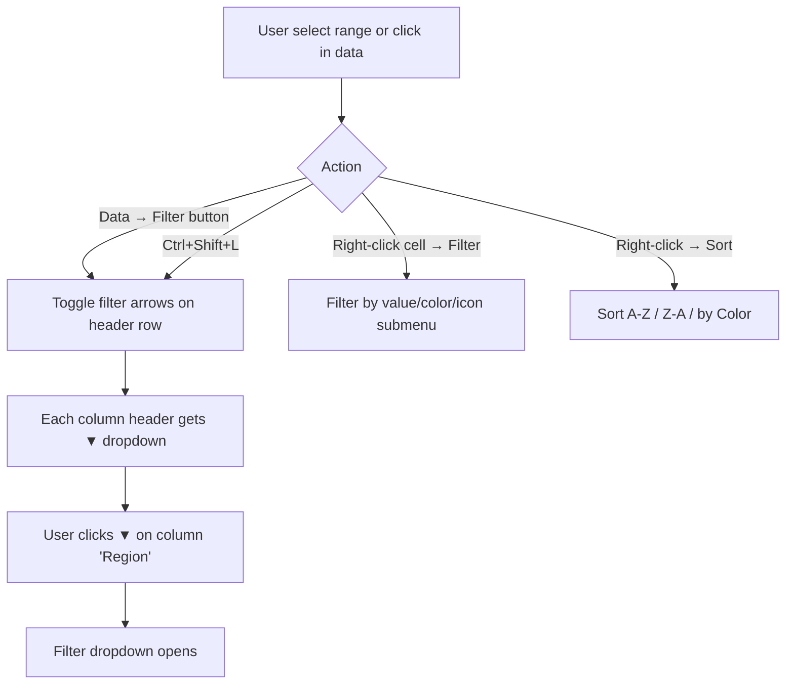
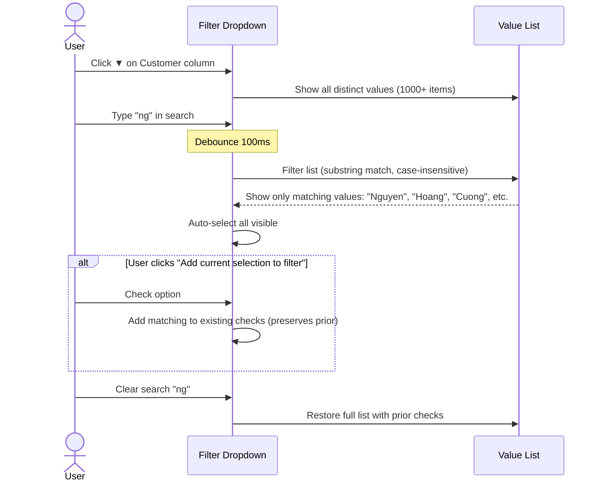
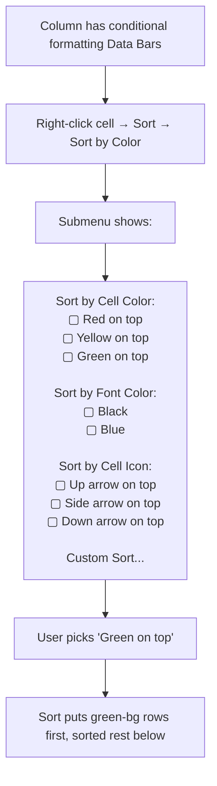

# UX Flow — Spec 15 Filter & Sort

> Spec gốc: [../15-filter-sort.md](../15-filter-sort.md)

## Apply filter — entry flow



## Filter dropdown layout (modern Excel)

```
Click ▼ on column "Region" header:
┌─ Filter dropdown ─────────────────────────┐
│ ⬆ Sort A to Z                             │
│ ⬇ Sort Z to A                             │
│ Sort by Color                          ▶ │
│ Sheet View                             ▶ │ ← 2024+ Sheet View integration
│ ──────────────────────────────────────── │
│ 🧹 Clear Filter From "Region"            │
│ Filter by Color                        ▶ │
│ Text Filters                           ▶ │ ← Begins With, Contains, etc.
│ ──────────────────────────────────────── │
│ 🔍 [Search...]                            │
│ ──────────────────────────────────────── │
│ ☑ (Select All)                            │
│ ☑ North                                   │
│ ☑ South                                   │
│ ☑ East                                    │
│ ☑ West                                    │
│ ☐ (Blanks)                                │
│                                             │
│              [ OK ]   [ Cancel ]           │
└──────────────────────────────────────────────┘

When column is filtered:
Header arrow changes ▼ → 🔽 (with funnel icon overlay)
Row numbers of hidden rows display in blue instead of black
```

## Text/Number/Date filter submenu

```
Hover over "Number Filters" (column is numeric):
┌────────────────────────────────────┐
│ Equals...                            │
│ Does Not Equal...                    │
│ Greater Than...                      │
│ Greater Than Or Equal To...          │
│ Less Than...                         │
│ Less Than Or Equal To...             │
│ Between...                           │
│ ────────────────────────────────── │
│ Top 10...                            │
│ Above Average                        │
│ Below Average                        │
│ ────────────────────────────────── │
│ Custom Filter...                     │ ← 2-condition AND/OR
└──────────────────────────────────────┘

Hover over "Date Filters" (column is date):
┌────────────────────────────────────┐
│ Equals...                            │
│ Before...                            │
│ After...                             │
│ Between...                           │
│ ────────────────────────────────── │
│ Tomorrow                             │
│ Today                                │
│ Yesterday                            │
│ ────────────────────────────────── │
│ Next Week                            │
│ This Week                            │
│ Last Week                            │
│ ────────────────────────────────── │
│ Next Month                           │
│ This Month                           │
│ Last Month                           │
│ ────────────────────────────────── │
│ Next Quarter                         │
│ This Quarter                         │
│ Last Quarter                         │
│ ────────────────────────────────── │
│ Next Year                            │
│ This Year                            │
│ Last Year                            │
│ Year to Date                         │
│ All Dates in the Period         ▶  │ ← Q1/Q2/Q3/Q4 or Jan-Dec
│ ────────────────────────────────── │
│ Custom Filter...                     │
└──────────────────────────────────────┘
```

## Custom Filter (2-condition AND/OR)

```
Number Filters → Custom Filter...:
┌─ Custom AutoFilter ─────────────────────────────────┐
│ Show rows where: Revenue                              │
│                                                        │
│ [Greater Than          ▼]  [50000               ▼]   │
│                                                        │
│ ● And  ◯ Or                                            │
│                                                        │
│ [Less Than Or Equal To ▼]  [200000              ▼]   │
│                                                        │
│ Use ? to represent any single character                │
│ Use * to represent any series of characters            │
│                                                        │
│                              [ OK ]   [ Cancel ]      │
└────────────────────────────────────────────────────────┘
```

## Filter search box flow (Excel 2010+)



## Sort dialog (Data → Sort)

```
Data tab → Sort button:
┌─ Sort ──────────────────────────────────────────────────────┐
│ [+ Add Level] [- Delete Level] [📋 Copy Level]  [⬆ ⬇]      │
│ ☑ My data has headers                                        │
│ ──────────────────────────────────────────────────────────── │
│ Column           Sort On             Order                   │
│ ┌──────────────────────────────────────────────────────┐   │
│ │ Sort by:   [Region    ▼]  [Cell Values  ▼]  [A to Z ▼]│   │
│ │ Then by:   [Revenue   ▼]  [Cell Values  ▼]  [Largest ▼]│   │
│ │ Then by:   [Date      ▼]  [Cell Values  ▼]  [Oldest ▼]│   │
│ └──────────────────────────────────────────────────────┘   │
│                                                                │
│ Options... (left-to-right, case-sensitive)                    │
│                                          [ OK ]   [ Cancel ]  │
└────────────────────────────────────────────────────────────────┘

Sort On options:
- Cell Values (default)
- Cell Color
- Font Color
- Conditional Formatting Icon

Order options (depend on Sort On):
- Cell Values: A to Z / Z to A / Custom List...
- Color: pick color → on top/bottom
```

## Multi-level sort visual

```
Data before sort:
┌────────┬─────────┬──────┐
│ Region │ Revenue │ Date │
├────────┼─────────┼──────┤
│ South  │ 100     │ Jan  │
│ North  │ 300     │ Feb  │
│ South  │ 200     │ Mar  │
│ North  │ 150     │ Jan  │
└────────┴─────────┴──────┘

After Sort: Region A→Z, then Revenue Largest→Smallest:
┌────────┬─────────┬──────┐
│ North  │ 300     │ Feb  │  ← Region North first, sorted by Revenue desc
│ North  │ 150     │ Jan  │
│ South  │ 200     │ Mar  │  ← Region South second, sorted by Revenue desc
│ South  │ 100     │ Jan  │
└────────┴─────────┴──────┘
```

## Filter result UI state

```
Filtered Sales table (only "North" region shown):

Row#  ┌────────┬─────────┬──────┐
   1  │ Region 🔽│ Revenue │ Date │  ← funnel icon shows filter active
      ├────────┼─────────┼──────┤
   2  │ North   │ 300     │ Feb  │
      ├────────┼─────────┼──────┤
   5  │ North   │ 150     │ Jan  │  ← row 5 (rows 3,4 hidden, numbered in blue)
      ├────────┼─────────┼──────┤
  10  │ North   │ 450     │ Apr  │
      └────────┴─────────┴──────┘

Hidden row numbers (3, 4, 6-9) shown in blue color in row headers.
Status bar: "3 of 100 records found"
```

## Sort by Color / Icon



## Advanced Filter (Data → Advanced)

```
┌─ Advanced Filter ────────────────────────────────────┐
│ Action                                                 │
│ ● Filter the list, in-place                            │
│ ◯ Copy to another location                             │
│                                                         │
│ List range:        [Sheet1!$A$1:$D$1000        ] ↗   │
│ Criteria range:    [Sheet1!$F$1:$H$3           ] ↗   │
│ Copy to:           [                            ] ↗   │
│                                                         │
│ ☐ Unique records only                                  │
│                                                         │
│                            [ OK ]   [ Cancel ]        │
└────────────────────────────────────────────────────────┘

Criteria range format:
┌───────┬────────┐
│ Region│ Revenue│  ← copy of column headers
├───────┼────────┤
│ North │ >1000  │  ← row 2: AND condition (Region=North AND Revenue>1000)
│ South │ >500   │  ← row 3: OR condition (Region=South AND Revenue>500)
└───────┴────────┘
```

## Filter integration with Tables

```
For ListObject (Table):
- Filter arrows ALWAYS visible in header (auto-enabled)
- Slicer (Spec 54) provides visual filter UI as alternative
- Filter state stored per-table, persists when table grows
- Total row reflects filtered values: SUBTOTAL(9, range)
```

## Implementation hints cho Slave

- **Filter model**: per-column dict `{col: FilterCriteria}` stored on sheet.
- **Hidden rows**: maintain `set[int]` of hidden row indices; `QTableView.setRowHidden(row, True)`.
- **Distinct values cache**: when opening filter dropdown, compute `set(sheet.col_values(col))`; cache invalidated on edit.
- **Filter dropdown**: `QMenu` with `QLineEdit` (search), scrollable `QListWidget` (checkboxes), OK/Cancel.
- **Sort algorithm**:
  ```python
  def sort_range(rng, levels):
      data = sheet.get_block(rng)
      header = data[0] if has_headers else None
      rows = data[1:] if has_headers else data
      
      def sort_key(row):
          keys = []
          for level in levels:
              v = row[level.col]
              keys.append(_normalize(v, level.sort_on, level.order))
          return tuple(keys)
      
      rows.sort(key=sort_key)
      sheet.set_block(rng, [header, *rows] if has_headers else rows)
  ```
- **Sort by Color**: extract bg color from format dict; sort by color rank with user-specified priority.
- **Custom Lists**: load from `Excel Options → Advanced → Custom Lists`; e.g. ["Mon", "Tue", ...].
- **Advanced Filter criteria**: parse criteria range → list of dicts; each row = AND group, rows = OR.
- **Performance**: filter 1M rows → use bitmap (numpy bool array) for hidden mask; apply via `setRowHidden` only on visible rows.
- **Sheet View** (Spec 56): filter state can be scoped to view, not workbook-wide.
