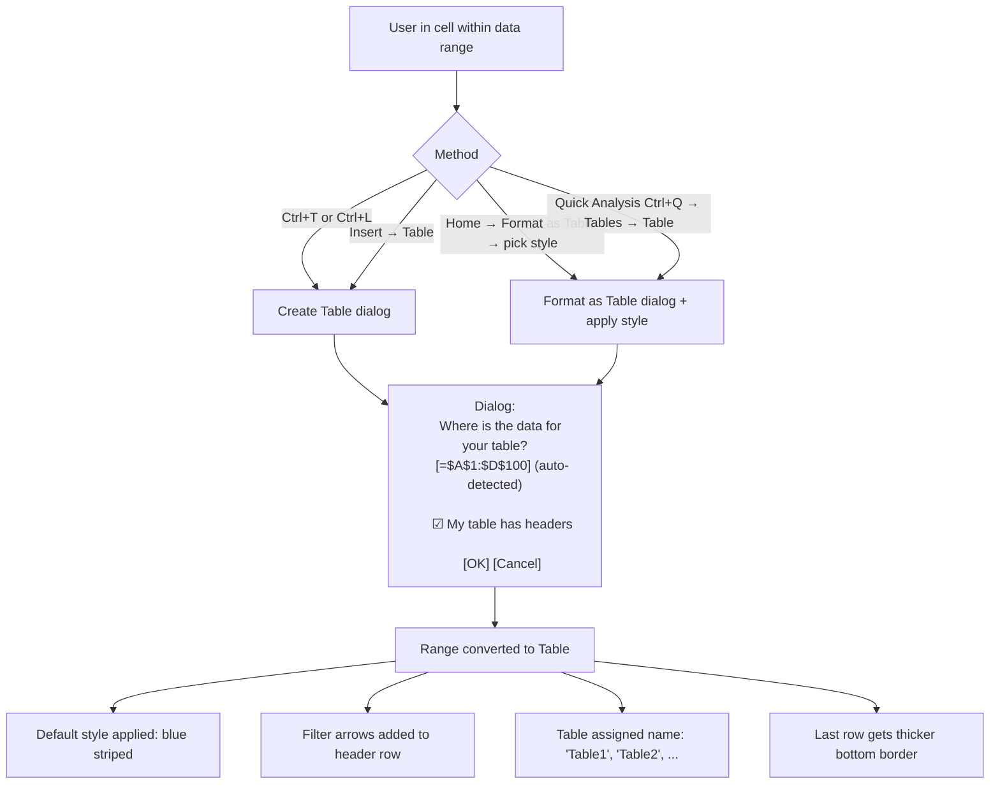
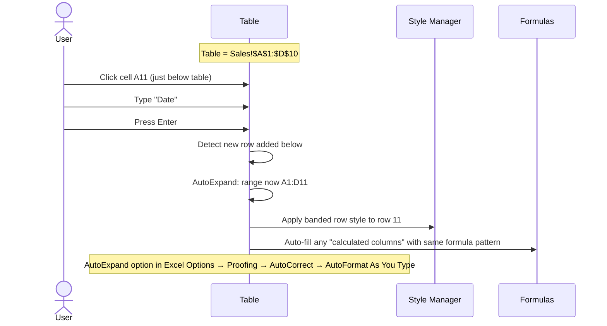

# UX Flow — Spec 16 Table (ListObject)

> Spec gốc: [../16-table.md](../16-table.md)

## Create Table flow



## Table visual

```
Before (regular range):
┌────────┬─────────┬──────┬────────┐
│ Name   │ Region  │ Qty  │ Price  │
├────────┼─────────┼──────┼────────┤
│ Apple  │ North   │ 10   │ 100    │
│ Banana │ South   │ 20   │ 50     │
│ Cherry │ East    │ 15   │ 80     │
└────────┴─────────┴──────┴────────┘

After Ctrl+T (default blue style):
┌────────────────────────────────────┐
│▓Name▓▼ ▓Region▓▼▓Qty▓▼ ▓Price▓▼  │ ← dark header row + filter arrows
├────────┼─────────┼──────┼─────────┤
│ Apple  │ North   │ 10   │ 100     │ ← row 1: light bg
├────────┼─────────┼──────┼─────────┤
│ Banana │ South   │ 20   │ 50      │ ← row 2: alt bg (striped)
├────────┼─────────┼──────┼─────────┤
│ Cherry │ East    │ 15   │ 80      │ ← row 3: light bg
└────────┴─────────┴──────┴─────────┘
                                      ⌐
                                      Resize handle bottom-right (extends table)
```

## Table Design contextual tab

```
Click in Table → ribbon shows Table Design tab:

┌─────────────────────────────────────────────────────────────────────────┐
│ [Table Name:   ] [Resize] [Convert ] [Slicer ] [Export ▼] [Refresh] [Properties] [Header Row ☑] [Total Row ☐] [Banded Rows ☑] [Banded Cols ☐] [Filter Btn ☑] [Style ▼ Quick Styles gallery]│
└─────────────────────────────────────────────────────────────────────────────┘

Table Name field: rename via this box
Resize Table: drag UI or type new range
Convert to Range: removes table semantics, keeps formatting
Insert Slicer: opens Slicer dialog scoped to this Table

Style toggles:
- Header Row: show/hide header
- Total Row: show/hide bottom Total Row (with aggregate functions)
- First Column / Last Column: bold those columns
- Banded Rows / Banded Cols: alternating row/col colors
- Filter Button: show/hide filter arrows
```

## Structured references

```
After creating table named "Sales" with columns Name/Region/Qty/Price:

Cell references inside table use structured syntax:
- =Sales[@Qty] * Sales[@Price]      ← current row, columns Qty & Price
- =SUM(Sales[Qty])                   ← entire Qty column
- =SUMIF(Sales[Region], "North", Sales[Qty]) ← criteria + sum
- =Sales[[#Headers],[Name]]          ← header cell only
- =Sales[[#Totals],[Qty]]            ← total row cell only
- =Sales[[#Data],[Qty]]              ← data rows only (no header/total)
- =Sales[#All]                        ← whole table including header+total

Inside table:
- "@" = "this row"
- No "@" = entire column

Formula auto-completes when typing:
"=Sales[" → dropdown lists all columns + special items:
┌──────────────────┐
│ #All              │
│ #Data             │
│ #Headers          │
│ #Totals           │
│ #This Row         │
│ ────────────────  │
│ Name              │
│ Region            │
│ Qty               │
│ Price             │
└────────────────────┘
```

## AutoExpand on new data



## Total Row

```
Click in Table → Table Design → ☑ Total Row:

Result — last row appended:
┌────────────────────────────────────┐
│▓Name▓▓Region▓▓Qty▓▓Price▓▓Total▓ │
├────────┼─────────┼──────┼──────────┤
│ Apple  │ North   │ 10   │ 1000     │
│ Banana │ South   │ 20   │ 1000     │
│ Cherry │ East    │ 15   │ 1200     │
├────────┼─────────┼──────┼──────────┤
│ Total  │         │  45  │   3200   │ ← Total row
└────────┴─────────┴──────┴──────────┘
   ▲         ▲       ▲        ▲
   text      blank   SUM      SUM (default for numeric cols)

Each Total Row cell has a ▼ dropdown to pick aggregation:
- None
- Average
- Count
- Count Numbers
- Max
- Min
- Sum
- StdDev
- Var
- More Functions...

Generated formula: =SUBTOTAL(9, Sales[Qty])
(SUBTOTAL ignores hidden rows from filter)
```

## Filter integration

```
Filter arrows in table header (always visible by default):
┌────────────────────────────────────┐
│▓Name▓▼ ▓Region▓▼▓Qty▓▼ ▓Price▓▼  │
└────────────────────────────────────┘

Click ▼ → standard filter dropdown (Spec 15)
+ Slicer option to add visual filter panel

Filter applied:
- Hidden rows respect filter (visually skip)
- Total Row's SUBTOTAL auto-excludes filtered-out rows
- Sort persists on table; reflects in filter dropdown
```

## Calculated columns

```mermaid
flowchart TD
    A[User type formula in any cell of new column] --> B[Press Enter]
    
    B --> C{Detect uniform pattern?}
    C -->|Yes| D[Auto-fill entire column with same formula]
    C -->|No| E[Just that cell gets formula]
    
    D --> F[Lightning bolt icon ⚡ appears at top of column]
    F --> G[Click ⚡ to:
    - Stop creating calculated columns
    - Restore formula in other cells
    - Open AutoCorrect Options]
    
    E --> H[User edits other cells in column independently]
    
    D --> I[Column called "calculated column"]
    I --> J[New rows added → formula auto-propagates]
```

## Sliced Table example

```
Click table → Table Design → Insert Slicer → pick "Region":

┌─ Region (Slicer) ─────┐    ┌────────────────────────────────────┐
│ ☑ East                  │    │ Table filtered by Region=North        │
│ ☑ North                 │    │ (rows for other regions hidden)        │
│ ☑ South                 │    │                                        │
│ ☑ West                  │    │ Name   Region  Qty  Price             │
└─────────────────────────┘    │ Apple  North   10   100               │
   ↑                            │ Date   North   30   400               │
   User clicks "North"          └────────────────────────────────────────┘
   → table filters
```

## Table → Range conversion

```
Click table → Table Design → Convert to Range:

┌─ Microsoft Excel ──────────────────────┐
│ Do you want to convert the table to a    │
│ normal range?                             │
│                                            │
│         [ Yes ]   [ No ]                  │
└────────────────────────────────────────────┘

After Yes:
- Filter arrows removed
- Table styling preserved (colors stay)
- Structured references → A1-style refs (e.g., Sales[Qty] → $C$2:$C$11)
- Table name removed
- No more AutoExpand
```

## Naming rules

```
Table name validation:
- 1-255 chars
- Start with letter or underscore
- Cannot contain: spaces, special chars except _ and .
- Cannot be cell address (e.g., "A1")
- Case-insensitive uniqueness within workbook

Default names: Table1, Table2, ...
Best practice: rename to descriptive name (e.g., "Sales", "Customers")
```

## Implementation hints cho Slave

- **ListObject model**:
  ```python
  class Table:
      name: str
      range: CellRange
      has_headers: bool = True
      has_totals: bool = False
      style: TableStyle
      column_names: list[str]
      calculated_columns: dict[col_name, formula]
      total_row_aggs: dict[col_name, AggregateFunc]
      slicers: list[Slicer]
      filters: dict[col_name, FilterCriteria]
      sort: list[SortLevel]
  ```
- **Style application**: precompute alternating row colors; render in `CellDelegate` using style.
- **Auto-expand detection**: hook `sheet.dataChanged` signal; if change is in row immediately below table AND row was empty before → extend `range.bottom += 1`.
- **Calculated columns**: when user enters formula → check if 50%+ of column cells have same pattern relative to row → mark as calc column → fill rest.
- **Structured references parser**: tokenizer recognizes `Name[Col]`, `Name[@Col]`, `Name[#All]`, etc.; resolver translates to A1 ranges at eval time.
- **Total Row**: special row appended to range; cells contain `=SUBTOTAL(func_num, Table[Col])`.
- **Filter integration**: same engine as Spec 15; per-table filter state stored on Table object.
- **Auto-suggest column names in formulas**: when typing `=TableName[` → `QCompleter` with columns + special items.
- **Convert to range**: walk all cells, replace `Table[Col]` references with absolute range; remove Table from workbook registry.
- **Persistence**: serialize as `<table>` element in xlsx; openpyxl supports natively.
- **Slicer binding**: Spec 54 slicer connects via `connected_tables: list[Table]`.
