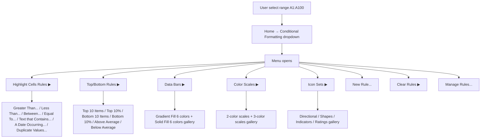
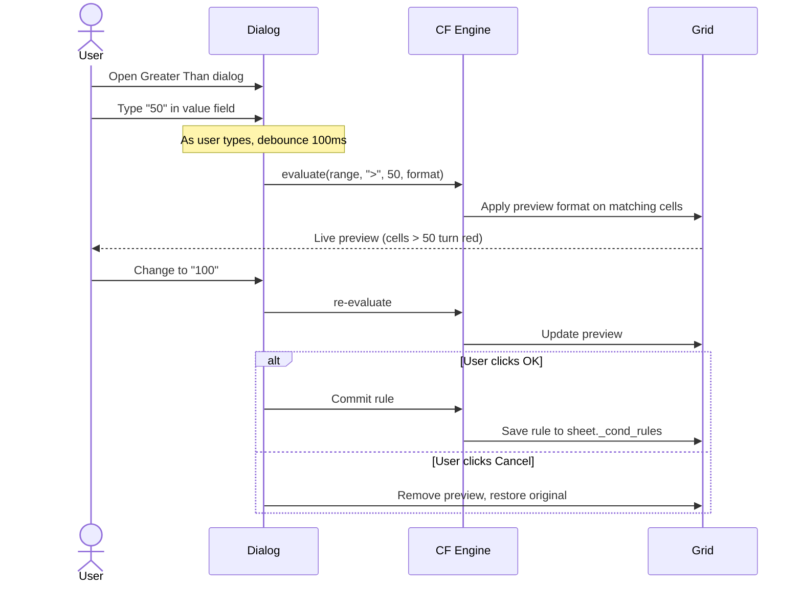
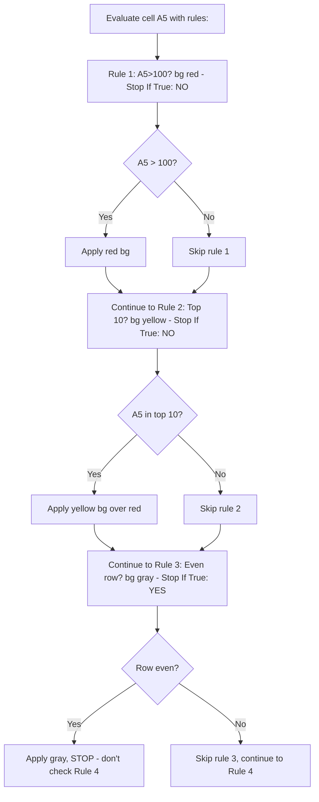
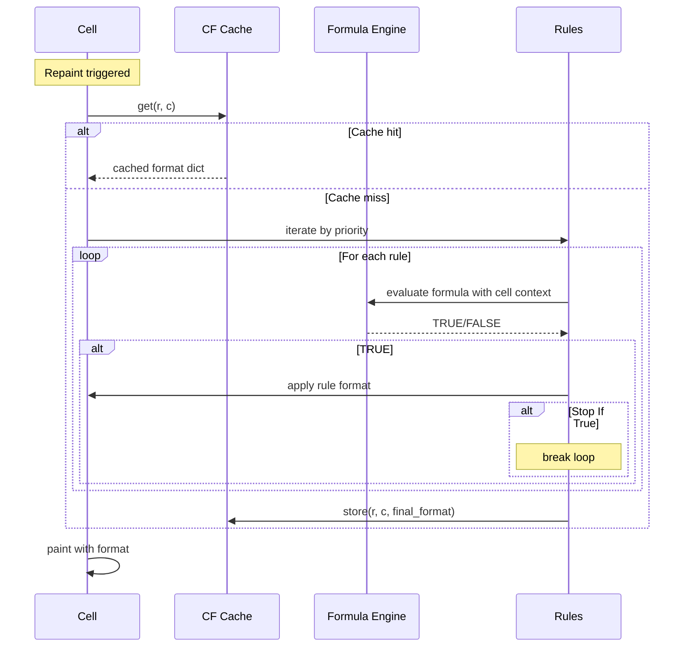

# UX Flow — Spec 17 Conditional Formatting

> Spec gốc: [../17-conditional-formatting.md](../17-conditional-formatting.md)

## CF entry flow



## Highlight Cells Rules → Greater Than dialog

```
┌─ Greater Than ──────────────────────────────────────┐
│ Format cells that are GREATER THAN:                  │
│                                                       │
│ ┌──────────────┐  with  ┌─────────────────────────┐ │
│ │ 100          │↗       │ Light Red Fill with     │ │
│ └──────────────┘        │ Dark Red Text         ▼ │ │
│                          └─────────────────────────┘ │
│                                                       │
│                                  [ OK ]   [ Cancel ] │
└───────────────────────────────────────────────────────┘
```

`with` dropdown — 6 màu preset fixed:
```
┌──────────────────────────────────────────────────┐
│ ▣ Light Red Fill with Dark Red Text (default)    │
│ ▣ Yellow Fill with Dark Yellow Text              │
│ ▣ Green Fill with Dark Green Text                │
│ ▣ Light Red Fill                                 │
│ ▣ Red Text                                       │
│ ▣ Red Border                                     │
│ ──────────────────────────────────────────────── │
│ Custom Format...    ← opens Format Cells dialog  │
└──────────────────────────────────────────────────┘
```

## Real-time preview



## Data Bars gallery

```
Home → Conditional Formatting → Data Bars → Gradient Fill submenu:

┌──────────────────────────────────────┐
│ Gradient Fill                         │
│                                        │
│ ┌──────────────────────┐              │
│ │ ▓▓▓▓░░░  Blue        │              │
│ │ ▓▓▓░░░░  Green       │              │
│ │ ▓▓░░░░░  Red         │              │
│ │ ▓▓▓▓▓░░  Orange      │              │
│ │ ▓▓▓░░░░  Light Blue  │              │
│ │ ▓▓▓░░░░  Purple      │              │
│ └──────────────────────┘              │
│                                        │
│ Solid Fill                             │
│                                        │
│ ┌──────────────────────┐              │
│ │ ▓▓▓░ Blue (solid)    │              │
│ │ ▓▓▓░ Green (solid)   │              │
│ │ ▓▓░░ Red (solid)     │              │
│ │ ...                   │              │
│ └──────────────────────┘              │
│                                        │
│ More Rules... → New Rule dialog       │
└────────────────────────────────────────┘
```

## Data Bars visual in cells

```
Cells with values 25, 50, 75, 100 and Blue Gradient Data Bar:

┌─────────────────────┐
│ ▓▓▓▓░░░░░░░░░  25  │  ← bar 25% width, value text right
├─────────────────────┤
│ ▓▓▓▓▓▓▓░░░░░░  50  │  ← bar 50% width
├─────────────────────┤
│ ▓▓▓▓▓▓▓▓▓▓░░░  75  │  ← bar 75% width
├─────────────────────┤
│ ▓▓▓▓▓▓▓▓▓▓▓▓▓  100 │  ← bar 100% width
└─────────────────────┘
```

## Color Scales — 3-color visual

```
Cells with values 10, 30, 50, 70, 90, 100 and Green-Yellow-Red 3-Color Scale:

(Min = green, Mid = yellow, Max = red)

┌─────┐
│ 10  │  ← deep green
├─────┤
│ 30  │  ← light green
├─────┤
│ 50  │  ← yellow-green
├─────┤
│ 70  │  ← orange-yellow
├─────┤
│ 90  │  ← orange-red
├─────┤
│ 100 │  ← deep red
└─────┘
```

## Icon Sets visual

```
3 Arrows (colored) icon set on values 10, 50, 90:

┌─────────────┐
│ ⬇  10       │  ← red down arrow (bottom 33%)
├─────────────┤
│ ➡  50       │  ← yellow side arrow (middle 33%)
├─────────────┤
│ ⬆  90       │  ← green up arrow (top 33%)
└─────────────┘
```

## New Rule → Use a formula dialog

```
┌─ New Formatting Rule ──────────────────────────────────────┐
│ Select a Rule Type:                                         │
│ ┌──────────────────────────────────────────────────────┐   │
│ │ Format all cells based on their values                │   │
│ │ Format only cells that contain                        │   │
│ │ Format only top or bottom ranked values               │   │
│ │ Format only values that are above or below average    │   │
│ │ Format only unique or duplicate values                │   │
│ │ Use a formula to determine which cells to format     │ ← │   │
│ └──────────────────────────────────────────────────────┘   │
│                                                              │
│ Edit the Rule Description:                                   │
│ Format values where this formula is true:                    │
│ ┌──────────────────────────────────────────────────────┐   │
│ │ =$B2>1000000                                          │   │
│ └──────────────────────────────────────────────────────┘   │
│                                                              │
│ Preview:                                                     │
│ ┌──────────────────────────────────────────────────────┐   │
│ │ AaBbCcYyZz                                            │   │
│ └──────────────────────────────────────────────────────┘   │
│ [ Format... ]                                                │
│                                                              │
│                                      [ OK ]   [ Cancel ]    │
└──────────────────────────────────────────────────────────────┘
```

## Manage Rules dialog

```
┌─ Conditional Formatting Rules Manager ─────────────────────┐
│ Show formatting rules for: [This Worksheet            ▼]   │
│                                                              │
│ [+ New Rule] [Edit Rule] [- Delete Rule]  [⬆] [⬇]          │
│ ──────────────────────────────────────────────────────────  │
│ Rule (applied in order shown)  Format     Applies to  Stop  │
│ ┌──────────────────────────────────────────────────────┐    │
│ │ Cell Value > 100        | ▓▓ (red bg) | =$A$1:$A$100 │ ☐  │
│ ├──────────────────────────────────────────────────────┤    │
│ │ Top 10 Items            | ▓▓ (yel bg) | =$B$1:$B$100 │ ☐  │
│ ├──────────────────────────────────────────────────────┤    │
│ │ Data Bar (Blue)         | ▓▓░░         | =$C$1:$C$100 │ ☐  │
│ ├──────────────────────────────────────────────────────┤    │
│ │ Formula: =MOD(ROW(),2)=0| ▓▓ (gray bg) | =$A$1:$D$100 │ ☑  │ ← Stop If True
│ └──────────────────────────────────────────────────────┘    │
│                                                              │
│                              [ Apply ]   [ OK ] [ Cancel ]  │
└──────────────────────────────────────────────────────────────┘

Rule priority: top = highest. Drag rows to reorder.
Stop If True: if row matches, skip rules below.
```

## Stop If True behavior



## CF evaluation hot-path consideration



Cache invalidation:
- Data change in cell → invalidate that cell + dependents.
- Rule edit → invalidate all cells in `applies_to`.
- New rule → invalidate all cells in applies_to.

## Implementation hints cho Slave

- **Rule data model**: extend `sheet._cond_rules: list[CondFormatRule]`. Include in `_push_undo()` snapshot.
- **Real-time preview**: when dialog open with debounced input → call `apply_preview(range, fmt)` that updates a transient overlay state, NOT committed to model. On Cancel → revert.
- **Data Bar render trong CellDelegate**: vẽ rect overlay phần data bar (width based on value normalized), text foreground.
- **Color Scale**: per-cell gradient interpolation between 2-3 color stops; value normalized [0,1] → blend RGB.
- **Icon Set**: render icon (SVG path) bên trái cell content, value text right-shift.
- **Manage Rules dialog**: `QTableWidget` với drag-drop reorder rows (priority).
- **Stop If True**: simple bool flag in rule; CF engine break loop when matched + flag set.
- **Performance**: 1M cells × 5 rules = 5M evaluations potentially. Cache aggressively, invalidate selectively. Async background evaluation cho non-visible cells.
