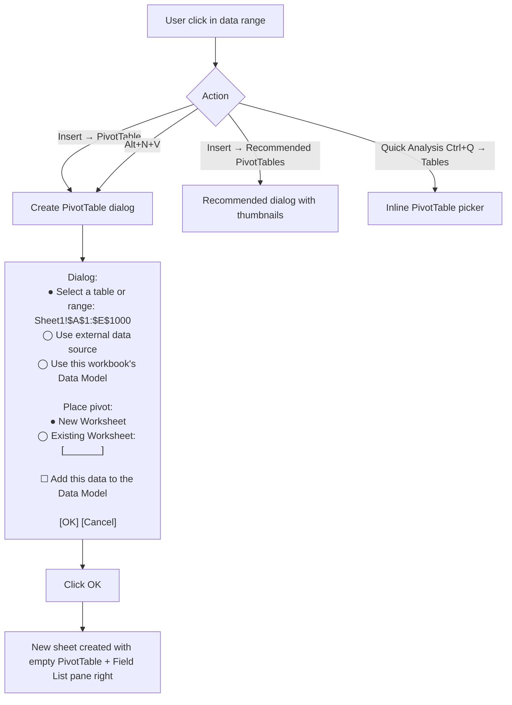
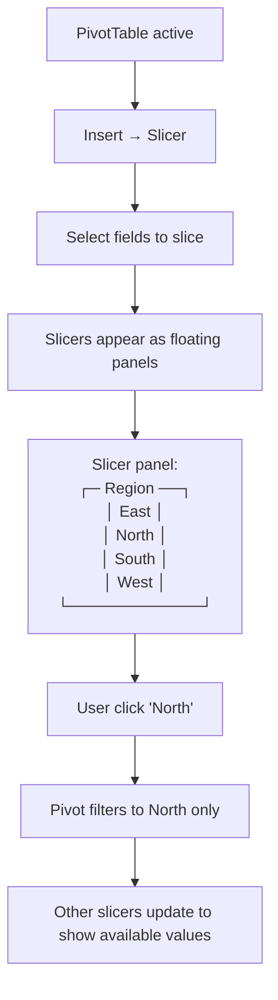

# UX Flow — Spec 18 PivotTable

> Spec gốc: [../18-pivot-table.md](../18-pivot-table.md)

## Create PivotTable — entry flow



## Field List pane

```
┌─ PivotTable Fields ─────────────────────┐
│ [⚙] [⌕ Search]                          │
│ ─────────────────────────────────────── │
│ Choose fields to add to report:          │
│                                            │
│ ☐ ID                                      │
│ ☑ Region          ← drag to area below   │
│ ☑ Product                                 │
│ ☐ Date                                    │
│ ☑ Quantity                                │
│ ☑ Revenue                                 │
│ ☐ Cost                                    │
│ ☐ Discount                                │
│                                            │
│ More Tables...   (if Data Model)          │
│ ─────────────────────────────────────── │
│ Drag fields between areas below:          │
│                                            │
│ ▼ Filters         ▼ Columns               │
│ ┌──────────────┐ ┌──────────────────┐   │
│ │              │ │ Region            │   │
│ └──────────────┘ │                    │   │
│                  └──────────────────┘   │
│                                            │
│ ▼ Rows            ▼ Values                │
│ ┌──────────────┐ ┌──────────────────┐   │
│ │ Product       │ │ Sum of Revenue   │   │
│ │               │ │ Sum of Quantity  │   │
│ └──────────────┘ └──────────────────┘   │
│                                            │
│ ☐ Defer Layout Update   [Update]          │
└────────────────────────────────────────────┘
```

## Drag-drop interaction

```mermaid
sequenceDiagram
    actor User
    participant List as Field List
    participant Pivot as PivotTable
    participant Engine as Pivot Engine
    
    User->>List: Drag "Revenue" from field list
    User->>List: Drop onto "Values" area
    
    List->>List: Field appears in Values area as "Sum of Revenue" (default agg)
    List->>Engine: Recalculate pivot layout
    
    Engine->>Engine: GROUP BY rows × columns × filter; aggregate values
    Engine-->>Pivot: New result grid
    
    Pivot->>User: Updated table appears
    
    User->>List: Click "Sum of Revenue" ▼
    List->>User: Show menu:
    Note over List: Move Up / Down / Beginning / End
    Note over List: Move to Rows / Columns / Filters
    Note over List: Remove Field
    Note over List: Value Field Settings...
    
    User->>List: Click "Value Field Settings..."
    List->>User: Open Value Field dialog (Sum/Count/Avg/Max/Min/...)
```

## Value Field Settings dialog

```
┌─ Value Field Settings ─────────────────────────┐
│ Source Name: Revenue                            │
│ Custom Name: [Sum of Revenue           ]        │
│                                                  │
│ [Summarize Values By] [Show Values As]          │
│                                                  │
│ Summarize value field by:                       │
│ ┌────────────────────────────────────┐         │
│ │ Sum                  ← selected     │         │
│ │ Count                                │         │
│ │ Average                              │         │
│ │ Max                                  │         │
│ │ Min                                  │         │
│ │ Product                              │         │
│ │ Count Numbers                        │         │
│ │ StdDev                               │         │
│ │ StdDevp                              │         │
│ │ Var                                  │         │
│ │ Varp                                 │         │
│ └────────────────────────────────────┘         │
│                                                  │
│ [Number Format...]                              │
│                                                  │
│                        [ OK ]   [ Cancel ]      │
└──────────────────────────────────────────────────┘

"Show Values As" tab:
- No Calculation
- % of Grand Total
- % of Column Total
- % of Row Total
- % Of...
- % of Parent Row Total
- % of Parent Column Total
- % of Parent Total
- Difference From...
- % Difference From...
- Running Total In...
- % Running Total In...
- Rank Smallest to Largest
- Rank Largest to Smallest
- Index
```

## PivotTable layout result

```
After dragging:
  Rows: Product
  Columns: Region
  Values: Sum of Revenue

Result on sheet:
┌─────────────────┬───────┬───────┬───────┬───────┬────────────┐
│ Sum of Revenue  │ Column Labels                                │
├─────────────────┼───────┼───────┼───────┼───────┼────────────┤
│ Row Labels    ▼ │ East  │ North │ South │ West  │ Grand Total│
├─────────────────┼───────┼───────┼───────┼───────┼────────────┤
│ Apple           │ 1200  │  800  │ 1500  │  900  │  4400      │
│ Banana          │  500  │  600  │  300  │  400  │  1800      │
│ Cherry          │  900  │ 1200  │ 1100  │  700  │  3900      │
│ Date            │  300  │  450  │  500  │  250  │  1500      │
├─────────────────┼───────┼───────┼───────┼───────┼────────────┤
│ Grand Total     │ 2900  │ 3050  │ 3400  │ 2250  │ 11600      │
└─────────────────┴───────┴───────┴───────┴───────┴────────────┘
```

## Drill-down flow

```mermaid
flowchart TD
    A[User double-clicks cell "Apple/East = 1200"] --> B[Create new sheet]
    B --> C[Filter source data to Product=Apple AND Region=East]
    C --> D[Show 47 underlying records in new sheet as ListObject]
    D --> E[New sheet auto-named "Sheet2" or "Apple-East details"]
```

## Group field (date hierarchy)

```mermaid
sequenceDiagram
    actor User
    participant Pivot
    participant Group as Grouping dialog
    
    User->>Pivot: Drag "Date" field to Rows
    Pivot->>Pivot: Auto-detect date; suggest Year/Quarter/Month groups
    Pivot->>User: Add "Years", "Quarters", "Months" virtual fields
    
    alt User wants custom grouping
        User->>Pivot: Right-click Date row → Group
        Pivot->>Group: Open Grouping dialog
        Group->>User: "Starting at: 2024-01-01, Ending at: 2026-12-31
                       By: ☑ Days ☑ Months ☑ Quarters ☑ Years
                       Number of days: 7"
        User->>Group: OK
        Group->>Pivot: Apply grouping
    end
```

## Slicer integration



## Refresh flow

```
User edits source data → adds new row
  ↓
Pivot does NOT auto-update
  ↓
User actions to refresh:
  - Right-click pivot → Refresh
  - Data tab → Refresh All
  - Ctrl+Alt+F5 → Refresh All
  - PivotTable Analyze → Refresh
  - Set workbook option "Refresh data when opening the file"
  ↓
Engine re-reads source range/connection → re-aggregate → repaint pivot
Slicers also refresh
```

## Modern: Recommended PivotTables dialog

```
Insert → Recommended PivotTables:

┌─ Recommended PivotTables ──────────────────────────────────┐
│ Choose a layout:                                             │
│ ┌────────────────────────────────────────────────────────┐ │
│ │ ┌─Preview 1─────────┐  ┌─Preview 2─────────┐         │ │
│ │ │ Sum of Revenue     │  │ Count by Region    │         │ │
│ │ │ by Region          │  │                     │         │ │
│ │ │ ┌─────────────┐   │  │ ┌─────────────┐    │         │ │
│ │ │ │ East: $2900 │   │  │ │ East: 47    │    │         │ │
│ │ │ │ North:$3050 │   │  │ │ North: 52   │    │         │ │
│ │ │ └─────────────┘   │  │ └─────────────┘    │         │ │
│ │ └────────────────────┘  └────────────────────┘         │ │
│ │                                                          │ │
│ │ ┌─Preview 3─────────┐  ┌─Preview 4─────────┐          │ │
│ │ │ Avg by Product    │  │ Region × Product   │          │ │
│ │ │                    │  │  matrix             │          │ │
│ │ └────────────────────┘  └────────────────────┘         │ │
│ └────────────────────────────────────────────────────────┘ │
│                                                              │
│ Blank PivotTable                       [ OK ]   [ Cancel ]  │
└──────────────────────────────────────────────────────────────┘
```

## Modern dynamic array: GROUPBY / PIVOTBY

```
Alternative to PivotTable — Excel 365 dynamic array:

Cell A1: =PIVOTBY(Sales[Product], Sales[Region], Sales[Revenue], SUM)

Result spills:
A      B      C      D      E      F
Product East   North  South  West   Total
Apple  1200   800    1500   900    4400
Banana 500    600    300    400    1800
...

Advantages:
- Auto-updates on data change (no Refresh needed)
- Formula-based, transparent
- No Field List, drag-drop UI

PivotTable advantages still:
- Slicers, drill-down, value field settings UI
- Conditional formatting easier
- Hierarchical groupings UI
```

## Implementation hints cho Slave

- **Pivot model**: `class PivotTable: source_range, rows[], cols[], values[], filters[], cache`.
- **Aggregation engine**: pandas-backed:
  ```python
  df = pd.DataFrame(source_data)
  pivot = pd.pivot_table(df, 
                          index=rows, columns=cols, 
                          values=value_fields, aggfunc=agg_map,
                          margins=show_grand_totals)
  ```
- **Field List pane**: `QDockWidget` right side. Top half = `QListWidget` checkable; bottom = 4 `QListWidget`s (Filter/Cols/Rows/Vals) supporting drag-drop.
- **Drag-drop**: `QListWidget.setDragDropMode(InternalMove)` + accept drops from field tree.
- **Pivot output to grid**: render result back into target sheet starting at anchor cell; mark rows/cols as "pivot-managed" to prevent direct edit.
- **Refresh**: re-read source data → recompute pivot → diff with existing → update cells; preserve user formatting where possible.
- **Drill-down**: track contribution rows per output cell; on double-click → filter source df → write to new sheet as ListObject.
- **Modern alternative**: implement GROUPBY/PIVOTBY in formula engine (Spec 22) for declarative pivot.
- **Save/load**: serialize pivot config to JSON in workbook metadata; reconstruct on open.
- **Performance**: pandas pivot fast up to ~10M rows in memory; spill to DuckDB if larger.
