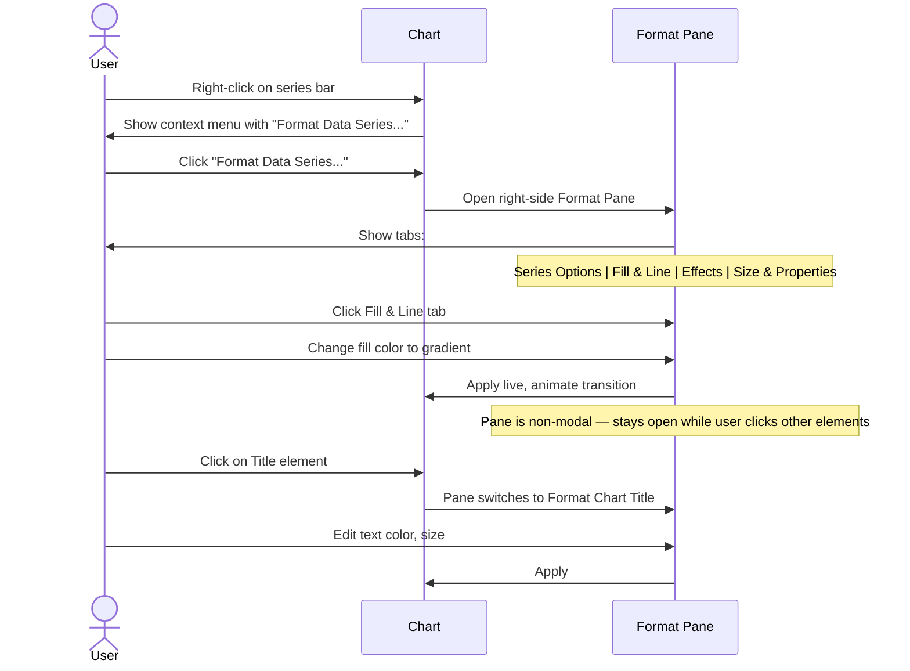

# UX Flow — Spec 19 Chart

> Spec gốc: [../19-chart.md](../19-chart.md)

## Insert Chart — entry flow

```mermaid
flowchart TD
    A[User select data range A1:D10] --> B{Action}
    
    B -->|Insert tab → Recommended Charts| C[Insert Chart dialog]
    B -->|Insert → specific chart gallery| D[Pick from preset gallery]
    B -->|Alt+F1| E[Insert default chart on same sheet]
    B -->|F11| F[Insert default chart on NEW chart sheet]
    B -->|Quick Analysis Ctrl+Q → Charts| G[Inline chart picker with previews]
    
    C --> H[Dialog with 2 tabs]
    H --> I[Tab 1: Recommended Charts - AI-suggested]
    H --> J[Tab 2: All Charts - full catalog by category]
    
    D --> K[Chart inserted at cell anchor]
    E --> K
    F --> L[New sheet "Chart1"]
    G --> K
```

## Insert Chart dialog

```
Insert → Recommended Charts:

┌─ Insert Chart ────────────────────────────────────────────┐
│ [Recommended Charts] [All Charts]                           │
│ ────────────────────────────────────────────────────────── │
│ ┌──────────────┬─────────────────────────────────────────┐│
│ │ Suggestions  │  Preview                                  ││
│ │              │                                            ││
│ │ ┌──────────┐ │  ┌──────────────────────────────────┐  ││
│ │ │📊 Clust. │ │  │ Clustered Column                 │  ││
│ │ │  Column  │ │  │                                   │  ││
│ │ └──────────┘ │  │ Title                             │  ││
│ │              │  │ ┌─────────────────────────────┐   │  ││
│ │ ┌──────────┐ │  │ │█ █ █ █                       │   │  ││
│ │ │📈 Line   │ │  │ │█ █ █ █                       │   │  ││
│ │ │          │ │  │ │█▒█▒█▒█▒                      │   │  ││
│ │ └──────────┘ │  │ └─────────────────────────────┘   │  ││
│ │              │  │  Q1 Q2 Q3 Q4                       │  ││
│ │ ┌──────────┐ │  │  ▢ Apple  ▢ Banana               │  ││
│ │ │📊 Stacked│ │  └──────────────────────────────────┘  ││
│ │ │  Column  │ │                                          ││
│ │ └──────────┘ │  Why suggested: Your data has 1 categ.  ││
│ │              │  column and 2-4 numeric columns suit-    ││
│ │ ┌──────────┐ │  able for comparison side-by-side.       ││
│ │ │🍩 Donut  │ │                                          ││
│ │ │          │ │                                          ││
│ │ └──────────┘ │                                          ││
│ │              │                                          ││
│ │ (scrollable) │                                          ││
│ └──────────────┴──────────────────────────────────────────┘│
│                                                              │
│                                  [ OK ]   [ Cancel ]        │
└──────────────────────────────────────────────────────────────┘
```

## All Charts tab — categories

```
[Recommended Charts] [All Charts]
─────────────────────────────────────────────────
Categories (left sidebar):

📊 Column          ← Clustered, Stacked, 100% Stacked, 3D variants
📊 Bar             ← horizontal column equivalents
📈 Line            ← Line, Stacked Line, 100% Stacked, with Markers
🥧 Pie             ← Pie, Doughnut, 3D Pie, Pie of Pie, Bar of Pie
📈 Area            ← Area, Stacked, 100% Stacked
📊 XY (Scatter)    ← Scatter, Scatter with Smooth Lines, Bubble
🗺️ Map             ← Filled Map (geographic)
📊 Stock           ← OHLC, Candlestick
📊 Surface         ← 3D, Contour
🕸️ Radar           ← Radar, Filled Radar
📊 Treemap         ← hierarchical proportions
☀️ Sunburst        ← hierarchical rings
📊 Histogram       ← frequency distribution
📊 Box & Whisker   ← statistical summary
🌊 Waterfall       ← cumulative effects (financial)
🔀 Funnel          ← sales pipeline visualization
🔄 Combo           ← mix line + column on dual axis
```

## Chart objects on sheet

```
After inserting Clustered Column chart:

┌──┬────┬────┬────┬────┐
│  │ Q1 │ Q2 │ Q3 │ Q4 │
├──┼────┼────┼────┼────┤
│A │ 10 │ 20 │ 15 │ 25 │
│B │ 5  │ 15 │ 25 │ 30 │
└──┴────┴────┴────┴────┘

       ┌──────────────────────────────┐
       │ Sales by Quarter              │ ← Chart Title
       │ 30 ┤                  █       │
       │ 25 ┤            █  █ █  █     │
       │ 20 ┤      █  █  █  █ █  █    │
       │ 15 ┤ █  █ █  █  █  █ █  █    │
       │ 10 ┤ █  █ █  █  █  █ █  █    │
       │  5 ┤ █▒ █▒█▒ █▒ █▒ █▒█▒ █▒  │
       │    └────────────────────────  │
       │      Q1   Q2   Q3   Q4         │
       │      ▢ A  ▢ B   ← Legend       │
       └──────────────────────────────┘
       ╲                          ╱
        ◯ ─────resize handles ─── ◯
        ╲                          ╲
         ◯ ──────────────────────── ◯
         
Resize handles 8 positions; corner handles preserve aspect ratio with Shift held.
Drag border (not handle) → move chart anchor.
```

## Chart Tools contextual ribbon

```
When chart selected, ribbon switches to:

[File] [Home] [Insert] ... | [Chart Design] [Format]
                              ╲                    ╱
                               Contextual tabs

Chart Design tab:
┌─────────────────────────────────────────────────────────────┐
│ [Add Chart] [Quick   ] [Change Colors] [Chart Styles ▼     ]│
│ [Element ▼] [Layout ▼]                                       │
│ ─────────────────────────────────────────────────────────── │
│ [Switch    ] [Select  ] [Change      ] [Move      ]         │
│ [Row/Column] [Data]     [Chart Type]   [Chart]              │
└────────────────────────────────────────────────────────────── ┘

Format tab:
┌─────────────────────────────────────────────────────────────┐
│ [Current  ] [Shape Styles] [WordArt    ] [Arrange] [Size  ] │
│ [Selection]                [Styles]                          │
└────────────────────────────────────────────────────────────── ┘
```

## Chart Elements (+ button)

```
Click chart → 3 floating buttons appear top-right:

       ┌──────────────────────────┐
       │ ...chart content...        │ [+]
       │                            │ [🎨]  ← Chart Styles
       │                            │ [▼]   ← Chart Filters
       └──────────────────────────┘

Click [+] → Chart Elements panel:
┌─ Chart Elements ──────────┐
│ ☑ Axes               ▶   │
│ ☑ Axis Titles        ▶   │
│ ☑ Chart Title        ▶   │
│ ☐ Data Labels        ▶   │
│ ☐ Data Table         ▶   │
│ ☐ Error Bars         ▶   │
│ ☑ Gridlines          ▶   │
│ ☑ Legend             ▶   │
│ ☐ Lines              ▶   │ ← (line charts only)
│ ☐ Trendline          ▶   │
│ ☐ Up/Down Bars       ▶   │
└────────────────────────────┘

Hover ▶ on item → submenu with position options (top/bottom/left/right/centered)
```

## Format chart pane



## Select Data Source dialog

```
Chart Design → Select Data:

┌─ Select Data Source ─────────────────────────────────────┐
│ Chart data range: [=Sheet1!$A$1:$D$10              ] ↗  │
│                                                            │
│ ┌──────────────────────────────────────────────────────┐ │
│ │ [Switch Row/Column]                                    │ │
│ └──────────────────────────────────────────────────────┘ │
│                                                            │
│ Legend Entries (Series)        Horizontal (Category)      │
│                                Axis Labels                 │
│ [+ Add] [Edit] [- Remove]      [Edit]                     │
│ [⬆] [⬇]                                                    │
│ ┌──────────────────────┐       ┌──────────────────────┐  │
│ │ ☑ Apple               │       │ Q1                    │  │
│ │ ☑ Banana              │       │ Q2                    │  │
│ │ ☐ Cherry              │       │ Q3                    │  │
│ └──────────────────────┘       │ Q4                    │  │
│                                  └──────────────────────┘  │
│                                                            │
│ Hidden and Empty Cells...        [ OK ]   [ Cancel ]      │
└──────────────────────────────────────────────────────────────┘

Series edit dialog:
┌─ Edit Series ────────────────────────────┐
│ Series name:                              │
│ [=Sheet1!$B$1                       ] ↗  │
│                                            │
│ Series values:                            │
│ [=Sheet1!$B$2:$B$5                 ] ↗  │
│                                            │
│                          [ OK ]   [ Cancel] │
└────────────────────────────────────────────┘
```

## Change Chart Type

```
Right-click chart → Change Chart Type, or Chart Design → Change Chart Type:

┌─ Change Chart Type ──────────────────────────────────────┐
│ [Recommended Charts] [All Charts]                          │
│ ────────────────────────────────────────────────────────  │
│ Same UI as Insert Chart dialog                             │
│ Current chart type pre-selected                            │
│                                                              │
│ For Combo charts:                                           │
│ ┌──────────────────────────────────────────────────────┐  │
│ │ Series Name    Chart Type      Secondary Axis          │  │
│ │ Apple          [Clust. Col ▼]  ☐                      │  │
│ │ Banana         [Line       ▼]  ☑                      │  │
│ │ Target         [Line       ▼]  ☑                      │  │
│ └──────────────────────────────────────────────────────┘  │
│                                                              │
│                                      [ OK ]   [ Cancel ]   │
└──────────────────────────────────────────────────────────────┘
```

## Chart filter (▼ button)

```
Click ▼ on chart:

┌─ Chart Filters ──────────┐
│ [Values] [Names]          │ ← tabs
│ ───────────────────────── │
│                            │
│ Series                     │
│ ☑ Apple                    │
│ ☑ Banana                   │
│ ☐ Cherry                   │ ← uncheck → hide from chart
│                            │
│ Categories                 │
│ ☑ Q1                       │
│ ☑ Q2                       │
│ ☑ Q3                       │
│ ☐ Q4                       │ ← uncheck → hide quarter
│                            │
│ Select Data...             │
│            [Apply]         │
└────────────────────────────┘
```

## Move Chart to new sheet

```mermaid
flowchart TD
    A[Chart selected] --> B[Chart Design → Move Chart]
    B --> C["Dialog:
    ● New sheet: [Chart1____]
    ◯ Object in:  [Sheet1 ▼]"]
    
    C --> D{User choice}
    D -->|New sheet| E[Chart becomes full-page; chart sheet created]
    D -->|Object in| F[Chart moves to specified sheet as embedded]
    
    E --> G[New tab "Chart1" appears at bottom; chart fills the tab]
    F --> H[Chart anchored on target sheet]
```

## Sparklines vs Charts

```
Sparklines (Spec 33) = mini-charts inside a cell:
┌────┬──────────────────┐
│ A  │       Trend        │
├────┼──────────────────┤
│ 10 │ ▁▂▃▅▆▇▅▃▂▁         │ ← Line sparkline
│ 20 │ ▁▂▃▄▅▆▇█▇▆         │
└────┴──────────────────┘

vs full Chart = separate object on sheet:
- Sparkline: 1-cell, ultra-compact, no axes/legend
- Chart: standalone, full features

Both exist — Sparkline for inline data, Chart for analysis.
```

## Implementation hints cho Slave

- **Chart object model**: `class Chart: chart_type, data_range, series[], options, anchor_cell, size`.
- **Render engine**: use **matplotlib** (mature) or **pyqtgraph** (faster for interactive).
  ```python
  import matplotlib.pyplot as plt
  from matplotlib.backends.backend_qtagg import FigureCanvasQTAgg
  
  fig = Figure()
  ax = fig.add_subplot(111)
  ax.bar(categories, values)
  canvas = FigureCanvasQTAgg(fig)
  ```
- **Chart embedded in sheet**: wrap canvas in `QGraphicsProxyWidget` in a `QGraphicsScene` overlay; movable/resizable.
- **Chart sheet**: separate tab type (not regular spreadsheet); fill entire view with canvas.
- **Contextual ribbon**: switch tab visibility based on selection type; activate Chart Design + Format tabs.
- **Format Pane**: `QDockWidget` right side; populated dynamically per chart element selected.
- **Live update**: chart subscribes to data range change events → re-render with debounce 200ms.
- **Recommended Charts AI**: simple heuristics:
  - 1 category col + 1 numeric col → Pie/Bar
  - 1 category col + 2-4 numeric cols → Clustered Column/Line
  - 2 numeric cols → Scatter
  - Date col + numeric → Line
  - Multiple numeric cols all sum to 100% → Stacked
- **Export**: chart to PNG/SVG via `fig.savefig(path)`; included in xlsx via openpyxl native chart objects.
