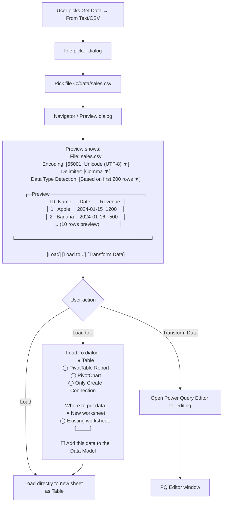
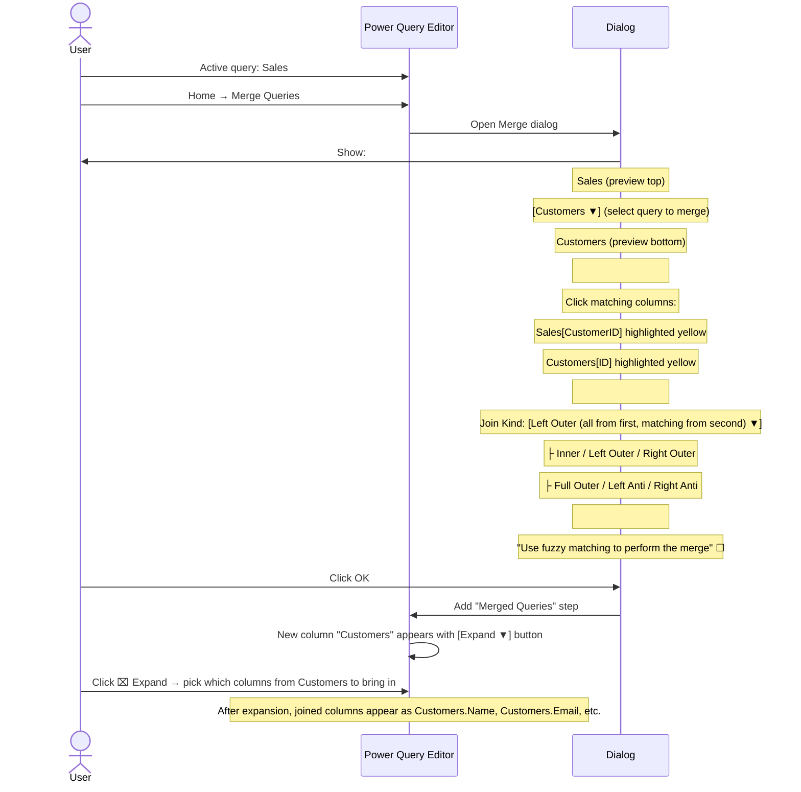
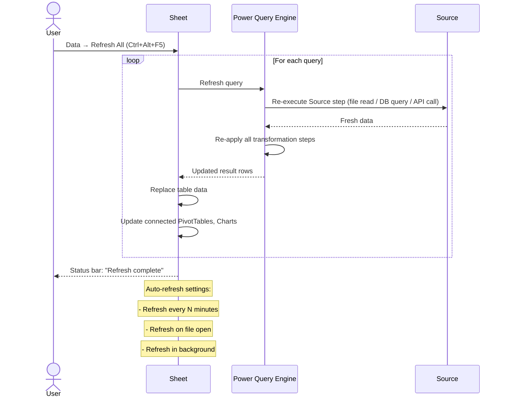

# UX Flow — Spec 20 Power Query (Get & Transform)

> Spec gốc: [../20-power-query.md](../20-power-query.md)

## Get Data entry points

```
Data tab → Get & Transform Data group:

┌──────────────────────────────────────────────────────────┐
│ [Get Data ▼] [From Text/CSV] [From Web] [From Table/Range]│
│ [Recent Sources] [Existing Connections]                    │
└────────────────────────────────────────────────────────────┘

Get Data ▼ submenu:
┌──────────────────────────────────────────────┐
│ 📁 From File                              ▶ │
│ 🗄 From Database                          ▶ │
│ ☁ From Azure                              ▶ │
│ 🌐 From Online Services                   ▶ │
│ 📊 From Other Sources                     ▶ │
│   ├ From Web                                  │
│   ├ From SharePoint List                      │
│   ├ From OData Feed                           │
│   ├ From Hadoop File (HDFS)                   │
│   ├ From Active Directory                     │
│   ├ From Microsoft Exchange                   │
│   ├ From ODBC                                 │
│   ├ From OLEDB                                │
│   ├ Blank Query                                │
│ 🔄 Combine Queries                         ▶ │
│   ├ Append                                    │
│   └ Merge                                     │
│ 🛠 Launch Power Query Editor                 │
│ ⚙ Data Source Settings                       │
│ ⚙ Query Options                              │
└────────────────────────────────────────────────┘
```

## Connection / load flow



## Power Query Editor window

```
┌─ Power Query Editor — Sales [Editor] ────────────────────────────────────────┐
│ [File] [Home] [Transform] [Add Column] [View] [Help]                          │
│ ────────────────────────────────────────────────────────────────────────────  │
│ Home tab:                                                                       │
│ [Close & Load▼] [Refresh] [Properties] [Advanced Editor] [Manage] [Choose Cols]│
│ [Remove Cols▼] [Keep Rows▼] [Remove Rows▼] [Split Col▼] [Group By] [Replace] │
│ [Use First Row as Headers] [Merge Queries▼] [Append] [Combine Files]           │
│ ─────────────────────────────────────────────────────────────────────────────│
│                                                                                  │
│ ┌─Queries─────────┐ ┌─Query result ────────────────────┐ ┌─Query Settings ───┐│
│ │ ▼ Queries [3]   │ │ Sales (45,672 rows)               │ │ PROPERTIES         ││
│ │ ▶ Sales         │ │ ┌────┬──────┬──────────┬───────┐│ │ Name: Sales        ││
│ │ ▶ Products      │ │ │ ID │ Name │ Date     │Revenue││ │ All Properties     ││
│ │ ▶ Customers     │ │ ├────┼──────┼──────────┼───────┤│ │                     ││
│ │                  │ │ │ 1  │Apple │2024-01-15│ 1200  ││ │ APPLIED STEPS      ││
│ │                  │ │ │ 2  │Banana│2024-01-16│  500  ││ │ Source             ││
│ │                  │ │ │ 3  │Cherry│2024-01-17│  800  ││ │ Promoted Headers   ││
│ │                  │ │ │ 4  │Date  │2024-01-18│  300  ││ │ Changed Type       ││
│ │                  │ │ │ ...                              ││ │ Filtered Rows      ││
│ │                  │ │ └────┴──────┴──────────┴───────┘│ │ Removed Columns    ││
│ │                  │ │                                     │ │ Sorted Rows        ││
│ │                  │ │                                     │ │ Renamed Columns    ││
│ │                  │ │                                     │ │ ← currently selected step│
│ │                  │ │                                     │ │                     ││
│ │                  │ │                                     │ │ [⚙][▼][↑↓][⌧]     ││
│ │                  │ │                                     │ │                     ││
│ └──────────────────┘ └─────────────────────────────────────┘ └─────────────────────┘│
│                                                                                  │
│ Column 4 selected | 4 columns × 45,672 rows | Refresh: 2 min ago               │
└──────────────────────────────────────────────────────────────────────────────────┘
```

## Applied Steps (transformation history)

```
Each transformation = an "Applied Step" recorded in M language.

Example query history:
1. Source              ← Csv.Document(File.Contents(...))
2. Promoted Headers    ← Table.PromoteHeaders(...)
3. Changed Type        ← Table.TransformColumnTypes(...)
4. Filtered Rows       ← Table.SelectRows(each [Revenue] > 0)
5. Removed Columns     ← Table.RemoveColumns(..., {"InternalID"})
6. Sorted Rows         ← Table.Sort(..., {"Revenue", Order.Descending})
7. Renamed Columns     ← Table.RenameColumns(..., {{"Date", "OrderDate"}})

Each step:
- Click step → preview shows result AT that step (time travel)
- ⚙ gear icon → edit step parameters via friendly dialog
- ↑↓ → reorder steps (use carefully — may break dependencies)
- ⌧ → delete step
- New transformation auto-inserted after current step
```

## Common transforms by category

```
Home tab transforms:
├ Reduce rows:
│  ├ Keep top N / bottom N / range / duplicates / unique
│  ├ Remove top N / alternate / duplicates / blank
├ Remove columns / keep columns
├ Split column by delimiter / number of chars / position
├ Use first row as headers (or transpose first)
├ Group by (with aggregation)
├ Replace values
├ Sort

Transform tab:
├ Data type (Text, Whole, Decimal, Date, ...)
├ Detect Data Type (auto)
├ Text column: lowercase / uppercase / capitalize / trim / clean / prefix / suffix / split
├ Number column: round / abs / power / log / sign / factorial / sum / min / max / median
├ Date column: year / month / quarter / week / day / age
├ Pivot Column / Unpivot Column / Unpivot Other Columns
├ Transpose
├ Reverse Rows

Add Column tab:
├ Column from Examples (AI-driven, like Flash Fill)
├ Custom Column (M formula)
├ Conditional Column (if-then-else builder)
├ Index Column
├ Duplicate Column
├ Merge Columns
```

## Filter rows visual

```
Filter rows by criterion:

User right-clicks "Region" column → Number Filters → Greater Than:

┌─ Filter Rows ────────────────────────┐
│ Keep rows where 'Revenue':              │
│                                          │
│ [is greater than          ▼]             │
│ [1000                                  ]  │
│                                          │
│ ● And  ◯ Or                              │
│                                          │
│ [is less than or equal to ▼]             │
│ [50000                                 ]  │
│                                          │
│                  [ OK ]   [ Cancel ]   │
└──────────────────────────────────────────┘

→ Auto-appended as "Filtered Rows" step in applied steps
→ M code: = Table.SelectRows(prev_step, each [Revenue] > 1000 and [Revenue] <= 50000)
```

## Group By dialog

```
Home → Group By:

┌─ Group By ──────────────────────────────────────────────┐
│ ● Basic                                                    │
│ ◯ Advanced (multiple groupings)                            │
│                                                              │
│ Group by:                                                   │
│ [Region                                          ▼]         │
│                                                              │
│ New column name:                  Operation:                │
│ ┌──────────────────────┐ ┌──────────────────────┐         │
│ │ Total Revenue           │ │ Sum                  ▼│ Column: │
│ └──────────────────────┘ └──────────────────────┘ [Revenue▼]│
│                                                              │
│ [+ Add Aggregation]                                         │
│                                                              │
│                              [ OK ]   [ Cancel ]           │
└──────────────────────────────────────────────────────────────┘

Effect:
Before:
┌──────┬───────┬────┐
│Region│Product│Rev │
├──────┼───────┼────┤
│ East │ Apple │100 │
│ East │ Banana│200 │
│ North│ Apple │150 │
│ North│ Cherry│300 │
└──────┴───────┴────┘

After Group by Region, Sum Revenue:
┌──────┬─────────────┐
│Region│Total Revenue │
├──────┼─────────────┤
│ East │  300         │
│ North│  450         │
└──────┴─────────────┘
```

## Merge Queries (join) flow



## Append Queries flow

```
Home → Append Queries:

┌─ Append ─────────────────────────────────────┐
│ ● Two tables                                    │
│ ◯ Three or more tables                          │
│                                                  │
│ First table:                                     │
│ [Sales_Q1                              ▼]       │
│                                                  │
│ Second table:                                    │
│ [Sales_Q2                              ▼]       │
│                                                  │
│                          [ OK ]   [ Cancel ]   │
└──────────────────────────────────────────────────┘

Effect: row-wise concatenation (UNION ALL).
Columns matched by name; extras become null where unavailable.
```

## M language Advanced Editor

```
Home → Advanced Editor:

┌─ Advanced Editor — Sales ────────────────────────────────────┐
│ let                                                            │
│     Source = Csv.Document(                                     │
│         File.Contents("C:\data\sales.csv"),                    │
│         [Delimiter=",", Columns=4, Encoding=65001,             │
│          QuoteStyle=QuoteStyle.None]),                         │
│     #"Promoted Headers" = Table.PromoteHeaders(                │
│         Source, [PromoteAllScalars=true]),                     │
│     #"Changed Type" = Table.TransformColumnTypes(              │
│         #"Promoted Headers",                                    │
│         {{"ID", Int64.Type}, {"Name", type text},              │
│          {"Date", type date}, {"Revenue", Currency.Type}}),    │
│     #"Filtered Rows" = Table.SelectRows(                       │
│         #"Changed Type",                                         │
│         each [Revenue] > 0)                                     │
│ in                                                              │
│     #"Filtered Rows"                                            │
│                                                                  │
│ Display Options ▼            [ Done ]   [ Cancel ]            │
└──────────────────────────────────────────────────────────────────┘

Each Applied Step = one "let" assignment.
Steps with spaces wrap in #"..." identifier syntax.
Power user mode — write custom M code, complex transforms.
```

## Close & Load options

```
Home → Close & Load ▼:

┌──────────────────────────────────┐
│ Close & Load                       │
│ Loads the query results to a       │
│ table in a new worksheet.          │
│                                     │
│ Close & Load To...                 │
│ Opens the Load To dialog where     │
│ you can choose target sheet, conn. │
│ only, or Data Model.               │
└────────────────────────────────────┘
```

## Queries & Connections pane

```
After loading, sidebar pane shows:

┌─ Queries & Connections ────────────────┐
│ [Queries] [Connections]                 │
│ ─────────────────────────────────────  │
│                                            │
│ ▼ Queries (3)                             │
│   📋 Sales                                │
│      📊 Loaded to: Sheet1!A1              │
│      ⌚ Last refresh: 2 min ago           │
│      Rows: 45,672                          │
│      [Edit] [Refresh] [Delete]            │
│                                            │
│   📋 Products                              │
│      ⚙ Connection only (not loaded)       │
│      [Load to...] [Edit]                  │
│                                            │
│   📋 Customers                             │
│      📊 Loaded to: Sheet2!A1              │
│      Rows: 12,345                          │
│      [Edit] [Refresh]                     │
└────────────────────────────────────────────┘

Right-click query → options:
- Edit (open Power Query Editor)
- Refresh
- Load To... (change destination)
- Duplicate
- Reference (create new query referencing this one)
- Delete
- Move to Group...
- Properties
```

## Refresh flow



## Implementation hints cho Slave

- **Power Query implementation is complex** — consider scope:
  - **Minimal**: support CSV/Excel/JSON imports with basic transforms (filter, sort, type change, remove cols).
  - **Full**: M language interpreter — out of scope for v1; consider integration with `pandas` for transform layer.
  
- **Backend = pandas**:
  ```python
  class PowerQuery:
      def __init__(self, source: DataSource):
          self.df = source.load()
          self.steps: list[Step] = [LoadStep(source)]
      
      def add_step(self, step: Step):
          self.steps.append(step)
          self._reapply_from(len(self.steps) - 1)
      
      def remove_columns(self, cols): ...
      def filter_rows(self, condition): ...
      def group_by(self, cols, aggs): ...
      def merge_queries(self, other, left_on, right_on, how): ...
      def append(self, other): ...
  ```

- **PQ Editor UI**:
  - `QMainWindow` separate from main Excel window.
  - Left: `QTreeView` Queries pane.
  - Center: `QTableView` showing query result preview.
  - Right: `QListWidget` Applied Steps.
  - Top: ribbon with transform buttons.

- **Each transform button** → call PQ method + add Step → update preview.

- **Time travel**: click step N → render df after step N applied (cache intermediate dfs).

- **M language compatibility**: store M expression per step; output advanced editor as serialized text; full M interpreter is huge undertaking — defer.

- **Connection persistence**: serialize query definition (source + steps) to xlsx `power_query/` part.

- **Refresh**: re-execute Source step; for file sources → re-read; for DB → re-query; for web → re-fetch.

- **Performance**: chunked load for large CSVs (`pd.read_csv(chunksize=10000)`); show progress bar.

- **Privacy levels**: Microsoft's PQ has Public / Organizational / Private classification per source; affects whether data can be combined. Stub for now.
