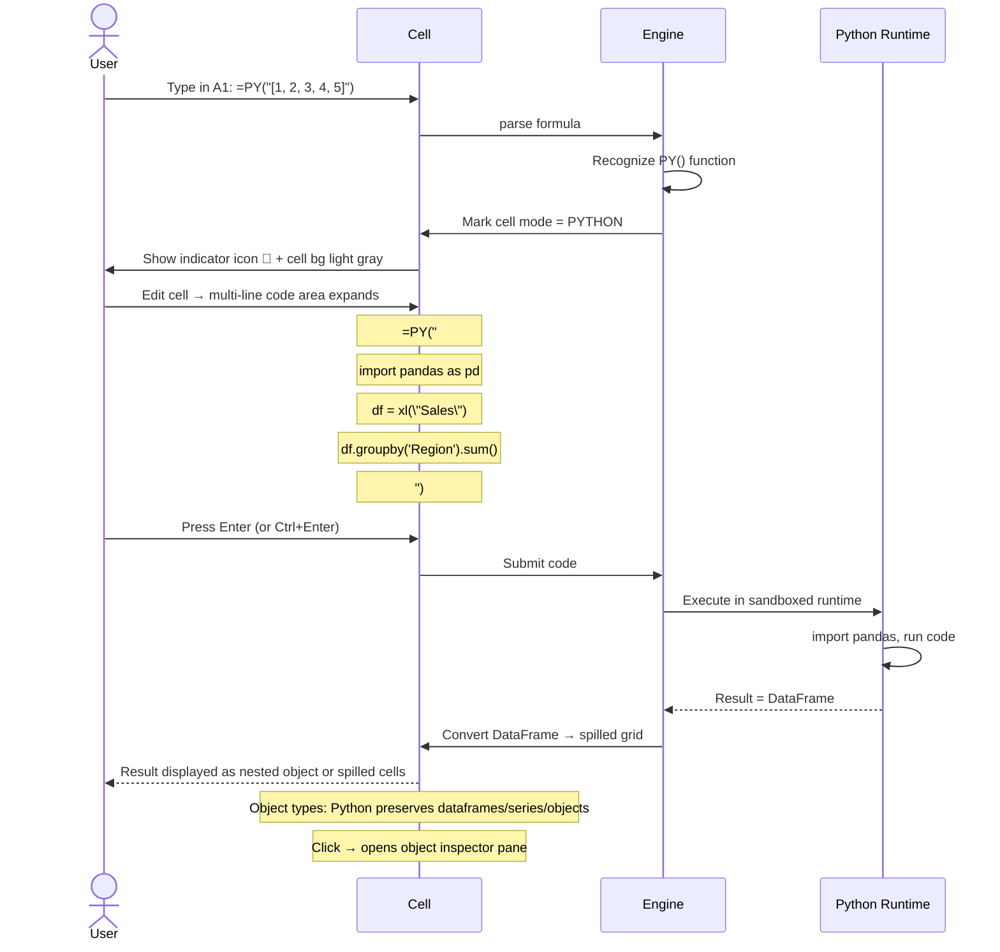
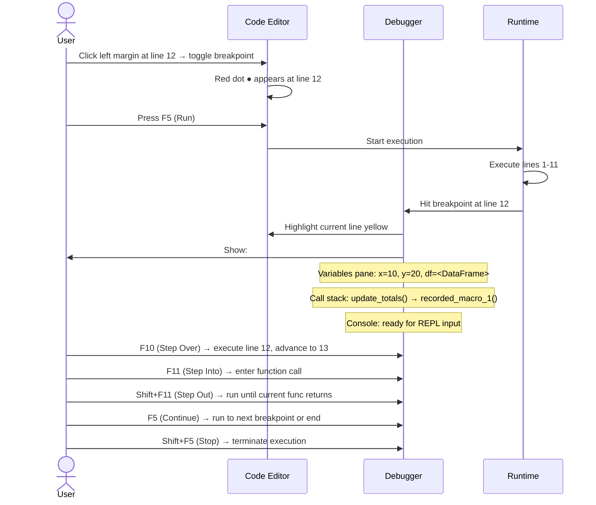

# UX Flow — Spec 21 Python in Excel (Macro replacement)

> Spec gốc: [../21-vba-macro.md](../21-vba-macro.md)

## Decision: Python over VBA

```
Ezcel SKIPS VBA entirely. Reasons:
- VBA is legacy COM-based, Windows-only
- Microsoft itself migrating toward Python + Office Scripts (TypeScript)
- Python ecosystem (numpy/pandas/matplotlib) >> VBA stdlib
- Easier to embed in PySide6 app (vs reimplementing VBA interpreter)

Ezcel choice:
- =PY() formula cells (similar to Microsoft Python in Excel, GA Sept 2024)
- Python scripts in Code Editor (replacement for VBA Editor)
- No COM, no .bas files, no UserForms — modern only
```

## Code Editor entry

```
View tab → Code group → Open Code Editor (or Alt+F11):

┌─ Code Editor — Sales.xlsx ─────────────────────────────────────────┐
│ [File] [Edit] [Run] [Debug] [View] [Help]                            │
│ ──────────────────────────────────────────────────────────────────── │
│ ┌─Project Explorer───┐ ┌─Code editor ─────────────────────────────┐ │
│ │ ▼ Sales.xlsx        │ │ # Module1.py                              │ │
│ │   ▼ Modules          │ │ from ezcel import workbook, sheet, cells │ │
│ │     📄 Module1.py    │ │                                            │ │
│ │     📄 Utilities.py  │ │ def update_totals():                       │ │
│ │   ▼ Sheets           │ │     ws = sheet("Sheet1")                  │ │
│ │     📄 Sheet1.py     │ │     for row in range(2, 100):              │ │
│ │     📄 Dashboard.py   │ │         ws[f"D{row}"] = ws[f"B{row}"] * ws[f"C{row}"]│ │
│ │   ▼ Custom Functions │ │                                            │ │
│ │     📄 udf.py         │ │ def fmt_currency(value):                   │ │
│ │                       │ │     return f"${value:,.2f}"                │ │
│ │   ▼ Workbook Events  │ │                                            │ │
│ │     📄 events.py      │ │ # Linter inline:                           │ │
│ └──────────────────────┘ │ # ✓ All good                                │ │
│                          └────────────────────────────────────────────┘ │
│                                                                          │
│ ┌─Output / Console ──────────────────────────────────────────────────┐  │
│ │ >>> update_totals()                                                 │  │
│ │ Updated 98 rows                                                     │  │
│ │ >>>                                                                  │  │
│ └──────────────────────────────────────────────────────────────────────┘  │
│                                                                          │
│ Ready                                              Line 5, Col 12        │
└──────────────────────────────────────────────────────────────────────────┘
```

## =PY() formula cell flow



## Python cell display modes

```
=PY() cell can render result in 2 modes:

1. Python Object (default):
   Cell shows: 🐍 [DataFrame: 100×5]
   ┌─────────────────────┐
   │ 🐍 DataFrame        │
   │ shape: (100, 5)      │
   │ Click to inspect ▼  │
   └─────────────────────┘

2. Excel Values (spill):
   Right-click 🐍 cell → "Output as Excel Values"
   → Spills as regular cells (numbers, strings)
   → For tabular data, becomes a normal grid
   
Object inspector pane (when clicking 🐍):
┌─ Python Object: df ─────────────────────────────┐
│ Type: pandas.DataFrame                            │
│ Shape: (100, 5)                                   │
│ ─────────────────────────────────────────────── │
│ Preview:                                          │
│ ┌────┬──────┬──────┬──────┬──────┐               │
│ │ ID │ Name │ Date │ Rev  │ Cost │               │
│ ├────┼──────┼──────┼──────┼──────┤               │
│ │ 1  │Apple │ ...  │ 1200 │ 800  │               │
│ │ 2  │Banana│ ...  │ 500  │ 300  │               │
│ └────┴──────┴──────┴──────┴──────┘               │
│                                                    │
│ Memory: 4.2 KB                                    │
│ Convert to Excel Values  [Apply]                  │
└────────────────────────────────────────────────────┘
```

## xl() helper

```
xl("Sales")          → returns Table "Sales" as DataFrame
xl("A1:B10")         → returns range as DataFrame (2D)
xl("A1:B10", headers=True)  → first row as column names
xl("Sales[Revenue]") → returns single column as Series
xl("=NamedRange")    → resolves named range
xl("Sheet2!A1")      → cell value from another sheet

These helper functions bridge spreadsheet ↔ Python.
```

## Run order (calculation chain)

```
Python cells participate in dependency graph:

Cell A1: =SUM(B1:B10)                  ← classic formula
Cell B1: =PY("xl('Data').mean()")      ← Python; depends on Data range
Cell C1: =PY("xl('A1') * 2")           ← depends on A1

Topological sort determines order:
  B1 → A1 → C1

Python evaluation:
- Runs in same calc cycle as Excel formulas
- Each cell = isolated execution context (re-runs on every recalc)
- Persistent state: use sheet-level Python module (Sheet1.py)
- Variables defined in =PY() cell are NOT shared between cells
```

## Trust dialog flow (security)

```mermaid
flowchart TD
    A[User opens workbook with =PY cells or scripts] --> B{Source trusted?}
    
    B -->|First time opening| C["Yellow trust bar at top:
    🛡 Python code in this workbook will execute when opened.
    [Enable Editing]  [More info]  [Block always]"]
    
    B -->|Trusted location| D[Auto-enable, no prompt]
    B -->|Signed by trusted publisher| D
    
    C --> E{User choice}
    E -->|Enable Editing| F[All =PY() cells calculated; scripts run on demand]
    E -->|Block| G[=PY cells show #BLOCKED!; scripts disabled]
    E -->|More info| H[Open Trust Center pane]
    
    F --> I[Trusted document mark stored — no prompt next time]
```

## Run script flow

```
View → Macros → Macros list:

┌─ Macro ─────────────────────────────────────┐
│ Macro name:                                    │
│ [update_totals                              ] │
│                                                  │
│ Macros in: [All open workbooks         ▼]    │
│                                                  │
│ ┌────────────────────────────────────────┐   │
│ │ update_totals                              │   │
│ │ fmt_currency                                │   │
│ │ refresh_data                                │   │
│ │ export_summary                              │   │
│ └────────────────────────────────────────┘   │
│                                                  │
│ Description:                                    │
│ Updates D column with B*C for each row          │
│                                                  │
│ [Run] [Step Into] [Edit] [Create] [Delete] [Options...] │
│                                                  │
│                                  [ Cancel ]    │
└──────────────────────────────────────────────────┘

Run: executes function
Step Into: opens debugger
Edit: jumps to code editor at function definition
```

## Record Macro flow (limited — Microsoft retains for VBA)

```
For Ezcel:
- "Record Macro" generates Python script (not VBA)
- Records user actions: cell selection, value entry, format change, sort, filter
- Outputs script in new Module file

Generated example:
```python
# Auto-generated from recording 2026-06-03 09:00
def recorded_macro_1():
    sheet("Sheet1").range("B5").value = "Apple"
    sheet("Sheet1").range("C5").value = 100
    sheet("Sheet1").range("B5:C5").format.bold = True
```

After recording user can:
- Run as-is
- Edit/parameterize
- Save in module for reuse
```

## Debug flow



## UDF (User-Defined Function) flow

```
In udf.py module, define:

```python
from ezcel import udf

@udf
def TAX(amount: float, rate: float = 0.1) -> float:
    """Calculate tax. Default rate 10%."""
    return amount * rate

@udf(volatile=True)
def NOW_MS() -> int:
    """Return current Unix timestamp in milliseconds."""
    import time
    return int(time.time() * 1000)

@udf(array=True)
def SQUARES(arr: list[float]) -> list[float]:
    """Return squares of an array (spills)."""
    return [x ** 2 for x in arr]
```

In any cell:
=TAX(1000)              → 100
=TAX(1000, 0.15)        → 150
=NOW_MS()               → 1717400000000 (auto-recalcs)
=SQUARES(A1:A10)        → spills 10 cells with squared values

UDFs appear in:
- Function Wizard (Shift+F3) → User-Defined Functions category
- Autocomplete when typing =T → shows TAX
- ScreenTip from function signature
```

## Modules vs Sheet code vs Custom Functions

```
Project Explorer structure:

▼ workbook.xlsx
  ▼ Modules
    Module1.py         ← general scripts, run from Macros menu
    Utilities.py       ← shared functions
  ▼ Sheets
    Sheet1.py          ← code specific to Sheet1 (events)
    Dashboard.py
  ▼ Custom Functions
    udf.py             ← @udf decorated functions, callable from cells
  ▼ Workbook Events
    events.py          ← workbook lifecycle handlers

Sheet event handlers (in Sheet1.py):
```python
from ezcel import sheet_events

@sheet_events.on_change
def handle_change(rng):
    """Triggered when any cell in sheet changes."""
    if rng.column == "A":
        sheet("Sheet1")[rng.row, "B"] = rng.value.upper()

@sheet_events.on_selection
def handle_select(rng):
    """Triggered when selection changes."""
    pass
```

Workbook events (in events.py):
```python
from ezcel import workbook_events

@workbook_events.on_open
def on_open(wb):
    print(f"Opened {wb.name}")

@workbook_events.on_save
def on_save(wb):
    # Validate before save
    if wb.has_pending_pq_refresh:
        raise SaveBlocked("Refresh queries before saving")

@workbook_events.on_close
def on_close(wb):
    pass
```
```

## Code Editor features

```
Editor capabilities (modern, like VSCode-lite):
✓ Syntax highlighting (Python AST-based)
✓ Auto-indent / smart Tab
✓ Bracket matching
✓ Multi-cursor (Ctrl+D add next occurrence)
✓ Find & Replace (Ctrl+F, Ctrl+H, regex toggle)
✓ Code folding (collapse functions)
✓ Linting (Pyflakes/Pylint inline warnings)
✓ Auto-completion (Jedi-based)
✓ Quick Info on hover
✓ Format Document (Black formatter, Shift+Alt+F)
✓ Go to Definition (F12)
✓ Find Usages (Shift+F12)
✓ Debugger (breakpoints, step, variables, watch)
✓ Output console + REPL
✓ Git integration (gutter shows added/modified/deleted lines)
✓ Dark mode
```

## Implementation hints cho Slave

- **Python runtime**: embed CPython via PythonQt or use subprocess with IPC.
  - Recommended: subprocess running Python interpreter; communicate via JSON-RPC or named pipes.
  - Sandboxing: chroot/jail capabilities (no fs access by default, opt-in per module).

- **Code Editor**: `QScintilla` (Python bindings for Scintilla) for advanced editor features.
  - Or `QTextEdit` with custom `QSyntaxHighlighter` (basic).

- **Project Explorer**: `QTreeWidget` with nodes per module/sheet code.

- **xl() helper**:
  ```python
  def xl(reference: str, headers: bool = False) -> pd.DataFrame | pd.Series | Any:
      # Parse reference (cell ref / range / table / named range)
      cells = workbook.resolve(reference)
      arr = np.array([[c.value for c in row] for row in cells])
      if headers:
          return pd.DataFrame(arr[1:], columns=arr[0])
      else:
          return pd.DataFrame(arr) if arr.ndim == 2 else pd.Series(arr)
  ```

- **=PY() formula function**: special formula function; body = Python code string.
  - Pre-execute analysis: extract xl(...) calls → register dependencies for calc graph.
  - Execute in dedicated namespace per cell; return last expression value.

- **Object inspector**: `QDockWidget` right; show DataFrame preview using `pd.DataFrame.to_html()` + `QTextBrowser`.

- **UDF registration**: scan `udf.py` for `@udf`-decorated functions; register in formula engine's `_FUNCTIONS` dict.

- **Debugger**: use Python's `bdb` module (basis of pdb); implement `Bdb` subclass that pauses on breakpoint and forwards events to editor UI.

- **Trust system**:
  - Trust Center settings: trusted locations (folder paths), trusted publishers (cert thumbprints).
  - Sign workbook with code-signing cert → auto-trust on machines with that cert.
  - "Block always" → permanent reject for that source.

- **Record Macro**: hook all user actions (cell edit, format, sort, filter) → emit Python code stub.

- **Events**: emit signals from sheet.dataChanged / workbook.opened / etc. → call registered handlers.

- **Modern alternative integration**: also support Office Scripts (TypeScript via embedded V8/Node)? Out of scope for v1 — Python only.
