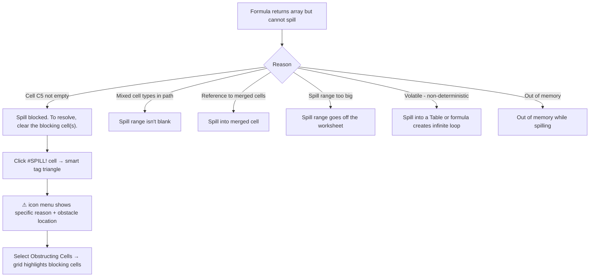
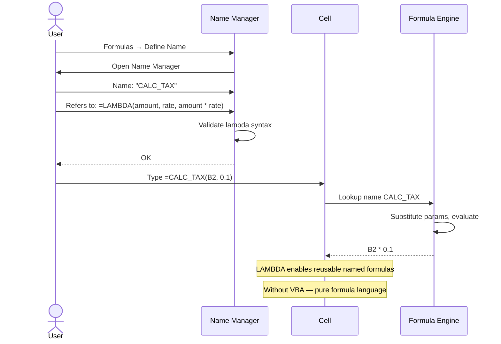
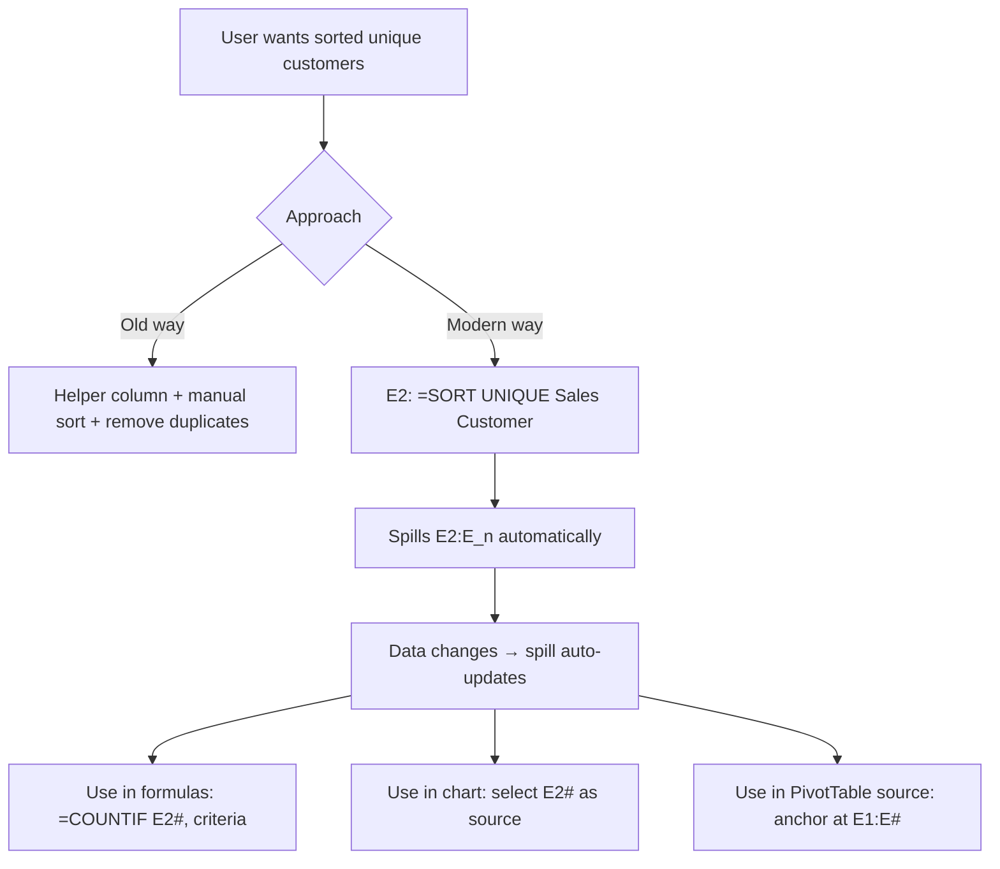

# UX Flow — Spec 22 Modern Features (Dynamic Arrays, XLOOKUP, LAMBDA, GROUPBY/PIVOTBY)

> Spec gốc: [../22-modern-features.md](../22-modern-features.md)

## Dynamic array spill flow

```mermaid
flowchart TD
    A[User types in C2: =SORT A2:A10] --> B[Press Enter]
    
    B --> C{Spill range C2:C10 empty?}
    C -->|Yes| D[Spill array vertically C2:C10]
    C -->|No - any cell occupied| E[Show #SPILL! error in C2]
    
    D --> F[Cells C2:C10 show sorted values]
    F --> G[C2 has blue spill border around C2:C10]
    F --> H[Anchor cell C2 contains the formula]
    F --> I[Other spilled cells C3:C10 are "ghost" - cannot edit individually]
    
    E --> J[User clicks #SPILL! cell]
    J --> K[Smart tag shows obstacle: "C5 blocks spill range"]
    J --> L[User clears C5 → spill auto-recovers]
```

## Spill border visual

```
After =SORT(A2:A10) in C2 produces 9 values:

         Col C
   ┏━━━━━━━━━━━━━┓ ← thin blue border around spill range
   ┃              ┃
2  ┃ Apple        ┃ ← anchor cell (formula here)
3  ┃ Banana       ┃ ← spilled (ghost, formula bar shows result)
4  ┃ Cherry       ┃
5  ┃ Date         ┃
6  ┃ Elderberry   ┃
7  ┃ Fig          ┃
8  ┃ Grape        ┃
9  ┃ Honeydew     ┃
10 ┃ Kiwi         ┃
   ┗━━━━━━━━━━━━━┛

Click C5 → Formula Bar shows: =SORT(A2:A10) (grayed, ghost cell)
Click C2 → Formula Bar shows: =SORT(A2:A10) (editable, anchor)
Try edit C5 directly → blocked, prompted "Cannot change part of array"
```

## Spilled reference (#) operator

```
After =SORT(A2:A10) in C2 spilled to C2:C10:

User in D2 types: =SUM(C2#)
                          ↑
                  "#" = "the spill range starting at C2"
                  
Result D2 = sum of C2:C10

If spill grows (data added to A11) → C2# auto-expands → D2 updates.

User in E2 types: =UNIQUE(B2:B100)
Spills to E2:E_n (n = unique count)

User in F2 types: =COUNTIF(E2#, "Apple")
COUNTIF auto-handles dynamic length of E2#
```

## #SPILL! error states



## Spill smart tag menu

```
Click ⚠ on #SPILL! cell:
┌──────────────────────────────────────────┐
│ Spill range isn't blank                   │ ← reason
│ ──────────────────────────────────────── │
│ Select Obstructing Cells                  │ ← highlights blockers
│ Show Calculation Steps...                 │
│ Help on this error                         │
│ Ignore Error                               │
│ Edit in Formula Bar                        │
│ Error Checking Options...                  │
└────────────────────────────────────────────┘
```

## XLOOKUP — modern replacement for VLOOKUP

```
Old way (VLOOKUP):
  =VLOOKUP(A2, B:D, 3, FALSE)
  
New way (XLOOKUP, Excel 365+):
  =XLOOKUP(A2, B:B, D:D, "Not found", 0, 1)
  
Arguments:
  lookup_value     = A2
  lookup_array     = B:B          (just the key column)
  return_array     = D:D          (return column - no count)
  [if_not_found]   = "Not found"  (built-in fallback)
  [match_mode]     = 0 exact (default), -1 exact-or-next-smaller, 1 next-larger, 2 wildcard
  [search_mode]    = 1 first-to-last (default), -1 last-to-first, 2 binary asc, -2 binary desc

XLOOKUP advantages:
✓ Looks both directions (no need INDEX/MATCH)
✓ Built-in if_not_found (no IFERROR wrapper)
✓ Returns array (can return multiple columns)
✓ Searches from start OR end
✓ Faster on large data via binary search modes
```

## XLOOKUP entry & autocomplete

```
User types in B2: =xl

Autocomplete:
┌────────────────────────┐
│ ✦ XLOOKUP              │ ← top suggestion (modern preferred)
│ XOR                     │
│ XMATCH                  │
└────────────────────────┘

Press Tab → completes to =XLOOKUP(

ScreenTip below cursor:
┌────────────────────────────────────────────────┐
│ XLOOKUP(lookup_value, lookup_array, return_     │
│ array, [if_not_found], [match_mode], [search_  │
│ mode])                                           │
└──────────────────────────────────────────────────┘
                  ▲ current arg highlighted bold
```

## LAMBDA function flow



## LAMBDA helper functions (recursive iteration)

```
SCAN — running aggregate:
  =SCAN(0, A1:A10, LAMBDA(acc, val, acc + val))
  → Returns running cumulative sum spilled array

MAP — element-wise transform:
  =MAP(A1:A10, LAMBDA(x, x * 2))
  → Returns each element doubled

REDUCE — fold to single value:
  =REDUCE(0, A1:A10, LAMBDA(acc, val, acc + val^2))
  → Returns sum of squares

MAKEARRAY — generate from row/col indices:
  =MAKEARRAY(5, 5, LAMBDA(r, c, r * c))
  → 5x5 multiplication table

BYROW / BYCOL — apply lambda per row/col:
  =BYROW(A1:C10, LAMBDA(row, SUM(row)))
  → Sum per row, spilled vertically

LET — local variables (cleaner formulas):
  =LET(
    revenue, B2:B100,
    cost, C2:C100,
    margin, (revenue - cost) / revenue,
    AVERAGE(margin)
  )
```

## GROUPBY function (2024)

```
=GROUPBY(row_fields, values, function, [field_headers],
         [total_depth], [sort_order], [filter_array])

Example:
=GROUPBY(Sales[Region], Sales[Revenue], SUM, , 1)

Result (auto-spill):
┌──────────┬──────────┐
│ Region   │ Sum      │
├──────────┼──────────┤
│ East     │ 12500    │
│ North    │ 18300    │
│ South    │ 9700     │
│ West     │ 14200    │
├──────────┼──────────┤
│ Total    │ 54700    │  ← total_depth=1 adds grand total row
└──────────┴──────────┘

Sort options: ascending, descending, by aggregate value
Filter: array of TRUE/FALSE per group to include
```

## PIVOTBY function (2024)

```
=PIVOTBY(row_fields, col_fields, values, function, [...optional])

Example:
=PIVOTBY(Sales[Product], Sales[Region], Sales[Revenue], SUM)

Result (auto-spill — like PivotTable but formula-based):
┌──────────┬──────┬───────┬───────┬──────┬───────┐
│          │ East │ North │ South │ West │ Total │
├──────────┼──────┼───────┼───────┼──────┼───────┤
│ Apple    │ 1200 │  800  │ 1500  │  900 │ 4400  │
│ Banana   │  500 │  600  │  300  │  400 │ 1800  │
│ Cherry   │  900 │ 1200  │ 1100  │  700 │ 3900  │
├──────────┼──────┼───────┼───────┼──────┼───────┤
│ Total    │ 2600 │ 2600  │ 2900  │ 2000 │10100  │
└──────────┴──────┴───────┴───────┴──────┴───────┘

Advantages vs PivotTable:
✓ Auto-refresh on data change (no Refresh button)
✓ Formula-transparent
✓ Spills into formula grid (no separate object)

PivotTable still wins for:
- Interactive Slicers, Field List UI
- Drill-down to details
- Complex formatting
```

## TEXTSPLIT, TEXTBEFORE, TEXTAFTER (2022)

```
=TEXTSPLIT("a,b;c,d", ",", ";")
→ Spills 2D:
┌─┬─┐
│a│b│
│c│d│
└─┴─┘

=TEXTBEFORE("Nguyen Van A", " ", 1) → "Nguyen"
=TEXTAFTER("Nguyen Van A", " ", -1) → "A"  (last delimiter)

Replaces messy LEFT/RIGHT/FIND/SEARCH combos.
```

## CHOOSEROWS / CHOOSECOLS / TAKE / DROP / EXPAND / HSTACK / VSTACK (2022)

```
=CHOOSEROWS(A1:D10, 1, 3, 5)
→ Returns rows 1, 3, 5 from array

=TAKE(A1:D10, 3) → first 3 rows
=TAKE(A1:D10, -2) → last 2 rows
=DROP(A1:D10, 5) → drop first 5 rows
=EXPAND(A1:B2, 4, 3, 0) → pad to 4x3 with 0s

=HSTACK(A1:A5, B1:B5, C1:C5)
→ Horizontal concatenation, spills 5×3

=VSTACK(A1:C5, A10:C15)
→ Vertical concatenation, spills (5+6)×3
```

## Dynamic array vs Tables interaction



## Backward compatibility (legacy CSE arrays)

```
Pre-365 array formulas:
  Select range first, type formula, press Ctrl+Shift+Enter
  → Formula shows as {=SUM(A1:A10*B1:B10)}
  → Curly braces auto-added; fixed range

Modern 365 dynamic arrays:
  Type =SUM(A1:A10*B1:B10) and just Enter
  → Spills if needed; no curly braces
  → CSE syntax still works but considered legacy

When opening older workbook in 365:
- CSE arrays kept as-is (curly braces)
- New formulas use dynamic by default
- @ operator for implicit intersection (compat mode): =@SUM(A1#)
```

## Implementation hints cho Slave

- **Spill engine**: when formula evaluates to array → check spill region clean → mark anchor + ghost cells.
- **Anchor cell metadata**:
  ```python
  cell.is_spill_anchor = True
  cell.spill_range = (start_row, start_col, height, width)
  cell.spill_values = array
  ```
- **Ghost cells**: `cell.is_spill_ghost = True; cell.spill_anchor = (anchor_r, anchor_c)`. Reject `setData()` on ghost.
- **Spill border**: render in `CellDelegate` — 1px blue (`#0078D4`) border around spill_range if anchor is selected.
- **#SPILL! detection**: pre-compute spill rect → check `any(cell.value not in (None, "") for cell in rect)` → if blocked, set anchor value = `"#SPILL!"`, set error_reason.
- **# operator parsing**: in formula tokenizer, recognize `A1#` → resolve to current spill range of A1 at eval time.
- **XLOOKUP**: implement in `formula._FUNCTIONS["XLOOKUP"]` matching all 6 args.
- **LAMBDA**: store as named function with parameter list; eval = substitute args → eval body.
- **SCAN/MAP/REDUCE/BYROW/BYCOL/MAKEARRAY**: higher-order — iterate input, call lambda per element.
- **GROUPBY/PIVOTBY**: pandas under hood; convert input table → pivot_table → return as spilled array.
- **TEXTSPLIT/STACK/CHOOSE**: numpy/list ops; ensure result is array → spill if non-1x1.
- **Performance**: lazy spill — don't materialize 1M-element spill until cells visible.
