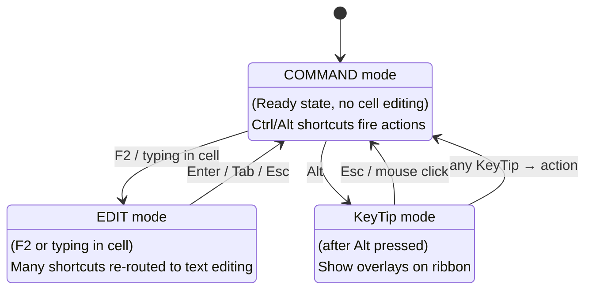
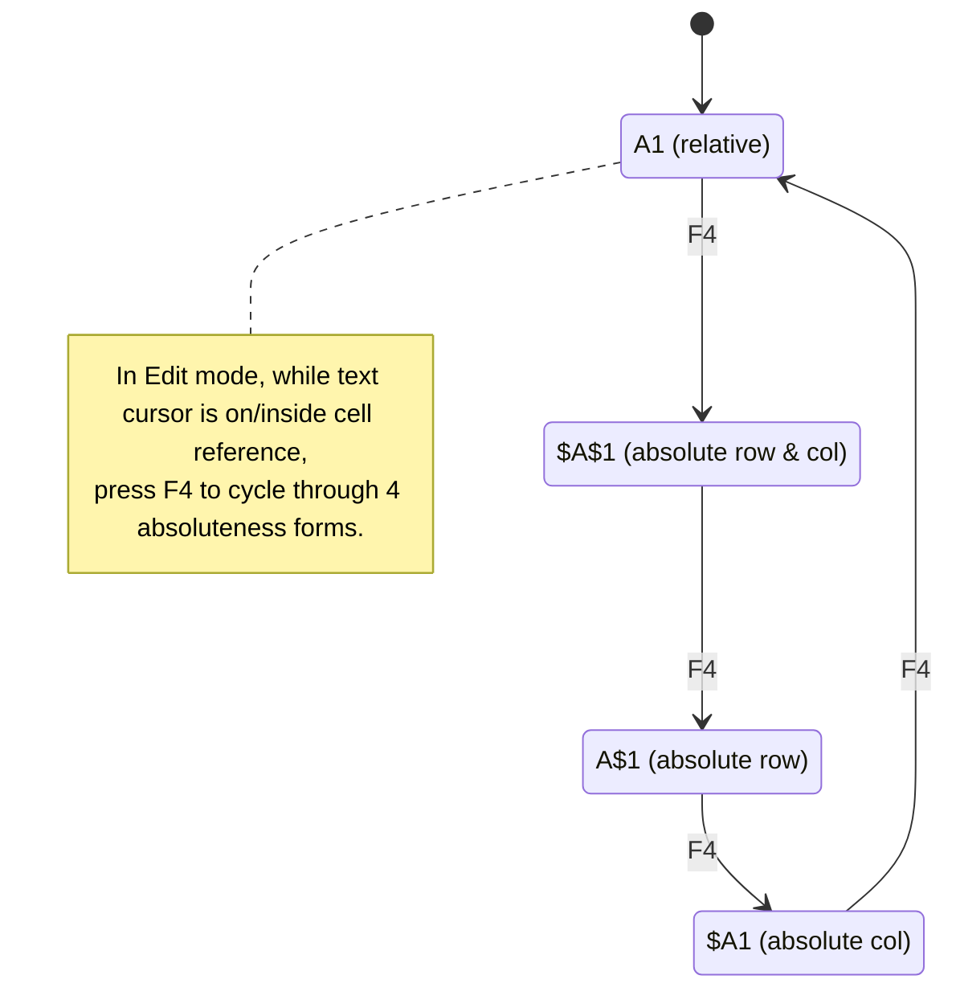

# UX Flow — Spec 23 Keyboard Shortcuts

> Spec gốc: [../23-keyboard-shortcuts.md](../23-keyboard-shortcuts.md)

## Three input modes



## Top-50 essential shortcuts

```
== Navigation ==
Arrow keys              → Move 1 cell
Ctrl+Arrow              → Jump to edge of data block
Ctrl+Home               → A1
Ctrl+End                → Last used cell
Page Up/Down            → Scroll up/down 1 screen
Alt+Page Up/Down        → Scroll left/right 1 screen
Ctrl+G or F5            → Go To dialog
Ctrl+F                  → Find
Ctrl+H                  → Replace

== Selection ==
Shift+Arrow             → Extend by 1 cell
Shift+Ctrl+Arrow        → Extend to edge of data
Shift+Page Up/Down      → Extend by 1 screen
Shift+Space             → Select entire row
Ctrl+Space              → Select entire column
Ctrl+A                  → Select current region (twice → all sheet)
Ctrl+Shift+End          → Extend selection to last used cell

== Editing ==
F2                      → Edit active cell (cursor at end)
Enter                   → Commit + move down
Shift+Enter             → Commit + move up
Tab                     → Commit + move right
Shift+Tab               → Commit + move left
Alt+Enter               → New line in cell
Esc                     → Cancel edit
Delete                  → Clear contents
Backspace               → Clear + edit
Ctrl+Z                  → Undo
Ctrl+Y                  → Redo
Ctrl+D                  → Fill Down from cell above
Ctrl+R                  → Fill Right from cell left
Ctrl+Enter              → Fill selection with same value

== Clipboard ==
Ctrl+C                  → Copy
Ctrl+X                  → Cut
Ctrl+V                  → Paste
Ctrl+Alt+V              → Paste Special dialog
Ctrl+Shift+V            → Paste Values (modern)
Ctrl+K                  → Insert Hyperlink

== Formatting ==
Ctrl+1                  → Format Cells dialog
Ctrl+B                  → Bold toggle
Ctrl+I                  → Italic toggle
Ctrl+U                  → Underline toggle
Ctrl+5                  → Strikethrough
Ctrl+Shift+&            → Apply border outline
Ctrl+Shift+_            → Remove borders
Ctrl+Shift+$            → Currency format
Ctrl+Shift+%            → Percentage format
Ctrl+Shift+#            → Date format (d-mmm-yy)
Ctrl+Shift+@            → Time format (h:mm AM/PM)
Ctrl+Shift+!            → Number format (2 decimals, thousands sep)
Ctrl+Shift+~            → General format

== Formulas ==
=                       → Start formula
Alt+=                   → AutoSum
F3                      → Paste Name dialog
F4                      → Toggle reference type (A1→$A$1→A$1→$A1→A1)
F9                      → Recalculate workbook
Shift+F9                → Recalculate active sheet
Ctrl+`                  → Toggle Show Formulas
Shift+F3                → Insert Function dialog
F4 (in edit mode)       → Cycle reference absoluteness

== Rows/Columns ==
Ctrl++ or Ctrl+Shift+=  → Insert dialog (row/col)
Ctrl+-                  → Delete dialog
Ctrl+9                  → Hide rows
Ctrl+Shift+9            → Unhide rows
Ctrl+0                  → Hide columns
Ctrl+Shift+0            → Unhide columns (note: Windows hijacks Ctrl+Shift+0 for input language; works in Excel)

== Workbook/Sheet ==
Ctrl+N                  → New workbook
Ctrl+O                  → Open
Ctrl+S                  → Save
F12                     → Save As
Ctrl+W                  → Close window
Ctrl+P                  → Print
Ctrl+F2                 → Print Preview
Shift+F11               → New sheet
Ctrl+Page Up/Down       → Switch sheet
Ctrl+Tab                → Switch open workbook
```

## F4 reference toggle flow



## Shortcut categories per modal mode

```
COMMAND mode (no cell editing):
- All Ctrl+letter shortcuts fire actions
- Arrow keys = navigation
- Letter keys = enter EDIT mode + type that letter
- F-keys = various commands (F2 edit, F5 go to, F12 save as)

EDIT mode (typing in cell):
- Arrow keys move text cursor INSIDE the cell
- Ctrl+Arrow moves text cursor by word
- Home/End = beginning/end of cell text
- F4 = toggle reference absoluteness on current ref token
- Enter/Tab/Esc commits and exits to COMMAND
- Most Ctrl shortcuts NOT processed (text editing context)

DIALOG mode (any modal dialog open):
- Tab = next field
- Shift+Tab = previous field
- Enter = OK button (default)
- Esc = Cancel
- Alt+letter = matches underlined letter on button/field
```

## KeyTip exploration journey

```mermaid
sequenceDiagram
    actor User
    participant Ribbon
    participant Action
    
    User->>Ribbon: Alt
    Ribbon->>User: Show KeyTips on all top-level: F H N P M A R W Y
    
    User->>Ribbon: Press M (Formulas)
    Ribbon->>User: Switch to Formulas tab; show KeyTips on each button:
    Note over Ribbon: FN Function ... UA AutoSum ... US Recently Used ... etc.
    
    alt User wants AutoSum
        User->>Ribbon: Press U+A
        Ribbon->>Action: Trigger AutoSum
        Action->>Action: Insert =SUM(...) in active cell
        Ribbon->>Ribbon: Exit KeyTip mode
    else User changes mind
        User->>Ribbon: Press Esc
        Ribbon-->>User: Back to Alt-level (F H N P M ...)
        User->>Ribbon: Press Esc again
        Ribbon-->>User: Exit KeyTip mode
    end
```

## Custom shortcut assignment

```
File → Options → Customize Ribbon → Customize button (bottom-left):

┌─ Customize Keyboard ─────────────────────────────────────────┐
│ Categories:              Commands:                              │
│ ┌──────────────────┐ ┌────────────────────────────────────┐  │
│ │ File Tab          │ │ AutoSum                               │  │
│ │ Home Tab          │ │ Bold                                  │  │
│ │ Insert Tab        │ │ Center                                │  │
│ │ Page Layout Tab   │ │ Conditional Formatting               │  │
│ │ ... (all tabs)    │ │ Copy                                  │  │
│ │ Macros            │ │ Cut                                   │  │
│ │ Office Scripts    │ │ Delete                                │  │
│ │ All Commands      │ │ ...                                    │  │
│ └──────────────────┘ └────────────────────────────────────┘  │
│                                                                 │
│ Current keys:           Press new shortcut key:                 │
│ ┌──────────────────┐    ┌──────────────────────────────┐      │
│ │ Alt+=             │    │ [press key combination here]  │      │
│ └──────────────────┘    └──────────────────────────────┘      │
│                                                                 │
│ Save changes in: [Excel ▼]                                      │
│                                                                 │
│ Description:                                                    │
│ Inserts the AutoSum formula in the active cell.                 │
│                                                                 │
│   [Assign]  [Remove]  [Reset All...]      [ Close ]            │
└─────────────────────────────────────────────────────────────────┘
```

## Conflict detection

```
User in Customize Keyboard dialog assigns Ctrl+B to a custom action:

Press new shortcut: [Ctrl+B]

Shows below:
┌─ Currently assigned to ──┐
│ Bold                       │ ← conflict warning
└────────────────────────────┘

User can:
- Reassign (overrides Bold)
- Try different key
- Cancel (keeps default)
```

## Platform differences

```
Windows shortcuts (this app's primary):
- Ctrl-based: Ctrl+C, Ctrl+V, etc.
- Alt for ribbon nav

Mac shortcuts (for reference, not implemented):
- Cmd-based: Cmd+C, Cmd+V
- Control key separate
- Ctrl+Click = right-click

Some Excel shortcuts are blocked by OS:
- Ctrl+Shift+0 might be hijacked by Windows input language switcher
- Workaround in spec: unmap via Windows settings, or use Format menu
```

## Implementation hints cho Slave

- **Shortcut registration**: `QShortcut(QKeySequence("Ctrl+B"), main_window, callback)` per shortcut.
- **Mode-aware routing**:
  ```python
  class ShortcutManager:
      def handle(self, key_event, mode):
          if mode == "EDIT":
              if key_event.key() == Qt.Key_F4:
                  self.cycle_ref_absoluteness()
              else:
                  return False  # let text editor handle
          elif mode == "COMMAND":
              return self.command_shortcuts.handle(key_event)
  ```
- **F2/F4 special**: not standard `QShortcut` because behavior depends on mode/cursor position.
- **KeyTip overlay**: `QWidget` overlays on ribbon when `Alt` pressed; rendering `QLabel` with yellow bg over each action.
- **Custom shortcuts dialog**: `QDialog` with category tree + command list + key capture widget.
  ```python
  class KeyCaptureWidget(QLineEdit):
      def keyPressEvent(self, ev):
          self.setText(QKeySequence(ev.modifiers() | ev.key()).toString())
  ```
- **Conflict check**: maintain `dict[QKeySequence, action_id]`; on assign → check existing → warn user.
- **Persistence**: serialize custom keys to QSettings; reload on startup.
- **Help discoverability**: tooltips on ribbon buttons show shortcut: `"Bold (Ctrl+B)"`.
- **F1 help**: open this skill's reference page when F1 pressed in a context.
- **AltGr/dead keys**: handle international keyboards properly (e.g., German `ä` shouldn't fire shortcut).
- **Long-press macros**: NOT a feature; ignore.
