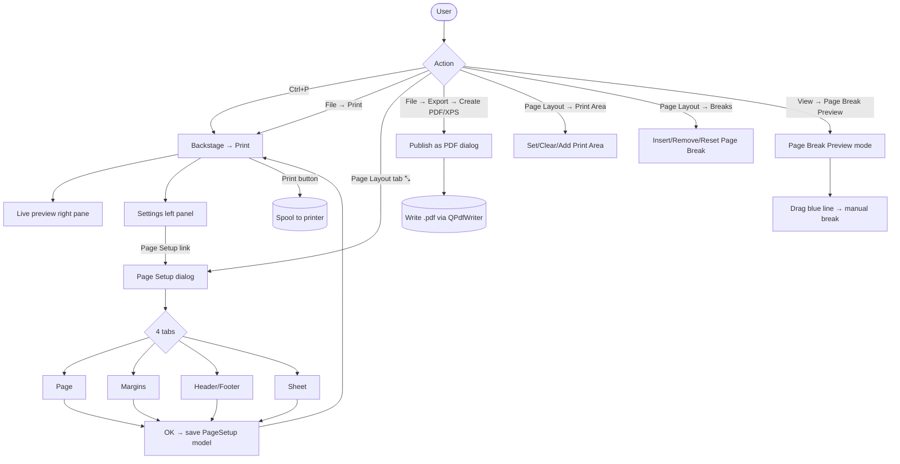
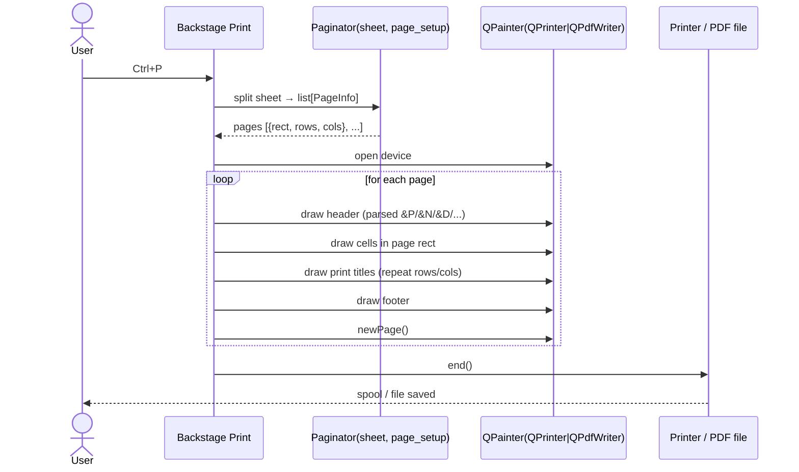
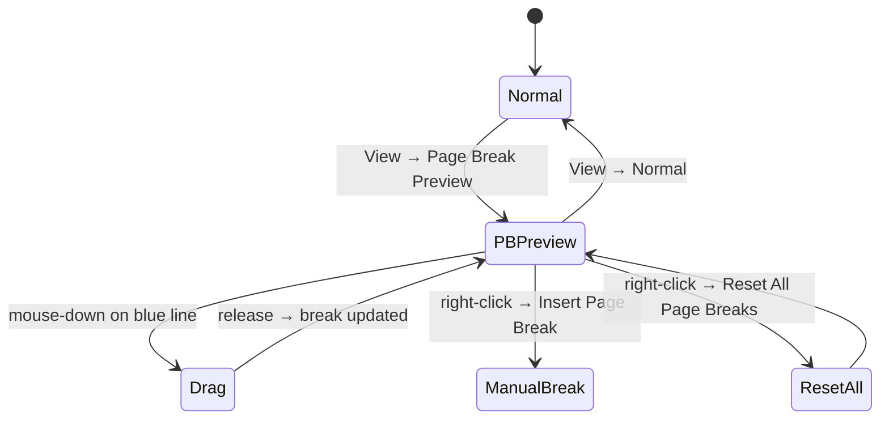
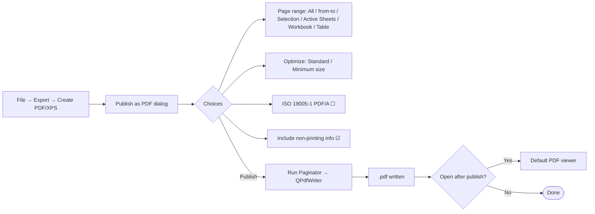

# 24 — Print & Page Setup & Export PDF — UX Flow

> Spec gốc: [24-print-page-setup.md](../24-print-page-setup.md)

## 1. Top-level flow



## 2. Backstage Print mockup (Ctrl+P)

```
┌─ File ▸ Print ────────────────────────────────────────────────────────────────────┐
│                                                                                    │
│  ┌─ Settings ─────────────────────┐   ┌─ Preview ──────────────────────────────┐  │
│  │ [Print]   Copies: [ 1 ▲▼]      │   │  ┌────────────────────────────────┐    │  │
│  │                                 │   │  │                                │    │  │
│  │ Printer                         │   │  │   ┌─────────────────────┐      │    │  │
│  │ ┌─────────────────────────┐    │   │  │   │ A | B | C | D | E   │      │    │  │
│  │ │ Microsoft Print to PDF ▼│    │   │  │   ├─────────────────────┤      │    │  │
│  │ └─────────────────────────┘    │   │  │   │ ...rendered cells…  │      │    │  │
│  │  Printer Properties             │   │  │   │                     │      │    │  │
│  │                                 │   │  │   └─────────────────────┘      │    │  │
│  │ Settings                        │   │  │                                │    │  │
│  │ ┌─────────────────────────┐    │   │  │   Page 1 of 3                  │    │  │
│  │ │ Print Active Sheets    ▼│    │   │  └────────────────────────────────┘    │  │
│  │ └─────────────────────────┘    │   │                                          │  │
│  │ Pages: [   ] to [   ]           │   │  ◀  1 / 3  ▶                            │  │
│  │ ┌─────────────────────────┐    │   │  [🔍-]  100%  [🔍+]   [Show Margins ☐]  │  │
│  │ │ Print One Sided        ▼│    │   └─────────────────────────────────────────┘  │
│  │ └─────────────────────────┘    │                                                │
│  │ ┌─────────────────────────┐    │                                                │
│  │ │ Collated 1,2,3 / 1,2,3 ▼│    │                                                │
│  │ └─────────────────────────┘    │                                                │
│  │ ┌─────────────────────────┐    │                                                │
│  │ │ Portrait Orientation   ▼│    │                                                │
│  │ └─────────────────────────┘    │                                                │
│  │ ┌─────────────────────────┐    │                                                │
│  │ │ A4 21cm × 29.7cm       ▼│    │                                                │
│  │ └─────────────────────────┘    │                                                │
│  │ ┌─────────────────────────┐    │                                                │
│  │ │ Normal Margins         ▼│    │                                                │
│  │ └─────────────────────────┘    │                                                │
│  │ ┌─────────────────────────┐    │                                                │
│  │ │ No Scaling             ▼│    │                                                │
│  │ └─────────────────────────┘    │                                                │
│  │   Page Setup                    │                                                │
│  └─────────────────────────────────┘                                                │
└────────────────────────────────────────────────────────────────────────────────────┘
```

## 3. Page Setup dialog mockups

### Tab Page

```
┌─ Page Setup ─────────────────────────────────────────────────┐
│ [Page] [Margins] [Header/Footer] [Sheet]                     │
│ ────────────────────────────────────────────────────────────│
│ Orientation                                                   │
│   ( ) Portrait     (●) Landscape                              │
│                                                               │
│ Scaling                                                       │
│   (●) Adjust to: [100 ▲▼] % normal size                       │
│   ( ) Fit to:    [ 1 ▲▼] page(s) wide by [ 1 ▲▼] tall         │
│                                                               │
│ Paper size:   [ A4                              ▼]           │
│ Print quality:[ 600 dpi                         ▼]           │
│ First page number: [Auto              ]                       │
│                                                               │
│                            [Print…] [Print Preview] [Options]│
│                                              [OK]    [Cancel]│
└──────────────────────────────────────────────────────────────┘
```

### Tab Margins

```
┌─ Page Setup ─────────────────────────────────────────────────┐
│ [Page] [Margins] [Header/Footer] [Sheet]                     │
│ ────────────────────────────────────────────────────────────│
│             ┌──── Top ────┐                                   │
│             │  [1.91 cm ▲▼]                                  │
│             │                                                 │
│  Header     │   ┌────────────────────┐                       │
│ [0.76 ▲▼]   │   │                    │                       │
│             │   │   (page preview    │                       │
│ Left        │   │    blue borders)   │  Right                │
│ [1.78 ▲▼]   │   │                    │  [1.78 ▲▼]            │
│             │   │                    │                       │
│  Footer     │   └────────────────────┘                       │
│ [0.76 ▲▼]   │                                                 │
│             └─── Bottom ───┘                                  │
│             [1.91 cm ▲▼]                                     │
│                                                               │
│ Center on page:  [☐] Horizontally   [☐] Vertically            │
│                                                               │
│                                              [OK]    [Cancel]│
└──────────────────────────────────────────────────────────────┘
```

### Tab Header/Footer

```
┌─ Page Setup ─────────────────────────────────────────────────┐
│ [Page] [Margins] [Header/Footer] [Sheet]                     │
│ ────────────────────────────────────────────────────────────│
│                                                               │
│ ┌──────────────────────────────────────────────────────────┐│
│ │           Sheet1                              Page 1     ││
│ │   (preview: shows current Header in 3 zones L/C/R)       ││
│ └──────────────────────────────────────────────────────────┘│
│ Header: [Sheet1, Page 1                              ▼]      │
│         [Custom Header…]                                      │
│                                                               │
│ Footer: [(none)                                       ▼]      │
│         [Custom Footer…]                                      │
│                                                               │
│ [☐] Different odd and even pages                              │
│ [☐] Different first page                                      │
│ [☑] Scale with document                                       │
│ [☑] Align with page margins                                   │
│                                                               │
│                                              [OK]    [Cancel]│
└──────────────────────────────────────────────────────────────┘
```

### Custom Header dialog

```
┌─ Header ───────────────────────────────────────────────────────┐
│ To format text: select text, then choose the Format Text button│
│                                                                 │
│ Buttons:                                                        │
│  [A] [📄] [📁] [✎📁] [✎🗎] [📑] [📅] [⏰] [🖼] [⚙🖼]            │
│  Fmt   Page  TotPg  Path   File  Sheet Date Time Pic FmtPic     │
│                                                                 │
│ Left section          Center section          Right section     │
│ ┌─────────────┐      ┌─────────────────┐    ┌─────────────┐    │
│ │             │      │ Page &P of &N   │    │             │    │
│ │             │      │                 │    │             │    │
│ └─────────────┘      └─────────────────┘    └─────────────┘    │
│                                                                 │
│                                              [OK]    [Cancel]   │
└────────────────────────────────────────────────────────────────┘
```

Placeholder tokens: `&L`/`&C`/`&R` (zone), `&P` (page), `&N` (total), `&D` (date), `&T` (time), `&F` (file), `&A` (sheet), `&G` (picture), `&B` (bold), `&I` (italic), `&"font,style"`, `&K{RRGGBB}` (color), `&14` (font size).

### Tab Sheet

```
┌─ Page Setup ─────────────────────────────────────────────────┐
│ [Page] [Margins] [Header/Footer] [Sheet]                     │
│ ────────────────────────────────────────────────────────────│
│ Print area: [                                       ][⤴]      │
│                                                               │
│ Print titles                                                  │
│   Rows to repeat at top:     [$1:$1                  ][⤴]     │
│   Columns to repeat at left: [                       ][⤴]     │
│                                                               │
│ Print                                                         │
│   [☐] Gridlines       [☐] Black and white                     │
│   [☐] Draft quality   [☐] Row and column headings             │
│   Comments and notes: [(None)                       ▼]        │
│   Cell errors as:     [displayed                    ▼]        │
│                                                               │
│ Page order                                                    │
│   (●) Down, then over                                         │
│   ( ) Over, then down                                         │
│                                                               │
│                                              [OK]    [Cancel]│
└──────────────────────────────────────────────────────────────┘
```

## 4. Print pipeline sequence



## 5. Page Break Preview interaction

```
View → Page Break Preview

   A    B    C    D    E    F    G
1 ┌────┬────┬────┬────┬────┬────┬────┐
2 │      Page 1               ╎       │   ← dashed blue = manual col break
3 │                            ╎       │
4 │                            ╎ Pg 2 │
5 ├────────────────────────────╎──────┤   ← solid blue = auto row break
6 │      Page 3                ╎ Pg 4 │
7 └────────────────────────────────────┘

Drag blue line → break moves; auto break becomes manual (line solid)
Right-click → Insert Page Break / Remove Page Break / Reset All
```



## 6. Export PDF flow



```
┌─ Publish as PDF or XPS ───────────────────────────────┐
│ File name: [out.pdf                                  ]│
│ Save as type: [PDF (*.pdf)                          ▼]│
│ [☑] Open file after publishing                        │
│                                                        │
│ Optimize for:                                          │
│   (●) Standard (publishing online and printing)        │
│   ( ) Minimum size (publishing online)                 │
│                                                        │
│ [Options…]                                             │
│                                  [Publish]   [Cancel] │
└────────────────────────────────────────────────────────┘

┌─ Options ──────────────────────────────────────────────┐
│ Page range:                                            │
│   (●) All                                              │
│   ( ) Page(s) from [   ] to [   ]                      │
│ Publish what:                                          │
│   (●) Active sheet(s)                                  │
│   ( ) Entire workbook                                  │
│   ( ) Selection                                        │
│   ( ) Table                                            │
│ [☑] Ignore print areas                                 │
│ Include non-printing information:                      │
│   [☑] Document properties                              │
│   [☑] Document structure tags for accessibility        │
│ PDF options:                                           │
│   [☐] ISO 19005-1 compliant (PDF/A)                    │
│   [☐] Bitmap text when fonts may not be embedded       │
│   [☐] Encrypt the document with a password             │
│                                              [OK]      │
└────────────────────────────────────────────────────────┘
```

## 7. User journeys

### J1 — Quick print active sheet
1. `Ctrl+P` → Backstage Print.
2. Confirm printer + Active Sheets + Portrait + A4.
3. Click **Print** → spool.

### J2 — Fit large sheet to 1 page
1. `Ctrl+P` → Settings → Scaling dropdown.
2. Pick **Fit Sheet on One Page** → preview shrinks.
3. Print.

### J3 — Header "Page X of Y" + repeat header row
1. Page Layout → ⤡ Page Setup → Header/Footer tab.
2. Custom Header → Center zone → click [Page] + type " of " + click [Total Pages] → `Page &P of &N` → OK.
3. Sheet tab → Print titles → Rows to repeat at top → click row 1 picker → `$1:$1` → OK.
4. Ctrl+P → preview shows row 1 on every page + "Page 1 of 3".

### J4 — Multi-region print area
1. Select A1:E20 → Page Layout → Print Area → Set Print Area.
2. Select G1:K15 → Page Layout → Print Area → Add to Print Area.
3. Ctrl+P → two pages (one region per page; defined name `Print_Area` updated to multi-range).

### J5 — Adjust auto break to manual
1. View → Page Break Preview.
2. Drag dashed blue line between col G and H to between col J and K.
3. Line turns solid (manual). Stored in `page_breaks_manual`.

### J6 — Export PDF with non-default options
1. File → Export → Create PDF/XPS Document.
2. Options → Active sheet(s) + ☑ document structure tags + ☐ PDF/A.
3. Publish → `out.pdf` written via `QPdfWriter` + opens in default viewer.

## 8. Implementation hints (bot-main / Slave)

- **Paginator** (`core/print/paginator.py`):
  - Input: `Sheet`, `PageSetup`, printable rect (paper - margins - header/footer reserve).
  - Walk columns left-to-right summing widths until exceeding rect width → column break; same for rows. Apply `page_breaks_manual` first (force-break).
  - Output: `list[PageInfo]` with `rows`, `cols`, `repeat_rows`, `repeat_cols`, `page_number`.
- **Header/Footer parser** (`core/print/hf_parser.py`):
  - Tokenize on `&` then on zone markers `&L/&C/&R`. Produce 3 sub-strings + format run list.
  - Resolve `&P`, `&N`, `&D` (today, locale), `&T` (now), `&F`, `&A`, `&G` (picture path), `&B/&I/&U`, `&"font,style"`, `&14`, `&K{RRGGBB}`.
- **Print renderer** (`ui/print/print_renderer.py`):
  - `QPrinter` or `QPdfWriter` → `QPainter`. Match DPI of printer; render cell text/borders/fill manually (do **not** reuse `QTableView.render()` — pagination not supported).
  - Honor Sheet tab toggles (gridlines / headings / B&W / draft).
- **Preview widget** (`ui/print/print_preview.py`):
  - `QPrintPreviewWidget` is one option, but custom render gives full control. Hook page-nav arrows + zoom + Show Margins toggle.
- **Page Break Preview overlay** (`ui/grid/page_break_overlay.py`):
  - In Page Break Preview mode, paint blue lines on top of grid; dashed for auto, solid for manual. Mouse drag → snap to nearest row/col boundary.
- **xlsx persistence** (`io_utils/print_io.py`):
  - openpyxl: `Worksheet.print_options`, `Worksheet.page_setup`, `Worksheet.page_margins`, `Worksheet.HeaderFooter`, `Worksheet.print_title_rows`, `Worksheet.print_area`.
- **PDF**: `QPdfWriter(path).setPageSize(QPageSize(QPageSize.A4))`. Reuse Paginator + Header/Footer parser.

## 9. Acceptance ↔ flow map

| Acceptance | Section in flow |
|---|---|
| AC1 Ctrl+P backstage with preview | §2 |
| AC2 Margins tab + Center Horizontally | §3 Tab Margins |
| AC3 Custom Header `Page &P of &N` | §3 Custom Header + J3 |
| AC4 Print titles rows `$1:$1` | §3 Tab Sheet + J3 |
| AC5 Set Print Area | J4 |
| AC6 Insert Page Break | §5 + state diagram |
| AC7 Export PDF | §6 + J6 |
