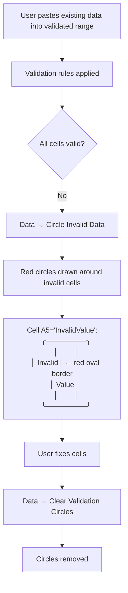
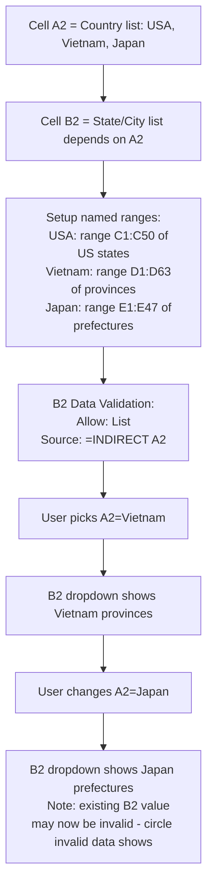

# UX Flow — Spec 25 Data Validation

> Spec gốc: [../25-data-validation.md](../25-data-validation.md)

## Data Validation entry

```
Ribbon: Data tab → Data Tools group → Data Validation ▼ dropdown:
┌────────────────────────────────────┐
│ ⚪ Data Validation...               │ ← opens dialog
│ ⭕ Circle Invalid Data              │ ← visual flag
│ 🧹 Clear Validation Circles         │
└──────────────────────────────────────┘

Or: Alt+A+V+V → Data Validation dialog
```

## Data Validation dialog — 3 tabs

```
Select range A1:A10, Data → Data Validation:

┌─ Data Validation ──────────────────────────────────────┐
│ [Settings] [Input Message] [Error Alert]                │
│ ────────────────────────────────────────────────────── │
│                                                          │
│ ── Validation criteria ──                                │
│ Allow:                                                   │
│ [List                                ▼]                  │
│                                                          │
│ Data:                                                    │
│ [between                             ▼]                  │
│                                                          │
│ Source:                                                  │
│ ┌──────────────────────────────────────┐ ↗            │
│ │ Yes,No,Maybe                          │              │
│ └──────────────────────────────────────┘              │
│ (or reference: =$B$1:$B$5)                              │
│                                                          │
│ ☑ Ignore blank                                          │
│ ☑ In-cell dropdown                                      │
│                                                          │
│ ☐ Apply these changes to all other cells with the     │
│   same settings                                         │
│                                                          │
│ [ Clear All ]                       [ OK ]   [ Cancel ] │
└──────────────────────────────────────────────────────────┘
```

## Allow types

```
Allow dropdown options:
┌─────────────────────────────────┐
│ Any value      ← no validation  │
│ Whole number                     │
│ Decimal                          │
│ List           ← dropdown        │
│ Date                             │
│ Time                             │
│ Text length                      │
│ Custom         ← formula-based   │
└──────────────────────────────────┘

Data operators (when not List/Any/Custom):
┌────────────────────────────────────┐
│ between                             │
│ not between                         │
│ equal to                            │
│ not equal to                        │
│ greater than                        │
│ less than                           │
│ greater than or equal to            │
│ less than or equal to               │
└──────────────────────────────────────┘
```

## Input Message tab

```
[Settings] [Input Message] [Error Alert]
─────────────────────────────────────────
☑ Show input message when cell is selected

Title:
┌──────────────────────────────────┐
│ Enter a region                    │
└──────────────────────────────────┘

Input message:
┌──────────────────────────────────┐
│ Pick one of:                       │
│ North, South, East, West           │
│                                    │
└──────────────────────────────────┘

         [ Clear All ]  [ OK ]  [ Cancel ]
```

## Input message appearance

```
User clicks cell A5 with input message:

┌────┐
│ A5 │ ← cell selected
└────┘
  ╲
   ▼
   ┌─────────────────────────┐
   │ Enter a region            │ ← tooltip yellow
   │                            │
   │ Pick one of:               │
   │ North, South, East, West   │
   └─────────────────────────┘

Auto-dismisses after ~5 seconds or when user starts typing.
```

## Error Alert tab

```
[Settings] [Input Message] [Error Alert]
─────────────────────────────────────────
☑ Show error alert after invalid data is entered

Style:
[Stop                              ▼]
  ├ Stop      — must correct, cannot save
  ├ Warning   — can save with confirmation
  └ Information — can save with notification only

Title:
┌──────────────────────────────────┐
│ Invalid Region                    │
└──────────────────────────────────┘

Error message:
┌──────────────────────────────────┐
│ Region must be one of:             │
│ North, South, East, or West.       │
└──────────────────────────────────┘

         [ Clear All ]  [ OK ]  [ Cancel ]
```

## Error alert dialogs (3 styles)

```
Stop alert (🛑):
┌─ Invalid Region ─────────────────────────┐
│ 🛑 Region must be one of:                │
│    North, South, East, or West.           │
│                                            │
│           [ Retry ]  [ Cancel ]           │
└────────────────────────────────────────────┘
  → User MUST fix or cancel; cannot keep invalid value

Warning alert (⚠️):
┌─ Invalid Region ─────────────────────────┐
│ ⚠️ Region must be one of:                │
│    North, South, East, or West.           │
│                                            │
│ Continue?                                  │
│     [ Yes ]  [ No ]  [ Cancel ]           │
└────────────────────────────────────────────┘
  → Yes = accept invalid; No = retry; Cancel = revert

Info alert (ℹ️):
┌─ Invalid Region ─────────────────────────┐
│ ℹ️ Region must be one of:                │
│    North, South, East, or West.           │
│                                            │
│           [ OK ]  [ Cancel ]              │
└────────────────────────────────────────────┘
  → OK = accept (default); just informational
```

## List dropdown UX

```
Cell A5 with validation List "Yes,No,Maybe":

User clicks A5 → ▼ arrow appears at right of cell:
┌───────────┐
│         ▼ │
└───────────┘

User clicks ▼:
┌───────────┐
│         ▼ │
└───────────┤
│ Yes       │
│ No        │
│ Maybe     │
└───────────┘

User clicks "Yes" → cell = "Yes"

Keyboard navigation:
- Alt+↓ → opens dropdown
- ↑/↓ → navigate items
- Enter → select
- Esc → close without change

Search support (long lists):
- Type character → jumps to first item starting with that letter
- Modern Excel 365: live filter as user types
```

## Custom formula validation

```
Allow: Custom
Formula: =AND(LEN(A5)<=10, ISNUMBER(SEARCH("@", A5)))

→ Cell A5 only accepts text that:
  - Has 10 or fewer characters
  - Contains "@" character

Other examples:
- =COUNTIF($A$1:$A$100, A5) = 1   (must be unique)
- =A5 > A4                         (must be > previous row)
- =MOD(A5, 5) = 0                  (multiple of 5)
- =LEN(A5) = 10                    (exactly 10 chars)
```

## Circle Invalid Data



## Validation with named range source

```
Best practice — dynamic list:

1. Create Named Range "RegionList":
   Refers to: =Sheet2!$A$2:INDEX(Sheet2!$A:$A,COUNTA(Sheet2!$A:$A))
   
2. Data Validation:
   Allow: List
   Source: =RegionList
   
3. Add new region to Sheet2 → dropdown auto-updates

Modern alternative — Table reference:
   Source: =Tables[Regions[Name]]
   → Table auto-extends when new row added
```

## Dependent dropdowns (cascading)



## Implementation hints cho Slave

- **Rule data model**: `sheet._validation_rules: dict[CellRange, ValidationRule]`. Save in `_push_undo()`.
  ```python
  class ValidationRule:
      allow: Literal["any","whole","decimal","list","date","time","textLength","custom"]
      operator: Literal["between","notBetween","eq","neq","gt","lt","gte","lte"] | None
      formula1: str  # value or formula
      formula2: str | None  # for between/notBetween
      list_source: str | None  # comma-list or range ref
      input_msg_title: str | None
      input_msg_body: str | None
      error_style: Literal["stop","warning","information"]
      error_title: str | None
      error_body: str | None
      ignore_blank: bool = True
      show_dropdown: bool = True
  ```
- **Validation dialog**: `QDialog` with `QTabWidget` (3 tabs).
- **In-cell dropdown**: when cell with List validation is active → show `QToolButton` overlay with ▼; on click → `QMenu` populated with list items.
- **Input message tooltip**: `QToolTip.showText(point, html, widget)` triggered on selection change.
- **Validation hook**: intercept `setData` → check `_validate(value, rule)` → show error alert dialog if Stop/Warning style.
- **Circle Invalid Data**: iterate all validated cells → if `not _validate(current_value)` → draw red oval in `CellDelegate.paint()` via overlay state.
- **INDIRECT() in source**: resolve at dropdown-open time, not at rule-save time, so cascading works.
- **List-based with typed value**: when user types value not in list → trigger error alert; allow typing if `show_dropdown=False`.
- **Table reference (Tables[Col])**: special case in formula engine; auto-expand range when table grows.
