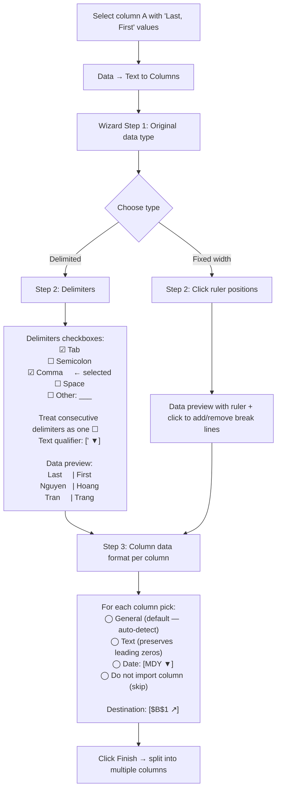
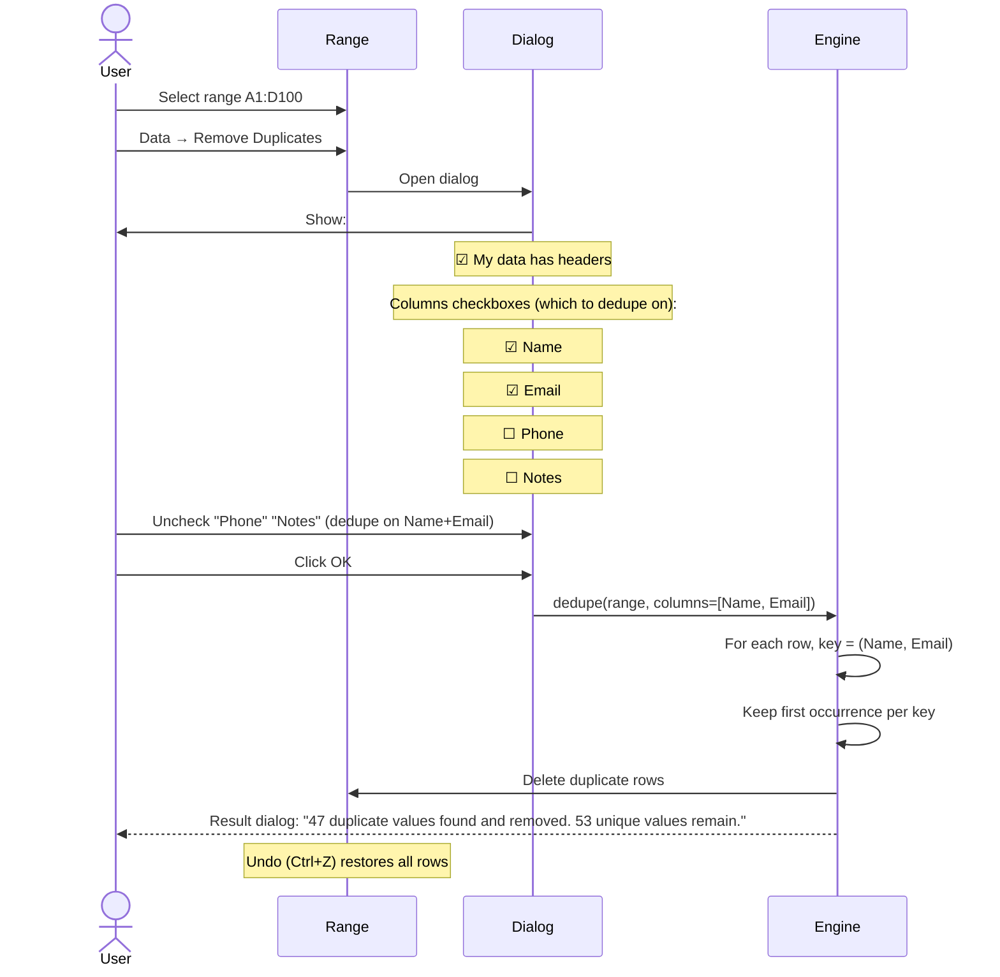

# UX Flow — Spec 27 Data Tools

> Spec gốc: [../27-data-tools.md](../27-data-tools.md)

## Data Tools group overview

```
Data tab → Data Tools group:

┌─ Data Tools ────────────────────────────────────────────┐
│ [Text to Columns] [Flash Fill]  [Remove Duplicates]      │
│ [Data Validation ▼] [Consolidate] [Relationships]        │
│ [Manage Data Model]                                       │
└────────────────────────────────────────────────────────────┘
```

## Text to Columns flow



## Text to Columns Step 1 dialog

```
┌─ Convert Text to Columns Wizard - Step 1 of 3 ────────────┐
│ The Text Wizard has determined that your data is:           │
│                                                               │
│ Choose the file type that best describes your data:          │
│ ● Delimited      — Characters such as commas or tabs        │
│                    separate each field.                       │
│ ◯ Fixed width    — Fields are aligned in columns with        │
│                    spaces between each field.                 │
│                                                               │
│ Preview of selected data:                                     │
│ ┌─────────────────────────────────────────────────────┐    │
│ │ Nguyen, Hoang                                         │    │
│ │ Tran, Trang                                            │    │
│ │ Le, Quynh                                              │    │
│ │ ...                                                    │    │
│ └─────────────────────────────────────────────────────┘    │
│                                                               │
│  [ Cancel ]  [ < Back ]  [ Next > ]  [ Finish ]            │
└───────────────────────────────────────────────────────────────┘
```

## Flash Fill (Spec 05 cross-link)

```
See ux-flows/05-autofill-flow.md for full Flash Fill flow.

Quick entry:
Column A: "Nguyen Van Hoang"
Column B: User types "N. V. Hoang" in row 1
        Press Ctrl+E or Data → Flash Fill
        → Excel infers pattern, fills rest of B
```

## Remove Duplicates flow



## Remove Duplicates dialog

```
┌─ Remove Duplicates ──────────────────────────────────────┐
│ To delete duplicate values, select one or more columns     │
│ that contain duplicates.                                    │
│                                                              │
│ [Select All]  [Unselect All]    ☑ My data has headers      │
│                                                              │
│ Columns                                                     │
│ ┌──────────────────────────────────────────────────────┐  │
│ │ ☑ Name                                                  │  │
│ │ ☑ Email                                                 │  │
│ │ ☐ Phone                                                 │  │
│ │ ☐ Notes                                                 │  │
│ └──────────────────────────────────────────────────────┘  │
│                                                              │
│                              [ OK ]   [ Cancel ]           │
└──────────────────────────────────────────────────────────────┘
```

## Data Validation (Spec 25 cross-link)

```
See ux-flows/25-data-validation-flow.md

Dropdown within Data Tools:
[Data Validation ▼]
  ├ Data Validation...      (opens 3-tab dialog)
  ├ Circle Invalid Data     (overlay markers)
  └ Clear Validation Circles
```

## Consolidate dialog

```
Combine data from multiple ranges/sheets:

┌─ Consolidate ────────────────────────────────────────────┐
│ Function:                                                   │
│ [Sum                            ▼]                          │
│  ├ Sum / Count / Average / Max / Min / Product             │
│  ├ CountNums / StDev / StDevp / Var / Varp                 │
│                                                              │
│ Reference:                                                  │
│ [Sheet2!$A$1:$C$10                                ] ↗     │
│ [Add]    [Delete]                                           │
│                                                              │
│ All references:                                             │
│ ┌──────────────────────────────────────────────────────┐  │
│ │ Sheet1!$A$1:$C$10                                       │  │
│ │ Sheet2!$A$1:$C$10                                       │  │
│ │ Sheet3!$A$1:$C$10                                       │  │
│ │ '[Budget.xlsx]Q1'!$A$1:$C$10  ← external book          │  │
│ └──────────────────────────────────────────────────────┘  │
│                                                              │
│ Use labels in:                                              │
│ ☑ Top row                                                  │
│ ☑ Left column                                              │
│                                                              │
│ ☐ Create links to source data    ← formulas vs static       │
│                                                              │
│ [ Browse... ]                       [ OK ]   [ Cancel ]    │
└──────────────────────────────────────────────────────────────┘
```

## Consolidate visual example

```
Source 1 (Sheet1!A1:C5):
┌────────┬───┬───┐
│ Name   │ Q1│ Q2│
├────────┼───┼───┤
│ Apple  │ 10│ 20│
│ Banana │  5│ 15│
└────────┴───┴───┘

Source 2 (Sheet2!A1:C5):
┌────────┬───┬───┐
│ Name   │ Q1│ Q2│
├────────┼───┼───┤
│ Apple  │ 30│ 40│
│ Cherry │ 25│ 35│
└────────┴───┴───┘

After Consolidate with SUM + Top row + Left column labels:
┌────────┬───┬───┐
│        │ Q1│ Q2│
├────────┼───┼───┤
│ Apple  │ 40│ 60│ ← 10+30, 20+40
│ Banana │  5│ 15│
│ Cherry │ 25│ 35│
└────────┴───┴───┘

With "Create links to source data": shows outline + formulas linking back
```

## Relationships dialog (Power Pivot)

```
Manage relationships between tables in Data Model:

┌─ Manage Relationships ────────────────────────────────────┐
│ [New...] [Edit...] [Activate] [Deactivate] [Delete]         │
│ ────────────────────────────────────────────────────────── │
│ Active    From Table  Column      Related Table  Column     │
│ ┌────────────────────────────────────────────────────────┐ │
│ │ ✓      Sales        CustomerID   Customers     ID         │ │
│ │ ✓      Sales        ProductID    Products      ID         │ │
│ │ ✗      Sales        RegionCode   Regions       Code       │ │
│ └────────────────────────────────────────────────────────┘ │
│                                                              │
│                                              [ Close ]      │
└──────────────────────────────────────────────────────────────┘

New Relationship dialog:
┌─ Create Relationship ─────────────────────────┐
│ Pick the tables and columns you want to use for │
│ this relationship.                                │
│                                                    │
│ Table:           Related Table:                   │
│ [Sales      ▼]   [Customers ▼]                  │
│                                                    │
│ Column (Foreign): Related Column (Primary):       │
│ [CustomerID ▼]   [ID         ▼]                  │
│                                                    │
│                            [ OK ]   [ Cancel ]    │
└────────────────────────────────────────────────────┘
```

## Get Data (Power Query) flow link

```
Get Data dropdown (Data tab → Get & Transform Data):

┌──────────────────────────────────────────┐
│ From File              ▶                  │
│   ├ From Workbook                          │
│   ├ From Text/CSV                          │
│   ├ From JSON                              │
│   ├ From XML                               │
│   └ From PDF                               │
│ From Database          ▶                  │
│   ├ From SQL Server                        │
│   ├ From MySQL                             │
│   └ ... (many DB types)                    │
│ From Online Services   ▶                  │
│   ├ From SharePoint List                   │
│   ├ From OData Feed                        │
│   └ ... (many cloud services)              │
│ From Other Sources    ▶                  │
│   ├ From Web                                │
│   ├ From OData                              │
│   └ ...                                    │
│ Combine Queries        ▶                  │
│ Launch Power Query Editor                  │
│ Data Source Settings                       │
│ Query Options                              │
└────────────────────────────────────────────┘

See ux-flows/20-power-query-flow.md for Power Query Editor details (iter sau).
```

## Modern: Data Types / Linked Data Types

```
Select cell with text "Apple Inc.", click Data → Stocks (or Geography):

┌────────────────────────┐
│ Apple Inc.  📊         │ ← Linked Data Type icon
└────────────────────────┘

Click icon → Data Card panel:
┌─ Apple Inc. ──────────────────┐
│ 🏢 Stock                       │
│ Price:        $192.45          │
│ 52-Week High: $215.00          │
│ Market Cap:   $2.9T            │
│ Employees:    164,000          │
│ Industry:     Consumer Elect.  │
│ Headquarters: Cupertino, CA    │
│ ...                             │
└────────────────────────────────┘

In another cell: =A2.Price → extracts Price field
Auto-refreshes periodically (15-min cache typical)
```

## Implementation hints cho Slave

- **Text to Columns wizard**: `QWizard` with 3 `QWizardPage`s.
  - Page 1: radio Delimited / Fixed; show preview from `sheet.get_block(selection)`.
  - Page 2: checkboxes; live update preview based on parse result.
  - Page 3: per-column format combo box; commit calls split function.
  
- **Split function**:
  ```python
  def text_to_columns_delim(values: list[str], delim_set: list[str], qualifier: str):
      pattern = "|".join(re.escape(d) for d in delim_set)
      return [csv_split(v, pattern, qualifier) for v in values]
  ```

- **Remove Duplicates**:
  ```python
  def dedupe(rows, key_cols):
      seen = set()
      result = []
      for row in rows:
          key = tuple(row[c] for c in key_cols)
          if key not in seen:
              seen.add(key)
              result.append(row)
      return result
  ```

- **Consolidate**: dictionary-based aggregation by row+col labels; loop sources; sum into output.

- **Relationships UI**: `QTableWidget` with active/from/col/to/col columns; `QDialog` for new relationship picking from registered tables.

- **Linked Data Types**:
  - Special cell value type `LinkedDataValue(entity_id, fields_dict)`.
  - Render icon in `CellDelegate`; click → open card pane.
  - Field extraction: `=A2.Price` → tokenize `.Field` syntax → resolve from cell's linked entity dict.
  - Refresh: Microsoft Graph / Wolfram (deprecated 2023) / LSEG-Refinitiv API.

- **All dialogs**: `QDialog` with `setModal(True)`; remember last settings via QSettings per-dialog.
