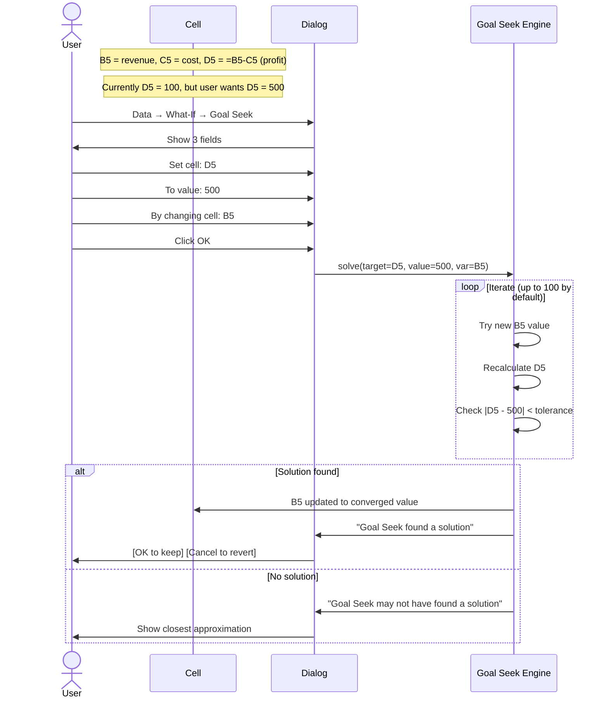
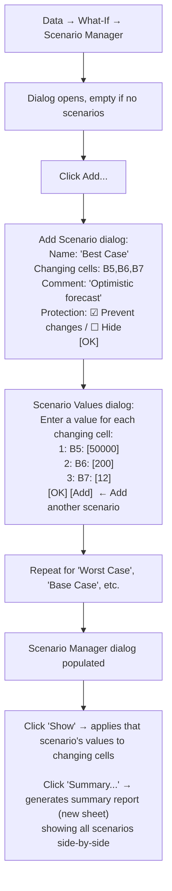
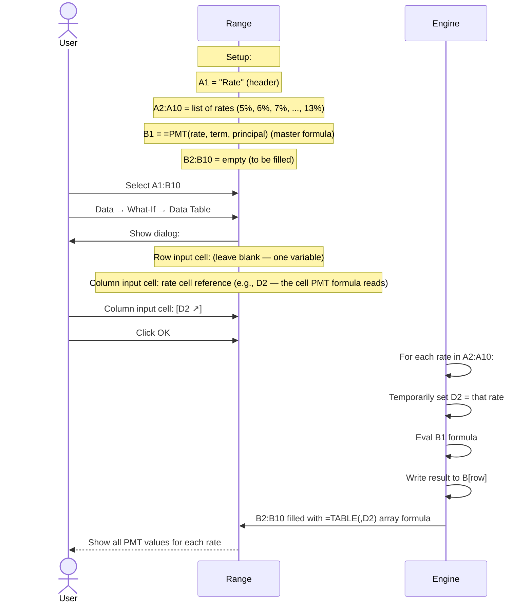
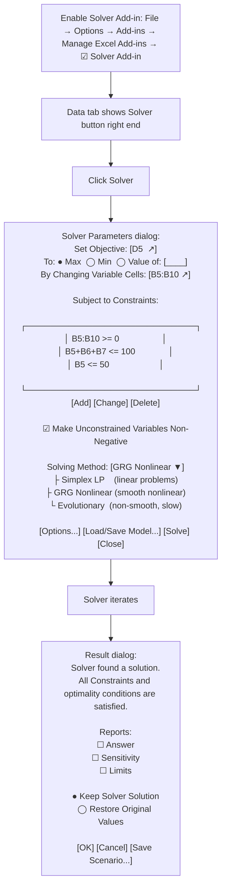

# UX Flow — Spec 28 What-If Analysis

> Spec gốc: [../28-what-if-analysis.md](../28-what-if-analysis.md)

## What-If Analysis menu

```
Data tab → Forecast group → What-If Analysis ▼:

┌──────────────────────────────────────────┐
│ Scenario Manager...                       │
│ Goal Seek...                              │
│ Data Table...                             │
└────────────────────────────────────────────┘

Plus standalone tool:
- Solver (Add-in, separate Add-ins button)
- Forecast Sheet (Spec 22 modern)
```

## Goal Seek flow



## Goal Seek dialog

```
┌─ Goal Seek ─────────────────────────────┐
│                                            │
│ Set cell:        [D5                  ] ↗ │
│ To value:        [500                  ]   │
│ By changing cell:[B5                  ] ↗ │
│                                            │
│                          [ OK ] [ Cancel ] │
└────────────────────────────────────────────┘

After OK:
┌─ Goal Seek Status ──────────────────────┐
│ Goal Seeking with Cell D5                 │
│ found a solution.                          │
│                                            │
│ Target value: 500                          │
│ Current value: 500                         │
│                                            │
│                    [ Step ]                │
│                    [ Pause ]               │
│                    [ OK ]   [ Cancel ]    │
└────────────────────────────────────────────┘

- OK: keep B5 = solution
- Cancel: revert B5 to original value
- Step / Pause: walk through iterations
```

## Scenario Manager flow



## Scenario Manager dialog

```
┌─ Scenario Manager ──────────────────────────────────┐
│ Scenarios:                                            │
│ ┌──────────────────────────────────────────────┐    │
│ │ Best Case                                       │    │
│ │ Base Case                  ← selected           │    │
│ │ Worst Case                                      │    │
│ └──────────────────────────────────────────────┘    │
│                                                        │
│ [Add...] [Delete] [Edit...] [Merge...] [Summary...]   │
│                                                        │
│ Changing cells:                                       │
│ $B$5,$B$6,$B$7                                        │
│                                                        │
│ Comment:                                              │
│ Realistic forecast based on Q3 trends                 │
│                                                        │
│              [ Show ]                    [ Close ]    │
└────────────────────────────────────────────────────────┘

Click Summary... → choose result cells (e.g., D5 = profit):

┌─ Scenario Summary ──────────────────────────────────┐
│ Report type:                                           │
│ ● Scenario summary                                     │
│ ◯ Scenario PivotTable report                           │
│                                                         │
│ Result cells: [D5,D10                          ] ↗   │
│                                                         │
│                              [ OK ]   [ Cancel ]      │
└─────────────────────────────────────────────────────────┘
```

## Scenario Summary report output

```
New sheet "Scenario Summary" created with structured output:

┌─────────────────────────────────────────────────────────┐
│ Scenario Summary                                          │
│                                                            │
│                  Current Values  Best Case  Base  Worst   │
│ Changing Cells:                                            │
│   $B$5            55000          50000      40000  25000  │
│   $B$6            220            200        180    150    │
│   $B$7            12             12         11     10     │
│ Result Cells:                                              │
│   $D$5            600            500        300    100    │
│   $D$10           7200           6000       3300    1000  │
│                                                            │
│ Notes: Current Values column represents values of changing │
│ cells at time Scenario Summary report was created. Changing │
│ cells for each scenario are highlighted in gray.            │
└────────────────────────────────────────────────────────────┘
```

## Data Table (One-variable) flow



## Data Table dialog

```
One-variable data table:
┌─ Data Table ────────────────────────────┐
│                                            │
│ Row input cell:      [                  ] ↗│
│ Column input cell:   [D2               ] ↗│ ← only one filled
│                                            │
│                        [ OK ]  [ Cancel ] │
└────────────────────────────────────────────┘

Two-variable data table:
┌─ Data Table ────────────────────────────┐
│                                            │
│ Row input cell:      [E2               ] ↗│ ← variable 1 (e.g., term)
│ Column input cell:   [D2               ] ↗│ ← variable 2 (e.g., rate)
│                                            │
│                        [ OK ]  [ Cancel ] │
└────────────────────────────────────────────┘
```

## Two-variable Data Table layout

```
Setup:
┌─────┬──────┬──────┬──────┬──────┐
│     │  10y │  15y │  20y │  30y │ ← row input (terms) in row 1
├─────┼──────┼──────┼──────┼──────┤
│ 5%  │  ?   │  ?   │  ?   │  ?   │ ← column input (rates) in col A
│ 6%  │  ?   │  ?   │  ?   │  ?   │
│ 7%  │  ?   │  ?   │  ?   │  ?   │
└─────┴──────┴──────┴──────┴──────┘

Cell A1 = =PMT(D2, E2*12, 100000)   ← master formula at corner
Cell A2:A4 = list of rates
Cell B1:E1 = list of terms

Select A1:E4 → Data Table:
- Row input cell: E2 (where master formula reads term)
- Column input cell: D2 (where master formula reads rate)

Result: full grid filled with PMT values for each rate × term combo
Formula in B2:E4 = {=TABLE(E2,D2)}
```

## Solver flow (Add-in)



## Forecast Sheet (modern)

```
Data tab → Forecast group → Forecast Sheet:

Select time-series data (date column + value column) → click Forecast Sheet:

┌─ Create Forecast Worksheet ──────────────────────────────┐
│ Use historical data to predict future trends.              │
│                                                              │
│ ┌──────────────────────────────────────────────────────┐  │
│ │ Preview chart:                                          │  │
│ │                                                          │  │
│ │  Value                                                  │  │
│ │    │     ●●●●●●                                          │  │
│ │    │   ●●        ●●                                      │  │
│ │    │ ●●            ●●●●                                  │  │
│ │    │                    ●●○○○○ ← forecast (lighter)     │  │
│ │    │                          ○○○                        │  │
│ │    └──────────────────────────────                       │  │
│ │     Past dates                Future dates              │  │
│ │                                                          │  │
│ │     ─── Actual                                          │  │
│ │     - - Forecast                                        │  │
│ │     ▒▒  Confidence interval                            │  │
│ └──────────────────────────────────────────────────────┘  │
│                                                              │
│ Forecast End: [2026-12-31         ▼]                       │
│ ▼ Options                                                   │
│   Forecast Start: [Auto                  ]                  │
│   Confidence Interval: 95%                                  │
│   Seasonality:                                              │
│   ● Detect Automatically                                    │
│   ◯ Set Manually: [12 ▼] (e.g., 12=monthly seasonality)    │
│   Timeline Range: [A2:A24 ↗]                                │
│   Values Range:   [B2:B24 ↗]                                │
│   Fill Missing Points Using: [Interpolation ▼]              │
│   Aggregate Duplicates Using: [Average      ▼]              │
│ ☑ Include forecast statistics                              │
│                                                              │
│                              [ Create ]   [ Cancel ]       │
└──────────────────────────────────────────────────────────────┘

Click Create → new sheet with:
- Original + forecast data table
- Chart showing actual + forecast + confidence interval
- Uses ETS (Exponential Triple Smoothing) algorithm
- Formulas: FORECAST.ETS, FORECAST.ETS.CONFINT, FORECAST.ETS.SEASONALITY
```

## Implementation hints cho Slave

- **Goal Seek**: simple bisection / Newton's method:
  ```python
  def goal_seek(target_cell, target_value, var_cell, max_iter=100, tol=1e-6):
      def evaluate(x):
          sheet[var_cell] = x
          return sheet[target_cell] - target_value
      
      x0, x1 = 0, 1  # initial bracket; expand if needed
      for _ in range(max_iter):
          f0, f1 = evaluate(x0), evaluate(x1)
          if abs(f1) < tol:
              return x1
          x_new = x1 - f1 * (x1 - x0) / (f1 - f0)  # secant
          x0, x1 = x1, x_new
      raise ConvergenceError
  ```
- **Scenario data model**:
  ```python
  class Scenario:
      name: str
      changing_cells: list[CellRef]
      values: dict[CellRef, Any]
      comment: str
      protection: bool
      hidden: bool
  
  sheet._scenarios: dict[str, Scenario]
  ```
- **Show scenario**: snapshot current values → write scenario values → recalc → keep snapshot for undo.
- **Summary report generation**: new sheet, populate as 2D table with scenario columns.
- **Data Table**:
  ```python
  def data_table_1var(input_col, output_col, var_cell):
      for r in input_col_range:
          input_val = sheet[input_col, r]
          sheet[var_cell] = input_val  # temp set
          recalc()
          sheet[output_col, r] = sheet[formula_cell]  # write result
      # Mark output cells as {=TABLE(,var_cell)} (array formula)
  ```
- **TABLE() function**: special pseudo-function rendered as `{=TABLE(row_input, col_input)}` in cells; recomputes when source data table inputs change.
- **Solver**: use `scipy.optimize`:
  - Simplex LP → `scipy.optimize.linprog`
  - GRG nonlinear → `scipy.optimize.minimize(method="SLSQP")`
  - Evolutionary → `scipy.optimize.differential_evolution`
- **Forecast Sheet (ETS)**: implement Triple Exponential Smoothing in `forecast.py`; or use `statsmodels.tsa.holtwinters.ExponentialSmoothing`.
- **All dialogs**: `QDialog`; remember last inputs via QSettings.
