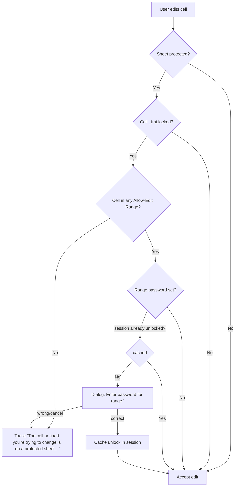
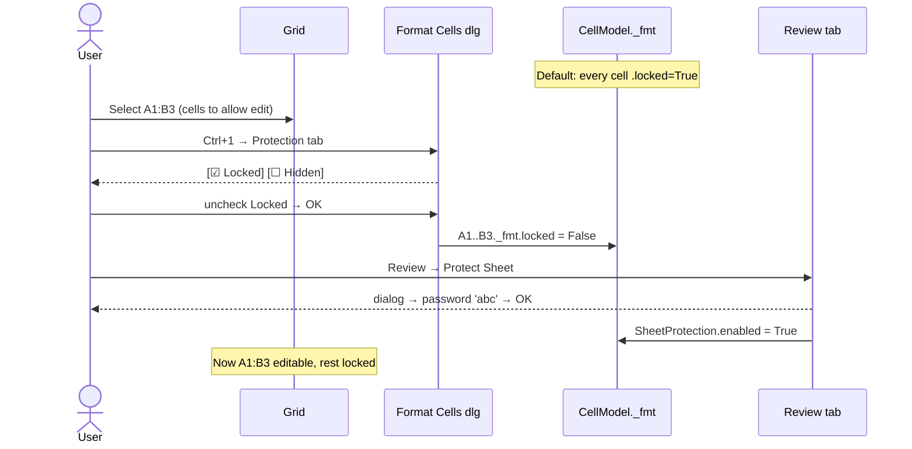
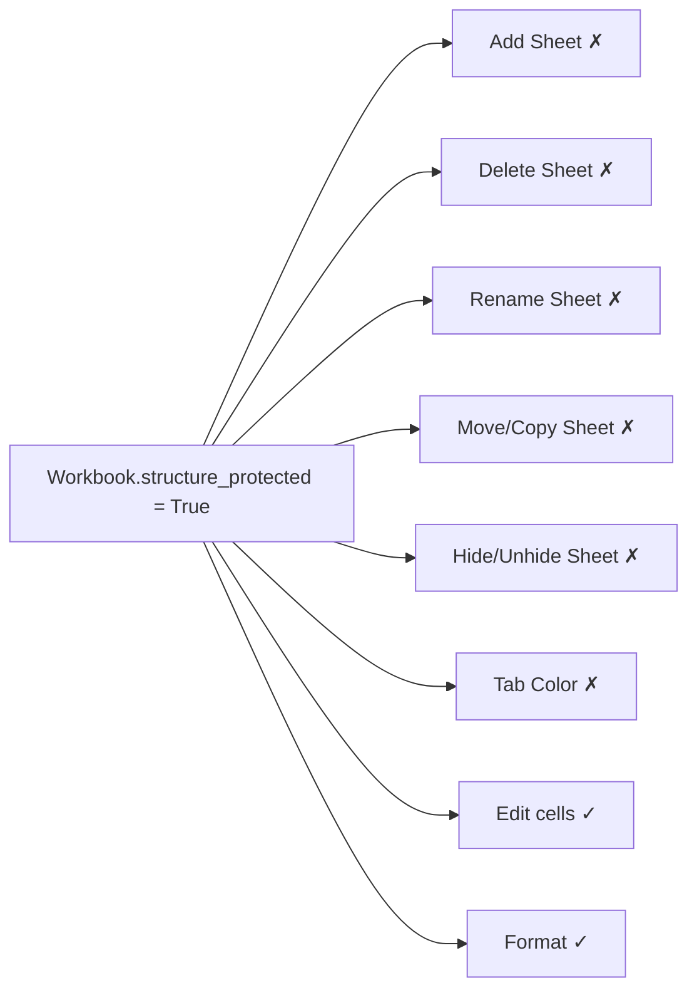
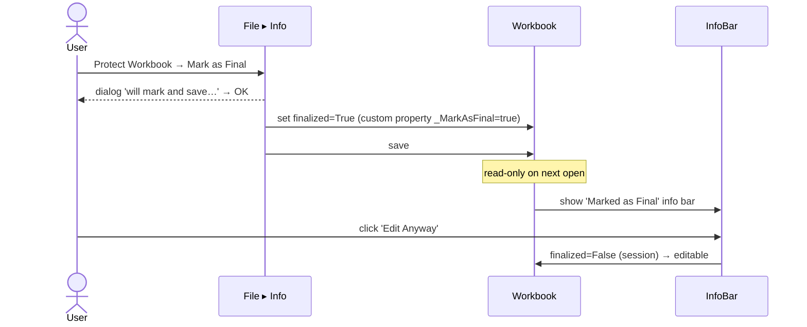
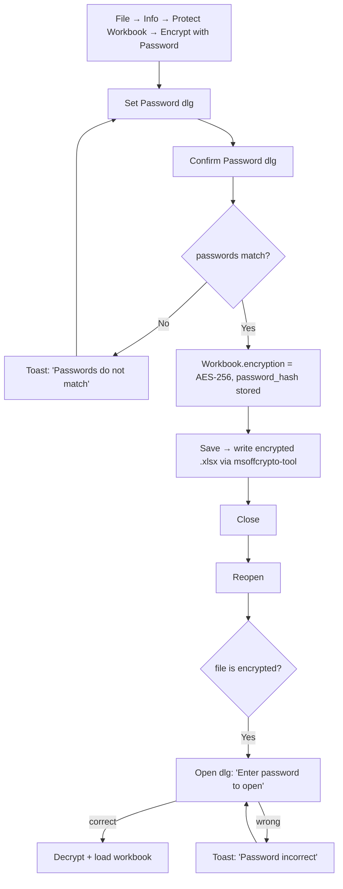
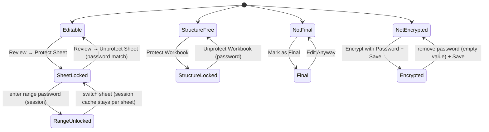

# 29 — Protection (Sheet / Workbook / Range / Encryption) — UX Flow

> Spec gốc: [29-protection.md](../29-protection.md)

## 1. Protection layers



## 2. Protect Sheet dialog (Review → Protect Sheet)

```
┌─ Protect Sheet ──────────────────────────────────────────┐
│ [☑] Protect worksheet and contents of locked cells       │
│                                                           │
│ Password to unprotect sheet (optional):                  │
│ [********                                              ] │
│                                                           │
│ Allow all users of this worksheet to:                    │
│ ┌──────────────────────────────────────────────────────┐│
│ │ [☑] Select locked cells                              ││
│ │ [☑] Select unlocked cells                            ││
│ │ [☐] Format cells                                     ││
│ │ [☐] Format columns                                   ││
│ │ [☐] Format rows                                      ││
│ │ [☐] Insert columns                                   ││
│ │ [☐] Insert rows                                      ││
│ │ [☐] Insert hyperlinks                                ││
│ │ [☐] Delete columns                                   ││
│ │ [☐] Delete rows                                      ││
│ │ [☐] Sort                                             ││
│ │ [☐] Use AutoFilter                                   ││
│ │ [☐] Use PivotTable & PivotChart                      ││
│ │ [☐] Edit objects                                     ││
│ │ [☐] Edit scenarios                                   ││
│ └──────────────────────────────────────────────────────┘│
│                                                           │
│                                       [OK]    [Cancel]   │
└──────────────────────────────────────────────────────────┘

  ↓ (password set?)

┌─ Confirm Password ───────────────────────────────────────┐
│ Reenter password to proceed:                              │
│ [********                                              ] │
│ Caution: it's not possible to recover a forgotten         │
│ password.                                                 │
│                                       [OK]    [Cancel]   │
└──────────────────────────────────────────────────────────┘
```

## 3. Locked/Unlocked cell prep sequence



## 4. Format Cells → Protection tab

```
┌─ Format Cells ───────────────────────────────────────────┐
│ [Number][Alignment][Font][Border][Fill][Protection]      │
│ ────────────────────────────────────────────────────────│
│ [☑] Locked                                                │
│ [☐] Hidden                                                │
│                                                           │
│ Locking cells or hiding formulas has no effect until      │
│ you protect the worksheet (Review tab → Protect Sheet).   │
│                                                           │
│                                       [OK]    [Cancel]   │
└──────────────────────────────────────────────────────────┘
```

Behavior matrix:

| `_fmt.locked` | `_fmt.hidden` | Sheet protected? | Edit? | Formula visible in Formula Bar? |
|---|---|---|---|---|
| True (default) | False | No | ✓ | ✓ |
| True | False | Yes | ✗ (toast) | ✓ |
| False | False | Yes | ✓ | ✓ |
| True | True | Yes | ✗ | ✗ (result only) |
| False | True | Yes | ✓ | ✗ |

## 5. Edit attempt on protected cell

```
       click C5 (locked) and start typing
                 │
                 ▼
   ┌─────────────────────────────────────────────────┐
   │ ⚠ The cell or chart you're trying to change is │
   │   on a protected sheet. To make changes, click │
   │   Unprotect Sheet in the Review tab (you might │
   │   be prompted for a password).                 │
   │                                          [OK]  │
   └─────────────────────────────────────────────────┘
```

Status bar status pill: `🔒 Protected sheet` (visible when active sheet protected).

## 6. Protect Workbook (Structure)

```
Review → Protect Workbook

┌─ Protect Structure and Windows ──────────────────────────┐
│ Protect workbook for                                      │
│   [☑] Structure                                           │
│   [☐] Windows (legacy — disabled in Excel 365)            │
│                                                           │
│ Password (optional):                                      │
│ [********                                              ] │
│                                       [OK]    [Cancel]   │
└──────────────────────────────────────────────────────────┘
```

Disabled commands when Structure protected:



Tab strip context menu items grey out; ribbon Format → Hide & Unhide → Hide Sheet greyed.

## 7. Allow Edit Ranges

```
Review → Allow Edit Ranges

┌─ Allow Users to Edit Ranges ─────────────────────────────┐
│ Ranges unlocked by a password when sheet is protected:    │
│ ┌──────────────────────────────────────────────────────┐│
│ │ Title          │ Refers to cells     │ Has password ││
│ │────────────────┼─────────────────────┼──────────────││
│ │ FinanceRange   │ $D$1:$E$5           │ Yes           ││
│ │ SalesRange     │ Sheet1!$G$1:$H$10   │ No            ││
│ └──────────────────────────────────────────────────────┘│
│                                                           │
│ [New…]  [Modify…]  [Delete]   [Permissions…]              │
│                                                           │
│ [☐] Paste permissions information into a new workbook    │
│                                                           │
│                  [Protect Sheet…] [OK]    [Cancel]       │
└──────────────────────────────────────────────────────────┘

  ↓ New

┌─ New Range ──────────────────────────────────────────────┐
│ Title:        [FinanceRange                            ] │
│ Refers to:    [=$D$1:$E$5                            ][⤴]│
│ Range password (optional):                                │
│              [********                                ] │
│                                                           │
│ [Permissions…]                            [OK] [Cancel]  │
└──────────────────────────────────────────────────────────┘

  ↓ user clicks D2 on protected sheet

┌─ Unlock Range ──────────────────────────────────────────┐
│ Enter the password to change this cell.                  │
│ Title: FinanceRange  ($D$1:$E$5)                         │
│ Password: [********                                    ] │
│                                       [OK]    [Cancel]   │
└──────────────────────────────────────────────────────────┘
   → correct → cache unlock for session (per range_id)
```

## 8. Mark as Final



InfoBar mockup:

```
┌────────────────────────────────────────────────────────────────────┐
│ 🟡 MARKED AS FINAL  An author has marked this workbook as final to│
│ discourage editing.                              [ Edit Anyway ]  │
└────────────────────────────────────────────────────────────────────┘
```

## 9. Encrypt with Password



```
┌─ Encrypt Document ──────────────────────────────────────┐
│ Encrypt the contents of this file                        │
│ Password:                                                 │
│ [********                                              ] │
│ Caution: if you lose or forget the password, it cannot   │
│ be recovered.                                             │
│                                       [OK]    [Cancel]   │
└──────────────────────────────────────────────────────────┘
```

File → Info pane shows:

```
🛡  Protect Workbook
    A password is required to open this workbook.
    [Protect Workbook ▼]
```

## 10. Password algorithm cheat-sheet

| Use | Algorithm | Salt | Spin | Storage |
|---|---|---|---|---|
| Sheet protection (modern) | SHA-512 | 16 bytes | 100000 | `<sheetProtection algorithmName="SHA-512" hashValue=… saltValue=… spinCount=…/>` |
| Sheet protection (legacy) | SHA-1 / CRC | none | n/a | `<sheetProtection password="ABCD"/>` (avoid) |
| Workbook structure | SHA-512 | 16 bytes | 100000 | `<workbookProtection algorithmName=…/>` |
| Range password | SHA-512 | 16 bytes | 100000 | `<protectedRange .../>` |
| File encryption | AES-256-CBC | 16 bytes | 100000 | MS-OFFCRYPTO agile profile (EncryptionInfo + EncryptedPackage streams) |

## 11. UI state model



## 12. User journeys

### J1 — Lock everything except A1:B3
1. Select A1:B3 → Ctrl+1 → Protection → uncheck Locked → OK.
2. Review → Protect Sheet → password "abc" → confirm → OK.
3. Click C5 → type → toast appears. Click A1 → type "hi" → accepted.

### J2 — Allow edit range with separate password
1. Sheet not protected. Review → Allow Edit Ranges → New → title "FinanceRange", range `$D$1:$E$5`, password "qwe" → OK.
2. Click **Protect Sheet…** from same dialog → password "abc".
3. Click D2 → typing → prompt for range password "qwe" → unlock → edit OK.
4. Click C2 → toast (locked, not in any allow range).

### J3 — Encrypt + reopen
1. File → Info → Protect Workbook → Encrypt with Password "xyz" → confirm.
2. Save. Close.
3. Open file → password dialog → "xyz" → workbook loads.

### J4 — Protect structure
1. Review → Protect Workbook → ☑ Structure → password "s1" → confirm.
2. Right-click tab strip → Insert / Delete / Rename / Hide all greyed.

### J5 — Mark as Final → keep editing anyway
1. File → Info → Protect Workbook → Mark as Final → dialog → OK → save.
2. Reopen → yellow info bar → **Edit Anyway** → editable for session (finalized flag still on next open).

## 13. Implementation hints

- **`core/protection/sheet_protection.py`** — `SheetProtection` model + `is_editable(cell, edit_ranges, unlocked_set) → bool`. Called from `model.setData` and ribbon button enable logic.
- **`core/protection/password.py`** — agile SHA-512 hash + verify; reuse openpyxl `Protection._password_hash`.
- **`io_utils/encryption.py`** — `msoffcrypto-tool` wrapper: `decrypt(path, password) → BytesIO` for open; `encrypt(bytes_io, path, password)` for save.
- **`ui/dialogs/protect_sheet.py`** — Qt dialog mirroring §2 checklist; emits `SheetProtectionSpec`.
- **`ui/dialogs/allow_edit_ranges.py`** — list widget + New/Modify/Delete buttons.
- **`ui/widgets/cell_editor.py`** — pre-edit hook: if not editable → toast + cancel; if range-protected and not session-unlocked → prompt for range password.
- **`ui/delegates/cell_delegate.py`** — when `cell._fmt.hidden and sheet_protected` → render value but suppress formula in Formula Bar (read via `model.displayFormula(idx)`).
- **Disable map** (`ui/protection/disable_map.py`): map ribbon action ids → `allow` flag; subscribe to `SheetProtectionChanged`, recompute enabled state.

## 14. Acceptance ↔ flow map

| AC | Where |
|---|---|
| 1 unlock A1:B3 then protect 'abc' | J1 + §3 |
| 2 toast on locked cell edit | §5 + J1 |
| 3 typing on unlocked cell OK | J1 |
| 4 Unprotect 'abc' | §11 state |
| 5 encrypt 'xyz' + reopen | J3 + §9 |
| 6 structure protect → add/delete/rename disabled | J4 + §6 |
| 7 Allow Edit Ranges 'qwe' | J2 + §7 |
