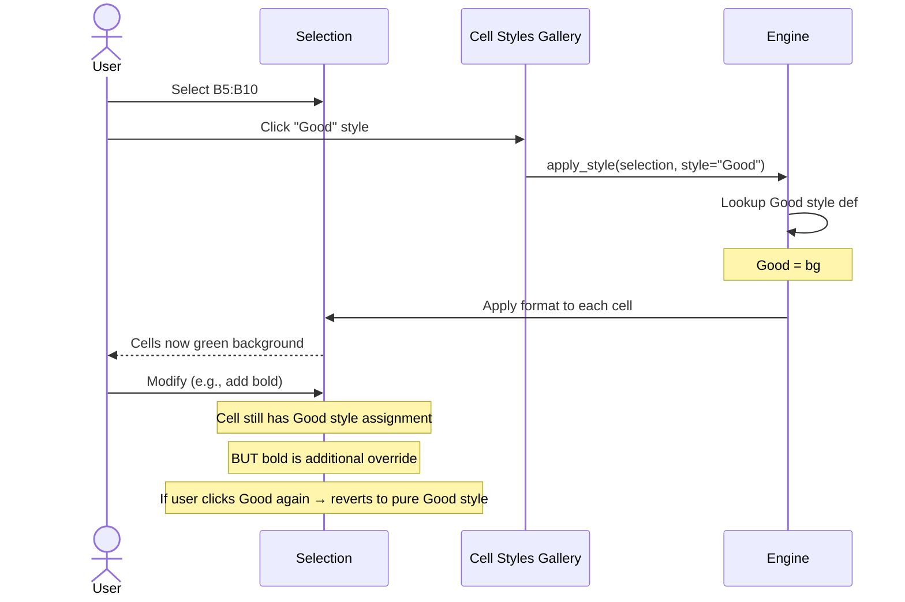

# UX Flow — Spec 30 Themes & Cell Styles

> Spec gốc: [../30-themes-cell-styles.md](../30-themes-cell-styles.md)

## Theme picker

```
Page Layout tab → Themes group:

┌────────────────────────────────────────────────┐
│ [Themes ▼] [Colors ▼] [Fonts ▼] [Effects ▼]   │
└──────────────────────────────────────────────────┘

Click "Themes" ▼ → gallery dropdown:
┌─────────────────────────────────────────────────────────┐
│ Office (current)                                          │
│ ┌────┐ ┌────┐ ┌────┐ ┌────┐ ┌────┐                     │
│ │Cur ▢│ │Office Theme│ │Aspect│ │Banded│ │Basis │     │
│ │     │ │            │ │      │ │      │ │      │     │
│ └─────┘ └────────────┘ └──────┘ └──────┘ └──────┘     │
│                                                            │
│ Custom                                                     │
│ ┌────┐                                                    │
│ │MyTheme│                                                 │
│ └────┘                                                     │
│                                                            │
│ Built-In (galleries of 30+ themes)                        │
│ ┌────┐ ┌────┐ ┌────┐ ┌────┐ ┌────┐ ┌────┐ ┌────┐      │
│ │... thumbnails preview each theme color combo ... │      │
│ └────┘ └────┘ └────┘ └────┘ └────┘ └────┘ └────┘      │
│                                                            │
│ Reset to Theme from Template                              │
│ Browse for Themes...                                      │
│ Save Current Theme...                                      │
└────────────────────────────────────────────────────────────┘
```

## What's in a Theme?

```
A theme = combination of 3 parts:

1. Theme Colors (12 colors):
   - Background 1, Text 1 (light/dark pair)
   - Background 2, Text 2 (light/dark pair)
   - Accent 1, 2, 3, 4, 5, 6
   - Hyperlink, Followed Hyperlink

2. Theme Fonts (2 fonts):
   - Heading font (e.g., "Aptos Display")
   - Body font (e.g., "Aptos Narrow")

3. Theme Effects (1 set):
   - Shape outlines/fills/effects style applied to chart elements,
     SmartArt, drawing shapes

When user picks Theme color in Font Color or Fill picker, they're picking
ONE OF THE THEME COLORS (theme-aware). Switch theme → all theme-color cells
update automatically.
```

## Theme colors visual

```
Theme = "Office":
┌──────────────────────────────────────────────────────────┐
│ Theme Colors (top row = primary, below = 5 tints each)  │
│                                                            │
│ ⬜ ⬛ 🟫 🟦 🟩 🟨 🟧 🟪                                 │ ← row 1: primary
│ ⬜ ⬛ 🟫 🟦 🟩 🟨 🟧 🟪                                 │ ← row 2: lighter 80%
│ ⬜ ⬛ 🟫 🟦 🟩 🟨 🟧 🟪                                 │ ← row 3: lighter 60%
│ ⬜ ⬛ 🟫 🟦 🟩 🟨 🟧 🟪                                 │ ← row 4: lighter 40%
│ ⬜ ⬛ 🟫 🟦 🟩 🟨 🟧 🟪                                 │ ← row 5: darker 25%
│ ⬜ ⬛ 🟫 🟦 🟩 🟨 🟧 🟪                                 │ ← row 6: darker 50%
│                                                            │
│ Standard Colors (NOT theme-aware):                         │
│ 🟥 🟧 🟨 🟩 🟦 🟪 🟫 ⬛ ⬜                              │
│                                                            │
│ More Colors... → custom color picker (RGB/HSL/HEX)         │
└──────────────────────────────────────────────────────────────┘

Theme colors hover tooltip: "Accent 1, Lighter 40%"
```

## Apply theme flow

```mermaid
flowchart TD
    A[User clicks Page Layout → Themes → Banded] --> B[Excel applies theme]
    
    B --> C[All cells with theme-color formatting update]
    C --> D[Cells with #1F77B4 Office Accent 1 → new accent in Banded theme]
    
    B --> E[All cells using theme fonts update font face]
    
    B --> F[Charts re-render with new color palette]
    
    B --> G[Cell Styles gallery updates to show new theme colors]
    
    Note over A,G: STANDARD colors (#FF0000 red picked from Standard) DO NOT change
    Note over A,G: Only theme-aware properties update
```

## Cell Styles gallery

```
Home tab → Styles group → Cell Styles ▼:

┌───────────────────────────────────────────────────────────────────┐
│ Good, Bad and Neutral                                              │
│ ┌─────────┐ ┌─────────┐ ┌─────────┐ ┌─────────┐                  │
│ │ Normal   │ │ Bad      │ │Good     │ │ Neutral  │                 │
│ │ (white)  │ │ (red)    │ │(green)  │ │ (yellow) │                 │
│ └──────────┘ └──────────┘ └─────────┘ └──────────┘                │
│                                                                       │
│ Data and Model                                                       │
│ ┌─────────┐ ┌─────────┐ ┌─────────┐ ┌─────────┐ ┌─────────┐       │
│ │Calculat. │ │Check Cell│ │Explan.  │ │Input    │ │Linked   │       │
│ │         │ │          │ │Text     │ │          │ │Cell     │       │
│ └──────────┘ └──────────┘ └─────────┘ └──────────┘ └──────────┘     │
│ ┌─────────┐ ┌─────────┐ ┌─────────┐                                 │
│ │Note      │ │Output    │ │Warning  │                                │
│ │          │ │          │ │Text     │                                │
│ └──────────┘ └──────────┘ └─────────┘                                │
│                                                                       │
│ Titles and Headings                                                  │
│ ┌─────────┐ ┌─────────┐ ┌─────────┐ ┌─────────┐ ┌─────────┐       │
│ │Heading 1 │ │Heading 2 │ │Heading 3│ │Heading 4│ │Title    │       │
│ │ BIG       │ │ BIG       │ │ med      │ │ med      │ │ HUGE    │       │
│ │ blue      │ │ underline │ │         │ │         │ │         │       │
│ └──────────┘ └──────────┘ └─────────┘ └──────────┘ └──────────┘     │
│ ┌─────────┐                                                          │
│ │Total     │                                                         │
│ │ bold+ul  │                                                         │
│ └─────────┘                                                          │
│                                                                       │
│ Themed Cell Styles                                                   │
│ ┌─────────┐ ┌─────────┐ ┌─────────┐ ┌─────────┐ ┌─────────┐ ┌─────────┐│
│ │20%Acc1  │ │20%Acc2  │ │20%Acc3  │ │20%Acc4  │ │20%Acc5  │ │20%Acc6  ││
│ │light blue│ │light or │ │light gn │ │... │ │...      │ │...      ││
│ └──────────┘ └──────────┘ └─────────┘ └──────────┘ └──────────┘ └─────────┘│
│ ┌─────────┐ ┌─────────┐ ... (60% Accent, dark Accent)                   │
│                                                                       │
│ Number Format                                                        │
│ ┌─────────┐ ┌─────────┐ ┌─────────┐ ┌─────────┐ ┌─────────┐         │
│ │Comma     │ │Comma[0] │ │Currency │ │Curr.[0]  │ │Percent   │         │
│ │1,234.56  │ │1,234    │ │$1,234.56│ │$1,234    │ │ 50%      │         │
│ └──────────┘ └──────────┘ └─────────┘ └──────────┘ └──────────┘       │
│                                                                       │
│ New Cell Style...                                                    │
│ Merge Styles...                                                      │
└────────────────────────────────────────────────────────────────────────┘
```

## Apply Cell Style



## New Cell Style dialog

```
Home → Cell Styles → New Cell Style...:

┌─ Style ──────────────────────────────────────┐
│ Style name: [My Sales Style                ] │
│                                                  │
│ Style includes (by example): [Format...]      │
│ ☑ Number     Number format: General           │
│ ☑ Alignment  Horizontal: Center, Vertical: Top│
│ ☑ Font       Aptos Narrow 12pt Bold #FFFFFF  │
│ ☑ Border     Bottom: thick line               │
│ ☑ Fill       Solid Background: #1F77B4        │
│ ☑ Protection Locked, Hidden                   │
│                                                  │
│ Apply this style based on:                    │
│ ◯ The selected cell                            │
│                                                  │
│                          [ OK ]   [ Cancel ]  │
└────────────────────────────────────────────────┘
```

## Custom theme creation

```mermaid
flowchart TD
    A[User wants custom brand theme] --> B[Page Layout → Colors → Customize Colors]
    
    B --> C["Create New Theme Colors dialog:
    Each of 12 colors → click swatch → color picker
    
    ┌────────────────────────────────────┐
    │ Theme Colors:                        │
    │ Text/Background - Dark 1:    [◼]   │
    │ Text/Background - Light 1:   [◻]   │
    │ Text/Background - Dark 2:    [◼]   │
    │ Text/Background - Light 2:   [◻]   │
    │ Accent 1:                    [🟦]   │
    │ Accent 2:                    [🟧]   │
    │ Accent 3:                    [🟩]   │
    │ Accent 4:                    [🟨]   │
    │ Accent 5:                    [🟪]   │
    │ Accent 6:                    [🟫]   │
    │ Hyperlink:                   [🔵]   │
    │ Followed Hyperlink:          [🟣]   │
    │                                       │
    │ Name: [Acme Brand                ]   │
    │ ──────────────────────────────────── │
    │ Sample:                              │
    │ [preview chart + cells using colors] │
    │                                       │
    │ [Reset]  [Save]  [Cancel]            │
    └────────────────────────────────────────┘"]
    
    C --> D[Save → Custom colors added to Colors ▼ gallery]
    D --> E[Apply same way as built-in themes]
    
    F[Customize Fonts (Page Layout → Fonts → Customize Fonts)] --> G[Pick heading + body font]
    
    H[Save current Colors+Fonts+Effects as Theme] --> I[Page Layout → Themes → Save Current Theme...]
    I --> J[File saved as .thmx; appears in Custom themes gallery]
```

## Style modification & propagation

```
If user modifies a built-in style (e.g., changes "Heading 1" bg color):
- Right-click style in gallery → Modify
- Edit dialog opens
- Save → ALL cells using "Heading 1" update across workbook

To not affect existing cells:
- Right-click style → Duplicate → name as new style
- Modify the duplicate; original "Heading 1" untouched
```

## Aptos vs Calibri (font default change 2024)

```
Excel default font history:
- Pre-2007:    Arial 10pt
- 2007-2024:   Calibri 11pt
- 2024+:       Aptos Narrow 11pt (for cell content) — Microsoft's new default
- UI chrome:   Segoe UI Variable (Windows 11 style)

Aptos family includes:
- Aptos              (sans-serif, geometric)
- Aptos Narrow       (compact, default for cells)
- Aptos Display      (for large headings)
- Aptos Mono         (monospaced)
- Aptos Serif        (transitional serif)

Users with older themes: workbook may explicitly use Calibri 11pt;
applying modern theme → font swaps to Aptos.

Compatibility: workbooks saved with Aptos open fine in older Excel
(font substituted if not installed; falls back to Calibri).
```

## Theme persistence

```
Theme saved to xlsx:
- theme/theme1.xml — full theme definition (colors, fonts, effects)
- Workbook-level: <theme> reference in workbook.xml

Custom themes:
- Saved as .thmx file in user theme folder (C:\Users\...\AppData\Roaming\Microsoft\Templates\Document Themes\)
- Available across all Office apps (PowerPoint, Word, Excel)
```

## Implementation hints cho Slave

- **Theme data model**:
  ```python
  class Theme:
      name: str
      colors: dict[ThemeColorRole, RGB]  # 12 roles
      fonts: dict[Literal["heading", "body"], str]
      effects: EffectStyle
  ```
  
- **Cell color storage**: 
  - Option A: store RGB directly → loses theme-awareness.
  - Option B (Excel-style): store as `(theme_role, tint)` tuple → resolve to RGB at render time using current theme.
  - Recommended: support both; theme-color picker stores B, standard color picker stores A.

- **Cell Style model**:
  ```python
  class CellStyle:
      name: str
      format: FormatDict   # font, bg, fg, border, number_format, alignment
      builtin: bool
      based_on: str | None  # parent style (e.g., "Heading 1" based on "Normal")
  ```

- **Apply Style**: store `cell.style = "Good"`; format dict computed by merging style + direct overrides.

- **Modify Style**: update style dict; emit signal → all cells using that style repaint.

- **Theme Picker UI**: `QToolButton` with `QMenu` containing `QListWidget` of theme thumbnails.

- **Theme Colors picker** (in Font Color / Fill button): custom popup widget with 8 cols × 6 rows grid; tooltips show "Accent 1, Lighter 40%" etc.

- **Tint computation** (for lighter/darker variants):
  ```python
  def apply_tint(rgb, tint):
      # tint > 0 = lighter, tint < 0 = darker
      if tint > 0:
          return tuple(int(c + (255 - c) * tint) for c in rgb)
      else:
          return tuple(int(c * (1 + tint)) for c in rgb)
  ```

- **Font resolution**: when rendering cell, resolve font:
  ```python
  if cell.font_role == "body": font = current_theme.fonts["body"]  # e.g., "Aptos Narrow"
  elif cell.font_role == "heading": font = current_theme.fonts["heading"]
  else: font = cell.font_name  # explicit override
  ```

- **Theme persistence**: serialize to `theme/theme1.xml` per OOXML spec.

- **.thmx import**: open as zip; read theme1.xml; load into theme picker.

- **Aptos fallback**: bundle Aptos Narrow with installer or detect + fallback to Calibri/Arial.
