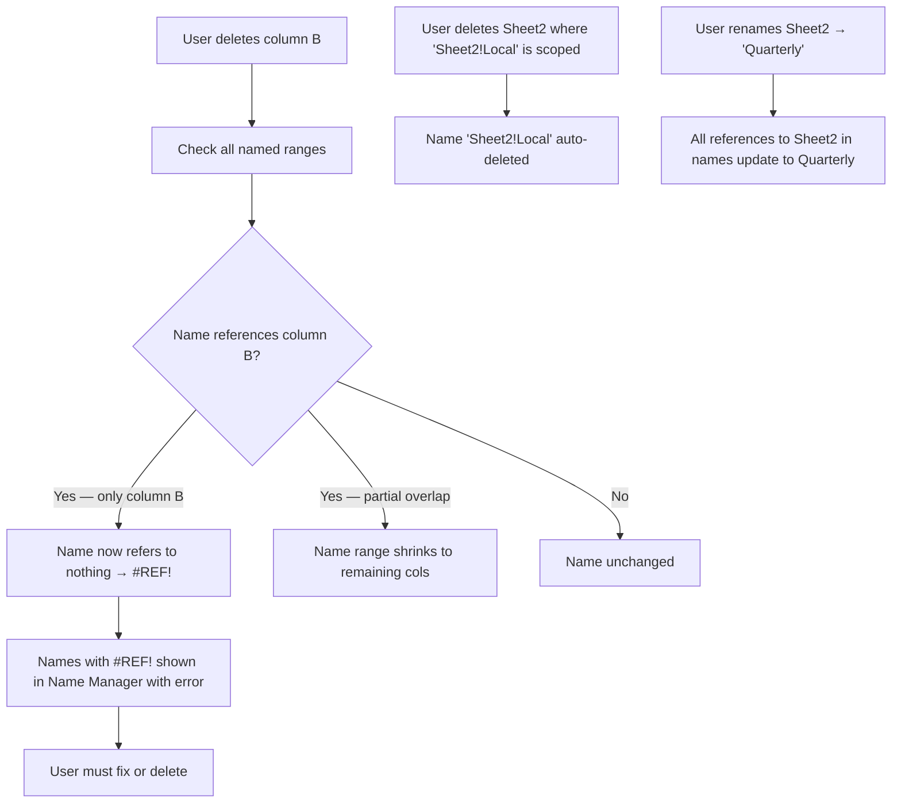

# UX Flow — Spec 31 Named Ranges

> Spec gốc: [../31-named-ranges.md](../31-named-ranges.md)

## Define a Name — three methods

```
Method 1: Name Box (fastest)
1. Select cells A2:A100
2. Click Name Box (left of Formula Bar)
3. Type "Salaries"
4. Press Enter
→ Name "Salaries" defined for A2:A100 (workbook scope)

Method 2: Formulas → Define Name
1. Formulas → Define Name
2. Dialog opens; pre-fills with current selection
3. Set name, scope (Workbook or specific sheet), comment, refers to
4. OK

Method 3: Create from Selection (Ctrl+Shift+F3)
1. Select range that includes labels (e.g., A1:B10 with headers A1, B1)
2. Formulas → Create from Selection
3. Choose where labels are (Top row, Left column, etc.)
4. Names auto-generated from labels
```

## Define Name dialog

```
Formulas → Define Name (or Ctrl+F3 → New):

┌─ New Name ─────────────────────────────────────────┐
│ Name:                                                │
│ [Salaries                                       ]    │
│                                                       │
│ Scope:                                                │
│ [Workbook                                     ▼]    │
│   ├ Workbook (visible from all sheets)               │
│   └ Sheet1 / Sheet2 / ... (scoped to a sheet)         │
│                                                       │
│ Comment:                                              │
│ [Monthly salary data from HR system            ]    │
│ [                                              ]    │
│                                                       │
│ Refers to:                                            │
│ [=Sheet1!$A$2:$A$100                          ] ↗  │
│                                                       │
│                                [ OK ]   [ Cancel ]  │
└──────────────────────────────────────────────────────────┘

Name rules:
- 1-255 chars
- Must start with letter, underscore, or backslash
- Cannot contain: spaces, special chars (use _ instead)
- Cannot look like a cell ref (e.g., not "A1" or "BC100")
- Case-insensitive
- Cannot be reserved word (Print_Area, Print_Titles, etc. — special meaning)
- Unique within scope
```

## Name Manager dialog

```
Formulas → Name Manager (Ctrl+F3):

┌─ Name Manager ──────────────────────────────────────────┐
│ [New...] [Edit...] [Delete]              Filter ▼       │
│ ────────────────────────────────────────────────────── │
│ Name           Value         Refers To       Scope      │
│ ┌──────────────────────────────────────────────────┐    │
│ │ Salaries     {300; 250; ...} =Sheet1!$A$2:$A$100  │    │
│ │ TaxRate      0.15            =0.15                │    │
│ │ MyTable      <Table>          =Sheet2!Sales        │    │
│ │ EmployeeCount #VALUE!         =COUNTA(Salaries)    │    │
│ │ Sheet1!Local "Local"          ="Local"             │    │
│ │ ...                                                  │    │
│ └──────────────────────────────────────────────────┘    │
│                                                            │
│ Refers to:                                                │
│ [=Sheet1!$A$2:$A$100                              ] ↗   │
│                                                            │
│                                          [ Close ]       │
└────────────────────────────────────────────────────────────┘

Filter dropdown:
- Names scoped to worksheet
- Names scoped to workbook
- Names with errors
- Names without errors
- Defined names
- Table names
```

## Edit Name from Name Manager

```mermaid
sequenceDiagram
    actor User
    participant Manager as Name Manager
    participant Engine
    
    User->>Manager: Select "Salaries", click Edit
    Manager->>User: Open Edit Name dialog (same as New, prefilled)
    
    User->>Manager: Change "Refers to" from $A$2:$A$100 to $A$2:$A$200
    User->>Manager: Click OK
    
    Manager->>Engine: Update reference
    Engine->>Engine: Recompute all formulas using "Salaries"
    Engine-->>Manager: Updated values
    
    Note over Manager: Name persists; all referencing formulas auto-update
```

## Use in formula

```mermaid
flowchart TD
    A[User types in cell: =SUM] --> B[Autocomplete shows functions]
    A --> C[Type =SUM open-paren]
    C --> D[ScreenTip shows args]
    
    D --> E[User type S a l]
    E --> F[Autocomplete dropdown:
    📊 Sales (Table)
    📐 Salaries (Range)
    📐 SalaryTotal (Constant)
    ]
    
    F --> G[Press Tab → inserts "Salaries"]
    G --> H[=SUM(Salaries]
    H --> I[Close paren + Enter]
    I --> J[Formula =SUM(Salaries) = 8500]
    
    K[F3 shortcut → opens Paste Name dialog] --> L["Paste Name dialog:
    Select from list of all defined names
    [Salaries]
    [TaxRate]
    [MyTable]
    
    [Paste List] [OK] [Cancel]"]
    
    L --> M["Paste List = inserts table of names + refs into cells (multi-row dump)"]
```

## Paste Name dialog (F3)

```
While in formula edit mode, press F3:

┌─ Paste Name ─────────────────────────────────────┐
│ Paste name:                                        │
│ ┌────────────────────────────────────────────┐   │
│ │ Salaries                                       │   │
│ │ TaxRate                                        │   │
│ │ MyTable                                        │   │
│ │ EmployeeCount                                  │   │
│ │ Sheet1!Local                                   │   │ ← sheet-scoped name
│ │                                                │   │
│ └────────────────────────────────────────────┘   │
│                                                    │
│ [Paste List]              [ OK ]   [ Cancel ]    │
└────────────────────────────────────────────────────┘

- OK / double-click → inserts selected name into formula
- Paste List → writes a 2-column table to current cell:
  Names | Refs
  Salaries | =Sheet1!$A$2:$A$100
  TaxRate  | =0.15
  ...
```

## Named constants & named formulas

```
Names can refer to constants or formulas, not just ranges:

Name "TaxRate" Refers to: =0.15
  → Use in formula: =A1*TaxRate

Name "TaxAmount" Refers to: =Salaries*TaxRate
  → Use: =SUM(TaxAmount)  [computed at use site]

Name "CurrentDate" Refers to: =TODAY()
  → Use: =CurrentDate+30

Name "ProperCase" Refers to: =LAMBDA(text, UPPER(LEFT(text,1)) & LOWER(MID(text,2,LEN(text)-1)))
  → Use: =ProperCase("hello") = "Hello"  (Modern LAMBDA, Spec 22)

Name "Sheet1!Header" Refers to: =Sheet1!$A$1:$Z$1  (sheet scope)
  → Available only when active sheet = Sheet1
```

## Create from Selection flow

```mermaid
sequenceDiagram
    actor User
    participant Sheet
    participant Dialog
    participant Engine
    
    User->>Sheet: Select A1:B5
    Note over Sheet: A1='Name', B1='Salary' (headers)
    Note over Sheet: A2:A5=names, B2:B5=salaries
    
    User->>Sheet: Formulas → Create from Selection (Ctrl+Shift+F3)
    
    Sheet->>Dialog: Open dialog
    Dialog->>User: Show 4 checkboxes:
    Note over Dialog: ☑ Top row
    Note over Dialog: ☐ Left column
    Note over Dialog: ☐ Bottom row
    Note over Dialog: ☐ Right column
    
    User->>Dialog: Check "Top row"
    User->>Dialog: Click OK
    
    Dialog->>Engine: Create names from top row labels
    Engine->>Engine: Name "Name" → refers to A2:A5
    Engine->>Engine: Name "Salary" → refers to B2:B5
    Engine-->>User: Names created
    
    Note over Engine: Auto-sanitize: spaces → underscores; "Net Income" → "Net_Income"
```

## Named range scope (workbook vs sheet)

```
Workbook scope (default):
- Name visible from all sheets
- Reference: just "Salaries"
- Conflict: only one Salaries can exist at workbook scope

Sheet scope:
- Name visible only from defining sheet
- Reference from same sheet: "Salaries" (just the name)
- Reference from other sheet: "Sheet1!Salaries"
- Multiple sheets can have own "Salaries" (each scoped)

Best practice:
- Use sheet scope for ranges that have local meaning per sheet
- Use workbook scope for constants, lookup tables, global lists
```

## Special reserved names

```
Excel uses some names internally — defining them has special meaning:

- Print_Area     → defines print area for sheet
  Page Layout → Print Area → Set Print Area = creates this name
  
- Print_Titles   → repeated rows/cols on each printed page
  Page Layout → Print Titles dialog defines
  
- _FilterDatabase → internally used by AutoFilter

- Criteria, Extract → Advanced Filter relics

These appear in Name Manager but typically managed via specific UI, not directly.
```

## Names in Sheet/Cell deletion



## Use Names in existing formulas (Apply Names)

```
Formulas → Define Name ▼ → Apply Names:

┌─ Apply Names ───────────────────────────────────┐
│ Apply names:                                      │
│ ┌────────────────────────────────────────────┐  │
│ │ ☑ Salaries                                  │  │
│ │ ☑ TaxRate                                   │  │
│ │ ☐ MyTable                                   │  │
│ │ ☑ EmployeeCount                              │  │
│ └────────────────────────────────────────────┘  │
│                                                    │
│ ☑ Ignore Relative/Absolute                        │
│ ☑ Use row and column names                        │
│                                                    │
│ [Options >>]              [ OK ]   [ Cancel ]    │
└────────────────────────────────────────────────────┘

Effect:
Before: =A2*0.15+SUM(A2:A100)
After:  =A2*TaxRate+SUM(Salaries)

Excel scans selected cells; replaces matching A1-style refs with named equivalents.
```

## Implementation hints cho Slave

- **Name data model**:
  ```python
  class DefinedName:
      name: str
      scope: Literal["workbook"] | str  # "workbook" or sheet name
      refers_to: str  # formula string, e.g., "=Sheet1!$A$2:$A$100" or "=0.15"
      comment: str
      hidden: bool = False  # some internal names are hidden
      
  workbook._names: dict[(scope, name), DefinedName]
  ```

- **Lookup resolution**:
  ```python
  def resolve_name(workbook, sheet_name, name):
      # 1. Try sheet-scoped first
      key = (sheet_name, name)
      if key in workbook._names: return workbook._names[key]
      # 2. Fall back to workbook scope
      key = ("workbook", name)
      if key in workbook._names: return workbook._names[key]
      return None  # → #NAME? error in formula
  ```

- **Name Box widget**: `QComboBox` editable; populated with all defined names + cell ref entry capability.

- **Name Manager dialog**: `QDialog` with `QTableWidget` showing name/value/refers/scope/comment columns; sortable, filterable.

- **Validation**:
  - Regex: `^[A-Za-z_\\][A-Za-z0-9_.\\]*$` (no spaces, no most special chars).
  - Reject cell-ref-looking names: `^[A-Z]+[0-9]+$`.
  - Reject reserved: `["Print_Area", "Print_Titles", ...]` (unless explicit special-name flow).
  - Length ≤ 255.

- **Formula tokenizer**: when parsing formulas, recognize name tokens — try to resolve via lookup; replace with cell range at eval time.

- **Autocomplete in formula**: combine function names + defined names in `QCompleter`; ranked by recency.

- **Paste Name dialog (F3)**: `QDialog` with `QListWidget`; double-click → emit "insert" signal → editor inserts text at cursor.

- **Create from Selection**:
  ```python
  def create_from_selection(rng, where):
      # where: {"top": bool, "left": bool, ...}
      if where["top"]:
          for col in rng.cols:
              label = sheet[rng.top, col].value
              if label and is_valid_name(label):
                  define_name(sanitize(label), refers_to=range_below(col))
  ```

- **Sheet rename propagation**: when sheet renamed, scan all `refers_to` strings; regex replace `OldName!` with `NewName!`; similarly for `name.scope`.

- **Reference shift on insert/delete**: same propagation logic as Spec 09 — names referring to shifted regions update.

- **Apply Names**: iterate selected cells; tokenize each formula; if token range matches a defined name's referenced range → replace with name.

- **xlsx persistence**: write `<definedName>` elements in workbook.xml (workbook-scoped) and per-sheet (sheet-scoped).
