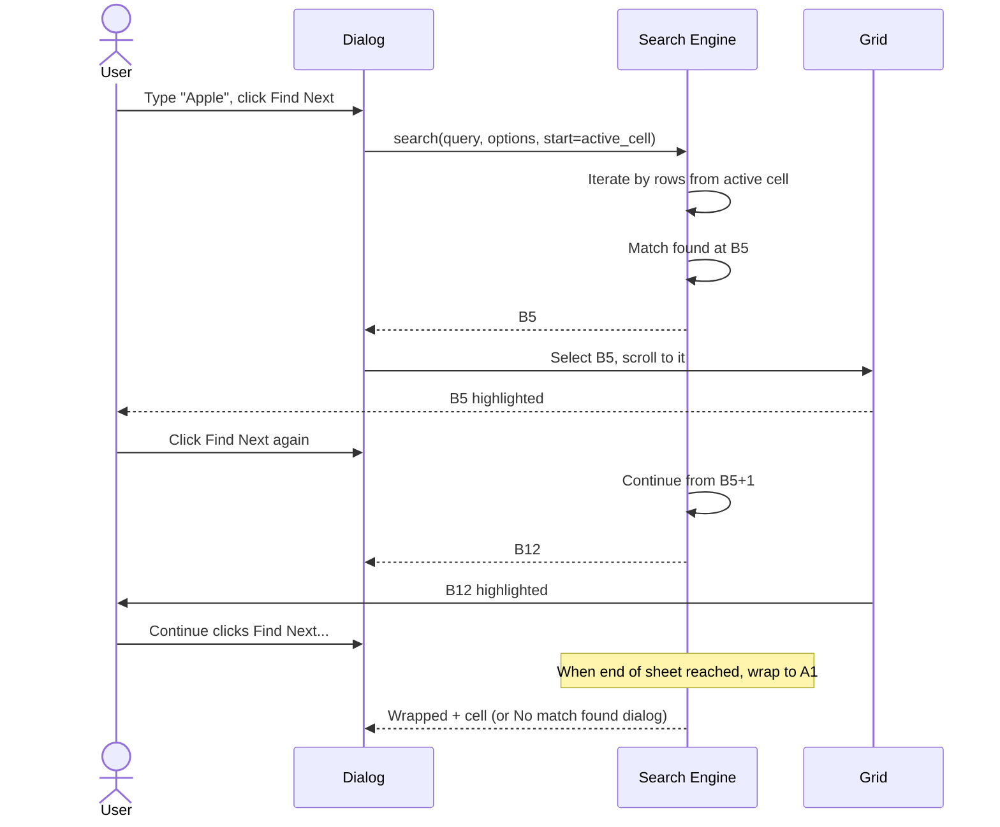
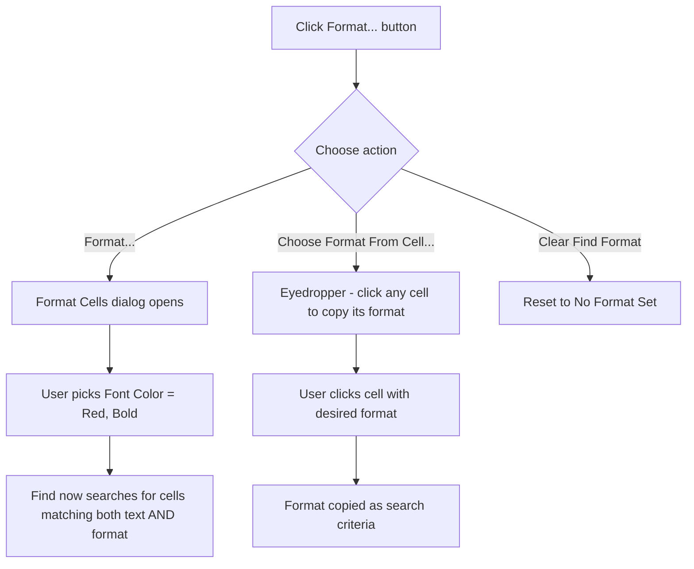
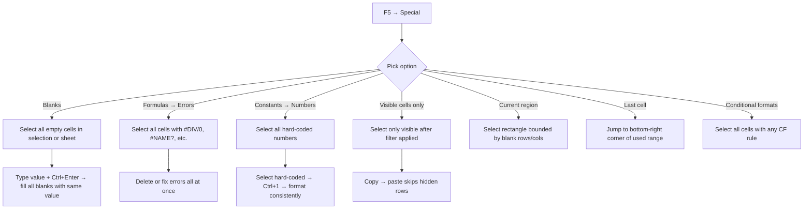

# UX Flow — Spec 32 Find, Replace & Go To

> Spec gốc: [../32-find-replace-goto.md](../32-find-replace-goto.md)

## Find dialog (Ctrl+F)

```
┌─ Find and Replace ─────────────────────────────────┐
│ [Find]  [Replace]                                    │
│ ────────────────────────────────────────────────── │
│                                                       │
│ Find what: [Apple                              ▼]    │
│                                                       │
│                                  Options >> ▶        │
│                                                       │
│ [Find All]  [Find Next]                  [Close]    │
└──────────────────────────────────────────────────────┘

With Options >> expanded:
┌─ Find and Replace ─────────────────────────────────┐
│ [Find]  [Replace]                                    │
│ ────────────────────────────────────────────────── │
│ Find what:      [Apple                       ▼]      │
│                                                       │
│                Format... | No Format Set            │
│                                                       │
│ Within:         [Sheet                     ▼]        │
│                  ├ Sheet (current)                   │
│                  └ Workbook (all sheets)              │
│ Search:         [By Rows                   ▼]        │
│                  ├ By Rows                            │
│                  └ By Columns                         │
│ Look in:        [Formulas                  ▼]        │
│                  ├ Formulas                           │
│                  ├ Values                             │
│                  ├ Notes (Spec 26)                    │
│                  └ Comments                           │
│                                                       │
│ ☐ Match case                                         │
│ ☐ Match entire cell contents                         │
│                                                       │
│                                Options << ◀         │
│                                                       │
│ [Find All]  [Find Next]                  [Close]    │
└──────────────────────────────────────────────────────┘
```

## Find All result panel

```
After clicking "Find All":

┌─ Find and Replace ─────────────────────────────────┐
│ Find what: [Apple                              ▼]    │
│ ────────────────────────────────────────────────── │
│ 12 cells found:                                      │
│ ┌──────────────────────────────────────────────┐    │
│ │ Book      Sheet   Name   Cell  Value   Form. │    │
│ ├──────────────────────────────────────────────┤    │
│ │ Sales.xlsx Sheet1         B5   Apple         │    │
│ │ Sales.xlsx Sheet1         B12  Apple Inc.    │    │
│ │ Sales.xlsx Sheet1         B47  Apple                │    │
│ │ Sales.xlsx Sheet2         A3   ApplePie      │    │
│ │ Sales.xlsx Sheet2         A8   Pineapple     │    │
│ │ ... (scrollable)                              │    │
│ └──────────────────────────────────────────────┘    │
│                                                       │
│ Click row → grid jumps to that cell                  │
│ Ctrl+A → select all matching cells in grid           │
└──────────────────────────────────────────────────────┘
```

## Find sequence (Find Next)



## Replace tab

```
┌─ Find and Replace ─────────────────────────────────┐
│ [Find]  [Replace]                                    │
│ ────────────────────────────────────────────────── │
│                                                       │
│ Find what:    [Apple                         ▼]      │
│                Format... | No Format Set            │
│                                                       │
│ Replace with: [Banana                        ▼]      │
│                Format... | No Format Set            │
│                                                       │
│ ── Options ──                                        │
│ Within: [Sheet  ▼]  Search: [By Rows  ▼]            │
│ Look in: [Formulas ▼]                                │
│ ☐ Match case   ☐ Match entire cell contents         │
│                                                       │
│ [Replace All] [Replace] [Find All] [Find Next] [Close] │
└──────────────────────────────────────────────────────┘

Replace All result:
┌──────────────────────────────────────┐
│ Microsoft Excel                        │
│                                        │
│ Excel has made 47 replacements.        │
│                                        │
│              [ OK ]                    │
└────────────────────────────────────────┘
```

## Wildcard support

```
Find what supports wildcards:
- ?  = any single character
- *  = any sequence of characters
- ~  = escape (e.g., ~? = literal ?)

Examples:
- "Apple*"     → Apple, Apple Inc., AppleTree
- "*Apple*"    → Apple, Pineapple, AppleTree
- "A?ple"      → Apple, Ample (but NOT Apple Inc.)
- "??ple"      → Apple, simple, etc.

Combined with Match entire cell contents:
- "Apple*" matches "Apple Inc." (cell value)
- Without Match entire cell: matches anywhere in cell text
```

## Find with format (advanced)



## Go To dialog (F5 / Ctrl+G)

```
┌─ Go To ────────────────────────────────────────┐
│ Go to:                                           │
│ ┌──────────────────────────────────────────┐   │
│ │ B5                                         │   │
│ │ Sheet2!A1                                  │   │
│ │ MyNamedRange                               │   │
│ │ Sales[Revenue]                             │   │
│ │ ────                                        │   │
│ │ (recently visited cells)                   │   │
│ │ Sheet1!$F$15                               │   │
│ │ Sheet3!$A$1                                │   │
│ └──────────────────────────────────────────┘   │
│                                                  │
│ Reference:                                       │
│ [B5                                       ]      │
│                                                  │
│ [Special...]   [ OK ]   [ Cancel ]              │
└──────────────────────────────────────────────────┘
```

## Go To Special dialog

```
F5 → Special... button:

┌─ Go To Special ────────────────────────────────────┐
│ Select:                                              │
│ ◯ Notes                       ◯ Row differences      │
│ ◯ Constants                   ◯ Column differences   │
│ ● Formulas                    ◯ Precedents           │
│   ☑ Numbers                   ◯ Dependents           │
│   ☑ Text                        ◯ Direct only         │
│   ☑ Logicals                    ◯ All levels          │
│   ☑ Errors                    ◯ Last cell             │
│ ◯ Blanks                      ◯ Visible cells only   │
│ ◯ Current region              ◯ Conditional formats  │
│ ◯ Current array               ◯ Data validation      │
│ ◯ Objects                       ◯ All                 │
│                                 ◯ Same               │
│                                                       │
│                              [ OK ]   [ Cancel ]    │
└──────────────────────────────────────────────────────┘
```

## Go To Special use cases



## Find & Replace keyboard navigation

```
Common shortcuts within dialog:
- Tab    → next field
- Enter  → Find Next (or default button)
- Esc    → Close dialog
- Alt+F  → Find tab
- Alt+R  → Replace tab
- Alt+A  → Replace All
- Alt+R  → Replace
- Alt+N  → Find Next
- Alt+I  → Find All

Dialog is non-modal (mostly):
- User can click cells in grid with dialog open
- Dialog stays on top
- Active cell updates as user clicks
```

## Inline find — Search bar (modern Excel 365)

```
Ctrl+F opens Find dialog (classic) OR
Search bar at top of window (modern, alongside Tell Me):

┌─ Search ──────────────────────────────────────┐
│ 🔍 [Type to search...                       ] │
└──────────────────────────────────────────────────┘

Filters by category:
- Cells matching: 12 results
- Functions: 3 results
- Help articles: 5 results
- Recent files: 2 results
```

## Implementation hints cho Slave

- **Dialog**: `QDialog` non-modal (`setModal(False)`); stay on top via `Qt.Tool | Qt.WindowStaysOnTopHint`.
- **Search engine**:
  ```python
  def find(sheet, query, opts):
      # opts: case, match_whole, look_in, wildcards, format
      cells = sheet.iter_cells(by_row=opts.by_rows, from_=opts.start)
      for cell in cells:
          target = cell.formula if opts.look_in == "formulas" else str(cell.value)
          if opts.wildcards:
              pattern = fnmatch.translate(query)
              match = re.search(pattern, target, flags=re.IGNORECASE if not opts.case else 0)
          else:
              match = query in target if not opts.case else query in target
          if match:
              if not opts.match_whole or target == query:
                  yield cell
  ```
- **Find All result**: `QTreeWidget` columns Book/Sheet/Cell/Value/Formula; row click → emit signal → grid.scrollTo(cell).
- **Replace All**: iterate find results in batch; wrap in single `_push_undo` snapshot for one-shot undo.
- **Wildcards**: `fnmatch.translate()` converts to regex; handle `~?` escape with custom pre-processing.
- **Format-based search**: compare cell format dict against criteria dict, intersect with text match.
- **Go To Special**: 
  - "Blanks" → filter cells where `value is None or value == ""`.
  - "Errors" → cells where value matches error code regex.
  - "Visible cells only" → exclude hidden rows/columns from selection.
  - "Last cell" → `sheet.used_range.bottom_right`.
- **Recent locations**: deque of last 10 cell references; F5 dialog populates from this.
- **Non-modal performance**: search incrementally as user types (debounced) and highlight first match live.
