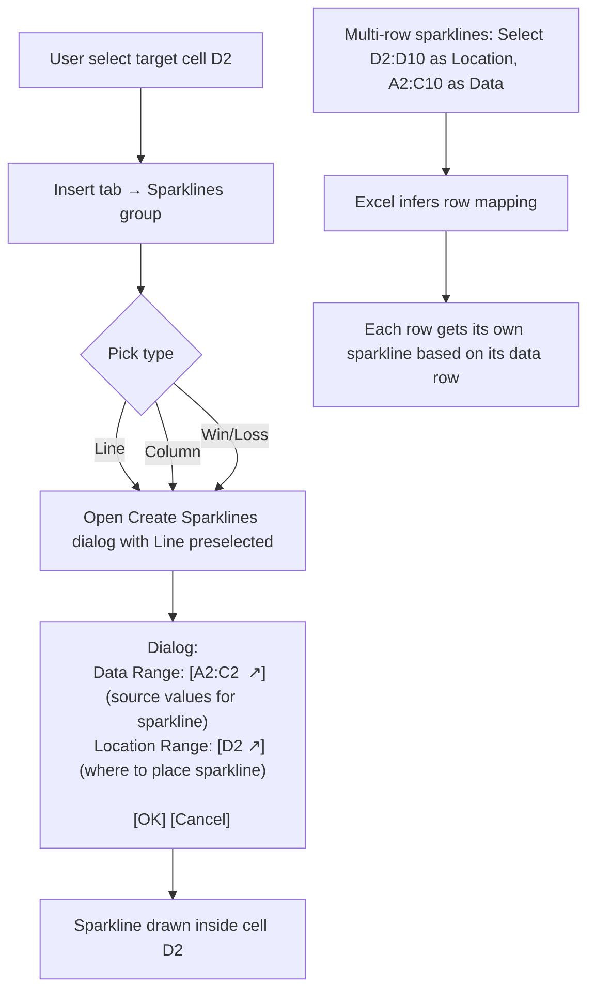
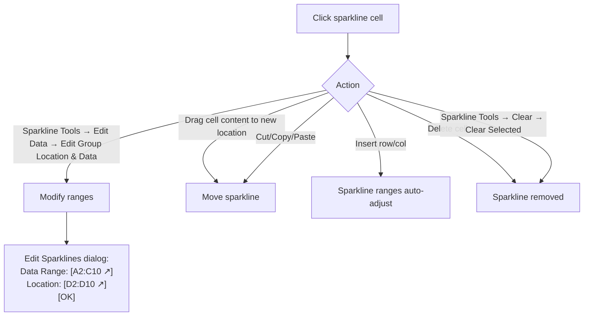

# UX Flow — Spec 33 Sparklines

> Spec gốc: [../33-sparklines.md](../33-sparklines.md)

## Sparkline types

```
3 types of sparklines (single-cell mini charts):

1. Line Sparkline:
   ┌──────────────┐
   │ ▁▂▃▅▆▇▅▃▂▁  │  ← line connecting points
   └──────────────┘

2. Column Sparkline:
   ┌──────────────┐
   │ ▁▂▃▅█▇▅▃▂▁  │  ← bar per data point
   └──────────────┘

3. Win/Loss Sparkline:
   ┌──────────────┐
   │ ▀ ▄ ▀ ▀ ▄ ▄ │  ← positive (up) vs negative (down), no magnitude
   └──────────────┘
```

## Insert Sparkline flow



## Multi-row sparkline example

```
Setup:
  A2:C2 = sales Q1, Q2, Q3 for product A
  A3:C3 = sales Q1, Q2, Q3 for product B
  ...
  A10:C10 = sales for product I

Insert → Sparklines → Line:
  Data Range: A2:C10
  Location: D2:D10

Result:
┌────────┬────┬────┬────┬─────────────┐
│ Product│ Q1 │ Q2 │ Q3 │ Trend         │
├────────┼────┼────┼────┼─────────────┤
│ A      │ 10 │ 20 │ 30 │ ▁▃▆           │
│ B      │ 30 │ 15 │ 25 │ █▃▄           │
│ C      │ 50 │ 40 │ 35 │ █▆▄           │
│ ...                    │ ...            │
└────────┴────┴────┴────┴─────────────┘

Each sparkline auto-scales to its own row's min/max
```

## Sparkline Tools contextual ribbon

```
Click sparkline cell → ribbon shows Sparkline tab:

┌─────────────────────────────────────────────────────────┐
│ [Edit Data ▼] [Line] [Column] [Win/Loss]                │
│ [Style ▼ Quick styles]                                   │
│ [Color ▼ Sparkline Color] [Marker Color ▼]              │
│ [☑ High Point] [☑ Low Point] [☐ Negative Points]        │
│ [☐ First Point] [☐ Last Point] [☐ Markers]              │
│ [Axis ▼]  [Group] [Ungroup] [Clear ▼]                   │
└────────────────────────────────────────────────────────────┘
```

## Highlight points (markers)

```
Line sparkline with markers enabled:

Default:
┌──────────────────────┐
│ ────●───●───●───●─── │  ← markers at each point
└──────────────────────┘

With High Point ✓ + Low Point ✓:
┌──────────────────────┐
│ ────●───🟢───●───🔴 │  ← high point green, low point red
└──────────────────────┘

With First Point ✓ + Last Point ✓:
┌──────────────────────┐
│ 🟦───●───●───●───🟦 │  ← first/last colored
└──────────────────────┘

Negative Points (column sparkline):
┌──────────────────────┐
│ █▆▄ ▌▌ █▆▄          │  ← negative bars highlighted differently
└──────────────────────┘
```

## Axis options

```
Sparkline Tools → Axis ▼:

┌────────────────────────────────────────┐
│ Horizontal Axis Options:                 │
│ ◯ General Axis Type                       │
│ ● Date Axis Type...                       │
│ ◯ Show Axis (visible baseline at y=0)    │
│ ◯ Plot Data Right-to-Left                │
│                                            │
│ Vertical Axis Options:                    │
│ ── Vertical Axis Minimum Value ──        │
│ ● Automatic for Each Sparkline            │
│ ◯ Same for All Sparklines (group min)    │
│ ◯ Custom Value: [____]                    │
│                                            │
│ ── Vertical Axis Maximum Value ──        │
│ ● Automatic for Each                      │
│ ◯ Same for All                            │
│ ◯ Custom Value: [____]                    │
└────────────────────────────────────────────┘

"Same for All" useful for comparing rows on equal scale.
"Automatic for Each" emphasizes within-row shape regardless of magnitude.
```

## Date Axis Type

```
For time-series data with irregular intervals:

Source dates: 2024-01-01, 2024-01-15, 2024-02-01, 2024-04-01

Default (General Axis): points evenly spaced (4 ticks)
┌──────────────────────┐
│ ●──●──●─────────── ● │  ← but gaps in time not represented
└──────────────────────┘

Date Axis Type: spacing proportional to time gaps
┌──────────────────────┐
│ ●●●────────────────● │  ← clusters of close dates show as close
└──────────────────────┘

Configure: Axis → Date Axis Type → reference range with dates:
[A2:A10 ↗]  (the date column)
```

## Group / Ungroup sparklines

```
Multiple sparklines can share settings (color, axis range, type).

Auto-grouped when:
- Created in single insert operation (D2:D10 → all grouped)

Manually group:
- Select range of sparklines (D2:D10)
- Sparkline Tools → Group
- Now changing color affects all

Ungroup:
- Select sparkline cell
- Sparkline Tools → Ungroup
- Now independent settings per cell
```

## Edit data / move sparkline



## Clear options

```
Sparkline Tools → Clear ▼:
┌──────────────────────────────────────┐
│ Clear Selected Sparklines              │ ← only this cell
│ Clear Selected Sparkline Groups        │ ← all in group
└────────────────────────────────────────┘
```

## Sparkline vs full chart decision

```
Use Sparkline when:
✓ Comparing trends across many rows (price history per product)
✓ Inline summary in dashboards
✓ Need to fit in tight space (table cell)
✓ Don't need axes/legends/details

Use full Chart (Spec 19) when:
✓ Single data series needs full visualization
✓ Audience needs to read specific values
✓ Multiple series to compare in detail
✓ Need axes labels, legend, title

Common pattern: dashboard combines:
- Tables with row sparklines (overview)
- 1-2 big charts (focus areas)
```

## Empty / hidden cell handling

```
Sparkline Tools → Edit Data → Hidden & Empty Cells:

┌─ Hidden and Empty Cell Settings ────────┐
│ Show empty cells as:                      │
│ ● Gaps                                     │
│ ◯ Zero                                     │
│ ◯ Connect data points with line           │
│                                              │
│ ☐ Show data in hidden rows and columns    │
│                                              │
│                    [ OK ]   [ Cancel ]    │
└──────────────────────────────────────────────┘

Examples:
- Data: [10, 20, _, 40, 50]
  Gaps option:    line breaks at gap, resumes after
  Zero option:    line dips to 0 at gap
  Connect option: line continues straight from 20 → 40
```

## Implementation hints cho Slave

- **Sparkline data model**:
  ```python
  class Sparkline:
      type: Literal["line", "column", "winloss"]
      data_range: CellRange
      location: CellRef
      group_id: UUID
      
      # Visual options
      color: RGB
      marker_color: RGB
      show_high: bool
      show_low: bool
      show_first: bool
      show_last: bool
      show_negative: bool
      show_markers: bool  # line type only
      
      # Axis
      date_axis_range: CellRange | None
      min_mode: Literal["auto", "group", "custom"]
      min_value: float | None
      max_mode: Literal["auto", "group", "custom"]
      max_value: float | None
      
      # Empty cells
      empty_as: Literal["gaps", "zero", "connect"]
      show_hidden: bool
      
  sheet._sparklines: dict[CellRef, Sparkline]
  ```

- **Render in CellDelegate.paint()**:
  ```python
  def paint(self, painter, option, index):
      super().paint(painter, option, index)
      cell = index.model().get_cell(index)
      if cell.sparkline:
          self._draw_sparkline(painter, option.rect, cell.sparkline)
  
  def _draw_sparkline(self, painter, rect, sp):
      values = read_values(sp.data_range)
      x_min, x_max = ...
      y_min, y_max = ...
      
      if sp.type == "line":
          points = [QPoint(scale_x(i), scale_y(v)) for i, v in enumerate(values)]
          painter.setPen(QPen(QColor(sp.color), 1.5))
          painter.drawPolyline(points)
          
          if sp.show_high:
              hi_idx = values.index(max(values))
              painter.fillRect(point_rect(points[hi_idx], 3), QColor(0,150,0))
          # ... similar for low/first/last/markers
      
      elif sp.type == "column":
          bar_width = rect.width() / len(values)
          for i, v in enumerate(values):
              h = scale_y(v) - rect.bottom()
              painter.fillRect(QRect(i * bar_width, rect.bottom() - h, bar_width, h), QColor(sp.color))
      
      elif sp.type == "winloss":
          # Each value: top half if +, bottom half if -, mid for zero
          for i, v in enumerate(values):
              color = win_color if v > 0 else loss_color if v < 0 else zero_color
              # draw fixed-height bar at top or bottom
  ```

- **Performance**: cache drawn QPixmap per sparkline; invalidate when data or settings change.

- **Group settings**: maintain `group_id`; on edit → propagate to all in group.

- **Insert/delete row**: auto-shift sparkline location + data ranges.

- **Persistence**: serialize as `<sparklineGroups>` per OOXML spec; reload on open.

- **Date axis**: compute proportional x-positions from datetime values; need date parsing.

- **Win/Loss baseline**: middle of cell rect (y = rect.center().y()); + half above, - half below.
