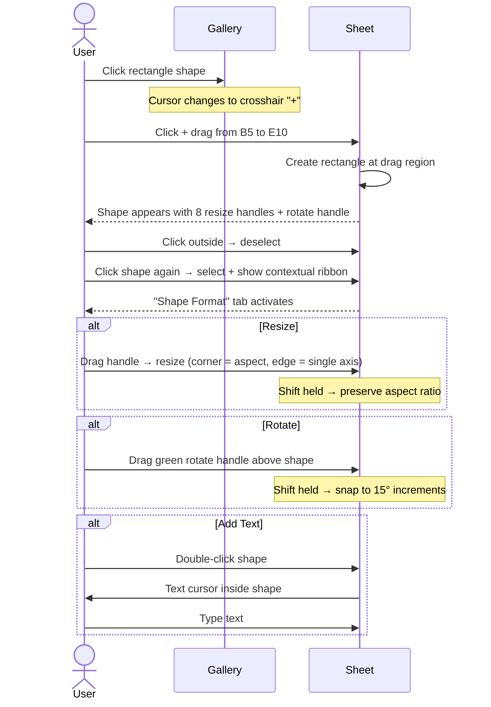
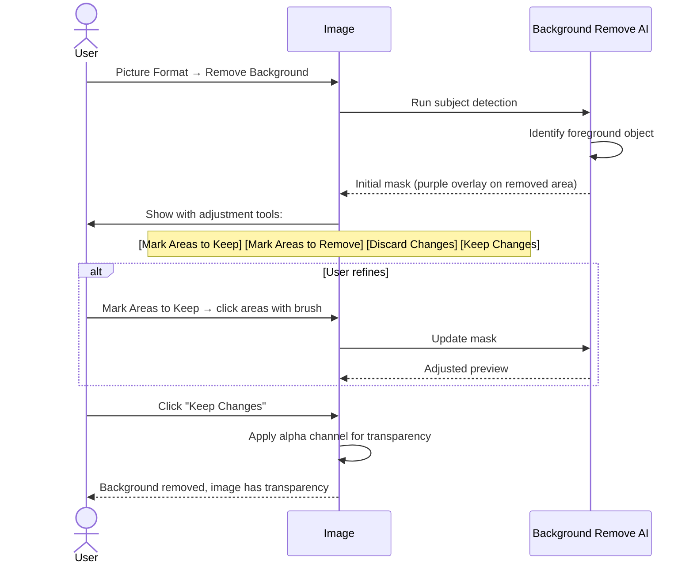
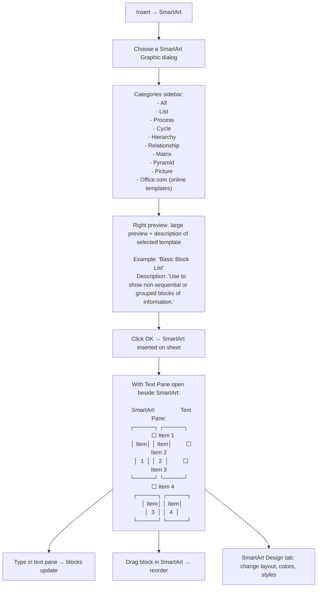

# UX Flow — Spec 34 Shapes, Images, Icons & SmartArt

> Spec gốc: [../34-shapes-images-smartart.md](../34-shapes-images-smartart.md)

## Insert menu (Illustrations group)

```
Insert tab → Illustrations group:

┌─────────────────────────────────────────────────────────────┐
│ [Pictures ▼] [Shapes ▼] [Icons] [3D Models ▼] [SmartArt]   │
│ [Screenshot ▼]                                                │
└──────────────────────────────────────────────────────────────┘

Pictures ▼ submenu:
┌──────────────────────────────────────┐
│ This Device...                         │ ← local file picker
│ Stock Images... (Microsoft library)    │
│ Online Pictures... (Bing search)       │
└────────────────────────────────────────┘
```

## Stock Images dialog

```
Insert → Pictures → Stock Images...:

┌─ Stock Images ───────────────────────────────────────────┐
│ [Images] [Icons] [Cutout People] [Stickers] [Illustrations]│
│ [Cartoon People] [Videos]                                  │
│ ────────────────────────────────────────────────────────  │
│ 🔍 [Search images...                                  ]   │
│ ────────────────────────────────────────────────────────  │
│ Categories: People | Nature | Business | Technology | ...  │
│                                                              │
│ ┌───┬───┬───┬───┬───┬───┐                                  │
│ │img│img│img│img│img│img│  ← thumbnail grid                │
│ ├───┼───┼───┼───┼───┼───┤                                  │
│ │img│img│img│img│img│img│                                  │
│ ├───┼───┼───┼───┼───┼───┤                                  │
│ │img│img│img│img│img│img│                                  │
│ └───┴───┴───┴───┴───┴───┘                                  │
│ (scroll for more)                                           │
│                                                              │
│ Selected: ☑ 3 items                                         │
│                                                              │
│                              [ Insert ]   [ Cancel ]       │
└──────────────────────────────────────────────────────────────┘

Royalty-free, included with M365 subscription
```

## Shapes gallery

```
Insert → Shapes ▼:

┌─ Shapes ─────────────────────────────────────────────────┐
│                                                              │
│ Recently Used Shapes                                         │
│ □ ○ △ ▽ → ⬛ ⬜                                            │
│                                                              │
│ Lines                                                        │
│ ─ ↘ ⤵ ⮌ ⤴ ↪ ⤳                                              │
│                                                              │
│ Rectangles                                                   │
│ ▢ ▣ ◇ ◈ ▢ ▭                                                │
│                                                              │
│ Basic Shapes                                                │
│ ○ △ ▽ ☐ ✦ ✚ ❤ ★ ☂ 🌙 ⚡                                 │
│ ❀ 🎯 ☁ 🔷 🌟                                              │
│                                                              │
│ Block Arrows                                                │
│ ➜ ➡ ⬅ ⬆ ⬇ ↗ ↘ ↙ ↖ ⤴ ⤵                                   │
│ ⤶ ⤷ ↔ ↕ ⇄ ⇅                                                │
│                                                              │
│ Equation Shapes                                              │
│ + - × ÷ = ≠                                                 │
│                                                              │
│ Flowchart                                                   │
│ ▱ ▭ ◇ ▢ ❖ ⬢ ○ ⊕ ⊗                                          │
│                                                              │
│ Stars and Banners                                            │
│ ★ ✯ ✩ ⚝ 🌟 🎖 🎗 🎀                                        │
│                                                              │
│ Callouts                                                     │
│ 💬 💭 🗨 🗯                                                 │
│                                                              │
│ Action Buttons                                              │
│ ▶ ⬛ 🏠 ❓                                                  │
└────────────────────────────────────────────────────────────────┘
```

## Insert shape flow



## Shape on grid visual

```
Selected shape with handles:

      ○ ← rotate handle (above shape)
      │
   ┌──┴──┐
   │     │
○──┤  ▢  ├──○   ← 4 edge handles (resize 1 axis)
   │     │
   └──┬──┘
      │
   ○──┴──○      ← corner handles (resize both axes)
   
○ = anchor point with 8-way drag

When selected:
- Bounding rectangle drawn with thin solid line
- 8 round handles for resize
- Green circle handle above for rotation
- Cursor changes per handle (NW-SE, N-S, etc.)
```

## Shape Format contextual ribbon

```
Click shape → ribbon shows Shape Format tab:

┌──────────────────────────────────────────────────────────────────┐
│ [Insert Shapes group] [Shape Styles group] [WordArt Styles group] │
│ [Arrange group] [Size group]                                       │
└──────────────────────────────────────────────────────────────────────┘

Shape Styles:
- Quick Styles gallery (preset combinations)
- Shape Fill ▼ (color, gradient, picture, texture, pattern, none)
- Shape Outline ▼ (color, weight, dashes, arrows, none)
- Shape Effects ▼ (shadow, reflection, glow, soft edges, bevel, 3D rotation)

Arrange:
- Bring Forward / Send Backward / Bring to Front / Send to Back
- Selection Pane (manage z-order)
- Align (left, center, right, top, middle, bottom, distribute)
- Group / Ungroup / Regroup
- Rotate (90° / 180° / Flip H/V / More Rotation Options...)

Size:
- Height: [____] inches
- Width:  [____] inches
- Lock aspect ratio ☑
- Original size button
```

## Picture Format contextual ribbon

```
Click image → ribbon shows Picture Format tab:

┌──────────────────────────────────────────────────────────────────┐
│ [Adjust group] [Picture Styles group] [Arrange group] [Size group]│
└──────────────────────────────────────────────────────────────────────┘

Adjust group:
- Remove Background (AI-driven, isolates subject)
- Corrections (brightness/contrast)
- Color (saturation, tone, recolor preset)
- Artistic Effects (filters: pencil, watercolor, blur, etc.)
- Compress Pictures (reduce file size)
- Change Picture (replace while preserving size/effects)
- Reset Picture (back to original)
- Picture Layout (convert to SmartArt)

Picture Styles:
- Quick styles (frames + effects presets)
- Picture Border ▼
- Picture Effects ▼
- Picture Layout ▼ (SmartArt conversion)

Arrange & Size: same as shapes
```

## Background Remove flow



## Icons gallery

```
Insert → Icons:

┌─ Insert Icons ────────────────────────────────────────────┐
│ [All Icons] [Recent]                                        │
│ 🔍 [Search icons...                                    ]   │
│ ────────────────────────────────────────────────────────  │
│ Categories: People | Tech | Business | Nature | Symbols | ...│
│                                                              │
│ ┌──┬──┬──┬──┬──┬──┬──┬──┐                                 │
│ │📁 │📊 │📈 │📉 │💼 │💰 │📞 │📧 │                          │
│ ├──┼──┼──┼──┼──┼──┼──┼──┤                                 │
│ │🎯 │📌 │🏢 │💡 │⚙ │🔧 │🛠 │🛡 │                          │
│ ├──┼──┼──┼──┼──┼──┼──┼──┤                                 │
│ │... (200+ free icons)                                      │
│ └──────────────────────────────────────────────────────────┘│
│                                                              │
│ Selected: ☑ 1 item                                          │
│                                                              │
│                              [ Insert ]   [ Cancel ]       │
└──────────────────────────────────────────────────────────────┘

Icons are vector (SVG) → scale without quality loss
Can be recolored (Picture Format → Graphics Fill)
Convert to shape (Graphic Format → Convert to Shape) → editable as freeform
```

## SmartArt flow



## SmartArt Design contextual ribbon

```
Click SmartArt → ribbon shows SmartArt Design + Format tabs:

┌──────────────────────────────────────────────────────────────────┐
│ [Create Graphic group] [Layouts group] [SmartArt Styles group]    │
│ [Reset group]                                                      │
└──────────────────────────────────────────────────────────────────────┘

Create Graphic:
- Add Shape ▼ (above, below, after, before, assistant)
- Add Bullet
- Text Pane (toggle visibility)
- Promote / Demote (change hierarchy level)
- Move Up / Move Down
- Right to Left

Layouts: gallery of all layouts in current category
SmartArt Styles: gallery of color schemes + effects
Reset: revert to default style
```

## Screenshot flow

```
Insert → Screenshot ▼:

┌──────────────────────────────────────┐
│ Available Windows:                    │ ← list of currently open windows
│ ┌────────────────────────────────┐  │
│ │ ┌─Window 1 thumb─┐              │  │
│ │ │ (Notepad)        │              │  │
│ │ └─────────────────┘              │  │
│ │ ┌─Window 2 thumb─┐              │  │
│ │ │ (Chrome)         │              │  │
│ │ └─────────────────┘              │  │
│ └────────────────────────────────┘  │
│                                        │
│ Screen Clipping...                    │ ← drag to select region of screen
└────────────────────────────────────────┘

After Screen Clipping selected:
- Excel minimizes
- Cursor becomes crosshair
- User drags rectangle → captured image
- Excel restores; image inserted as picture at active cell anchor
```

## Alt text dialog

```
Right-click image/shape → Edit Alt Text...:

┌─ Alt Text ──────────────────────────────────┐
│ Describe this object so people who are        │
│ blind or have low vision can understand it.   │
│                                                 │
│ How would you describe this object?           │
│ ┌────────────────────────────────────────┐  │
│ │ Bar chart showing quarterly sales         │  │
│ │ growth from Q1 to Q4, with Q3 peaking    │  │
│ │ at $45K.                                  │  │
│ └────────────────────────────────────────┘  │
│                                                 │
│ ☐ Mark as decorative (skip in screen readers) │
│                                                 │
│ [Generate description for me] (AI-powered)    │
│                                                 │
│                          [ OK ]   [ Cancel ] │
└────────────────────────────────────────────────┘
```

## Selection Pane

```
Multiple shapes/images stacked — need to manage z-order:

Home → Editing → Find & Select → Selection Pane:
(Or right-click any object → Bring Forward → Show Selection Pane)

┌─ Selection ─────────────────────────────────┐
│ [Show All]  [Hide All]    [↑] [↓]            │ ← reorder buttons
│ ─────────────────────────────────────────── │
│ 👁 ▢ Rectangle 5                              │ ← topmost
│ 👁 🖼 Picture 4 — "logo.png"                  │
│ 👁 ⌧ Chart 3                                  │
│ 👁 ⌧ TextBox 2 — "Title"                     │
│ 👁 ⌧ Group 1                                  │
│   👁 ▢ Shape A                                │ ← grouped objects nest
│   👁 ▢ Shape B                                │
│                                                 │
│ Click name → select object                    │
│ Click 👁 → toggle visibility                   │
│ Double-click name → rename                    │
└─────────────────────────────────────────────────┘
```

## Anchor & cell binding

```
Shape/picture has 3 anchor modes (right-click → Size and Properties → Properties tab):

1. Move and size with cells (default):
   - Anchored to top-left + bottom-right cells
   - Insert row above → shape shifts down
   - Resize column → shape resizes proportionally

2. Move but don't size with cells:
   - Top-left anchor only
   - Resize column → shape stays same size

3. Don't move or size with cells:
   - Fully floating
   - Insert row → shape stays in same pixel position
```

## Implementation hints cho Slave

- **Object model**:
  ```python
  class SheetObject:
      id: UUID
      type: Literal["shape", "picture", "icon", "smartart", "chart", "control"]
      anchor: Anchor  # cell ref(s)
      position: (x, y, w, h)
      rotation: float
      z_order: int
      properties: dict  # type-specific
      
  sheet._objects: dict[UUID, SheetObject]
  ```

- **Render in scene**: use `QGraphicsScene` + `QGraphicsView` overlaid on grid; each object = `QGraphicsItem` subclass.
  - `QGraphicsRectItem`, `QGraphicsEllipseItem`, `QGraphicsPixmapItem`, `QGraphicsPolygonItem`, `QGraphicsPathItem` for primitives.
  - Custom subclasses for complex shapes (block arrows, callouts).

- **Resize handles**: when item selected, draw 8 handles + rotation handle.
  - Implement via custom `paint()` + `hoverMoveEvent()` for cursor changes.
  - Mouse drag on handle → update item geometry.

- **Picture loading**:
  - PNG/JPG/GIF/BMP: `QPixmap.load(path)`.
  - SVG: `QSvgRenderer` → render to QPixmap for raster, or use `QGraphicsSvgItem`.
  - 3D models: out of scope v1.

- **Background Remove**: integrate `rembg` library (uses U-2-Net neural network) for AI subject detection.

- **SmartArt**: ship N preset layouts as JSON definitions:
  ```json
  {
    "id": "basic-block-list",
    "category": "list",
    "shapes": [
      {"type": "rect", "x_rel": 0.0, "y_rel": 0.0, "w_rel": 0.45, "h_rel": 0.45, "text_anchor": "item_1"},
      {"type": "rect", "x_rel": 0.55, "y_rel": 0.0, "w_rel": 0.45, "h_rel": 0.45, "text_anchor": "item_2"},
      ...
    ]
  }
  ```
  Render shapes positioned by relative coordinates; bind text from text pane.

- **Text Pane**: `QDockWidget` next to SmartArt; `QTreeWidget` with indented bullets representing hierarchy.

- **Selection Pane**: `QDockWidget` with `QTreeWidget` of all objects; reorder = drag-drop.

- **Anchor binding**: on insert row/col, iterate objects → recompute position based on anchor mode.

- **Picture compress**: convert to JPG with quality 85 + resize to 220 DPI; reduces file size.

- **xlsx persistence**: shapes/pictures stored in `xl/drawings/drawing1.xml` + `xl/media/`; openpyxl handles basics.
