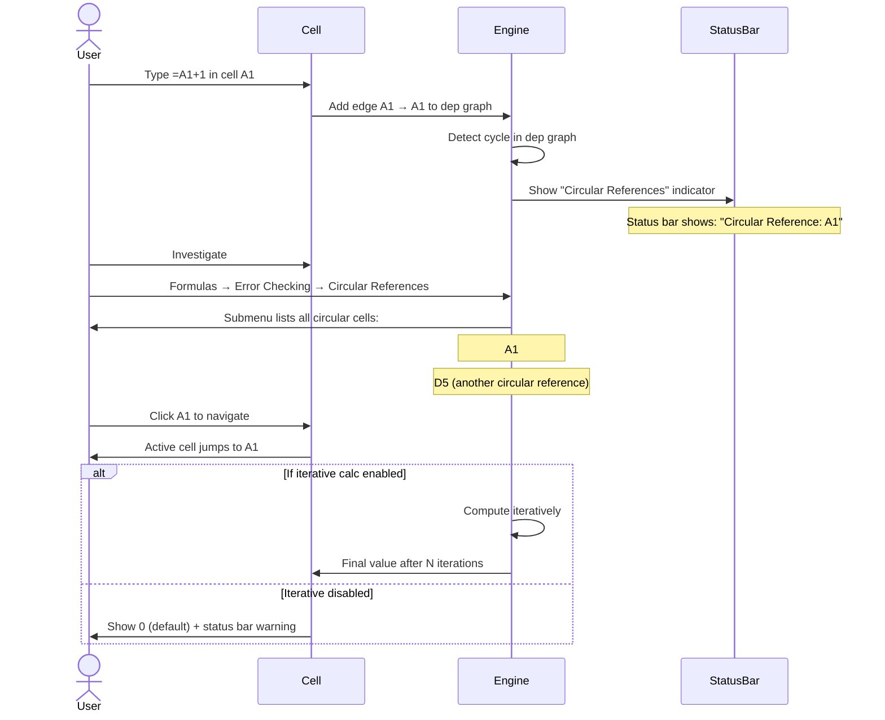
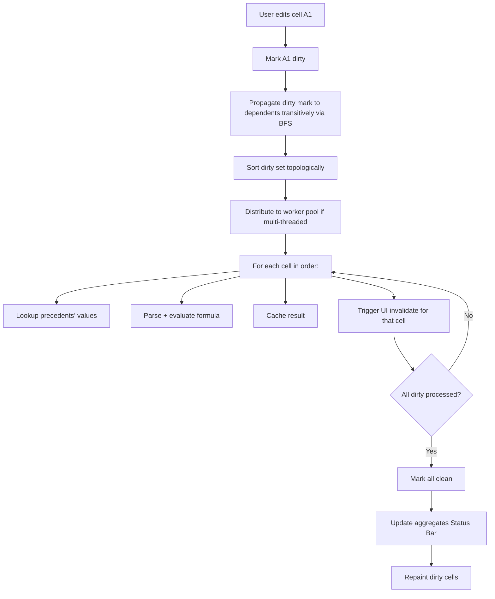
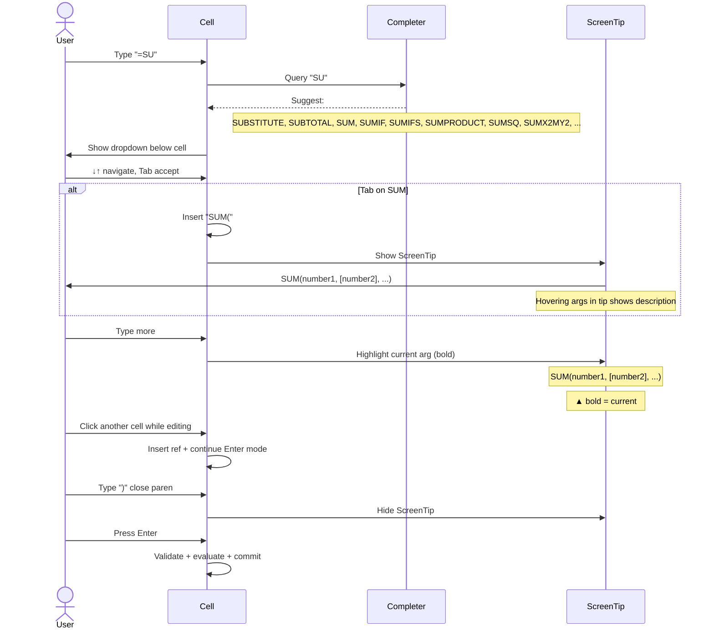

# UX Flow — Spec 35 Calculation Engine

> Spec gốc: [../35-calculation-engine.md](../35-calculation-engine.md)

## Calculation modes

```
Formulas tab → Calculation group → Calculation Options ▼:

┌──────────────────────────────────────────┐
│ ● Automatic                                │ ← default
│ ◯ Automatic Except for Data Tables         │
│ ◯ Manual                                   │
└────────────────────────────────────────────┘

Automatic:
- Every cell edit triggers immediate recalc of dirty graph
- Best for most workloads (small-medium workbooks)

Automatic Except Data Tables:
- Like Automatic, but Data Tables (Spec 28) defer
- Data Tables can be expensive (1000+ formulas per table)
- Press F9 to recalc data tables on demand

Manual:
- Edits do NOT trigger recalc
- "Calculate" indicator appears in status bar
- F9 = recalc entire workbook
- Shift+F9 = recalc active sheet only
- Ctrl+Alt+F9 = force recalc of all (ignore "clean" marks)
- Best for very large workbooks where edits would lag
```

## Dependency graph

```mermaid
flowchart TD
    A[Cell A1 = 10] --> B[Cell B1 = =A1*2]
    A --> C[Cell C1 = =A1+5]
    B --> D[Cell D1 = =B1*C1]
    C --> D
    D --> E[Cell E1 = =D1+100]
    
    F[Cell F1 = =SUM A1:A10] --> A
    F --> G[Cell G1 = =F1/COUNT A1:A10]
    
    Note over A: User changes A1 to 20
    Note over A,E: Engine marks A1 + transitive dependents dirty:
    Note over A,E: dirty = A1, B1, C1, D1, E1, F1, G1
    Note over A,E: Re-evaluate in topological order
```

## Topological sort

```
Dependency graph maintained as:
  precedents:  cell → cells it READS
  dependents:  cell → cells that READ it (reverse)

When cell A1 changes:
1. Mark A1 dirty + all transitive dependents dirty
2. Topo-sort dirty cells (precedents before dependents)
3. Evaluate in order

Sort algorithm (Kahn's):
  while dirty cells exist:
    pick any cell with no dirty precedents
    evaluate it; mark clean
    propagate "clean" status to dependents (recheck readiness)

If circular reference detected during sort:
  - Show #CIRC! warning OR
  - If "Enable Iterative Calculation" on: run iterative (Spec 35 advanced)
```

## Calculation triggers

```
What triggers recalc:

1. Cell edit (commit Enter/Tab):
   - Dirty: this cell + dependents
   
2. Insert/delete row/col:
   - Refs adjust; all formulas re-eval (full recalc)
   
3. Sheet rename:
   - Cross-sheet refs update; recalc
   
4. Recalc keyboard:
   - F9: dirty cells in workbook
   - Shift+F9: dirty cells in active sheet
   - Ctrl+Alt+F9: ALL cells (full force recalc — ignore clean marks)
   - Ctrl+Shift+Alt+F9: rebuild full dependency graph + recalc all
   
5. Volatile function present:
   - NOW(), TODAY(), RAND(), RANDBETWEEN(), OFFSET(), INDIRECT(), INFO(), CELL()
   - These re-evaluate on EVERY recalc (treated as always dirty)
   
6. Workbook open (if "Update links on open" set)
7. Manual mode → user presses F9
```

## Volatile vs Non-volatile

```
Volatile functions cause more recalcs:

Volatile (always dirty):
- NOW(), TODAY()           ← time-dependent
- RAND(), RANDBETWEEN()    ← random
- OFFSET(), INDIRECT()     ← reference resolution dynamic
- INFO(), CELL()           ← environmental
- AREAS()                  ← counts areas (used with INDIRECT)

Side effect: any cell that READS a volatile cell becomes volatile by transitivity.
Result: 1 volatile cell can poison entire workbook → recalc all on every change.

Best practice:
- Use volatile sparingly
- Replace OFFSET with INDEX (non-volatile)
- Cache TODAY() in a cell, refer to that cell elsewhere
```

## Calc indicator visual

```
Status bar shows current calc state:

Idle (clean workbook):
┌─────────────────────────────────────────────────────────┐
│ Ready                                Avg: ... Count: ...│
└──────────────────────────────────────────────────────────┘

Calculating (in progress):
┌─────────────────────────────────────────────────────────┐
│ Calculating: 23%                                          │
│ ▓▓▓░░░░░░░░░░░                                            │
└──────────────────────────────────────────────────────────┘

Manual mode pending:
┌─────────────────────────────────────────────────────────┐
│ Calculate                            Avg: ... Count: ...│
└──────────────────────────────────────────────────────────┘
  ▲ "Calculate" appears in italic when dirty cells exist in manual mode

Done:
┌─────────────────────────────────────────────────────────┐
│ Ready                                Avg: ... Count: ...│
└──────────────────────────────────────────────────────────┘
```

## Iterative calculation (circular refs)

```
File → Options → Formulas → "Enable iterative calculation":

┌─ Excel Options — Formulas ────────────────────────────┐
│ Calculation options                                      │
│ Workbook Calculation: ● Automatic / ◯ Manual / ...     │
│                                                            │
│ ☑ Enable iterative calculation                            │
│   Maximum Iterations: [100              ]                │
│   Maximum Change:     [0.001            ]                │
│                                                            │
│ Working with formulas                                    │
│ ☑ R1C1 reference style                                    │
│ ☑ Formula AutoComplete                                    │
│ ☑ Use table names in formulas                            │
│ ☑ Use GetPivotData functions for PivotTable references   │
└────────────────────────────────────────────────────────────┘

Circular reference example:
  A1 = =B1 + 1
  B1 = =A1 + 1
  
Without iteration: #CIRC! error in status bar, flagged cells
With iteration: 
  - Initial: A1=0, B1=0
  - Iter 1: A1=1, B1=1
  - Iter 2: A1=2, B1=2
  - ... reaches Maximum Iterations or Maximum Change tolerance
```

## Circular reference detection



## Multi-threaded calculation

```
File → Options → Advanced → Formulas section:

┌─ Excel Options — Advanced ────────────────────────────┐
│ Formulas:                                                │
│ ☑ Enable multi-threaded calculation                     │
│                                                            │
│ Number of calculation threads:                           │
│ ● Use all processors on this computer (4 detected)       │
│ ◯ Manual: [____] threads                                 │
└────────────────────────────────────────────────────────────┘

Multi-threaded calc:
- Engine identifies independent dirty cells (no shared dep path)
- Distributes them to worker threads
- Joins results
- 2-4× speedup on multi-core for large workbooks

Some functions NOT thread-safe (UDFs, OFFSET, INDIRECT) → fall back to single-thread
```

## Recalc performance hot path



## Formula AutoComplete in detail



## Error propagation

```
If a referenced cell has an error, the error propagates:

  A1 = "abc"
  B1 = =A1*2          → #VALUE! (string × number)
  C1 = =B1+10         → #VALUE! (error propagates)
  D1 = =SUM(B1:B10)   → #VALUE! (any error in range = result error)

Use IFERROR() to catch:
  =IFERROR(B1*2, "Error")  → "Error" if B1 errors
  =IFNA(VLOOKUP(...), "Not Found")  → only catches #N/A
```

## Error codes

```
Standard Excel error codes:

#NULL!       → range intersection is empty (e.g., =A1 A2 without colon/comma)
#DIV/0!      → division by zero or empty cell
#VALUE!      → wrong type (e.g., text where number expected)
#REF!        → invalid reference (deleted cell, broken link)
#NAME?       → unrecognized name (typo, missing add-in, missing scope)
#NUM!        → invalid numeric value (e.g., =SQRT(-1) without imaginary support)
#N/A         → value not available (e.g., VLOOKUP no match)
#GETTING_DATA → temporary while async function computes
#SPILL!      → dynamic array can't spill (Spec 22)
#CALC!       → calc engine error (recursion, unsupported lambda return)
#FIELD!      → linked data type field missing
#CONNECT!    → external data source unavailable
#BLOCKED!    → cell blocked by privacy/security (e.g., =PY in untrusted workbook)
#BUSY!       → async function in flight (=PY, =COPILOT)
#UNKNOWN!    → catch-all for new error types not recognized
```

## Implementation hints cho Slave

- **Dependency graph data structure**:
  ```python
  class DependencyGraph:
      precedents: dict[CellRef, set[CellRef]]
      dependents: dict[CellRef, set[CellRef]]
      
      def add_edge(self, from_, to):
          self.precedents.setdefault(to, set()).add(from_)
          self.dependents.setdefault(from_, set()).add(to)
      
      def remove_cell(self, cell):
          for prec in self.precedents.pop(cell, ()):
              self.dependents[prec].discard(cell)
          for dep in self.dependents.pop(cell, ()):
              self.precedents[dep].discard(cell)
  ```

- **Recalc engine**:
  ```python
  def recalc(workbook, dirty_set):
      sort_order = topological_sort(workbook.dep_graph, dirty_set)
      for cell in sort_order:
          try:
              cell.value = evaluate(cell.formula, workbook)
              cell.dirty = False
          except CircularReferenceError:
              if workbook.iterative_calc:
                  iterative_solve(cell, workbook)
              else:
                  cell.value = ErrorValue("#CIRC!")
          except EvalError as e:
              cell.value = ErrorValue(e.code)
  ```

- **Volatile tracking**: each cell has `is_volatile_user` (explicit, e.g., NOW()) + `is_volatile_transitive` (reads volatile). Recompute on any recalc.

- **Multi-threaded**: 
  - Identify independent subgraphs in dirty set.
  - Submit to `ThreadPoolExecutor`.
  - Beware of GIL — for pure Python, true parallelism limited; consider Cython/Rust for numeric.
  - For numeric-heavy formulas, NumPy releases GIL → real speedup.

- **Iterative calc**:
  ```python
  def iterative_solve(cycle_cells, max_iter=100, max_change=0.001):
      for _ in range(max_iter):
          old_values = {c: c.value for c in cycle_cells}
          for c in cycle_cells:
              c.value = evaluate(c.formula)
          max_delta = max(abs(c.value - old_values[c]) for c in cycle_cells)
          if max_delta < max_change:
              break
  ```

- **AutoComplete**: register all functions in `_FUNCTIONS` dict with metadata; use `QCompleter` triggered on `=` typing in formula editor.

- **ScreenTip**: floating `QFrame` showing current function signature; bold the active argument based on cursor position within parentheses.

- **F9 / Shift+F9 / Ctrl+Alt+F9 / Ctrl+Shift+Alt+F9**:
  - F9: recalc dirty
  - Shift+F9: recalc dirty in active sheet
  - Ctrl+Alt+F9: mark all cells dirty + recalc
  - Ctrl+Shift+Alt+F9: rebuild dep graph from scratch + recalc

- **Error type system**:
  ```python
  class ErrorValue:
      def __init__(self, code: str): self.code = code
      def __repr__(self): return self.code
      def __bool__(self): return False
  ```

- **Status bar calc progress**: for long recalcs (>500ms), emit progress signal every N cells; update QStatusBar progress widget.
