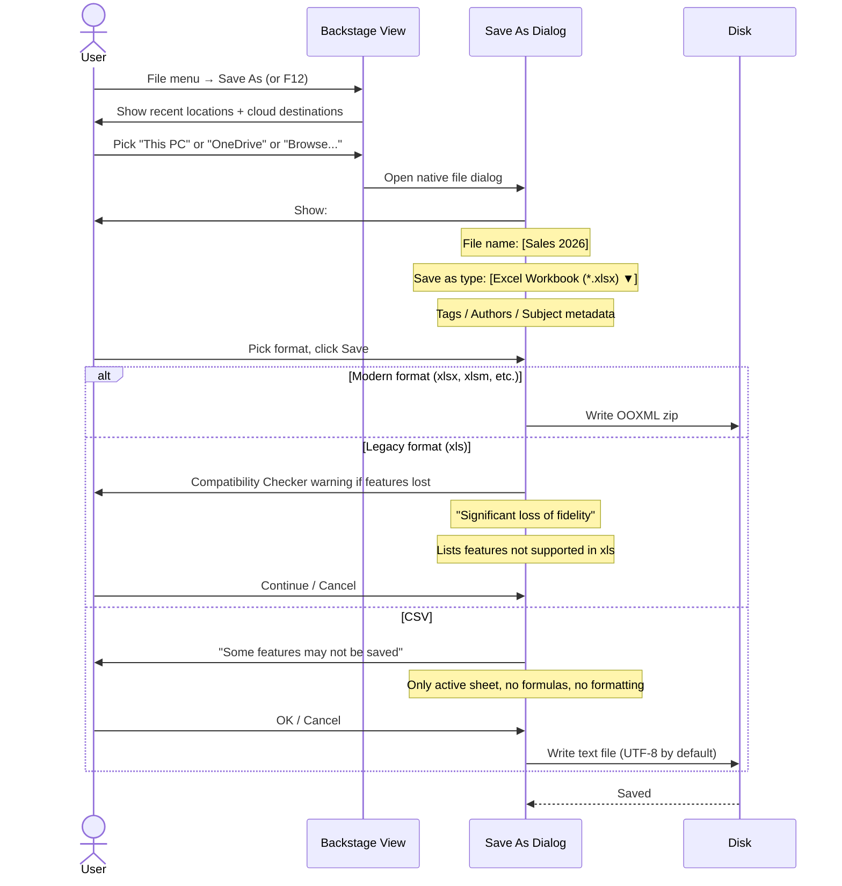
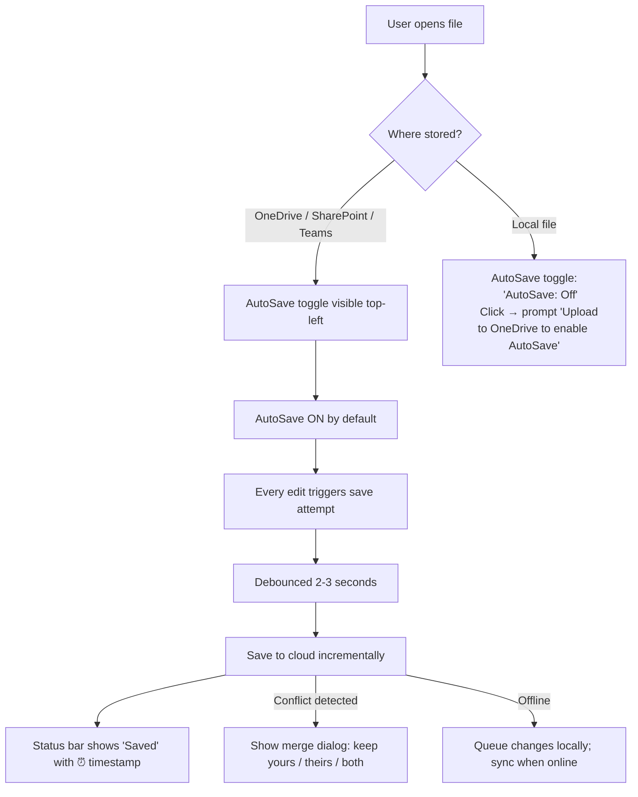
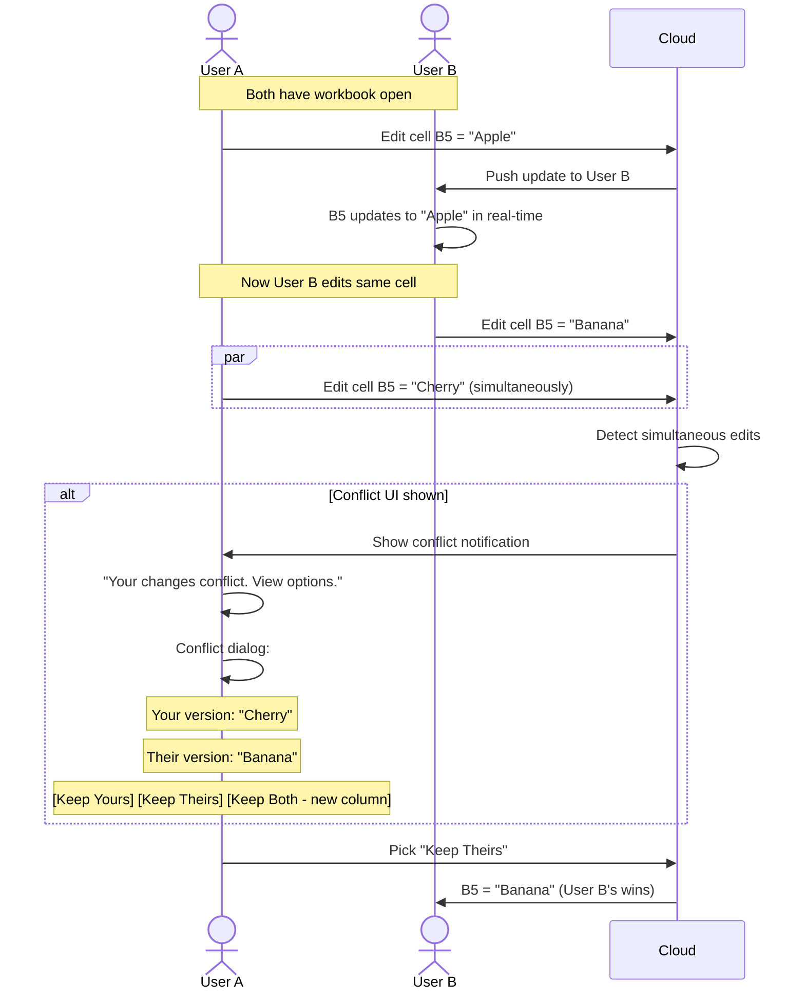

# UX Flow — Spec 36 File Formats & AutoSave

> Spec gốc: [../36-file-formats-autosave.md](../36-file-formats-autosave.md)

## File format matrix

```
Save As dropdown — supported formats:

┌────────────────────────────────────────────────────────────────────┐
│ Modern OOXML formats (default):                                      │
│ - .xlsx     Excel Workbook (default, no macros)                       │
│ - .xlsm     Excel Macro-Enabled Workbook (has VBA/scripts)            │
│ - .xltx     Excel Template (reusable layout, no data)                 │
│ - .xltm     Excel Macro-Enabled Template                              │
│ - .xlsb     Excel Binary Workbook (faster open, smaller, but no XML)  │
│                                                                        │
│ Legacy formats:                                                       │
│ - .xls      Excel 97-2003 (binary, 65k row limit, no modern features) │
│ - .xlt      Excel 97-2003 Template                                    │
│ - .xla      Excel 97-2003 Add-in                                      │
│                                                                        │
│ Open formats:                                                         │
│ - .ods      OpenDocument Spreadsheet                                   │
│ - .csv      Comma-Separated Values (text, single sheet)                │
│ - .tsv      Tab-Separated Values                                       │
│ - .txt      Tab-Separated Text                                         │
│                                                                        │
│ Export formats:                                                       │
│ - .pdf      Portable Document Format (read-only print)                │
│ - .xps      XML Paper Specification                                    │
│ - .htm/.html  Web Page (interactive)                                   │
│ - .mht/.mhtml Single File Web Page                                    │
│ - .prn      Formatted Text (space-delimited)                          │
│ - .dif      Data Interchange Format (legacy)                           │
│ - .slk      Symbolic Link (legacy)                                     │
│                                                                        │
│ Strict formats:                                                       │
│ - .xlsx (Strict)  ISO/IEC 29500:2008 strict (no legacy quirks)        │
└──────────────────────────────────────────────────────────────────────┘
```

## Save As dialog flow



## Compatibility Checker

```
Saving xlsx with legacy features → on save to .xls:

┌─ Compatibility Checker ────────────────────────────────┐
│ The following features in this workbook are not          │
│ supported by earlier versions of Excel. These features   │
│ may be lost or degraded when you save this workbook      │
│ in an earlier file format.                                │
│ ──────────────────────────────────────────────────────  │
│                                                            │
│ Significant loss of functionality                        │
│ • Number of cells in this workbook exceeds limit          │
│   (this version max 65,536 × 256)                        │
│   3 cells in worksheet "Sheet1"                          │
│   ──── Help ────                                          │
│                                                            │
│ Minor loss of fidelity                                    │
│ • Conditional formatting will not work as expected        │
│   12 rules in worksheet "Sheet1"                          │
│   ──── Help ────                                          │
│                                                            │
│ • Charts will lose visual richness                        │
│   2 charts                                                │
│   ──── Help ────                                          │
│                                                            │
│ ☐ Check compatibility when saving this workbook.         │
│                                                            │
│ Select versions to show: [Excel 97-2003 ▼]               │
│                                                            │
│ [Copy to New Sheet]  [Continue]   [ Cancel ]              │
└────────────────────────────────────────────────────────────┘

Click Continue → save proceeds, features dropped/converted.
"Copy to New Sheet" → list of issues inserted into new sheet for review.
```

## AutoSave (cloud-required feature)



## AutoSave indicator visual

```
Title bar AutoSave toggle:

State 1: ON (cloud file, network ok):
┌─ Title Bar ─────────────────────────────────────────────────┐
│ ●AutoSave ⬤  Sales.xlsx — Excel    🔍   👤   [_][□][×]    │
└──────────────────────────────────────────────────────────────┘
              ▲ green dot indicates active

State 2: OFF (local file or user disabled):
┌─ Title Bar ─────────────────────────────────────────────────┐
│ ○AutoSave Off  Sales.xlsx — Excel  🔍   👤   [_][□][×]     │
└──────────────────────────────────────────────────────────────┘
              ▲ outline circle

State 3: Saving in progress:
┌─ Title Bar ─────────────────────────────────────────────────┐
│ ↻AutoSave ⬤  Sales.xlsx — Excel    🔍   👤   [_][□][×]    │
└──────────────────────────────────────────────────────────────┘
              ▲ rotating arrow

State 4: Offline (queued):
┌─ Title Bar ─────────────────────────────────────────────────┐
│ ⚠AutoSave Offline  Sales.xlsx       🔍   👤   [_][□][×]    │
└──────────────────────────────────────────────────────────────┘
              ▲ warning, changes queued
```

## Save indicators per state

```
Status bar (right side):

AutoSave on + clean:
"Saved 2 min ago"

AutoSave on + dirty (pending):
"Saving..."  →  "Saved just now"

AutoSave off + clean:
(empty)

AutoSave off + dirty:
"Modified — Press Ctrl+S to save"

Manual save (Ctrl+S) feedback:
- Brief "Saving..." toast
- Brief "Saved" confirmation
- Or "Save failed" toast with retry button
```

## Conflict resolution



## Recover unsaved changes

```
After crash / close without save:

File → Info → Manage Workbook → Recover Unsaved Workbooks:

┌─ Open File Dialog (UnsavedFiles folder) ──────────────┐
│ Locations: AppData\Roaming\Microsoft\Excel\Recovery   │
│                                                          │
│ ┌──────────────────────────────────────────────────┐ │
│ │ Sales_Recovered_2026-06-03_08-45.xlsb              │ │
│ │ Last modified: 2 hours ago                          │ │
│ │ Size: 245 KB                                        │ │
│ └──────────────────────────────────────────────────┘ │
│                                                          │
│                              [ Open ]   [ Cancel ]    │
└──────────────────────────────────────────────────────────┘

AutoRecover settings (File → Options → Save):
- ☑ Save AutoRecover information every: [10] minutes
- ☑ Keep the last AutoRecovered version if I close without saving
- AutoRecover file location: C:\Users\...\AppData\Roaming\Microsoft\Excel
```

## Document Recovery pane

```
On startup after crash:

┌─ Document Recovery (sidebar) ──────────────┐
│ Excel has recovered the following files.    │
│ Save the ones you want to keep.              │
│                                                │
│ ▼ Sales.xlsx [Original]                       │
│   Last saved: yesterday 18:32                 │
│   Available actions:                           │
│   - [Open] - [Save As...] - [Delete]          │
│                                                │
│ ▼ Sales.xlsx [Recovered]                      │
│   ⚠ AutoRecovered version with last edits    │
│   Recovered at: today 09:15                   │
│   Available actions:                           │
│   - [Open] - [Save As...] - [Delete]          │
│                                                │
│              [Close]                           │
└────────────────────────────────────────────────┘
```

## Encryption / password protect

```
File → Info → Protect Workbook → Encrypt with Password:

┌─ Encrypt Document ───────────────────┐
│ Encrypt the contents of this file     │
│                                         │
│ Password:                              │
│ ┌────────────────────────────────┐  │
│ │ ●●●●●●●●●●                       │  │
│ └────────────────────────────────┘  │
│                                         │
│ Caution: If you lose the password,     │
│ it cannot be recovered.                │
│ Keep a list of passwords and corresp.  │
│ documents in a safe place. (Remember   │
│ that passwords are case-sensitive.)    │
│                                         │
│               [ OK ]   [ Cancel ]     │
└─────────────────────────────────────────┘

After OK → Confirm Password dialog (re-enter)

Encryption: AES-256 (modern, since Excel 2007)
Algorithm stored in workbook.xml metadata

Open password-protected file:
┌─ Password ─────────────────────────────┐
│ 🔒 'Sales.xlsx' is protected             │
│                                            │
│ Password:                                  │
│ ┌────────────────────────────────────┐ │
│ │                                       │ │
│ └────────────────────────────────────┘ │
│                                            │
│                  [ OK ]   [ Cancel ]    │
└────────────────────────────────────────────┘
```

## Inspect Document & sensitive data check

```
File → Info → Check for Issues → Inspect Document:

┌─ Document Inspector ───────────────────────────────────┐
│ Inspects this workbook for these contents:               │
│                                                            │
│ ☑ Comments                                                │
│ ☑ Notes                                                   │
│ ☑ Document Properties and Personal Information            │
│ ☑ Custom XML Data                                         │
│ ☑ Headers and Footers                                     │
│ ☑ Hidden Rows and Columns                                 │
│ ☑ Hidden Worksheets                                       │
│ ☑ PivotTables, PivotCharts, Cube Formulas, Slicers and    │
│   Timelines                                               │
│ ☑ Embedded Documents                                      │
│ ☑ Macros, Forms and ActiveX Controls                      │
│ ☑ Links to Other Files                                    │
│ ☑ External Connections                                    │
│ ☑ Real-Time Data                                          │
│ ☑ Defined Scenarios                                       │
│ ☑ Cell Active Content                                     │
│ ☑ Database Queries                                        │
│ ☑ Workbook Analysis Report                                │
│ ☑ Custom Cell Style Colors                                │
│                                                            │
│                       [Inspect]    [ Close ]              │
└────────────────────────────────────────────────────────────┘

Result shows ⚠ items found + "Remove All" buttons per category.
Good for cleaning before sharing externally.
```

## Implementation hints cho Slave

- **xlsx read/write**: use `openpyxl` (mature Python lib) for xlsx/xlsm/xltx/xltm.
- **xls (legacy)**: use `xlrd` for reading; writing xls deprecated, can convert via LibreOffice headless.
- **xlsb**: openpyxl doesn't support; use `pyxlsb` for read only; write would need custom binary format.
- **CSV/TSV**: use `csv` module + encoding detection (`chardet` for non-UTF8 files).
- **ODS**: use `pyexcel-ods3` or `odfpy`.
- **PDF export**: use `reportlab` or render via `QPrinter.setOutputFormat(PdfFormat)`.
- **AutoSave**:
  - Background `QTimer` triggers save every 10s if dirty.
  - For cloud files: integrate Microsoft Graph API or use OneDrive sync folder.
  - For local: save to temp file + atomic rename.
- **AutoRecover**:
  - Periodic snapshot to `%APPDATA%\Excel\Recovery\` folder.
  - On startup → scan folder for non-empty recovered files.
  - Show Document Recovery pane if found.
- **Encryption**: 
  - Use `cryptography` Python library for AES-256.
  - Store algorithm + salt + IV in workbook.xml metadata.
  - Decrypt on open with user password.
- **Compatibility Checker**:
  - Run pre-save analysis if target = legacy format.
  - Iterate features used; check against compatibility matrix; show warnings.
- **Document Inspector**:
  - Iterate workbook + sheets + objects → collect inspection items per category.
  - Provide "Remove" action that clears identified data.
- **Conflict resolution** (cloud editing):
  - Track last-known-server-version per cell.
  - On save, compare local diff vs server diff.
  - If both changed same cell → show conflict UI.
- **Title bar widget**: custom toolbar at top with AutoSave toggle (3-state: on/off/saving) + filename + sign-in.
