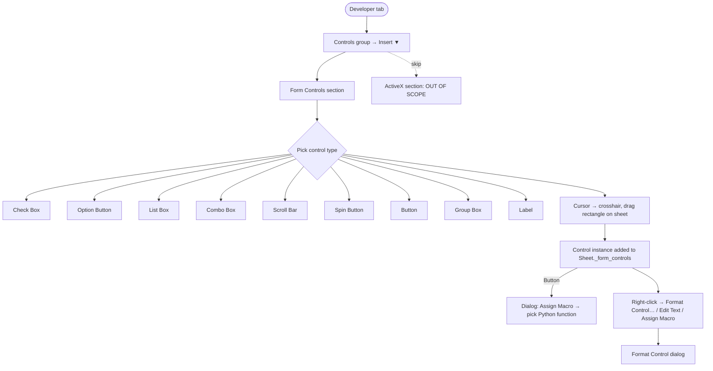
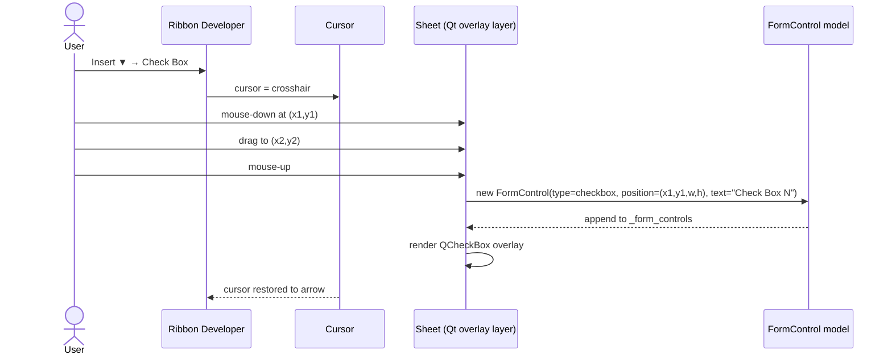
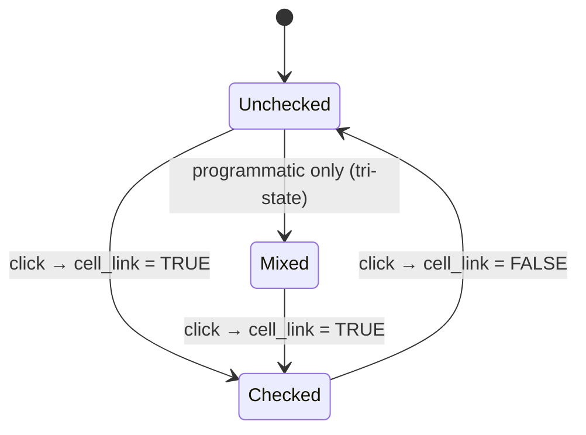
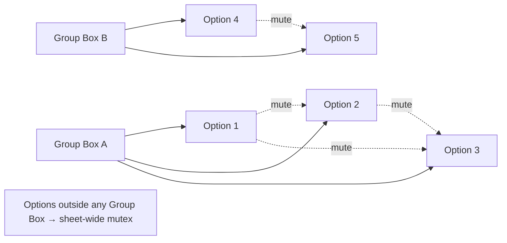
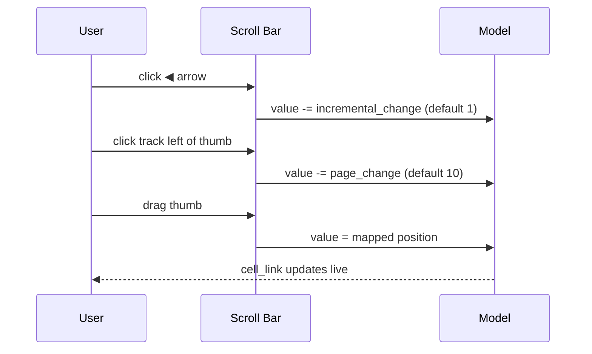
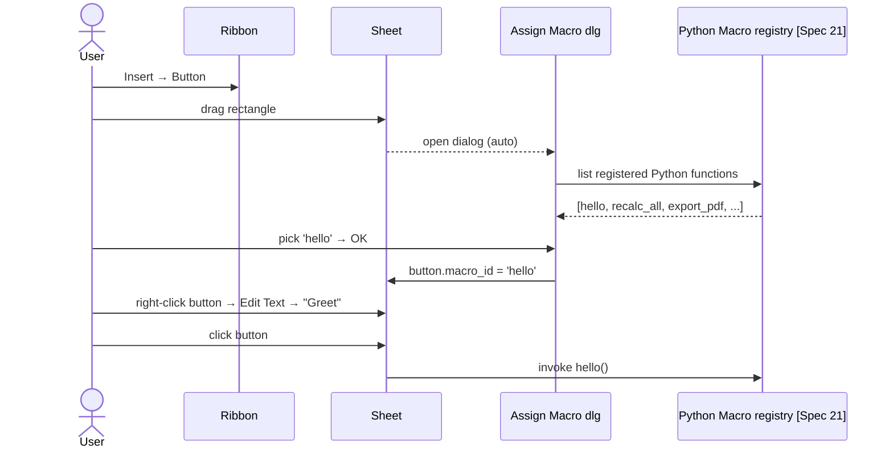
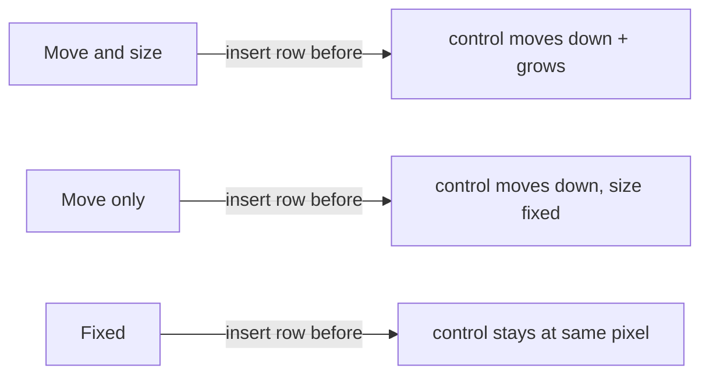

# 37 — Form Controls — UX Flow

> Spec gốc: [37-form-controls.md](../37-form-controls.md)
>
> **Lưu ý**: Modern Excel khuyến nghị Checkbox cell-native ([Spec 22](../22-modern-features.md)). Spec này giữ để compat với file Excel cũ. ActiveX **bỏ qua hoàn toàn**.

## 1. Top-level flow



## 2. Insert dropdown mockup

```
Developer tab ▸ Controls ▸ Insert ▼

┌─ Insert ──────────────────────────────────────┐
│ Form Controls                                 │
│ ┌───┬───┬───┬───┬───┬───┬───┬───┐            │
│ │[A]│[☑]│[⊙]│[≡]│[▼]│[║]│[▲▼]│[B]│            │
│ │Lbl│Chk│Opt│LBx│CBx│ScB│SpB │Btn│            │
│ ├───┼───┼───┘                                 │
│ │[□]│[≣]│  ← Group Box, (legacy combo edit)  │
│ └───┴───┘                                     │
│ ─────────────────────────────────────────────│
│ ActiveX Controls  (Ezcel: disabled — N/A)    │
│ ┌───┬───┬───┬───┬───┬───┬───┬───┬───┐        │
│ │ ▒ │ ▒ │ ▒ │ ▒ │ ▒ │ ▒ │ ▒ │ ▒ │…  │ greyed │
│ └───┴───┴───┴───┴───┴───┴───┴───┴───┘        │
└───────────────────────────────────────────────┘
```

## 3. Insert sequence (any control)



## 4. Check Box — full UX

### Default look (after insert)

```
   A         B         C         D
1 ┌────┬─────────┬─────────┬─────────┐
2 │    │   ☐ Check Box 1   │         │      ← drawn as overlay anchored at (col=B,row=2)
3 │    │                   │         │
4 └────┴─────────┴─────────┴─────────┘
```

### Format Control (right-click → Format Control)

```
┌─ Format Control ─────────────────────────────────────────┐
│ [Size][Protection][Properties][Web][Alt Text][Control]   │
│ ────────────────────────────────────────────────────────│
│ Control tab                                               │
│   Value                                                   │
│     (●) Unchecked                                         │
│     ( ) Checked                                           │
│     ( ) Mixed                                             │
│                                                           │
│   Cell link: [$D$1                                  ][⤴] │
│                                                           │
│   [☑] 3-D shading                                         │
│                                                           │
│                                       [OK]    [Cancel]   │
└──────────────────────────────────────────────────────────┘
```

### Click cycle



## 5. Option Button (Radio) + Group Box

### Layout

```
   ┌─ Group Box: "Plan" ───────────────────────┐
   │   ⊙ Basic                                  │   ← cell_link $C$1 = 1
   │   ○ Pro                                    │   (selected)
   │   ○ Enterprise                             │
   └────────────────────────────────────────────┘
```

### Mutex rules



- Cell link of **first** option in group holds 1-based ordinal of selected. All options in group share that cell link.
- Excel auto-assigns group: option falls inside a Group Box geometrically → joins that group.

### Sequence

```
Click "Pro" (was on "Basic")
   ↓
Set $C$1 = 2  (Basic=1, Pro=2, Enterprise=3)
   ↓
Redraw all 3 options: dot moves to "Pro"
```

## 6. List Box / Combo Box

### List Box anatomy

```
┌─ items ───────────┐
│ Apple             │   ← items from Input range A1:A5
│ Banana            │
│ Cherry  ◀ selected│   ← cell_link $D$1 = 3
│ Date              │
│ Elderberry        │
└───────────────────┘
```

### Format Control (Control tab)

```
┌─ Format Control — List Box ──────────────────────────────┐
│ Input range:   [Sheet1!$A$1:$A$5                    ][⤴] │
│ Cell link:     [$D$1                                ][⤴] │
│ Selection type:                                           │
│   (●) Single                                              │
│   ( ) Multi      (cell link unused; iterate via API)      │
│   ( ) Extend     (Shift/Ctrl ranges)                      │
│ [☑] 3-D shading                                           │
│                                       [OK]    [Cancel]   │
└──────────────────────────────────────────────────────────┘
```

### Combo Box

```
[ Cherry              ▼]   ← collapsed; cell_link = 3
       ↓ click
┌─ items (Drop down lines = 4) ─┐
│ Apple                          │
│ Banana                         │
│ Cherry                         │
│ Date                           │   ← Elderberry below scroll
└────────────────────────────────┘
```

## 7. Scroll Bar / Spin Button

### Scroll Bar

```
   ┌──┬───────████████──────────┬──┐
   │◀ │         thumb           │ ▶│       ← cell_link $D$5 = 42 (Min=0..Max=100)
   └──┴─────────────────────────┴──┘
```



### Spin Button

```
   ┌─┐
   │▲│   ← + step
   ├─┤
   │▼│   ← - step
   └─┘
```

Format Control: Min / Max / Incremental change / Cell link. No track, no page step.

## 8. Button — Assign Macro

### Insert sequence



### Mockup

```
┌─ Assign Macro ───────────────────────────────────────┐
│ Macro name: [hello                                 ] │
│ ┌──────────────────────────────────────────────────┐│
│ │ hello                                             ││
│ │ recalc_all                                        ││
│ │ export_pdf                                        ││
│ │ greet_user                                        ││
│ └──────────────────────────────────────────────────┘│
│ Macros in: [All Open Workbooks                   ▼] │
│ [Edit] [Record…]                                     │
│                                  [OK]    [Cancel]   │
└──────────────────────────────────────────────────────┘
```

Button visual:

```
   ┌─────────────┐
   │   Greet     │   ← text editable via right-click → Edit Text
   └─────────────┘
```

## 9. Format Control dialog tabs

```
┌─ Format Control ─────────────────────────────────────────┐
│ [Size][Protection][Properties][Web][Alt Text][Control]   │
│ ────────────────────────────────────────────────────────│
│  Size                                                     │
│    Height: [1.0 cm ▲▼]   Width: [3.5 cm ▲▼]              │
│    [☐] Lock aspect ratio                                  │
│    Scale  Height: [100 %▲▼]  Width: [100 %▲▼]            │
│    [Reset]                                                │
│ ────────────────────────────────────────────────────────│
│  Protection                                               │
│    [☑] Locked                                             │
│    [☐] Lock text                                          │
│    (effective only when sheet protected)                  │
│ ────────────────────────────────────────────────────────│
│  Properties → Object positioning                          │
│    (●) Move and size with cells                           │
│    ( ) Move but don't size with cells                     │
│    ( ) Don't move or size with cells                      │
│    [☑] Print object                                       │
│    [☑] Locked                                             │
│ ────────────────────────────────────────────────────────│
│  Alt Text                                                 │
│    Title:       [                                       ] │
│    Description: [                                       ] │
│ ────────────────────────────────────────────────────────│
│  Control  (type-specific — see §4-§7)                     │
└──────────────────────────────────────────────────────────┘
```

## 10. Anchor mode visuals



## 11. User journeys

### J1 — Checkbox → cell TRUE/FALSE
1. Developer → Insert → Check Box → drag at B2.
2. Right-click → Format Control → Cell link `$D$1` → OK.
3. Click checkbox → D1 = TRUE; uncheck → D1 = FALSE.

### J2 — Three radio options mutex
1. Insert → Group Box → drag at B5:B12 → text "Plan".
2. Insert → Option Button x3 inside group → text "Basic", "Pro", "Enterprise".
3. Right-click first option → Format Control → Cell link `$C$1`.
4. Click "Pro" → C1 = 2; click "Enterprise" → C1 = 3.

### J3 — List Box driven by named range
1. Define Name `Fruits = Sheet1!$A$1:$A$5`.
2. Insert → List Box → drag.
3. Format Control → Input range `Fruits` → Cell link `$D$1`.
4. Click "Cherry" (3rd) → D1 = 3 → `=INDEX(Fruits, D1)` returns "Cherry".

### J4 — Scroll Bar 0..100
1. Insert → Scroll Bar → drag horizontal at row 20.
2. Format Control → Min 0 / Max 100 / Incremental 1 / Page 10 / Cell link `$D$5`.
3. Click ▶ once → D5 = 1; drag thumb to middle → D5 ≈ 50.

### J5 — Button runs Python
1. Register `hello()` via [Spec 21] Python module.
2. Insert → Button → drag → Assign Macro dialog → pick `hello`.
3. Edit Text → "Greet".
4. Click → `hello()` executes (prints to Console pane).

### J6 — Print + accessibility
1. Right-click checkbox → Format Control → Properties → Print object ☑.
2. Alt Text → Title "Subscribe checkbox" / Description "Click to subscribe".
3. Ctrl+P → preview shows checkbox; screen reader announces alt text.

## 12. Implementation hints

- **Overlay layer** (`ui/overlays/form_controls_layer.py`): single `QWidget` over `QTableView` viewport; subclasses for each control wrap `QCheckBox`/`QRadioButton`/`QListWidget`/`QComboBox`/`QScrollBar`/`QPushButton`. Position computed from `position` + anchor mode + scroll offset on every viewport scroll.
- **Group-Box geometry** (`core/form_controls/grouping.py`): on Option Button insert/move, compute parent Group Box by `rect.intersects(group_box.rect)` largest-area match. Re-evaluate on geometry change.
- **Cell-link binding** (`core/form_controls/binding.py`): two-way:
  - control → model: `setData(cell_link, new_value)` on value change.
  - model → control: subscribe to `dataChanged(cell_link)` → call `setValue()` without re-emitting (guard with flag to avoid loop).
- **Anchor mode** (`core/shapes/anchor.py` — share with Spec 34): on `rowsInserted` / `columnsInserted` / column-width change, update overlay rect per mode.
- **Button → Macro**: reuse `MacroRegistry` from [Spec 21]. `Assign Macro dlg` filters by user-marked `@macro` functions only.
- **xlsx I/O** (`io_utils/form_controls_io.py`): openpyxl `xl/drawings/drawing1.xml` + `xl/ctrlProps/ctrlProp{n}.xml`. Write attribute `objectType`, `lockText`, `cellLink`, `inputRange`, `min`, `max`, `inc`, `page`, `dropLines`, `sel`. openpyxl write support partial — may need raw XML for some attrs.
- **Default counter**: per-sheet auto-name `Check Box 1`, `Check Box 2`, … tracked in `Sheet._form_control_counter`.

## 13. Acceptance ↔ flow map

| AC | Where |
|---|---|
| 1 Check Box drag + default label | §4 + J1 |
| 2 Cell link → TRUE on click | §4 state + J1 |
| 3 Option Buttons mutex in Group Box | §5 + J2 |
| 4 List Box input/cell link | §6 + J3 |
| 5 Scroll Bar range + drag | §7 + J4 |
| 6 Button → Assign Macro Python | §8 + J5 |
