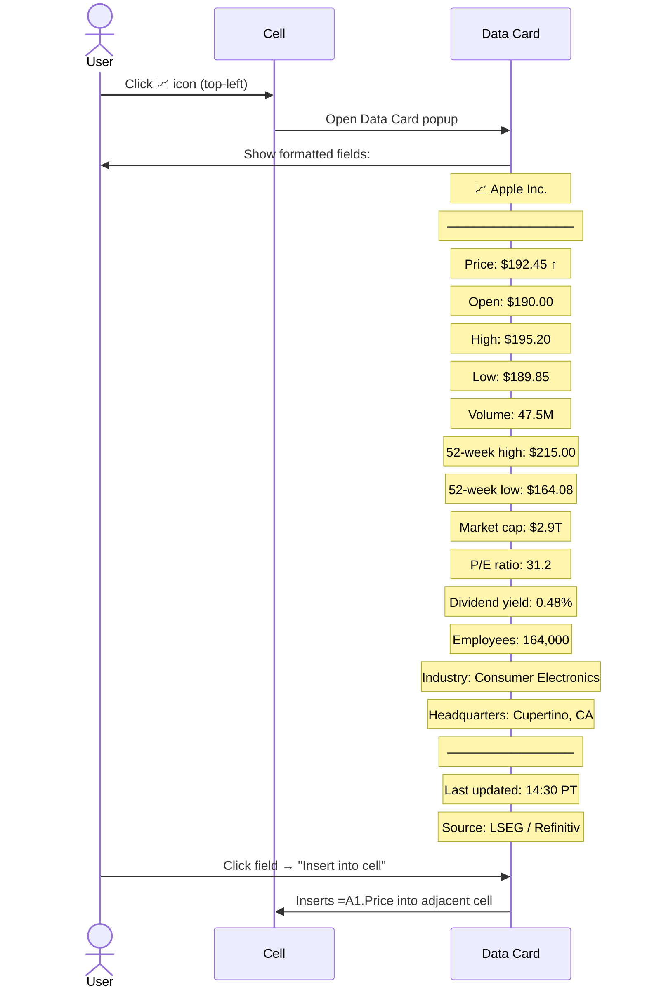
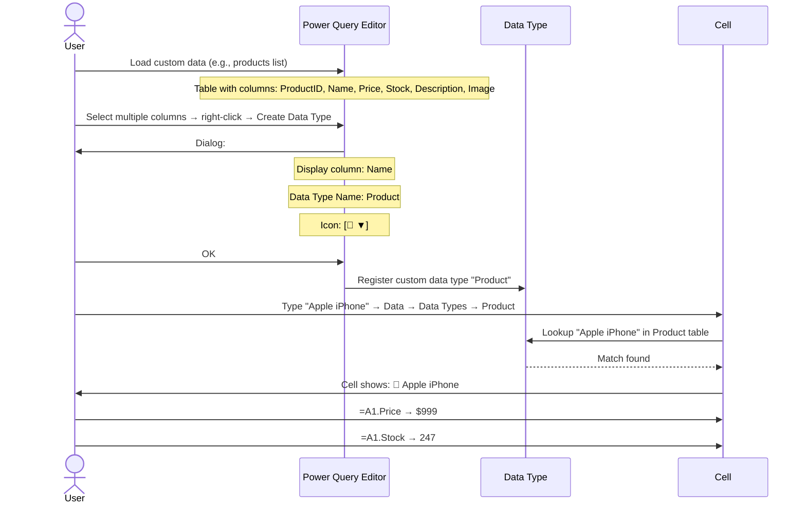

# UX Flow — Spec 38 Linked Data Types

> Spec gốc: [../38-linked-data-types.md](../38-linked-data-types.md)

## Linked Data Types overview

```
"Linked Data Type" = cell value linked to live external entity with rich fields.

Cell shows just a text label, but underneath:
- Entity reference (e.g., "Apple Inc." stock entity ID)
- Multiple typed fields (Price, Market Cap, P/E ratio, ...)
- Periodic refresh from data source
- Field extraction via dot syntax in formulas

Types available (Microsoft 365):
- 📈 Stocks (LSEG-Refinitiv, mid-2023+)
- 🌍 Geography (Wolfram retired 2023; now Bing geographic data)
- ❤ Anatomy (educational, Bing)
- 🌟 Astronomy (Bing)
- 🧪 Chemistry (Bing)
- 🦁 Animals (Bing)
- 🌱 Plants (Bing)
- 🍔 Foods (Bing)
- 🎬 Movies (limited, Bing)
- 📚 Books (limited, Bing)
- 💱 Currencies (Bing)
- 📅 Dates (built-in)
- Organization (Microsoft Graph - your tenant)
- 👤 People (Microsoft Graph - your tenant)
- Power BI (Power BI datasets - linked to BI semantic model)
- Custom (via PowerQuery → Add Data Type)

NOTE: Wolfram Alpha integration was removed 06/2023 - use Bing/built-in instead.
```

## Convert text to data type

```mermaid
flowchart TD
    A[User types "Apple Inc." in cell A1] --> B[Select cell]
    
    B --> C{Method}
    C -->|Data tab → Stocks button| D[Convert A1 to Stocks type]
    C -->|Data tab → Geography button| E[Convert A1 to Geography type]
    C -->|Data tab → Automatic Data Types| F[Auto-detect best type]
    C -->|Right-click → Data Type → ...| G[Submenu with all types]
    
    D --> H[Lookup "Apple Inc." in Stocks database]
    
    H --> I{Match found?}
    I -->|Single match| J[Convert immediately; cell shows: 📈 Apple Inc.]
    I -->|Multiple matches| K[Show Data Selector pane]
    I -->|No match| L[Cell shows: ? icon → click → search dialog]
    
    K --> M["Data Selector:
    ┌─ Apple Inc. ───────────────┐
    │ Multiple results found:      │
    │                               │
    │ ● Apple Inc. (AAPL)         │
    │   $192.45 Consumer Elec.    │
    │                               │
    │ ○ Apple Hospitality REIT    │
    │   $14.20 REIT               │
    │                               │
    │ ○ Apple Holding Corp        │
    │   $3.50 Investments         │
    │                               │
    │ [Select]"]
    
    M --> J
```

## Cell appearance after conversion

```
Before:
┌────────────────┐
│ Apple Inc.      │  ← plain text
└────────────────┘

After convert to Stocks:
┌────────────────┐
│ 📈 Apple Inc.   │  ← icon + display name
└────────────────┘
            ▲
            small icon top-left indicates linked data type

Click cell → blue underline beneath text + small data card icon:
┌──────────────────────────┐
│ 📈 Apple Inc.    ┌──┐    │
│                  │📋│    │ ← "Insert Data" icon on click
│                  └──┘    │
└──────────────────────────┘
```

## Data Card flow



## Field extraction syntax

```
In any cell, use dot syntax to extract fields:

Cell A1 = 📈 Apple Inc.
Cell B1 = =A1.Price            → $192.45
Cell C1 = =A1.[Market cap]     → $2.9T (square brackets for field names with spaces)
Cell D1 = =A1.Industry         → "Consumer Electronics"

Multi-row extraction:
Cell B1 = =A1:A10.Price        → spills 10 prices (one per stock)

Autocomplete:
Type "=A1." → dropdown shows all available fields:
┌──────────────────────────────────────┐
│ Apple Inc.                              │
│ ─────────────────────────────────────│
│ 🔢 Price                                │
│ 🔢 Change                                │
│ 🔢 Change (%)                           │
│ 🔢 Open                                  │
│ 🔢 High                                  │
│ 🔢 Low                                   │
│ 🔢 Volume                                │
│ 🔤 Industry                              │
│ 🔤 Headquarters                          │
│ ... (40+ fields)                         │
└──────────────────────────────────────────┘
Press Tab → inserts field name with proper brackets if needed
```

## Insert Data icon button

```
Click linked data cell → small floating button appears:

┌──────────────────────────────┐
│ 📈 Apple Inc.      ┌──┐     │
│                     │📋│     │ ← "Insert Data" floating button
└──────────────────────────────┘
                     │
                     ▼
                  Click:
                  ┌──────────────────────────┐
                  │ Insert Data                │
                  │ ─────────────────────── │
                  │ 🔢 Price                   │
                  │ 🔢 Volume                  │
                  │ 🔤 Industry                │
                  │ 🔢 Market cap              │
                  │ ... (browse fields)        │
                  └────────────────────────────┘
                  
                  Click "Price" → inserts =A1.Price in cell B1 (cell to right)
```

## Refresh flow

```mermaid
flowchart TD
    A[Linked data types refresh modes:] --> B{Trigger}
    
    B -->|Auto on open| C[All linked cells refresh on workbook open]
    B -->|Right-click cell → Refresh| D[Refresh just that cell]
    B -->|Right-click → Refresh All| E[Refresh all linked types in workbook]
    B -->|Data tab → Refresh All| E
    B -->|Periodic auto-refresh (default 5 min)| F[Background refresh queued]
    
    C --> G[Send batch request to data service]
    D --> H[Send single entity request]
    E --> G
    F --> G
    
    G --> I[Receive updated values]
    I --> J[Update cell.linked_value fields]
    J --> K[Recompute dependent formulas referencing fields]
    K --> L[Repaint cells]
    
    M[While refreshing, cells show:] --> N[#GETTING_DATA temporarily]
    L --> O[#GETTING_DATA replaced with new value]
```

## Custom Data Types from Power Query



## "Field" function (modern, alternative syntax)

```
Alternative to dot syntax when field has special chars or you want compatibility:

=FIELDVALUE(A1, "Price")       → equivalent to =A1.Price
=FIELDVALUE(A1, "Market Cap")  → equivalent to =A1.[Market cap]
=A1.[52-week high]             → bracketed name with special chars

FIELDVALUE supports:
- 2nd arg can be any expression returning string
- =FIELDVALUE(A1, B1) where B1 has field name
- More flexible for dynamic field selection
```

## Data Selector pane (when match ambiguous)

```
After right-click → Data Type → Stocks on cell with "Apple":

┌─ Data Selector ──────────────────────────────────────────┐
│ Apple                                                       │
│ ────────────────────────────────────────────────────────  │
│ Multiple results found. Choose one:                         │
│                                                              │
│ ● 📈 Apple Inc. — AAPL                                     │
│   Consumer Electronics                                       │
│   Headquarters: Cupertino, CA                                │
│                                                              │
│ ○ 📈 Apple Hospitality REIT — APLE                          │
│   Real Estate Investment Trust                               │
│   Headquarters: Richmond, VA                                 │
│                                                              │
│ ○ 📈 Apple Holding Corp — AHC                               │
│   Investments                                                │
│   Headquarters: Vancouver, BC                                │
│                                                              │
│ ☐ Apply selection to all similar cells                      │
│                                                              │
│                                          [ Select ]         │
└──────────────────────────────────────────────────────────────┘

Click Select → A1 converted to chosen entity
Pane stays open if other ambiguous cells remain → click each to resolve
```

## Convert back to text

```
Right-click linked cell → Data Type → Convert to Text:
- Strips entity metadata
- Cell value reverts to plain display text "Apple Inc."
- All =A1.Field formulas now return #FIELD! (entity gone)
- Use to "untangle" before sharing simplified workbook
```

## Refresh frequency settings

```
File → Options → Data → Linked Data Types:

┌─ Excel Options — Data ──────────────────────────────┐
│ Linked Data Types:                                     │
│                                                          │
│ Auto-refresh interval:                                  │
│ [Every 5 minutes               ▼]                       │
│   ├ Off (never auto-refresh)                            │
│   ├ Every minute                                         │
│   ├ Every 5 minutes                                      │
│   ├ Every 15 minutes                                     │
│   ├ Every hour                                           │
│   └ Daily                                                │
│                                                          │
│ ☑ Refresh on file open                                  │
│ ☑ Show notification when data is stale                  │
│ ☐ Use cached data when offline                          │
└──────────────────────────────────────────────────────────┘
```

## Implementation hints cho Slave

- **Linked data cell value type**:
  ```python
  class LinkedDataValue:
      entity_id: str          # unique ID from data provider
      display_name: str       # text shown in cell
      data_type: str          # "Stock", "Geography", "Product" (custom), etc.
      icon: str               # emoji or SVG path
      fields: dict[str, Any]  # field name → value
      provider: str           # "LSEG", "Bing", "Microsoft Graph", custom name
      last_refresh: datetime
      cache_ttl_seconds: int
  ```

- **Display in cell**: render as `icon + display_name`; icon = small 12x12 px at left of text.

- **Click handler**: 
  - Top-left icon (12x12 area) → open Data Card.
  - Floating "Insert Data" button → appears on cell hover (200ms delay).

- **Data Card widget**: floating `QFrame`; tabular layout of field/value pairs; "Insert" action per field.

- **Field extraction in formula engine**:
  - Parser recognizes `cell_ref.field_name` and `cell_ref.[field name with spaces]`.
  - At eval time → resolve cell → check if `LinkedDataValue` → return `fields[name]`.
  - If field missing → `#FIELD!` error.
  - If not LinkedDataValue → `#VALUE!` error.

- **Data provider abstraction**:
  ```python
  class DataTypeProvider:
      name: str
      def lookup(query: str) -> list[Entity]: ...
      def fetch_fields(entity_id: str) -> dict[str, Any]: ...
      def refresh(entity_id: str) -> dict[str, Any]: ...
  
  providers = {
      "Stocks": LSEGProvider(api_key=...),
      "Geography": BingProvider(),
      "Product": CustomPQProvider(table=...),
  }
  ```

- **Refresh**:
  - `QTimer` for periodic auto-refresh based on user setting.
  - Right-click → manual refresh → call provider.refresh().
  - During fetch: cell shows `"#GETTING_DATA"` placeholder.
  - On success: update LinkedDataValue.fields; emit dataChanged for cell + dependents.

- **Data Selector pane**: `QDockWidget` right; shows multiple match candidates; user picks → call `provider.fetch_fields()`.

- **Custom types from Power Query**:
  - PQ Editor exposes "Create Data Type" action on column selection.
  - Build provider that uses PQ result table as lookup source.
  - Display column = column user picks as cell label; other columns = fields.

- **FIELDVALUE function**: register as standard function in `_FUNCTIONS`; signature `FIELDVALUE(linked_cell, field_name)`.

- **Persistence**: serialize entity_id + last fields snapshot in xlsx custom XML; refresh on open if `refresh_on_open` enabled.

- **Offline mode**: if network down → use cached fields; show stale indicator (small ⚠ on cell).
