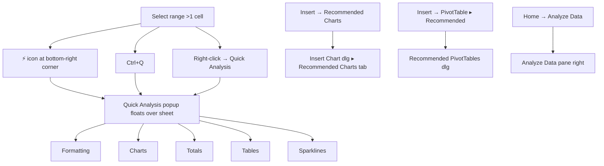
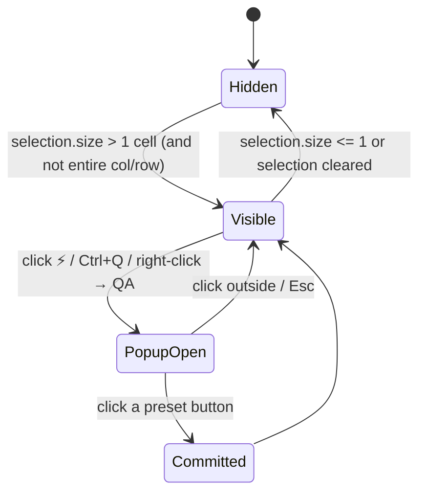
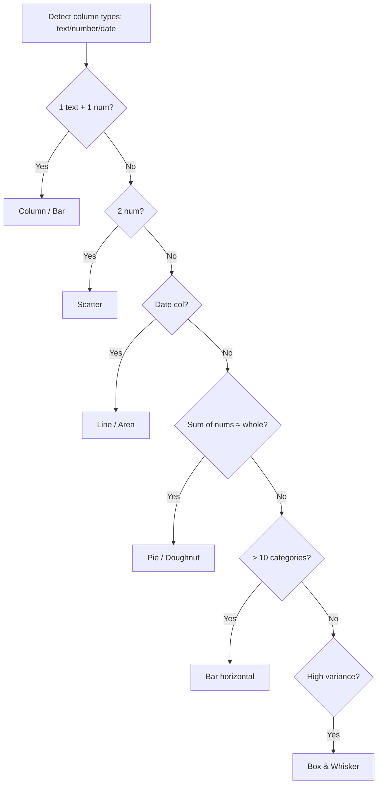

# 40 — Quick Analysis & Recommended Charts/PivotTables — UX Flow

> Spec gốc: [40-quick-analysis.md](../40-quick-analysis.md)

## 1. Three entry surfaces



## 2. ⚡ Icon placement

```
         A      B      C      D
    1  ┌─────┬─────┬─────┬─────┐
    2  │ 100 │ 200 │ 300 │     │   ← selection A2:C5
    3  │ 150 │ 220 │ 320 │     │
    4  │ 180 │ 240 │ 340 │     │
    5  │ 200 │ 260 │ 360 │     │
       └─────┴─────┴─────┴─[⚡]─┘
                          └─── icon overlay at bottom-right
                               of the selection rectangle
                               (offset = +6px right, +6px down)
```

State machine:



## 3. Popup mockup (5 tabs)

```
┌─ Quick Analysis ───────────────────────────────────────────┐
│ [Formatting] [Charts] [Totals] [Tables] [Sparklines]       │
│ ──────────────────────────────────────────────────────────│
│                                                             │
│   ┌──────┐ ┌──────┐ ┌──────┐ ┌──────┐ ┌──────┐ ┌────────┐│
│   │▌▌▌▌▌│ │ ▮▮ │ │  ●  │ │  >  │ │Top  │ │ Clear  ││
│   │      │ │ ▮▮ │ │  ●  │ │     │ │10%  │ │        ││
│   │Data  │ │Color│ │Icon │ │Grtr │ │Top  │ │Clear   ││
│   │Bars  │ │Scale│ │Set  │ │Than │ │10%  │ │Format  ││
│   └──────┘ └──────┘ └──────┘ └──────┘ └──────┘ └────────┘│
│                                                             │
│ Conditional formatting uses rules to highlight              │
│ interesting data.                                           │
└─────────────────────────────────────────────────────────────┘
```

Tab content reference:

| Tab | Buttons |
|---|---|
| Formatting | Data Bars · Color Scale · Icon Set · Greater Than · Top 10% · Clear Format |
| Charts | (up to 5 recommended chart icons) · More Charts… |
| Totals | Sum (row at bottom) · Average · Count · % Total · Running Total · Sum (column at right) · Average (col) · Count (col) … |
| Tables | Table · 5–6 PivotTable layout previews · More… |
| Sparklines | Line · Column · Win/Loss |

## 4. Live preview lifecycle

```mermaid
sequenceDiagram
    actor U
    participant P as Popup
    participant Snap as Snapshot service
    participant Grid as Sheet model

    U->>P: hover "Data Bars"
    P->>Snap: snapshot(selection) → state token T
    P->>Grid: apply DataBars rule (preview-only)
    Grid-->>U: cells repaint with bars
    U->>P: hover "Color Scale" (move)
    P->>Snap: restore(T)
    P->>Snap: snapshot(selection) → T2
    P->>Grid: apply ColorScale
    Grid-->>U: repaint
    alt commit
        U->>P: click "Color Scale"
        P->>P: discard snapshots; popup closes
        Note over Grid: rule persists in CF list
    else cancel
        U->>P: click outside / Esc
        P->>Snap: restore(T2)
        Note over Grid: state back to original
    end
```

Snapshot scope per tab:

| Tab | What snapshot must capture |
|---|---|
| Formatting | CF rules on selection, cell fmt overrides |
| Charts | inserted chart object (remove on rollback) |
| Totals | inserted SUM row/col + cell values + fmt |
| Tables | Table object + style + AutoFilter state |
| Sparklines | Sparkline group + target column writes |

## 5. Totals tab — specific layouts

Two sub-rows: "row at bottom" vs "column at right".

```
Selection A2:C5
  ↓ Totals → Sum (row at bottom)
        A      B      C
   2 │ 100 │ 200 │ 300 │
   3 │ 150 │ 220 │ 320 │
   4 │ 180 │ 240 │ 340 │
   5 │ 200 │ 260 │ 360 │
   6 │ 630 │ 920 │ 1320│   ← inserted, bold, =SUM(A2:A5) etc.

  ↓ Totals → Average (column at right)
        A      B      C      D
   2 │ 100 │ 200 │ 300 │ 200 │   ← =AVERAGE(A2:C2)
   3 │ 150 │ 220 │ 320 │ 230 │
   4 │ 180 │ 240 │ 340 │ 253 │
   5 │ 200 │ 260 │ 360 │ 273 │
```

```
Running Total (column at right):
   A      B      C      D
 │ 100 │ 200 │ 300 │ 600 │   = SUM($A2:C2)
 │ 150 │ 220 │ 320 │1290 │   = SUM($A$2:C3)
 │ 180 │ 240 │ 340 │2050 │
 │ 200 │ 260 │ 360 │2870 │
```

## 6. Charts tab → Recommended Charts dialog

### "More Charts…" opens

```
┌─ Insert Chart ─────────────────────────────────────────────────┐
│ [Recommended Charts] [All Charts]                              │
│ ──────────────────────────────────────────────────────────────│
│  Recommended:                       Preview:                   │
│ ┌─────────────────┐                ┌───────────────────────┐  │
│ │▣ Clustered Col  │ ◀ selected     │   ▮  ▮  ▮             │  │
│ │   1×4 mini      │                │   ▮  ▮  ▮  ▮  ▮       │  │
│ ├─────────────────┤                │   ▮  ▮  ▮  ▮  ▮  ▮    │  │
│ │▤ Line           │                │  A   B   C   D   E    │  │
│ ├─────────────────┤                │                        │  │
│ │◓ Pie            │                └───────────────────────┘  │
│ ├─────────────────┤                                            │
│ │📊 Bar           │   Note: A clustered column chart compares  │
│ ├─────────────────┤   values across a few categories. Use it   │
│ │📈 Scatter       │   when the order of categories is not      │
│ ├─────────────────┤   important.                                │
│ │📉 Area          │                                            │
│ └─────────────────┘                                            │
│                                              [OK]    [Cancel] │
└────────────────────────────────────────────────────────────────┘
```

### Recommendation rule cascade



Output: top 5–7 sorted by relevance score.

## 7. Recommended PivotTables dialog

```
┌─ Recommended PivotTables ─────────────────────────────────────┐
│ ┌─────────────────────────────────────────┐                   │
│ │ Sum of Sales by Region                  │ ◀ selected        │
│ │  ┌─────────┬────────────┐               │  Preview pivots   │
│ │  │ Region  │ Sum of Sales│              │  rendered as mini │
│ │  ├─────────┼────────────┤               │  HTML on right    │
│ │  │ North   │ 12,400      │              │                   │
│ │  │ South   │  9,200      │              │                   │
│ │  │ East    │ 14,100      │              │                   │
│ │  │ West    │ 10,700      │              │                   │
│ │  │ Total   │ 46,400      │              │                   │
│ │  └─────────┴────────────┘               │                   │
│ ├─────────────────────────────────────────┤                   │
│ │ Count of Orders by Product              │                   │
│ ├─────────────────────────────────────────┤                   │
│ │ Sum of Sales by Date (grouped Month)    │                   │
│ ├─────────────────────────────────────────┤                   │
│ │ Region × Product matrix (Sum)           │                   │
│ ├─────────────────────────────────────────┤                   │
│ │ Blank PivotTable                        │                   │
│ └─────────────────────────────────────────┘                   │
│                                          [OK]    [Cancel]     │
└───────────────────────────────────────────────────────────────┘
```

Click OK → new sheet `PivotN` + PivotTable inserted at A3 + Field List opens ([Spec 18](../18-pivot-table.md)).

## 8. Analyze Data pane (Home → Analyze Data)

```
┌─ Analyze Data ─────────────────────────┐
│ [×]                                     │
│                                          │
│ Ask a question about your data:         │
│ [                                     ] │
│                                          │
│ Suggested questions                      │
│   • What is the total Sales by Region?  │
│   • What is the trend of Sales over time?│
│   • Which product has highest growth?   │
│                                          │
│ ─── Insights ──────────────────────────│
│                                          │
│ ┌──────────────────────────────────┐   │
│ │ 📈 Trend                          │   │
│ │ Sales rise steadily through 2026 │   │
│ │  ▱▱▰▰▰▰▰▰▰  ┌─ chart ─┐         │   │
│ │             │ ╱╱╱╱╱╱╱╱│         │   │
│ │             └─────────┘         │   │
│ │ [Insert PivotTable]              │   │
│ └──────────────────────────────────┘   │
│                                          │
│ ┌──────────────────────────────────┐   │
│ │ 🎯 Outlier                        │   │
│ │ Region East — 2026-04 unusually  │   │
│ │ high                              │   │
│ │ [Insert Chart]                    │   │
│ └──────────────────────────────────┘   │
│                                          │
│ ┌──────────────────────────────────┐   │
│ │ 🔢 Rank                           │   │
│ │ Top 3 products by Revenue        │   │
│ │ [Insert PivotTable]              │   │
│ └──────────────────────────────────┘   │
└─────────────────────────────────────────┘
```

Insight types: Trend · Outlier · Rank · Majority · Correlation.

## 9. User journeys

### J1 — Quick Conditional Formatting via ⚡
1. Select A2:C5 (numeric data) → ⚡ appears at C5 bottom-right.
2. Click ⚡ → popup at Formatting tab.
3. Hover "Data Bars" → cells preview with blue bars.
4. Hover "Color Scale" → preview switches to green→red gradient.
5. Click "Color Scale" → committed; popup closes; rule appears in Manage Rules.

### J2 — Insert recommended chart in 2 clicks
1. Select data → Ctrl+Q → Charts tab.
2. Hover first preset "Clustered Column" → floating mini chart preview.
3. Click → chart inserted on sheet at default position; ⚡ disappears; ribbon switches to Chart Design contextual tab ([Spec 19](../19-chart.md)).

### J3 — Add totals row
1. Select A2:C5 → ⚡ → Totals tab.
2. Click "Sum row at bottom".
3. Row 6 inserted with `=SUM(A2:A5)`, `=SUM(B2:B5)`, `=SUM(C2:C5)`, bold formatting.

### J4 — Sparkline column
1. Select A2:C5 → ⚡ → Sparklines tab.
2. Click "Line" → column D2:D5 filled with per-row line sparkline grouped together ([Spec 33](../33-sparklines.md)).

### J5 — Recommended PivotTable
1. Select table → Insert → PivotTable → Recommended.
2. Dialog shows 5–6 layouts; click "Sum of Sales by Region".
3. New sheet `Pivot1` with pivot inserted; Field List pane opens for further customization.

### J6 — Analyze Data
1. Home → Analyze Data → pane right.
2. Read suggested insights; click "Insert PivotTable" on Trend card.
3. PivotTable appears with Date (grouped by month) × Sum of Sales + linked line chart.

### J7 — Cancel preview
1. Select range → ⚡ → Formatting.
2. Hover Data Bars (preview applies).
3. Press Esc → preview rolls back; popup closes.

## 10. Implementation hints

- **⚡ overlay** (`ui/overlays/quick_analysis_button.py`): single `QToolButton` floating widget in viewport. Reposition on `selectionChanged` + `viewportScrolled`. Hide when selection collapses to 1 cell or covers full rows/cols.
- **Popup** (`ui/dialogs/quick_analysis_popup.py`): `QWidget(Popup)` flag (auto-close on focus loss). Tab bar + stacked widget. Each tab is a `QHBoxLayout` of preset `QToolButton`s with hoverEnter/hoverLeave wired to the snapshot service.
- **Snapshot service** (`core/preview/snapshot.py`):
  - `snapshot(scope) → token` — copies cell values, fmts, CF rules within scope, plus referenced objects (chart/table/sparkline group ids before commit).
  - `restore(token)` — diff-apply reverse.
  - For inserted objects (chart/table), record `created_object_id`; rollback = delete that object.
- **Recommend engine** (`core/recommend/charts.py`, `core/recommend/pivots.py`):
  - Inputs: tabular slice of selection or detected Table around active cell.
  - Detect column kinds via dtype + simple heuristics (>50% datetime parseable → date col; numeric mean coverage; cardinality / distinct ratio).
  - Score table → return ranked list of `ChartConfig` / `PivotConfig`.
- **Recommended Charts dialog**: reuse `Insert Chart` dialog ([Spec 19](../19-chart.md)); Recommended tab populated from engine; right pane = matplotlib offscreen render → QImage.
- **Analyze Data** (Phase 6 — overlaps with Copilot [Spec 39](../39-copilot-agent.md)):
  - Anomaly: z-score |z|>2.5 or IQR-based.
  - Correlation: Pearson; report pairs |r|>0.7.
  - Trend: linear regression on sorted-by-date series; report slope sign + magnitude.
  - Each insight = one `InsightCard` model `{type, summary, generator_fn → PivotConfig|ChartConfig}`.

## 11. Acceptance ↔ flow map

| AC | Where |
|---|---|
| 1 ⚡ appears + click → 5-tab popup | §2 + §3 + J1 |
| 2 Formatting hover preview + click commit | §4 + J1 |
| 3 Charts hover preview + click insert | J2 |
| 4 Sum row at bottom | §5 + J3 |
| 5 Sparkline Line column | J4 |
| 6 Recommended Charts dialog | §6 + J2 |
| 7 Recommended PivotTables | §7 + J5 |
