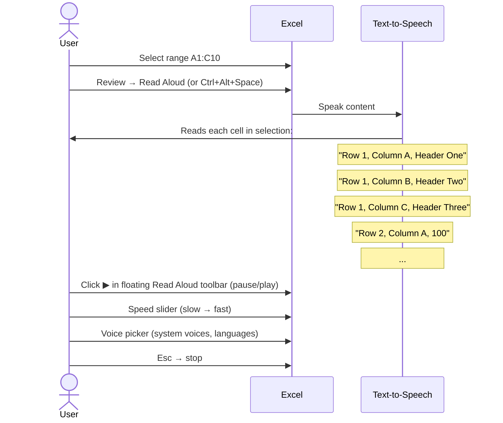

# UX Flow — Spec 41 Accessibility

> Spec gốc: [../41-accessibility.md](../41-accessibility.md)

## Accessibility Checker entry

```
Review tab → Accessibility group:

┌─────────────────────────────────────────┐
│ [Check Accessibility] [Read Aloud]        │
└───────────────────────────────────────────┘

Or: File → Info → Check for Issues → Check Accessibility

Status bar (when "Accessibility: Investigate" shown):
- Constant background scan
- Clickable indicator → opens Accessibility pane
```

## Accessibility Pane

```
Right-side dock pane:

┌─ Accessibility ─────────────────────────────────────┐
│ [Help] [⚙ Options] [Keep checker running ☑]         │
│ ─────────────────────────────────────────────────── │
│                                                        │
│ Inspection Results                                    │
│                                                        │
│ ⚠ ERRORS  (5)                                         │
│ ▼ Missing alternative text (3)                        │
│   • Picture 4 in Sheet1                                │
│     "Fix: Add description for screen readers"          │
│     [Add Alt Text] [Mark Decorative]                  │
│   • Chart 2 in Sheet2                                  │
│   • SmartArt 1 in Dashboard                            │
│                                                        │
│ ▼ Default sheet name (1)                              │
│   • "Sheet1" — should be renamed descriptively         │
│     [Rename Sheet]                                     │
│                                                        │
│ ▼ Merged cells (1)                                    │
│   • Sheet1!A1:C1 (merged across columns)              │
│     Screen readers may misread merged cells            │
│                                                        │
│ ⚠ WARNINGS (3)                                        │
│ ▼ Image color contrast (1)                            │
│ ▼ Heading row not formatted (1)                       │
│ ▼ Table without header row (1)                        │
│                                                        │
│ ℹ TIPS (2)                                            │
│ ▼ Use "Title" cell style for sheet titles             │
│ ▼ Add link tooltip for hyperlinks                     │
│                                                        │
│ ─────────────────────────────────────────────────── │
│ Additional Information                                │
│                                                        │
│ Why fix? Helps blind / low vision users               │
│ understand your data via screen readers.              │
│                                                        │
│ How to fix?                                            │
│ Add descriptive alt text via:                          │
│ - Right-click → View Alt Text                          │
│ - Or click [Add Alt Text] above                        │
└────────────────────────────────────────────────────────┘
```

## Categories of accessibility issues

```
ERRORS (must fix):
1. Missing alt text on images/shapes/charts/SmartArt
2. Default sheet names (Sheet1, Sheet2) without rename
3. Merged cells (screen readers can't read structure)
4. Insufficient color contrast (< 4.5:1 ratio for text)
5. Image of text instead of editable text
6. Repeated whitespace
7. Hyperlink text not descriptive (e.g., "click here")

WARNINGS (should fix):
1. Tables without header row marked
2. Heading rows not styled as headings
3. Color-only meaning (e.g., red dot = bad — needs text label too)
4. Auto-fit row heights very small (< 12pt may be unreadable)
5. PivotTables without table style
6. Charts without clear titles
7. Floating shapes near data (may confuse layout)

TIPS (consider):
1. Title cells for sheets
2. Hyperlink tooltips ("ScreenTip")
3. Consistent column widths
4. Multi-column tables more accessible than wide single-column
```

## Read Aloud flow



## Read Aloud toolbar

```
After triggering, floating toolbar appears:

┌─ Read Aloud ─────────────────────────────┐
│ [⏮ Prev] [⏯ Play/Pause] [⏭ Next]         │
│                                            │
│ Speed:  ─────●─────                       │
│         slow      fast                    │
│                                            │
│ Voice: [Hoa Vietnamese ▼]                 │
│         ├ Microsoft David                 │
│         ├ Microsoft Zira                  │
│         ├ Hoa Vietnamese                  │
│         ├ Linh Vietnamese                 │
│         └ ... (system voices)             │
│                                            │
│ ☑ Read row numbers                        │
│ ☑ Read column letters                     │
│ ☑ Read cell formulas (not just values)    │
│ ☑ Read formatting (bold, color)           │
│                                            │
│ [✕ Close]                                  │
└────────────────────────────────────────────┘

Floating, stays on top; user can navigate cells with arrows during playback.
```

## Alt Text dialog flow

```
Right-click image/shape/chart → View Alt Text:

┌─ Alt Text ────────────────────────────────────────────┐
│ Describe this object so people who are blind or have    │
│ low vision can understand it.                            │
│                                                            │
│ How would you describe this object?                       │
│ ┌──────────────────────────────────────────────────┐   │
│ │ Bar chart showing quarterly sales growth, with    │   │
│ │ Q3 peaking at $45K.                                │   │
│ └──────────────────────────────────────────────────┘   │
│ (max ~250 chars)                                          │
│                                                            │
│ ☐ Mark as decorative                                     │
│   (skip in screen readers — for purely visual elements)  │
│                                                            │
│ [Generate description for me] (AI-powered, 2024+)         │
│                                                            │
│ Title (optional, for some screen readers):               │
│ ┌──────────────────────────────────────────────────┐   │
│ │                                                    │   │
│ └──────────────────────────────────────────────────┘   │
│                                                            │
│                              [ OK ]   [ Cancel ]         │
└────────────────────────────────────────────────────────────┘
```

## Auto-generate description (AI)

```
"Generate description for me" button → uses Computer Vision API:

Input: image bytes
↓
Vision model analyzes:
- Object detection
- Scene understanding
- OCR if text in image
- Chart type recognition

Output suggestion appears in text box:
"A bar chart with categories Q1, Q2, Q3, Q4 on x-axis 
 and Revenue on y-axis. Q3 has the tallest bar at approximately 45,000."

User edits or accepts as-is.
```

## Keyboard navigation completeness

```
Every UI element reachable via keyboard:

Cell grid:
- Arrow keys: move 1 cell
- Tab/Shift+Tab: move right/left
- Enter/Shift+Enter: move down/up
- Ctrl+Arrow: jump to edge
- Page Up/Down: scroll viewport
- Ctrl+Home/End: jump to start/end
- F5/Ctrl+G: Go To dialog

Ribbon:
- Alt: enter KeyTip mode
- F6: cycle panes (grid → ribbon → formula bar → status)
- Tab in ribbon: next button in current group
- Shift+Tab: previous

Dialogs:
- Tab: next field
- Shift+Tab: previous
- Esc: cancel
- Enter: default button (usually OK)
- Alt+letter: matches underlined letter

Side panes:
- F6 enters/exits pane
- Tab navigates within pane
- Esc closes (some panes)
```

## Screen reader integration

```
Roles announced per element:

Cell:
"Cell A1, value 'Total', formula '=SUM(A2:A10)', formatted as bold,
 in column A of row 1 in sheet Sales"

Ribbon button:
"Bold, button, pressed/not pressed, keyboard shortcut Control B"

Formula Bar:
"Formula bar, contains =SUM(A2:A10)"

Status bar:
"Ready. Average 250, Count 8, Sum 2000."

Dialog:
"Format Cells dialog. 6 tabs. Number tab active. Press F1 for help."

Implementation: 
- Windows: UIA (UI Automation) — proper roles, names, descriptions
- ARIA-equivalent for any embedded HTML/web view
- macOS: NSAccessibility (out of scope for Ezcel Windows-first)
```

## Color & contrast tools

```
Color Picker → "Contrast Checker" mode:

┌─ Color Contrast Checker ──────────────────────┐
│ Text color:  [#605E5C ▼]                        │
│ Background:  [#FFFFFF ▼]                        │
│                                                    │
│ Contrast ratio: 5.6:1                              │
│                                                    │
│ WCAG 2.1 compliance:                              │
│ ✓ AA  (text > 4.5:1, large text > 3:1)            │
│ ✓ AAA (text > 7:1, large text > 4.5:1)            │
│                                                    │
│ Status: ✓ Accessible                              │
│                                                    │
│ Preview:                                          │
│ ┌──────────────────────────────────────────┐    │
│ │ Sample text on selected background       │    │
│ └──────────────────────────────────────────┘    │
└────────────────────────────────────────────────────┘
```

## High contrast mode

```
Windows Settings → Accessibility → Contrast themes:
- Aquatic / Desert / Dusk / Night sky
- Or custom theme

Excel respects these:
- All UI chrome (ribbon, status bar, dialogs) uses system colors
- Cell content: user-chosen colors kept (data integrity)
- Borders enhanced for visibility
- Focus indicators thicker
- Icons swap to high-contrast variants
- Pointer / cursor enlarged
```

## Zoom & magnification

```
Multiple zoom mechanisms work together:

1. Excel app zoom (Status bar slider or Ctrl+Wheel): 10%-400%
2. Windows display scaling: 100%-300% (system-wide, HiDPI)
3. Windows Magnifier (Win+Plus): screen overlay magnification
4. Browser zoom (if using web Excel): 50%-200%

Cells, fonts, UI all scale proportionally.
Touch mode auto-engages at higher scaling (44px hit targets).
```

## Implementation hints cho Slave

- **Accessibility Pane**:
  - `QDockWidget` right side; reuses standard pane chrome.
  - Run inspection on workbook → categorize issues → render tree (`QTreeWidget`).
  - Each issue has: severity (error/warning/tip), description, fix button(s), help link.

- **Inspection rules** (Python):
  ```python
  def inspect_workbook(wb) -> list[A11yIssue]:
      issues = []
      for sheet in wb.sheets:
          # Default sheet name
          if sheet.name in ("Sheet1", "Sheet2", ...) and sheet not in wb.is_only_sheet:
              issues.append(A11yIssue(severity="error", category="naming", ...))
          
          # Alt text on objects
          for obj in sheet.objects:
              if obj.type in ("picture", "chart", "smartart") and not obj.alt_text:
                  issues.append(A11yIssue(severity="error", category="alt_text", obj=obj, ...))
          
          # Merged cells
          for merged in sheet.merged_ranges:
              issues.append(A11yIssue(severity="error", category="merge", range=merged, ...))
          
          # Color contrast
          for cell in sheet.cells_with_format():
              ratio = contrast_ratio(cell.fg, cell.bg)
              if ratio < 4.5:
                  issues.append(A11yIssue(severity="warning", category="contrast", ...))
          
      return issues
  ```

- **Read Aloud**:
  - Use `pyttsx3` (offline) or Windows SAPI for TTS.
  - Build sentences per cell: "Row N, Column L, value V" + optional formula/format.
  - `QTimer` to advance through cells; integrate with selection model.

- **Alt Text dialog**: standard `QDialog` with `QTextEdit` (limit 250 chars); "Generate" button calls Vision API.

- **AI description**: 
  - Use Azure Computer Vision API (if M365 sub) or open-source CLIP / BLIP model.
  - Capture image bytes → POST → receive description.

- **Screen reader (UIA)**:
  - Subclass widgets with `QAccessibleInterface`.
  - For grid: implement `QAccessibleTable` interface; provide row/col headers, cell value, role.
  - Test with Narrator (built-in Windows) + NVDA (free).

- **High contrast detection**:
  - Listen for `WM_SETTINGCHANGE` with `SPI_GETHIGHCONTRAST`.
  - Switch QSS theme to high-contrast variant.

- **Contrast checker**: 
  ```python
  def contrast_ratio(fg_rgb, bg_rgb):
      def luminance(rgb):
          r, g, b = [(c/255) if c/255 <= 0.03928 else ((c/255 + 0.055) / 1.055) ** 2.4 for c in rgb]
          return 0.2126 * r + 0.7152 * g + 0.0722 * b
      l1, l2 = sorted([luminance(fg_rgb), luminance(bg_rgb)], reverse=True)
      return (l1 + 0.05) / (l2 + 0.05)
  ```

- **Status bar indicator**: poll inspection every N seconds; show "Accessibility: Good" or "Accessibility: Investigate (3)" with count.

- **Focus indicators**: ensure all focused widgets have visible 2px ring (Spec 50 token); test with Tab keyboard navigation throughout app.
