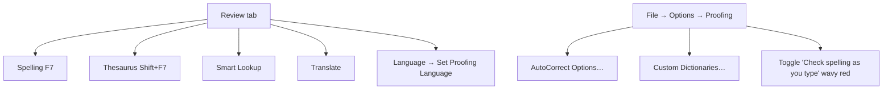
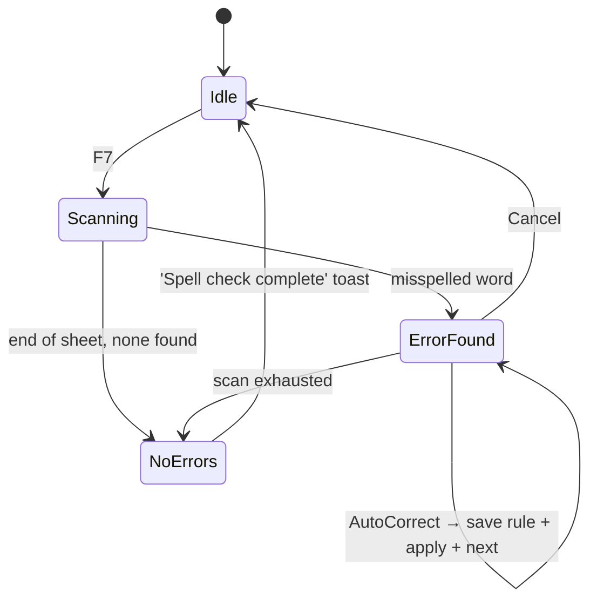
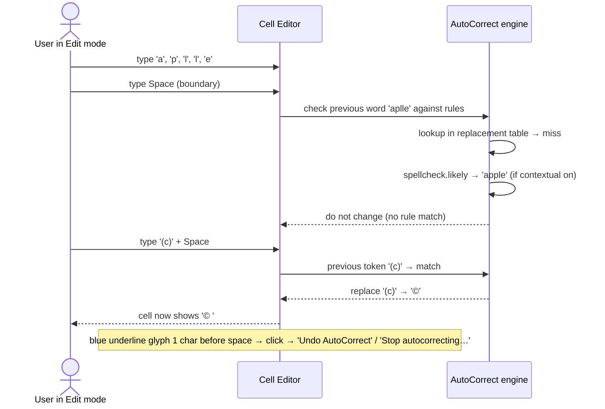
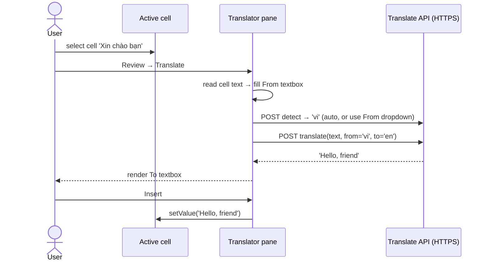

# 42 — Proofing & Language (Spell Check / AutoCorrect / Translate / Smart Lookup / Thesaurus) — UX Flow

> Spec gốc: [42-proofing-translate.md](../42-proofing-translate.md)

## 1. Surface map



## 2. Spelling dialog (F7) state machine



### Dialog mockup

```
┌─ Spelling: English (Vietnam) ──────────────────────────┐
│ Not in Dictionary:                                      │
│ ┌─────────────────────────────────────────────────────┐│
│ │ aplle                                                ││  ← editable
│ └─────────────────────────────────────────────────────┘│
│                                                         │
│ Suggestions:                                            │
│ ┌─────────────────────────────────────────────────────┐│
│ │ apple                                                ││ ◀ selected
│ │ apply                                                ││
│ │ appleseed                                            ││
│ │ ample                                                ││
│ └─────────────────────────────────────────────────────┘│
│                                                         │
│ Dictionary language: [English (Vietnam)            ▼]  │
│                                                         │
│ ┌─────────────┐ ┌──────────────┐ ┌────────────────────┐│
│ │ Ignore Once │ │ Ignore All   │ │ Add to Dictionary  ││
│ └─────────────┘ └──────────────┘ └────────────────────┘│
│ ┌─────────────┐ ┌──────────────┐ ┌────────────────────┐│
│ │   Change    │ │  Change All  │ │   AutoCorrect      ││
│ └─────────────┘ └──────────────┘ └────────────────────┘│
│ [Options…]                            [Undo Last] [Cancel]│
└─────────────────────────────────────────────────────────┘
```

## 3. Wavy red underline (real-time)

```
   A                      B
1 ┌──────────────────┬────────────────┐
2 │  aplle           │  Banana        │
3 │  ~~~~~ (red)     │                │
4 │  recieve         │  cherry        │
5 │  ~~~~~~~ (red)   │                │
6 │  apple           │  Date          │
7 │ (clean)          │                │
8 │  CEO             │  EOD           │   ← UPPERCASE: ignored
9 │ (no underline)   │                │
0 │  abc123          │  user@x.com    │   ← contains numbers / URL: ignored
   └──────────────────┴────────────────┘
```

Right-click on misspelled word:

```
┌─────────────────────────┐
│ apple                    │ ◀ top suggestions inline
│ apply                    │
│ appleseed                │
│ ────────────────────── │
│ Ignore All               │
│ Add to Dictionary        │
│ AutoCorrect            ▶ │ ─→ apple / apply / appleseed
│ Language               ▶ │
│ Spelling…                │
└─────────────────────────┘
```

## 4. Proofing Options pane (File → Options → Proofing)

```
┌─ Excel Options — Proofing ───────────────────────────────────┐
│ AutoCorrect options                                           │
│  Change how Excel corrects and formats text as you type:      │
│  [ AutoCorrect Options… ]                                     │
│                                                                │
│ When correcting spelling in Microsoft Office programs         │
│  [☑] Ignore words in UPPERCASE                                 │
│  [☑] Ignore words that contain numbers                         │
│  [☑] Ignore Internet and file addresses                        │
│  [☑] Flag repeated words                                       │
│  [☐] Enforce accented uppercase in French                      │
│  [☐] Suggest from main dictionary only                         │
│                                                                │
│  Custom Dictionaries…                                          │
│  French modes: [Traditional and new spellings              ▼] │
│  Spanish modes: [Tuteo verb forms only                     ▼] │
│                                                                │
│ When correcting spelling in Excel                              │
│  [☑] Check spelling as you type (wavy red underline)           │
│  [☑] Use contextual spelling                                   │
│                                                                │
│                                          [OK]    [Cancel]     │
└────────────────────────────────────────────────────────────────┘
```

## 5. AutoCorrect dialog

```
┌─ AutoCorrect: English (Vietnam) ───────────────────────────────┐
│ [AutoCorrect][Math AutoCorrect][AutoFormat As You Type][Actions]│
│ ─────────────────────────────────────────────────────────────│
│ [☑] Show AutoCorrect Options buttons                            │
│ [☑] Correct TWo INitial CApitals                       [Exceptions…]│
│ [☑] Capitalize first letter of sentences                       │
│ [☑] Capitalize names of days                                   │
│ [☑] Correct accidental use of cAPS LOCK key                    │
│                                                                 │
│ [☑] Replace text as you type                                    │
│   Replace: [        ]   With: (●) Plain text ( ) Formatted text │
│                          [                                     ]│
│   ┌────────────────────────┬──────────────────────────────────┐│
│   │ Replace                │ With                              ││
│   │────────────────────────┼──────────────────────────────────││
│   │ (c)                    │ ©                                 ││
│   │ (r)                    │ ®                                 ││
│   │ (tm)                   │ ™                                 ││
│   │ --                     │ —                                 ││
│   │ :)                     │ ☺                                 ││
│   │ ezcel                  │ Ezcel Spreadsheet App             ││
│   └────────────────────────┴──────────────────────────────────┘│
│                                       [Add]   [Delete]          │
│                                              [OK]    [Cancel]   │
└─────────────────────────────────────────────────────────────────┘
```

### AutoCorrect trigger sequence



### Math AutoCorrect tab

| Type | → |
|---|---|
| `\alpha` | α |
| `\beta` | β |
| `\sum` | ∑ |
| `\int` | ∫ |
| `\inf` | ∞ |
| `\to` | → |
| `\pm` | ± |
| `\neq` | ≠ |

Toggle: "Use Math AutoCorrect rules outside of math regions" — enabled means rules apply in any cell, not just inside `=` formula equation regions.

## 6. Translate pane

```
Review → Translate

┌─ Translator ────────────────────────────────┐
│ [×]                                          │
│ From:                                        │
│ ┌──────────────────────────────────────────┐│
│ │ Vietnamese                            ▼  ││
│ └──────────────────────────────────────────┘│
│ ┌──────────────────────────────────────────┐│
│ │ Xin chào bạn                              ││
│ │                                            ││
│ └──────────────────────────────────────────┘│
│                                              │
│         ↓ ↑   (swap)                          │
│                                              │
│ To:                                          │
│ ┌──────────────────────────────────────────┐│
│ │ English                                ▼ ││
│ └──────────────────────────────────────────┘│
│ ┌──────────────────────────────────────────┐│
│ │ Hello, friend                              ││
│ │                                            ││
│ └──────────────────────────────────────────┘│
│ [Insert]     [🔊 Listen]     [Copy]          │
│ ─────────────────────────────────────────── │
│ Powered by Microsoft Translator              │
│ [Set translation language defaults]          │
└──────────────────────────────────────────────┘
```



If no API key configured:

```
┌─ Translator ─────────────────────────────────┐
│ ⚠ Translation is unavailable.                 │
│ Set up an API key (Microsoft Translator /    │
│ Google Translate / DeepL) in                  │
│ File → Options → Language → Translation API. │
│                              [Set up API key]│
└──────────────────────────────────────────────┘
```

## 7. Smart Lookup pane

```
Right-click cell text → Smart Lookup

┌─ Smart Lookup ──────────────────────────────┐
│ [×]    Query: "Excel"                        │
│ ─────────────────────────────────────────── │
│ Wikipedia                                    │
│ ┌──────────────────────────────────────────┐│
│ │ Microsoft Excel is a spreadsheet …       ││
│ │ developed by Microsoft, featuring …      ││
│ │ [Read more on en.wikipedia.org]          ││
│ └──────────────────────────────────────────┘│
│                                              │
│ Web                                          │
│ ┌──────────────────────────────────────────┐│
│ │ • Microsoft Excel — Official site         ││
│ │ • Excel Functions reference               ││
│ │ • Excel community                         ││
│ └──────────────────────────────────────────┘│
│                                              │
│ Images                                       │
│ ┌──────┐ ┌──────┐ ┌──────┐                   │
│ │ img  │ │ img  │ │ img  │                   │
│ └──────┘ └──────┘ └──────┘                   │
│ ─────────────────────────────────────────── │
│ Privacy: queries sent to Microsoft / Bing.   │
│ [Manage privacy settings]                    │
└──────────────────────────────────────────────┘
```

First-time consent dialog:

```
┌─ Smart Lookup ───────────────────────────────────────┐
│ Get the most out of Smart Lookup.                     │
│ Smart Lookup uses Bing to provide contextual info.    │
│ Some content will be sent to Microsoft and Bing.      │
│ See Privacy Statement.                                │
│                                                       │
│ [☐] Don't ask me again                                │
│                            [Got it]    [Cancel]      │
└───────────────────────────────────────────────────────┘
```

## 8. Thesaurus pane (Shift+F7)

```
┌─ Thesaurus ────────────────────────────────┐
│ [×]                                         │
│ ┌──────────────────────────────────────┐  │
│ │ good                                  │  │  ← editable; Enter to re-lookup
│ └──────────────────────────────────────┘  │
│ ─────────────────────────────────────────│
│ adjective                                   │
│   excellent ▸ Insert / Copy / Look Up      │
│   fine                                     │
│   great                                    │
│   pleasant                                 │
│   wonderful                                │
│                                              │
│ noun                                        │
│   benefit                                  │
│   advantage                                │
│                                              │
│ antonyms                                    │
│   bad                                      │
│   poor                                     │
│ ─────────────────────────────────────────│
│ Powered by WordNet 3.1                      │
└─────────────────────────────────────────────┘
```

Click word → expands actions:

```
   excellent  [Insert] [Copy] [Look Up ▶]
                                    │
                                    └─ replaces query → re-lookup recursively
```

## 9. Set Proofing Language

```
Review → Language → Set Proofing Language

┌─ Language ───────────────────────────────────────────┐
│ Mark selected text as:                                │
│ ┌──────────────────────────────────────────────────┐│
│ │ Vietnamese                                ✓        ││ ◀ current
│ │ English (Vietnam)                                 ││
│ │ English (United Kingdom)                          ││
│ │ English (United States)                           ││
│ │ French (France)                                   ││
│ │ Japanese                                          ││
│ │ Korean                                            ││
│ │ ...                                               ││
│ └──────────────────────────────────────────────────┘│
│                                                       │
│ [☐] Do not check spelling or grammar                  │
│ [☐] Detect language automatically                     │
│                                                       │
│ [Set As Default]                  [OK]    [Cancel]   │
└───────────────────────────────────────────────────────┘
```

Per-cell `_fmt.proofing_language` overrides workbook default.

## 10. Background spell-check pipeline

```mermaid
flowchart LR
    Edit[Cell value changed] --> Hash[hash(text) compare to cell._spell_cache_hash]
    Hash -->|same| Skip[skip]
    Hash -->|different| Q[Enqueue to background QThread]
    Q --> Tok[Tokenize text → words]
    Tok --> Filter[Apply Options filter: skip UPPERCASE / number-containing / URL / email]
    Filter --> Look[Hunspell.spell(word) for each]
    Look --> Cache[cell._spell_cache = list[(span, suggestions)]]
    Cache --> Paint[Mark cell dirty → delegate.paint draws wavy underline]
```

## 11. User journeys

### J1 — F7 fix typo
1. F7 → first error "aplle" → Spelling dialog → Suggestions "apple, apply".
2. Click "apple" → Change → cell updated → next error.
3. Repeat → "Spell check complete" toast.

### J2 — Add custom word
1. F7 → "Ezcel" flagged.
2. Add to Dictionary → CUSTOM.DIC stores it.
3. Next F7 → not flagged.

### J3 — AutoCorrect symbol
1. Cell editor: type `(c)` + Space.
2. AutoCorrect → `(c)` becomes `©` + small blue underline.
3. Hover underline → tooltip "Undo AutoCorrect" / "Stop autocorrecting (c)".

### J4 — Custom AutoCorrect expansion
1. File → Options → Proofing → AutoCorrect Options.
2. Replace `ezcel` With `Ezcel Spreadsheet App` → Add → OK.
3. In any cell: type `ezcel` + Space → expands.

### J5 — Translate Vietnamese → English + insert
1. Select cell "Xin chào bạn" → Review → Translate.
2. Pane auto-detects Vietnamese → English shows "Hello, friend".
3. Insert → cell value replaced.

### J6 — Thesaurus chain lookup
1. Cell "good" → Shift+F7 → pane shows synonyms.
2. Click "excellent" → Look Up → pane re-queries with "excellent".
3. Insert → cell updated.

### J7 — Skip language on cell
1. Cell `=SUM(A1:A10)` (formula display "VBA code goes here" via comment) → Review → Language → Set Proofing Language.
2. Check "Do not check spelling or grammar" → OK.
3. Wavy underline removed; F7 skips cell.

## 12. Implementation hints

- **Hunspell wrapper** (`core/proofing/hunspell.py`):
  - `pyhunspell` or `cyhunspell` bindings; bundle `en_US.aff/.dic`, `vi_VN.aff/.dic` in `assets/dictionaries/`.
  - Lazy-load per language; LRU cache `spell(word) → bool` keyed on (lang, word).
- **Background scanner** (`core/proofing/scanner.py`):
  - `QThread` consuming a `QQueue` of dirty cells. Each cell processed produces `list[(char_start, char_end, suggestions)]`.
  - Throttle: max 1k cells/sec; pause when CPU > 50%.
- **Delegate wavy underline** (`ui/delegates/cell_delegate.py`):
  - On paint, for each `_spell_cache` span: `QPainterPath` zigzag at baseline + 2px, stroke 1.5px red.
- **Right-click suggestions** (`ui/menus/cell_context_menu.py`):
  - If cursor hits cached span → insert top 3 suggestions + Add to Dictionary + Ignore All entries.
- **AutoCorrect** (`core/autocorrect/autocorrect.py`):
  - Hook `QLineEdit.textEdited` in cell editor + Formula Bar. On boundary char (space, tab, `,`, `;`, `.`, `?`, `!`, Enter), examine last token.
  - Replacement table: dict loaded from JSON `assets/autocorrect/en_US.json` + user overrides `~/.ezcel/autocorrect_user.json`.
  - Capitalization rules: state machine over previous char sequence.
  - Undo: emit `AutoCorrectAppliedEvent` for ribbon undo stack.
- **Translate** (`core/translate/translator.py`):
  - Pluggable provider: Microsoft / Google / DeepL. Config in Options → Language.
  - Use `urllib` (no `requests`). Run in `QThreadPool` to keep UI responsive.
- **Smart Lookup** (`core/lookup/smart_lookup.py`):
  - Wikipedia REST `https://en.wikipedia.org/api/rest_v1/page/summary/{title}` (no key) + DuckDuckGo Instant Answer.
  - Pane: `QWebEngineView` if available, else `QTextBrowser` with HTML.
- **Thesaurus** (`core/proofing/thesaurus.py`):
  - WordNet via `nltk.corpus.wordnet` or pure-Python `wn` package; bundle compact subset (~10MB).
- **Per-cell language**: stored on `Cell._fmt.proofing_language` (3-letter code); scanner reads this to pick Hunspell dictionary.

## 13. Acceptance ↔ flow map

| AC | Where |
|---|---|
| 1 F7 dialog suggestions + Change | §2 + J1 |
| 2 Add to Dictionary | J2 |
| 3 Wavy red underline real-time | §3 + §10 |
| 4 `(c)` + space → © | §5 + J3 |
| 5 Custom AutoCorrect expand | §5 + J4 |
| 6 Translate pane + Insert | §6 + J5 |
| 7 Shift+F7 thesaurus | §8 + J6 |
| 8 Skip proofing on cell | §9 + J7 |
