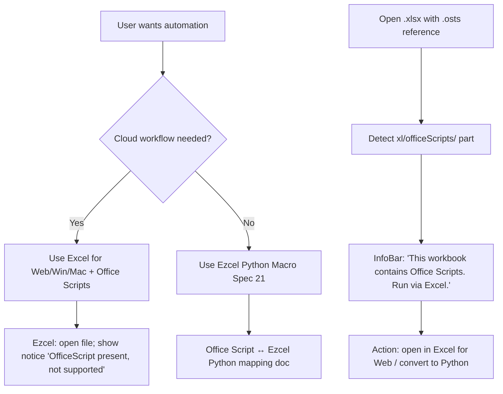
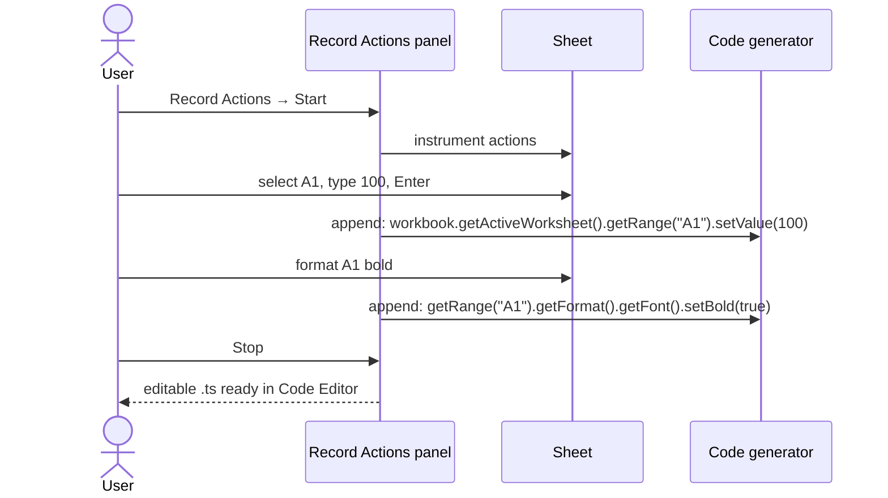
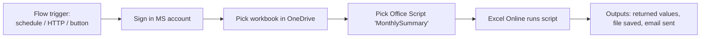
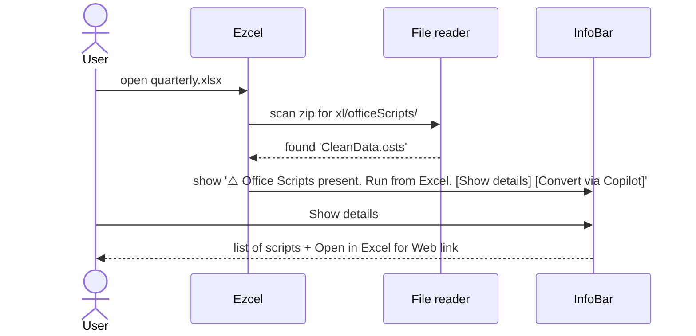
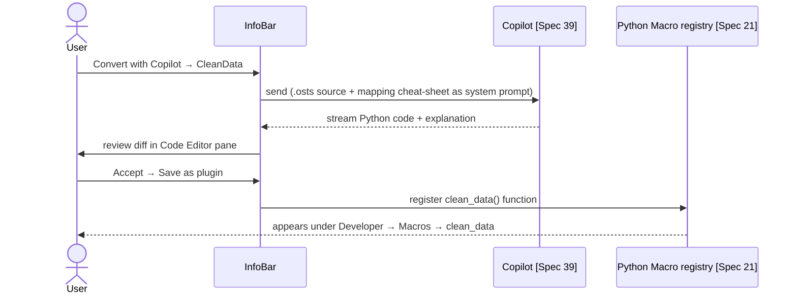
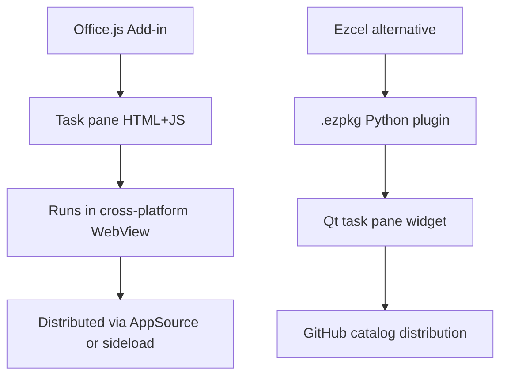

# 43 — Office Scripts (TypeScript Automation) — UX Flow

> Spec gốc: [43-office-scripts.md](../43-office-scripts.md)
>
> **Trạng thái: Decision record — Ezcel KHÔNG implement Office Scripts.** File flow này document UX **Excel chuẩn** (để dev hiểu khi đọc file `.xlsx` chứa script references) + UX **fallback Python** mà Ezcel cung cấp.

## 1. Decision branch



## 2. Excel reference — Automate tab (for documentation only)

```
Excel Automate tab (Web / Win / Mac)

┌─ Automate ──────────────────────────────────────────────────────────┐
│ [Record Actions] [New Script] [Automate a Task]                     │
│ ──────────────────────────────────────────────────────────────────│
│ All Scripts                                                          │
│ ┌─────────────────────────────────────────────────────────────────┐│
│ │ 📜 CleanData            Last edited: 2026-05-30  By: you         ││
│ │ 📜 MonthlySummary       Last edited: 2026-04-12  By: shared      ││
│ │ 📜 ExportRegionReports  Last edited: 2026-03-01  By: shared      ││
│ └─────────────────────────────────────────────────────────────────┘│
│                                                                       │
│ [Power Automate integration] [Settings]                              │
└──────────────────────────────────────────────────────────────────────┘
```

### March 2026 redesigned UI (cleaner script management)

```
┌─ Office Scripts (redesigned, March 2026) ────────────────────────────┐
│ Search: [                              🔍]    [+ New ▼]              │
│ ────────────────────────────────────────────────────────────────────│
│ ┌─ Filters ──────┐  ┌─ Script cards ────────────────────────────────┐│
│ │ All            │  │ ┌──────────────────┐ ┌──────────────────┐    ││
│ │ Recent      ◀  │  │ │ 📜 CleanData      │ │ 📜 MonthlySummary │    ││
│ │ Mine           │  │ │ Last run: 2h ago  │ │ Last run: today  │    ││
│ │ Shared with me │  │ │ ⭐ ⋯              │ │ ⭐ ⋯              │    ││
│ │ Sample scripts │  │ └──────────────────┘ └──────────────────┘    ││
│ └────────────────┘  └────────────────────────────────────────────────┘│
└────────────────────────────────────────────────────────────────────────┘
```

## 3. Office Script Editor (Excel; reference)

```
┌─ Code Editor (right pane) ──────────────────────────────────────────┐
│ Script name: [ CleanData                              ]              │
│ [▶ Run] [💾 Save] [↻ Refresh] [⋯ More]                              │
│ ──────────────────────────────────────────────────────────────────│
│  1  function main(workbook: ExcelScript.Workbook) {                  │
│  2    let sheet = workbook.getActiveWorksheet();                     │
│  3    let range = sheet.getRange("A1:B10");                          │
│  4    range.setValue(0);                                              │
│  5    range.getFormat().getFill().setColor("#FFEB9C");               │
│  6  }                                                                  │
│ ──────────────────────────────────────────────────────────────────│
│  Console                                                              │
│  > Script completed in 0.42s                                          │
└──────────────────────────────────────────────────────────────────────┘
```

### Record Actions sequence (Excel for Web)



## 4. Run from Power Automate



## 5. Ezcel behavior when opening file with Office Scripts



InfoBar mockup:

```
┌───────────────────────────────────────────────────────────────────────┐
│ 🟡 OFFICE SCRIPTS  This workbook contains 2 Office Scripts that Ezcel │
│  cannot run. Open in Excel for Web to execute, or                     │
│  convert to Ezcel Python macros.                                      │
│             [ Show details ] [ Convert with Copilot ] [ Dismiss ]    │
└───────────────────────────────────────────────────────────────────────┘
```

Show details panel:

```
┌─ Office Scripts in this workbook ────────────────────────────────┐
│ Script                  Description                Action         │
│ ──────────────────────────────────────────────────────────────│
│ CleanData              Remove dupes + format       [Convert ▶]   │
│ MonthlySummary         PivotTable + email          [Convert ▶]   │
│                                                                    │
│ [Open workbook in Excel for the Web]                              │
└────────────────────────────────────────────────────────────────────┘
```

## 6. Office Script → Ezcel Python mapping

Side-by-side cheat sheet (for "Convert with Copilot" target):

| Office Script (TypeScript)                          | Ezcel Python ([Spec 21](../21-vba-macro.md))                  |
|------------------------------------------------------|---------------------------------------------------------------|
| `function main(workbook: ExcelScript.Workbook) {…}`  | `@macro\ndef main(app):`                                       |
| `workbook.getActiveWorksheet()`                      | `app.active_sheet`                                             |
| `workbook.getWorksheets()`                           | `app.sheets`                                                   |
| `workbook.addWorksheet("New")`                       | `app.sheets.add("New")`                                        |
| `sheet.getRange("A1:B10")`                           | `sheet.range("A1:B10")`                                        |
| `range.setValue(0)`                                  | `rng.value = 0`                                                |
| `range.setValues([[1,2],[3,4]])`                     | `rng.values = [[1,2],[3,4]]`                                   |
| `range.getValues()`                                  | `rng.values`                                                   |
| `range.getFormat().getFill().setColor("#FFEB9C")`    | `rng.fill_color = "#FFEB9C"`                                   |
| `range.getFormat().getFont().setBold(true)`          | `rng.font.bold = True`                                         |
| `sheet.addTable(range, true)`                        | `sheet.add_table(rng, has_headers=True)`                       |
| `workbook.addChart(...)` ([Spec 19](../19-chart.md)) | `sheet.add_chart(...)`                                         |
| `console.log(...)`                                   | `print(...)` → Console pane                                    |
| Async function — not used                            | Native `async def` + `await app.recalc()`                       |

### Convert sequence with Copilot



## 7. Office.js add-ins (sibling concept, also out of scope)



See [Spec 58 Add-ins / AppSource](../58-add-ins-appsource.md) for `.ezpkg` system.

## 8. User journeys

### J1 — Open workbook with Office Scripts
1. Open `quarterly.xlsx`.
2. Yellow InfoBar appears: 2 Office Scripts detected.
3. Click "Show details" → list of scripts with names + descriptions.
4. Workbook itself opens read-write; scripts are inert.

### J2 — Round-trip preservation
1. Open .xlsx with Office Scripts.
2. Edit cells normally; save.
3. Ezcel preserves `xl/officeScripts/` part unmodified on save → file still has runnable scripts in Excel.

### J3 — Convert to Ezcel macro via Copilot
1. InfoBar → Convert with Copilot → pick "CleanData".
2. Copilot produces Python equivalent in side-by-side diff view.
3. Accept → script registered as `clean_data()` → Developer → Macros → Run.
4. Original `.osts` left intact for Excel users.

### J4 — User opens file in Excel after Ezcel edits
1. Save in Ezcel → file written including `xl/officeScripts/` round-tripped.
2. Open in Excel → scripts still listed in Automate tab + runnable.

## 9. Implementation hints

- **Detection** (`io_utils/office_scripts_detect.py`):
  - On open, scan ZIP for `xl/officeScripts/` directory. List `.osts` entries.
  - Parse `_rels` to map references.
  - Emit `OfficeScriptsDetectedEvent(scripts: list[ScriptRef])`.
- **Round-trip preservation** (`io_utils/passthrough.py`):
  - Treat `xl/officeScripts/`, `xl/customXml/`, unknown extension parts as opaque blobs. On save, copy bytes verbatim into output ZIP. Do **not** drop them.
- **InfoBar** (`ui/infobar/office_scripts_bar.py`):
  - Yellow banner widget shown in main window. Triggered by detection event. Dismissible per-file (remember in session).
- **Convert with Copilot** (`features/convert_script.py`):
  - Compose prompt: `system = "You are a translator from Office Script TypeScript to Ezcel Python macros. Use this mapping:" + mapping_cheat_sheet`. `user = .osts source`.
  - Show side-by-side diff using `ui/diff_view.py`.
  - On accept: write `~/.ezcel/plugins/<scriptname>.py` and import via macro loader.
- **Plugin loader**: reuse Spec 21 macro registry. Each converted script becomes a `@macro` function.
- **Documentation**: keep `docs/office_script_mapping.md` (this file §6) as the authoritative cheat-sheet, used both for human docs and as Copilot context.
- **What NOT to build**: TypeScript runtime, ExcelScript API surface, Record Actions UI, Power Automate connector. All explicitly out of scope.

## 10. Acceptance ↔ flow map

Spec 43 has no AC (decision record). This flow document fulfils:
- **Decision documented** §1
- **Excel behavior referenced** §2-4
- **Ezcel detection + InfoBar** §5
- **Conversion path** §6 + J3
- **Round-trip safety** J2 + J4
