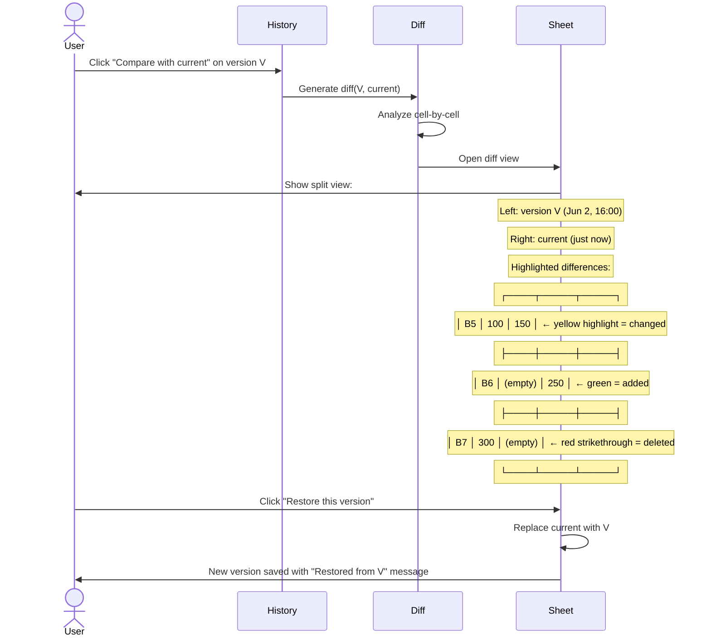
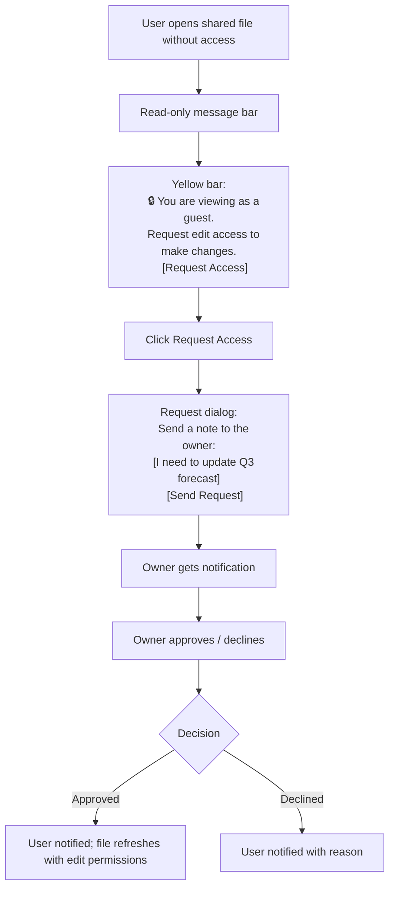

# UX Flow — Spec 44 Collaboration & Version History

> Spec gốc: [../44-collaboration-version-history.md](../44-collaboration-version-history.md)

## Sharing entry points

```
1. Title bar Share button (top-right):
   ┌─ Title Bar ─────────────────────────────────────┐
   │ Sales.xlsx  🔍   [Share]  [💬 Comments]  [👤]  │
   └──────────────────────────────────────────────────┘
                       ▲

2. File → Share submenu:
   - Share with people
   - Email (Send as attachment / link / PDF)
   - Online presentation (Skype/Teams)
   - Publish to Yammer/Stream

3. Right-click cells → New Comment (Spec 26)

4. Real-time multi-user editing — automatic for cloud files
```

## Share dialog

```
Click "Share" button (cloud file only):

┌─ Share "Sales.xlsx" ─────────────────────────────────┐
│ Send link:                                              │
│                                                          │
│ 🌐 Anyone with the link can edit                         │
│    Specific people can edit                              │
│    🔗 [Copy link] [Settings ⚙]                           │
│                                                          │
│ Send to:                                                 │
│ 👥 [To: type a name, group, or email...        ] [@]    │
│    [Hoang Tran ✕] [Trang Nguyen ✕]                      │
│                                                          │
│ Message (optional):                                      │
│ ┌────────────────────────────────────────────────────┐ │
│ │ Please review Q3 numbers and add notes.              │ │
│ └────────────────────────────────────────────────────┘ │
│                                                          │
│ Permission settings:                                     │
│ ● Can edit (default)                                     │
│ ◯ Can review (comments only)                             │
│ ◯ Can view (read-only)                                   │
│                                                          │
│ Expiration date: [No expiration              ▼]          │
│ Password: ☐ Set password                                │
│ ☐ Block download                                         │
│                                                          │
│         [Send]  [Copy Link]  [Outlook]   [ Cancel ]    │
└──────────────────────────────────────────────────────────┘
```

## Permission tiers

```
Editor (can edit):
- Modify cells, formulas, formatting
- Add/delete sheets, charts, PivotTables
- Manage data sources
- Cannot reshare unless owner permits

Reviewer (can comment):
- Read all content
- Add Comments and Notes
- Cannot modify cell values
- Can suggest changes (with separate Suggested Edits feature)

Viewer (read-only):
- View content
- Cannot modify or comment
- Can copy data to another workbook (unless block-download)

Owner:
- All Editor permissions
- Plus: change sharing, delete file, transfer ownership
```

## Co-author presence

```
When multiple users open same file:

Title bar shows colored avatars:
┌─ Title Bar ──────────────────────────────────────────┐
│ Sales.xlsx     🔍 [Share] [💬] [👤🟢G🟣H🟧T] [_][□][×]│
└────────────────────────────────────────────────────────┘
                                  ▲▲▲
                                  3 avatars = current users
                                  G = Giang (green border)
                                  H = Hoang (purple border)
                                  T = Trang (orange border)

Hover avatar → name + email + current cell location:
┌─────────────────────────┐
│ 🟢 Giang Nguyen           │
│ giang@company.com         │
│ Working on Sales!B5       │
└─────────────────────────────┘

Click avatar → jump to their current cell location
```

## Real-time selection display

```
Co-authors' selections shown on grid:

   Col A  B  C   D   E
  ┌──┬──┬──┬──┬──┬──┐
1 │  │  │  │  │  │  │
  ├──┼──┼──┼──┼──┼──┤
2 │  │  │  │  │  │  │
  ├──┼──┼──┼──┼──┼──┤
3 │  │  │HG│HG│HG│  │  ← Hoang's selection (purple border)
  ├──┼──┼──┼──┼──┼──┤  HG label = "Hoang"
4 │  │  │  │  │  │  │
  ├──┼──┼──┼──┼──┼──┤
5 │ TG  │  │  │  │  │  ← Trang's active cell (orange border)
  ├──┼──┼──┼──┼──┼──┤  TG label = "Trang"
6 │  │  │  │  │  │  │
  └──┴──┴──┴──┴──┴──┘

User's own cursor: standard accent #217346 border (Spec 50).
Others': their assigned color (from avatar palette) + name chip floating near cell.

Live updates via WebSocket / SignalR (Microsoft Graph).
```

## Inline cell change indicators

```
When another user edits a cell:

   Col A  B  C   D
  ┌──┬──┬──┬──┐
2 │  │XX│  │  │  ← X = edit flash (yellow background, fades over 2s)
  ├──┼──┼──┼──┤
3 │  │  │  │  │
  └──┴──┴──┴──┘

Animation:
1. Bright yellow flash on edited cell (200ms)
2. Fade to light yellow over 1500ms
3. Disappear

Hover edited cell within 5min → tooltip "Edited by Hoang 30s ago"
```

## Version History

```
File → Info → Version History (or File menu directly):

┌─ Version History ─────────────────────────────────────┐
│ Today                                                   │
│ ┌─────────────────────────────────────────────────┐  │
│ │ 14:35 (just now) — 🟢 Giang Nguyen + Copilot      │  │
│ │ "Modified Sales total formula"                      │  │
│ │ [Open] [Restore]                                    │  │
│ ├─────────────────────────────────────────────────┤  │
│ │ 14:20 — 🟣 Hoang Tran                              │  │
│ │ "Updated Q3 numbers"                                │  │
│ │ [Open] [Restore] [Compare with current]             │  │
│ ├─────────────────────────────────────────────────┤  │
│ │ 11:45 — 🟧 Trang Nguyen                             │  │
│ │ "Added Customer column"                             │  │
│ │ [Open] [Restore]                                    │  │
│ └─────────────────────────────────────────────────────┘  │
│                                                          │
│ Yesterday (Jun 2)                                       │
│ ┌─────────────────────────────────────────────────┐  │
│ │ 16:00 — 🟢 Giang Nguyen                            │  │
│ │ [Open] [Restore]                                    │  │
│ ├─────────────────────────────────────────────────┤  │
│ │ 09:15 — 🟣 Hoang Tran                              │  │
│ └─────────────────────────────────────────────────────┘  │
│                                                          │
│ Last week...                                            │
│                                                          │
│ Retention: keeps versions for 30 days (M365 free)       │
│           90 days (M365 Business)                       │
│           Forever w/ retention policy (Enterprise)      │
│                                                          │
│ [Auto-save version every: 10 min ▼]                     │
└──────────────────────────────────────────────────────────┘
```

## Compare versions



## Show Changes pane (modern 2026)

```
Review tab → Show Changes:

┌─ Changes ──────────────────────────────────────────────┐
│ Sort: [Newest first ▼]   Filter: [All sheets, all  ▼] │
│ ────────────────────────────────────────────────────  │
│                                                          │
│ 🟢 Giang Nguyen + Copilot           5 min ago          │
│ ─────────────────────────────────                      │
│ Sheet1!B5: =SUM(A1:A10) → =SUMIFS(A:A, B:B, ">0")     │
│ Sheet1!B12: =A12+B12 → =A12+VALUE(B12)                  │
│                                                          │
│ Edit prompt: "Fix formula errors in column F"            │
│ 💬 Reply                                                │
│ ────────────────────────────────────────────────────  │
│                                                          │
│ 🟣 Hoang Tran                       30 min ago         │
│ ─────────────────────────────────                      │
│ Sheet1!A2: changed value "10" → "15"                    │
│ Sheet1!C5: deleted value "Old Note"                     │
│                                                          │
│ ────────────────────────────────────────────────────  │
│                                                          │
│ 🟧 Trang Nguyen                     1h ago             │
│ ─────────────────────────────────                      │
│ Inserted row above row 5 (3 cells added)                │
│ Sheet1!A5: "New Customer"                               │
│ Sheet1!B5: "TBD"                                         │
│ Sheet1!C5: 0                                             │
│                                                          │
│ ────────────────────────────────────────────────────  │
│                                                          │
│ Earlier today...                                        │
│ ▶ 6 more changes (collapsed)                            │
└──────────────────────────────────────────────────────────┘

Click any change → highlight affected cell in grid
Hover person name → presence info (online/offline/last seen)
Copilot attribution shows ✦ icon when AI was used
```

## Track Changes (legacy — Review tab)

```
Note: Track Changes in Excel is mostly retired in modern versions.
Show Changes (above) is the modern replacement.

Legacy Track Changes:
- Review → Track Changes → Highlight Changes
- ☑ Track changes while editing
- ☑ When: All / Since I last saved / Not yet reviewed / Since date
- ☑ Who: Everyone / Specific person
- ☑ Where: range
- Output: changes annotated with author tooltip

Still available but discouraged for cloud workbooks.
Use Show Changes + Comments instead.
```

## Microsoft Teams integration

```
Files shared in Teams:
- Excel files in channel/chat → opens directly in Teams
- Co-authoring built-in
- Comments cross-link with Teams messages
- Loop components: embed live cells in Teams chat

Right-click cell → Loop component → "Send to Teams":
→ Cell becomes live reference in Teams message
→ Edits to cell update Teams display in real-time
→ Comments in Teams thread sync to Excel comment thread
```

## Permission elevation (request access)



## Implementation hints cho Slave

- **Cloud sync transport**:
  - Best: integrate Microsoft Graph API (auth via OAuth 2.0) for OneDrive/SharePoint.
  - Alternative: WebSocket server (custom backend) for proprietary sync.
  - Local file mode: no collaboration (single-user).

- **Operational Transformation (OT)** or **CRDT** for concurrent edits:
  - Cell-level granularity (atomic edits).
  - Each edit: `{type, user, timestamp, cell, old_value, new_value}`.
  - Server: applies ops in order, broadcasts to others.
  - Client: applies ops to local state; rebases pending local ops.

- **Presence**:
  - WebSocket connection per user.
  - Heartbeat every 30s with current selection.
  - Broadcast to all clients on change.
  - Render others' selections as colored overlays in grid.

- **Color assignment**: hash user ID → color from preset palette (8-10 distinguishable colors).

- **Edit flash animation**:
  ```python
  def show_edit_flash(cell):
      overlay = QGraphicsRectItem(cell.rect)
      overlay.setBrush(QColor(255, 255, 0, 200))  # yellow
      scene.addItem(overlay)
      
      anim = QPropertyAnimation(overlay, b"opacity")
      anim.setDuration(1700)
      anim.setStartValue(1.0)
      anim.setEndValue(0.0)
      anim.finished.connect(lambda: scene.removeItem(overlay))
      anim.start()
  ```

- **Version History**:
  - Periodically snapshot workbook to versioned blob storage (every save + every 10 min).
  - Metadata: author, timestamp, change summary (computed by diff vs previous).
  - UI: list versions; "Open" loads in read-only mode; "Restore" copies to current.

- **Diff algorithm**: cell-by-cell comparison; categorize as added/deleted/changed; render side-by-side QSplitter.

- **Show Changes pane**: log of all atomic edits with author/timestamp; group by recent activity; clickable to navigate.

- **Permission model**: per-file ACL:
  ```python
  class FilePermission:
      file_id: str
      user_id: str
      role: Literal["owner", "editor", "reviewer", "viewer"]
      expires_at: datetime | None
      block_download: bool
  ```

- **Share dialog**: standard `QDialog` with email autocomplete (queries Microsoft Graph for users in tenant).

- **Loop components** (Teams integration): out of scope for v1; reference for future.

- **Conflict resolution** (when same cell edited simultaneously):
  - Last-writer-wins (simple, default).
  - Show banner "Your changes conflict — view options" + dialog with both versions.
  - User picks which to keep.
