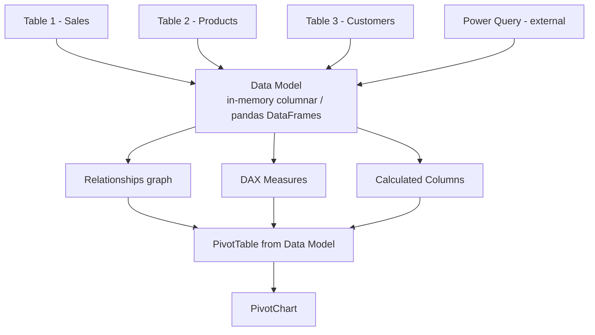
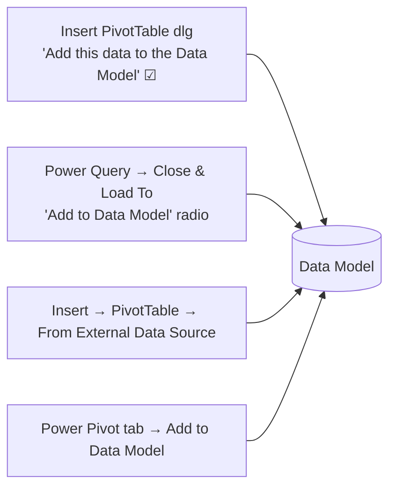
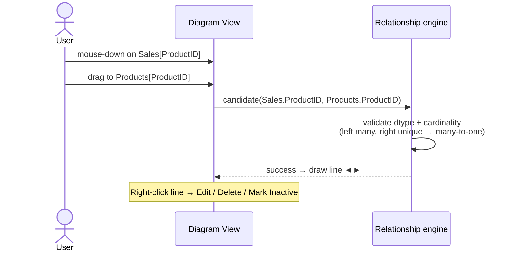
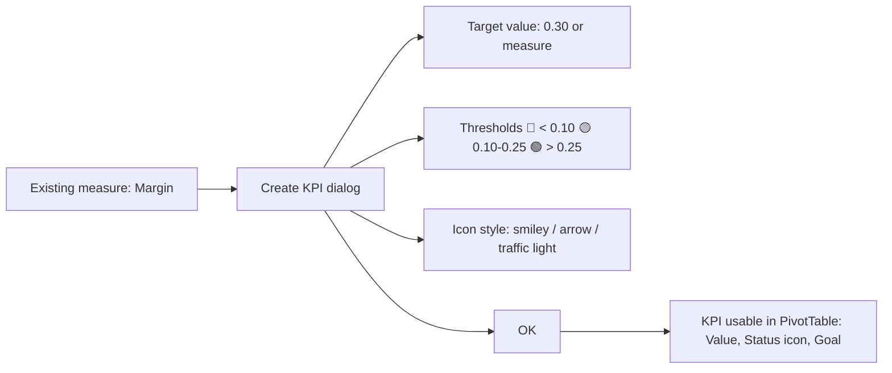
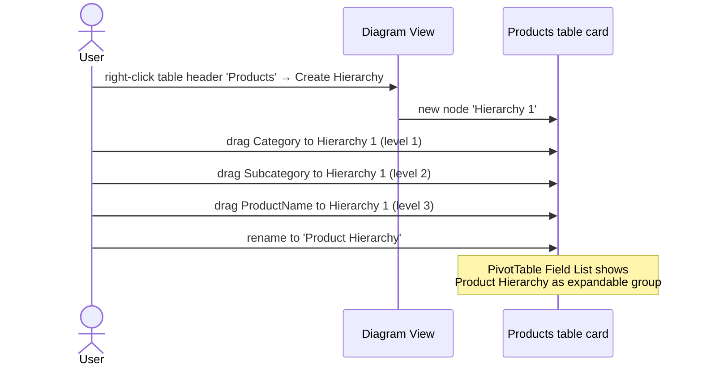
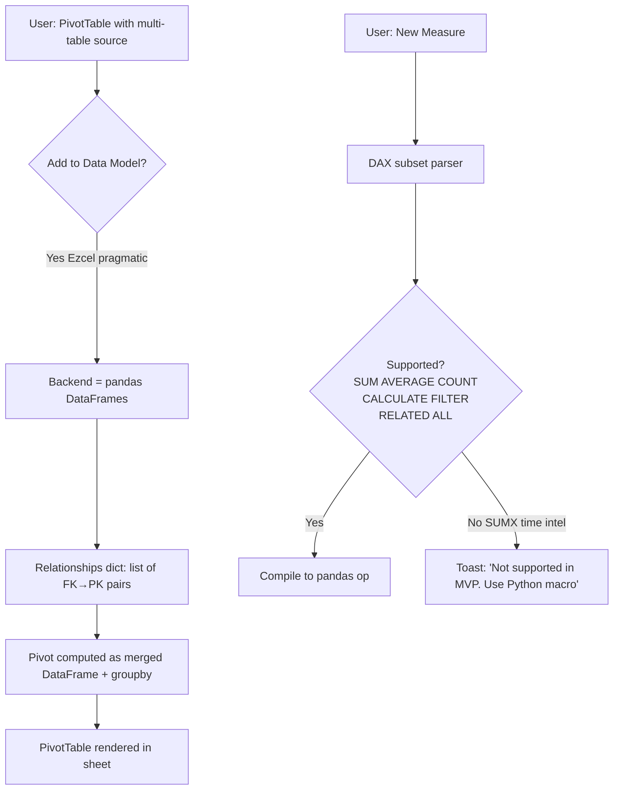

# 45 — Power Pivot, Data Model, DAX — UX Flow

> Spec gốc: [45-power-pivot-data-model.md](../45-power-pivot-data-model.md)
>
> **Scope**: Full DAX engine = out of scope MVP. This flow covers (a) Excel reference UX, (b) Ezcel pragmatic subset (pandas backend + minimal DAX), and (c) the Manage / Diagram / Measures windows.

## 1. Layer architecture



## 2. Adding data to the Data Model



### Insert PivotTable dialog with the toggle

```
┌─ Create PivotTable ──────────────────────────────────────┐
│ Choose the data you want to analyze:                      │
│   (●) Select a table or range                             │
│       Table/Range: [Sales[#All]                       ][⤴]│
│   ( ) Use an external data source                          │
│       [Choose Connection…]                                 │
│                                                            │
│ Choose where to place the PivotTable:                      │
│   (●) New Worksheet                                        │
│   ( ) Existing Worksheet  Location: [                  ][⤴]│
│                                                            │
│ [☑] Add this data to the Data Model    ◀ ★ key toggle      │
│                                                            │
│                                       [OK]    [Cancel]   │
└──────────────────────────────────────────────────────────┘
```

## 3. Power Pivot tab on ribbon

```
┌─ Power Pivot ──────────────────────────────────────────────────────┐
│ [Manage] [Measures ▼] [KPIs ▼] [Add to Data Model] [Update All] … │
└────────────────────────────────────────────────────────────────────┘
        │
        ▼
   Manage → opens Power Pivot window (modal-less, separate top-level window)
```

## 4. Power Pivot window — Data View

```
┌─ Power Pivot for Excel ─────────────────────────────────────────────┐
│ File  Home  Design  Advanced                          [ - □ × ]   │
│ ────────────────────────────────────────────────────────────────│
│ Home: Paste / From DB / From Data Service / From Other / Refresh  │
│       Format / PivotTable / Calculations / View …                  │
│ ────────────────────────────────────────────────────────────────│
│ ┌─ Tabs (one per table) ────────────────────────────────────────┐│
│ │ [▢ Sales] [▢ Products] [▢ Customers]                          ││
│ └────────────────────────────────────────────────────────────────┘│
│ ┌─ Data Grid ────────────────────────────────────────────────────┐│
│ │ Date       │ Product │ Region │ Sales │ Cost │ Add Column...   ││
│ │───────────┼─────────┼────────┼───────┼──────┼─────────────────││
│ │ 2026-01-01 │ P1      │ North  │ 100   │ 40   │                 ││
│ │ 2026-01-02 │ P2      │ South  │ 200   │ 90   │                 ││
│ │ 2026-01-03 │ P1      │ East   │ 150   │ 60   │                 ││
│ │ …          │ …       │ …      │ …     │ …    │                 ││
│ └────────────────────────────────────────────────────────────────┘│
│ ┌─ Measure Grid (under data) ───────────────────────────────────┐│
│ │ TotalSales := SUM(Sales[Sales])                                ││
│ │ AvgSales   := AVERAGE(Sales[Sales])                            ││
│ │ Margin     := DIVIDE([TotalSales]-SUM(Sales[Cost]),[TotalSales])││
│ └────────────────────────────────────────────────────────────────┘│
│                                                                     │
│ Bottom toolbar: [Data View] [Diagram View]  Rows: 12,345           │
└─────────────────────────────────────────────────────────────────────┘
```

### Add Calculated Column UX

```
Click "Add Column..." header → cursor in formula box above grid
   ↓
formula bar:  = Sales[Quantity] * Sales[Price]
   ↓
Enter → new column "Calculated Column 1" populated per row
   ↓
Double-click header → rename to "Revenue"
```

## 5. Diagram View

```
┌─ Power Pivot — Diagram View ────────────────────────────────────────┐
│                                                                       │
│  ┌─────────────┐                  ┌──────────────┐                  │
│  │ Sales       │                  │ Products     │                  │
│  │─────────────│   ProductID      │──────────────│                  │
│  │ Date        │ ◄──────────────► │ ProductID    │                  │
│  │ ProductID  *│  many-to-one     │ Name         │                  │
│  │ Region      │                  │ Category     │                  │
│  │ Quantity    │                  │ Price        │                  │
│  │ Sales       │                  └──────────────┘                  │
│  │ Cost        │                                                     │
│  │ ⌥ Revenue   │                                                     │
│  └─────────────┘                                                     │
│         ▲                                                             │
│         │ CustomerID                                                  │
│         │ many-to-one                                                 │
│         ▼                                                             │
│  ┌──────────────┐                                                    │
│  │ Customers    │                                                    │
│  │──────────────│                                                    │
│  │ CustomerID   │                                                    │
│  │ Name         │                                                    │
│  │ Country      │                                                    │
│  └──────────────┘                                                    │
│                                                                       │
│  Bottom toolbar: [Data View] [Diagram View]                          │
└───────────────────────────────────────────────────────────────────────┘
```

### Drag-create relationship sequence



### Edit Relationship dialog

```
┌─ Edit Relationship ──────────────────────────────────────────┐
│ Table 1:                                                      │
│ [Sales                                                  ▼]   │
│ Column (Foreign):                                             │
│ [ProductID                                              ▼]   │
│                                                                │
│ Table 2 (Lookup):                                             │
│ [Products                                               ▼]   │
│ Column (Primary):                                             │
│ [ProductID                                              ▼]   │
│                                                                │
│ Cardinality:        [Many to One (*:1)                  ▼]   │
│ Cross filter direction:  [Single                        ▼]   │
│ [☑] Make this relationship active                              │
│                                          [OK]    [Cancel]    │
└────────────────────────────────────────────────────────────────┘
```

## 6. DAX Measure flow

```mermaid
flowchart TD
    A[Power Pivot tab → Measures → New Measure] --> Dlg[Measure dialog]
    Dlg --> Name[Measure name: TotalSales]
    Dlg --> Tbl[Home table: Sales]
    Dlg --> Formula[Formula: =SUM Sales[Sales]]
    Dlg --> Fmt[Number format: $#,##0]
    Dlg --> Check[Check Formula button → IntelliSense]
    Check --> OK[OK → measure registered]
    OK --> PT[Appears in PivotTable Field List → drag to Values]
```

### Measure dialog

```
┌─ Measure ─────────────────────────────────────────────────────┐
│ Table name:  [Sales                                       ▼]  │
│ Measure name:[TotalSales                                   ]  │
│ Description: [Sum of Sales[Sales]                          ]  │
│ Formula:     fx                                                │
│ ┌──────────────────────────────────────────────────────────┐ │
│ │ =SUM(Sales[Sales])                                         │ │
│ └──────────────────────────────────────────────────────────┘ │
│ [Check formula] No errors in formula ✓                         │
│                                                                 │
│ Formatting Options                                              │
│   Category: [Currency                                      ▼]  │
│   Format:   [$ #,##0                                       ▼]  │
│                                                                 │
│                                              [OK]    [Cancel] │
└────────────────────────────────────────────────────────────────┘
```

### IntelliSense / autocomplete

```
Formula editor:
   = CALC|
            ┌──────────────────┐
            │ CALCULATE       │ ◀ highlighted
            │ CALCULATETABLE  │
            │ CALENDAR        │
            │ CALENDARAUTO    │
            └──────────────────┘

   Selecting CALCULATE → ScreenTip:
   CALCULATE(<expression>, [<filter1>], [<filter2>], …)
   Evaluates an expression in a modified filter context.
```

## 7. KPI flow



### KPI dialog

```
┌─ Key Performance Indicator (KPI) ─────────────────────────────────┐
│ KPI base field (value):  [Margin                              ▼] │
│ KPI Status                                                         │
│   ( ) Absolute value: [          ]                                │
│   (●) Measure:         [TargetMargin                          ▼] │
│                                                                    │
│   Define status thresholds:                                       │
│   ◀──🔴────│────🟡────│────🟢──▶                                  │
│        0.10        0.25        ∞                                  │
│        [0.10]      [0.25]                                          │
│                                                                    │
│   Select icon style:                                              │
│   (●) 🔴 🟡 🟢   ( ) ▼ ◆ ▲   ( ) ☹ 😐 😊                       │
│                                                                    │
│                                              [OK]    [Cancel]    │
└────────────────────────────────────────────────────────────────────┘
```

### KPI in PivotTable Field List

```
PivotTable Field List
┌─────────────────────────┐
│ 🔍 Search                │
│ ─────────────────────── │
│ ☐ Sales                 │
│ ☐ Products              │
│ ☐ Customers             │
│   ☐ Calculated columns  │
│ ▼ ☐ KPIs                │
│     ☐ Margin            │
│       Value             │
│       Goal              │
│       Status            │
└─────────────────────────┘
```

## 8. Hierarchy flow



PivotTable visual:

```
   Row Labels
   ─────────────────────
   ▼ Beverages              ← Category
     ▼ Soft Drinks          ← Subcategory
        Coca-Cola           ← ProductName
        Pepsi
     ▶ Juices
   ▶ Snacks
   ▶ Dairy
```

## 9. DAX vs Excel formula cheat-sheet

| Goal                       | Excel formula                                       | DAX                                                                  |
|----------------------------|------------------------------------------------------|----------------------------------------------------------------------|
| Sum a column               | `=SUM(A1:A1000)`                                     | `=SUM(Sales[Amount])`                                                |
| Conditional sum            | `=SUMIF(A:A, ">100", B:B)`                           | `=CALCULATE(SUM(Sales[Amount]), Sales[Amount]>100)`                  |
| Lookup from related table  | `=VLOOKUP(A1, Products!A:B, 2, FALSE)`               | `=RELATED(Products[Price])`                                          |
| Count distinct             | `=SUMPRODUCT(1/COUNTIF(...))`                        | `=DISTINCTCOUNT(Customers[CustomerID])`                              |
| Year-over-year             | manual cell math                                     | `=CALCULATE([Sales], SAMEPERIODLASTYEAR('Date'[Date]))`              |
| Top N value                | `=LARGE(A:A, 1)`                                     | `=CALCULATE([Sales], TOPN(1, Customers, [Sales]))`                   |
| Variables                  | n/a                                                  | `VAR x = SUM(...) RETURN IF(x>0, x*1.1, 0)`                          |
| Switch on value            | `=IFS(A1=1,…,A1=2,…)`                                | `=SWITCH(TRUE(), [m]<10,"low", [m]<50,"med","high")`                 |

## 10. Ezcel-pragmatic flow (subset)



Ezcel UI minimal:

```
Power Pivot tab (Ezcel build)
┌──────────────────────────────────────────────────────────┐
│ [Manage Model] [New Measure] [Relationships] [Refresh]    │
└──────────────────────────────────────────────────────────┘

Manage Model window (Ezcel)
┌─ Data Model ──────────────────────────────────────────────────┐
│ Tables                          Diagram                        │
│ ┌─ Sales (1,250 rows)         │ (boxes + arrows as §5)        │
│ │   Date date                                                  │
│ │   ProductID int                                              │
│ │   Sales decimal                                              │
│ ├─ Products (24 rows)                                          │
│ ├─ Customers (480 rows)                                        │
│ │                                                              │
│ │ Measures                                                     │
│ │   TotalSales = SUM(Sales[Sales])     [✏] [🗑]                │
│ │   AvgSales   = AVERAGE(Sales[Sales]) [✏] [🗑]                │
│ │   [+ New Measure]                                            │
│ └────────────────────────────────────────────────────────────┘ │
│ [Data] [Diagram] [Measures]                                    │
└────────────────────────────────────────────────────────────────┘
```

## 11. User journeys

### J1 — Add table to model + relationship
1. Sales table → Insert → PivotTable → ☑ Add to Data Model → OK.
2. Power Pivot → Manage → Diagram View.
3. Right-click empty area → Add Table from Workbook → pick Products.
4. Drag Sales[ProductID] to Products[ProductID] → many-to-one line.

### J2 — Create measure + use in pivot
1. Power Pivot → Measures → New Measure.
2. Name: `TotalSales`, formula `=SUM(Sales[Sales])`, format Currency.
3. Check Formula → ✓ → OK.
4. PivotTable Field List → `TotalSales` shows under Sales table → drag to Values area.

### J3 — Filter context with CALCULATE
1. New Measure: `NorthSales := CALCULATE([TotalSales], Sales[Region]="North")`.
2. Drag to Values → cell shows sum filtered to Region North only.

### J4 — KPI with target
1. Measures → `TargetMargin := 0.30`.
2. Existing measure `Margin` → Create KPI → target measure `TargetMargin` → thresholds 0.10 / 0.25 → smiley icons.
3. PivotTable Field List → Margin KPI Status → drag to Values → cells show 😊 / 😐 / ☹.

### J5 — Hierarchy
1. Diagram → Products → right-click → Create Hierarchy.
2. Drag Category, Subcategory, ProductName → rename "Product Hierarchy".
3. PivotTable → drag Product Hierarchy to Rows → 3-level drill-down.

### J6 — Ezcel limitation
1. New Measure: `RunningTotal := CALCULATE([TotalSales], FILTER(ALL('Date'), 'Date'[Date]<=MAX('Date'[Date])))`.
2. Ezcel parser hits `FILTER(ALL(...))` time-intel pattern → toast "DAX construct not supported in MVP; consider [Spec 21] Python macro".

## 12. Implementation hints (Ezcel subset)

- **Data Model store** (`core/data_model/store.py`):
  - `DataModel { tables: dict[str, pd.DataFrame], relationships: list[Relationship], measures: dict[str, Measure], kpis: dict[str, KPI], hierarchies: dict[str, Hierarchy] }`.
  - Persist as JSON sidecar in xlsx (`xl/dataModel/model.json`) — own format until openpyxl supports.
- **Relationship engine** (`core/data_model/relationships.py`):
  - Validate FK type matches PK type; check PK uniqueness; compute cardinality.
  - Index lookup tables for join performance.
- **DAX parser (subset)** (`core/dax/parser.py`):
  - Lark/pyparsing grammar for: SUM, AVERAGE, COUNT, MIN, MAX, DIVIDE, IF, SWITCH, CALCULATE, FILTER, RELATED, ALL, `[Measure]` reference, `Table[Column]` reference, VAR/RETURN.
  - AST → pandas operation tree. Cache compiled lambda per measure.
  - For unsupported tokens (SUMX, EARLIER, time intel) → raise `DaxNotSupportedError` → toast.
- **PivotTable integration** (`core/pivot/data_model_source.py`):
  - When pivot source = Data Model, build merged DataFrame on demand using relationships graph (BFS from value table to row/col tables).
  - Apply DAX measure on filtered subgroup.
- **Manage window** (`ui/power_pivot/manage_window.py`):
  - Modal-less `QMainWindow` with bottom `Data / Diagram / Measures` tab strip.
  - Diagram view = `QGraphicsView` with table card items + line items.
- **Measure dialog** (`ui/dialogs/measure_dialog.py`):
  - Formula edit + Check Formula button → run parser, show errors inline.
  - IntelliSense via existing function autocomplete framework ([Spec 12](../12-formula-system.md)).
- **KPI dialog** (`ui/dialogs/kpi_dialog.py`):
  - Threshold slider widget with 3 zones; icon style radio group.
- **xlsx I/O**:
  - On open: detect `xl/model/item.data` (Excel encrypted columnar) → cannot parse; show warning "Existing Excel Data Model present, switch to Ezcel pragmatic model" + offer to rebuild from source tables.
  - On save: write Ezcel sidecar JSON; preserve original Excel model bytes if user did not edit it (round-trip).

## 13. Acceptance ↔ flow map (minimal viable)

| AC | Where |
|---|---|
| 1 PivotTable + 'Add to Data Model' | §2 + J1 |
| 2 Manage → Diagram View tables | §5 + J1 |
| 3 Drag ProductID → relationship line | §5 + J1 |
| 4 Create Measure `TotalSales` shows in Field List | §6 + J2 |
| 5 Filter Region=North → measure recomputes | §10 + J3 |
