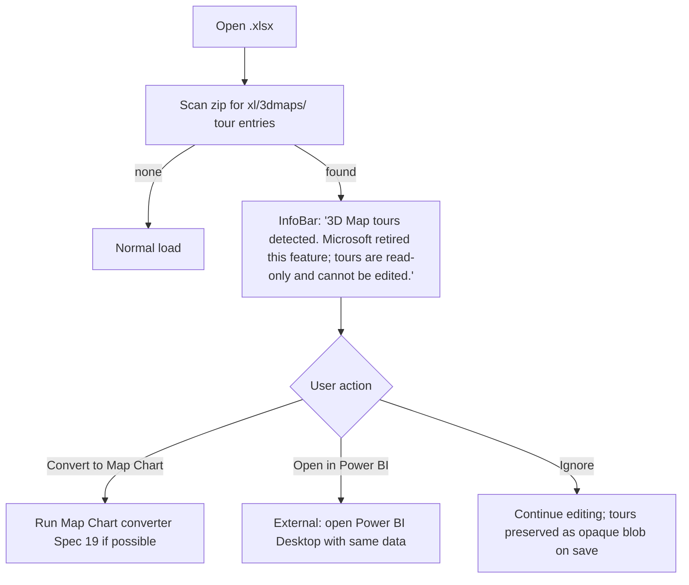
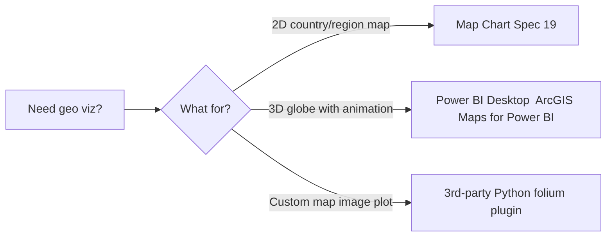

# 46 — 3D Maps (Power Map) — UX Flow

> Spec gốc: [46-3d-maps.md](../46-3d-maps.md)
>
> **Status: RETIRED bởi Microsoft (2024-2025).** Insert → 3D Map button đã gỡ khỏi Microsoft 365 modern ribbon. File `.xlsx` cũ chứa 3D Map data từ Excel 2016-2021 vẫn open được nhưng KHÔNG view/edit 3D scene. **Ezcel: out of scope vĩnh viễn.** Flow này là **decision record + legacy reference** cho lúc gặp file cũ.

## 1. Decision tree khi gặp file 3D Maps



## 2. InfoBar mockup

```
┌────────────────────────────────────────────────────────────────────────┐
│ 🟡 3D MAP TOURS  This workbook contains 3D Map / Power Map tours.      │
│ Microsoft retired this feature in 2024-2025; Ezcel preserves the data │
│ on save but cannot render the 3D scene.                                │
│   [ Show details ] [ Convert to Map Chart ] [ Open in Power BI ] [ × ]│
└────────────────────────────────────────────────────────────────────────┘
```

Show details panel:

```
┌─ 3D Map tours in this workbook ─────────────────────────────────┐
│ Tour              Scenes   Visualization   Source range          │
│ ─────────────────────────────────────────────────────────────│
│ Sales Tour 2024     5      Stacked Col     Sales!A1:F1000      │
│ Customer Heat       3      Heat Map        Customers!A1:E450   │
│ ─────────────────────────────────────────────────────────────│
│ Note: data preserved; visualization cannot be edited.            │
└──────────────────────────────────────────────────────────────────┘
```

## 3. Legacy reference (Excel 2016-2021 only — for context)

For developers reading old files. Brief reference to what 3D Maps UI used to look like.

### Window layout

```
┌─ 3D Map (legacy 2016-2021) ────────────────────────────────────────┐
│ Home │ Tour │ Tools                                                 │
│ ──────────────────────────────────────────────────────────────────│
│ Scenes:        ┌─ 3D Globe viewport ─────────────────┐  Layer Pane │
│ [Scene 1]    │ │                                       │  Location  │
│ [Scene 2]    │ │   Bing Maps globe + plotted bars      │  Height    │
│ [+ New]      │ │                                       │  Category  │
│              │ └───────────────────────────────────────┘  Time      │
│              │ Time slider: ●──────── 2024-01 → 2024-12             │
└─────────────────────────────────────────────────────────────────────┘
```

### Visualizations (5 types — no longer relevant)

| Type | Plot |
|---|---|
| Stacked Column | 3D bars per location, height = value, stack by category |
| Clustered Column | Side-by-side bars |
| Bubble | Sphere, size = value |
| Heat Map | Density gradient over region |
| Region | Choropleth fill region |

## 4. Ezcel response flow

```mermaid
sequenceDiagram
    actor U as User
    participant Ez as Ezcel open
    participant FS as File parser
    participant Pres as Passthrough preserver
    participant Bar as InfoBar
    U->>Ez: open old.xlsx
    Ez->>FS: scan xl/3dmaps/
    FS-->>Ez: found 2 tours
    Ez->>Pres: register 'xl/3dmaps/**' as opaque
    Ez->>Bar: show legacy warning
    U->>Bar: ignore
    U->>Ez: edit cells
    U->>Ez: save
    Ez->>Pres: copy 3dmaps/ blobs verbatim to output zip
    Note over Pres: file still has 3D Map data;<br/>opens fine in old Excel 2019 if any
```

## 5. Recommended Excel-side replacement (for docs)

Microsoft official guidance after 3D Maps retirement:



### Conversion hint
- If tour has Location + Height + Date columns → likely portable to:
  - **Map Chart** ([Spec 19](../19-chart.md)): drop Date column, use Location + Height as choropleth.
  - **PivotChart Line** + Slicer: keep temporal dimension.

## 6. Implementation hints

- **Detection** (`io_utils/three_d_maps_detect.py`):
  - Scan ZIP for `xl/3dmaps/` or `xl/persistedQueries/3dmaps.xml`.
  - List tour entries; produce `ThreeDMapDetectedEvent`.
- **Passthrough preservation**: opaque parts copied byte-exact on save. Reuse same passthrough machinery as Office Scripts ([Spec 43](../43-office-scripts.md)).
- **InfoBar**: yellow banner widget; dismissible per file.
- **Convert to Map Chart action** (best-effort):
  - Read Layer pane "Location" column → choropleth keys.
  - Read "Height" column → values.
  - Insert Map Chart via [Spec 19] insertion API; leave on a new sheet `Map (converted from 3D Map)`.
  - Tour collapsed into single snapshot; user warned that animation is lost.

## 7. Acceptance ↔ flow map

Spec 46 has **no AC** (out of scope). Flow documents:
- Detection + InfoBar §2
- Round-trip preservation §4
- Replacement guidance §5
