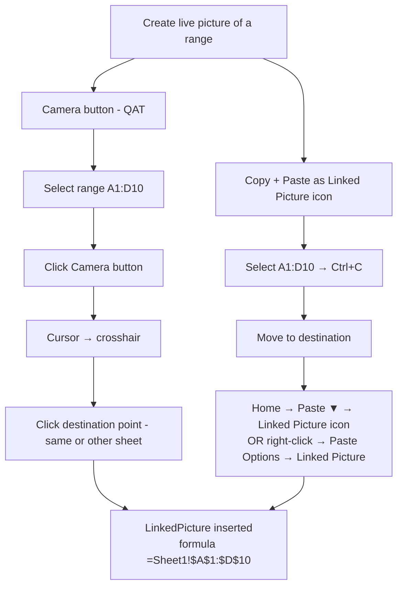
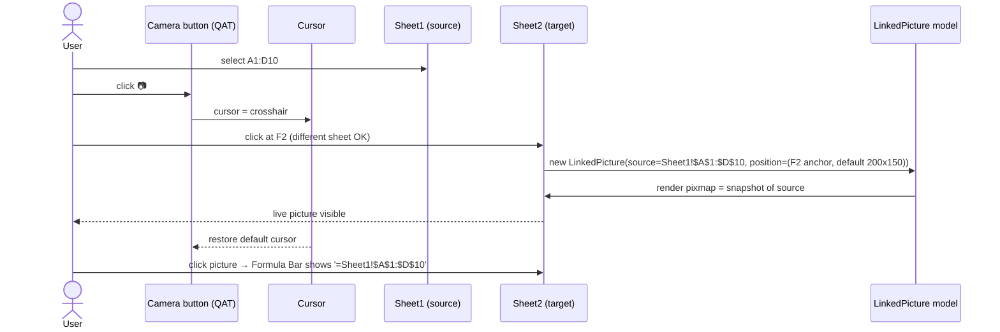
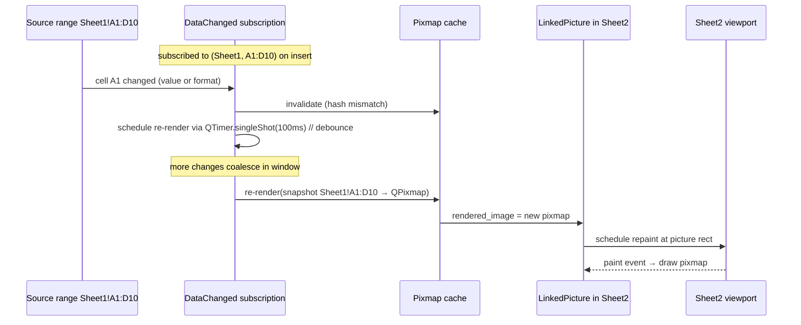
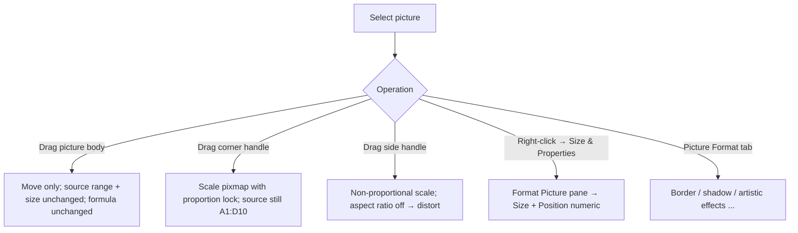
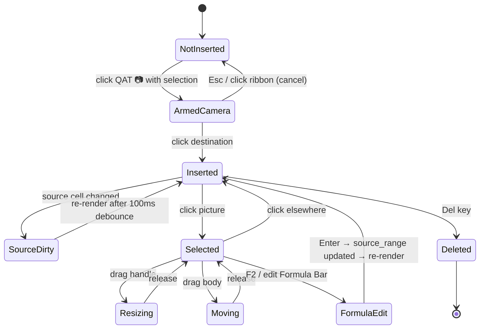

# 47 — Camera Tool (Live Picture Linked to Range) — UX Flow

> Spec gốc: [47-camera-snapshot.md](../47-camera-snapshot.md)

## 1. Two paths to a live picture



## 2. Adding Camera to QAT (one-time setup)

```
File → Options → Quick Access Toolbar

┌─ Excel Options — Quick Access Toolbar ───────────────────────────┐
│ Choose commands from: [All Commands                          ▼] │
│ ┌──────────────────────────────┐         ┌──────────────────────┐│
│ │ ...                           │         │ Save                  ││
│ │ Calculate Now                 │   →    │ Undo                  ││
│ │ Calculate Sheet               │ [Add>] │ Redo                  ││
│ │ Calls                         │        │ AutoSave              ││
│ │ Camera                  ◀     │ [<Rem] │ Camera           ◀ NEW││
│ │ Cancel                        │        │ ...                   ││
│ │ ...                           │         │                       ││
│ └──────────────────────────────┘         └──────────────────────┘│
│                                                                    │
│                                              [OK]    [Cancel]    │
└────────────────────────────────────────────────────────────────────┘
```

After Add: 📷 icon appears in QAT top-left strip.

## 3. Camera button flow sequence



## 4. Paste-As-Linked-Picture path

```
Home tab → Paste ▼

┌─ Paste ────────────────────────────────────────────┐
│ Paste                                               │
│  📋 Paste                                            │
│  fx Formulas                                         │
│  🎨 Values                                           │
│  ... (other options) ...                             │
│ ──────────────────────────────────────────────────│
│ Other Paste Options                                 │
│  🖼 Picture                                          │
│  📸 Linked Picture          ◀ THIS                   │
│ ──────────────────────────────────────────────────│
│  Paste Special...                                   │
└─────────────────────────────────────────────────────┘
```

Right-click → Paste Options icon bar (9 icons, see [Spec 13](../13-paste-special-flow.md)) → **9th icon = 📸 Linked Picture**.

Note: Linked Picture is NOT in the Ctrl+Alt+V dialog — only in the dropdown / icon bar.

## 5. Live picture anatomy

```
Sheet2!F2 area:
   F      G      H      I      J
2 ┌─────────────────────────────┐
3 │  ┌─ Linked Picture ───────┐ │   ← border subtle 1px gray
4 │  │ A      B      C      D  │ │      (only visible on selection /
5 │  │ 100    200    300    40 │ │       hover for chrome)
6 │  │ 150    220    320    45 │ │
7 │  │ 180    240    340    50 │ │
8 │  │ 200    260    360    55 │ │
9 │  └─────────────────────────┘ │
   └─────────────────────────────┘
   ↑ Formula bar when picture selected:
     fx | =Sheet1!$A$1:$D$10
```

When selected:

```
       ╔═══════════════════════════════╗
       ║■                             ■║  ← 8 sizing handles
       ║   (linked picture content)    ║
       ║■                             ■║
       ║                               ║
       ║■           ■           ■      ║
       ╚═══════════════════════════════╝
       Picture Format ribbon tab activates
```

## 6. Auto-update sequence



Debounce settles bursts of cell edits into one render at most every 100 ms.

## 7. Resize / move behavior



Resize math:

```
src_rect  = bounding box of A1:D10 in Sheet1 px
pic_rect  = current picture rect on Sheet2 px

scale = pic_rect.size / src_rect.size  (per axis if aspect unlocked)

paint:  draw rendered_pixmap into pic_rect (Qt SmoothTransformation)
```

Changing the source range itself (typing into Formula Bar `=Sheet1!$A$1:$E$15`) updates the `source_range`, invalidates cache, re-renders.

## 8. Picture Format ribbon (when picture selected)

```
Picture Format (contextual tab)
┌─────────────────────────────────────────────────────────────────┐
│ [Remove Background] [Corrections ▼] [Color ▼] [Artistic Effects ▼]│
│ [Picture Border ▼] [Picture Effects ▼] [Picture Layout ▼]        │
│ [Bring Forward ▼] [Send Backward ▼] [Selection Pane]              │
│ [Align ▼] [Group ▼] [Rotate ▼]                                    │
│ [Crop ▼]      Height: [3.5"▲▼]   Width: [5"▲▼]                   │
└─────────────────────────────────────────────────────────────────┘
```

Most effects work on the cached pixmap. Border/shadow apply to outer chrome. Crop adjusts the **visible** part of the cached pixmap without changing source range.

## 9. State diagram



## 10. Save / Reopen round-trip

```mermaid
sequenceDiagram
    participant App as Ezcel
    participant XL as xlsx writer (openpyxl + raw)
    participant File as out.xlsx

    App->>XL: save workbook
    XL->>XL: write xl/drawings/drawing{n}.xml with picture entry<br/>{type=image, anchor=oneCellAnchor or twoCellAnchor}
    XL->>XL: also write Sheet-level defined name or xdr:objectId metadata referencing source range
    XL->>XL: embed last rendered image in xl/media/image{n}.png (fallback display)
    XL->>File: zip
    Note over File: file open in Excel → picture renders from image; Excel's Camera link only intact if drawing.xml ext_lst carries the formula reference

    File->>App: reopen later
    App->>XL: parse
    XL->>App: LinkedPicture{source_range, position, cached_pixmap=image1.png}
    App->>App: schedule fresh render → may replace cached pixmap
```

Important: Excel persists Camera tool linkage in `xl/drawings/drawing.xml` `<xdr:pic>` with `<formula>=Sheet1!$A$1:$D$10</formula>` inside `<xdr:nvPicPr>` extension. Ezcel must write this for round-trip with Excel; fall back to a `.ezcel` namespaced custom XML for Ezcel-only deployments.

## 11. User journeys

### J1 — Quick dashboard from multiple sheets
1. Sheet `Sales` has table A1:E20 → select → 📷 → click on `Dashboard` sheet at B2 → live picture inserted.
2. Sheet `Costs` has table A1:E15 → select → 📷 → click on `Dashboard` at B25.
3. Dashboard now shows both source ranges; edit `Sales!C3` → Dashboard picture updates within 100 ms.

### J2 — Cross-sheet preview without switching
1. While building Sheet `Report`, want to peek at Sheet `Master` values.
2. Master select A1:B5 → 📷 → drop in Report margin.
3. Picture is always live; no need to switch sheets.

### J3 — Print-friendly layout
1. Source values across non-adjacent ranges. Use Camera 3 times into a Print sheet arranged for paper.
2. Page Setup ([Spec 24](../24-print-page-setup.md)) → orientation/scale tuned to picture sizes.

### J4 — Update source range via Formula Bar
1. Click existing picture → Formula Bar shows `=Sheet1!$A$1:$D$10`.
2. Edit to `=Sheet1!$A$1:$E$15` → Enter.
3. Picture re-renders showing wider source.

### J5 — Paste as Linked Picture instead of Camera
1. Sheet1 A1:D10 → Ctrl+C.
2. Sheet2 click F2 → Home → Paste ▼ → 📸 Linked Picture → equivalent live picture.

### J6 — Save and reopen
1. Save `dashboard.xlsx`. Close.
2. Reopen → picture present + still updates when source changes.

## 12. Implementation hints

- **Model** (`core/shapes/linked_picture.py`):
  ```python
  class LinkedPicture(Shape):
      type = "linked_picture"
      source_range: Range           # (sheet_name, top_left, bot_right)
      position: tuple[float,float,float,float]  # x,y,w,h in pt
      anchor: Literal["move_size","move_only","fixed"]
      _rendered_image: QPixmap | None
      _last_render_hash: int        # hash(source cells + fmt + col_widths + row_heights)
  ```
- **Subscription** (`core/shapes/source_subscription.py`):
  - Central `LinkedPictureRegistry` listens to `model.dataChanged`, `model.headerSizeChanged`, `model.formatChanged`.
  - On change, find pictures whose `source_range` intersects → mark dirty.
  - Per-picture `QTimer.singleShot(100, render)` debounce; idempotent if multiple events coalesce.
- **Renderer** (`core/shapes/linked_picture_render.py`):
  - Build a transient `QPixmap` sized to bounding box of source range in pt × device pixel ratio.
  - `QPainter` walk cells of source range; draw fill, value, borders using shared cell-paint helper (same routine as print renderer [Spec 24](../24-print-page-setup.md)).
  - Apply hash of source content; skip render if hash unchanged.
- **Overlay paint** (`ui/overlays/shapes_layer.py`):
  - Single overlay above grid (reuse Spec 34). Paints `_rendered_image` scaled to picture rect with `Qt.SmoothTransformation`.
- **Selection + handles** (`ui/overlays/shape_selection.py`):
  - 8 sizing handles; drag-move; drag-resize. On release update `position`; aspect lock if Shift held.
- **Formula Bar binding** (`ui/widgets/formula_bar.py`):
  - When selection is a Shape and Shape.type == "linked_picture": display `="{source_sheet}"!{range_a1}`; on commit, parse → update `source_range` → invalidate.
- **Picture Format ribbon** (`ui/ribbon/picture_format_tab.py`):
  - Contextual; activates when LinkedPicture selected. Effects (border, shadow) painted by overlay separately from pixmap. Crop adjusts source_rect subset displayed.
- **xlsx persistence** (`io_utils/linked_picture_io.py`):
  - Write `<xdr:pic>` with `<xdr:nvPicPr><xdr:cNvPr.../><xdr:cNvPicPr/></xdr:nvPicPr>` + extension list holding `<x:formula>=Sheet1!$A$1:$D$10</x:formula>`.
  - Embed `xl/media/image{n}.png` (last rendered) as fallback for viewers that don't understand the link.
- **Performance guards**:
  - Cap re-renders at 10/s per picture; coalesce bursts.
  - If source range cell count > 5000, render at lower resolution (max 1024px on longer side) + warn user via Status Bar.

## 13. Acceptance ↔ flow map

| AC | Where |
|---|---|
| 1 Select A1:D10 + Camera + click F2 → live picture | §3 + J1 |
| 2 A1 change → picture updates | §6 + J1 |
| 3 Background A2 → yellow → picture updates | §6 |
| 4 Formula Bar shows `=Sheet1!$A$1:$D$10` | §5 + §11.J4 |
| 5 Move picture preserves link | §7 + J2 |
| 6 Resize scales content proportionally | §7 |
| 7 Save + reopen preserves picture + link | §10 + J6 |
