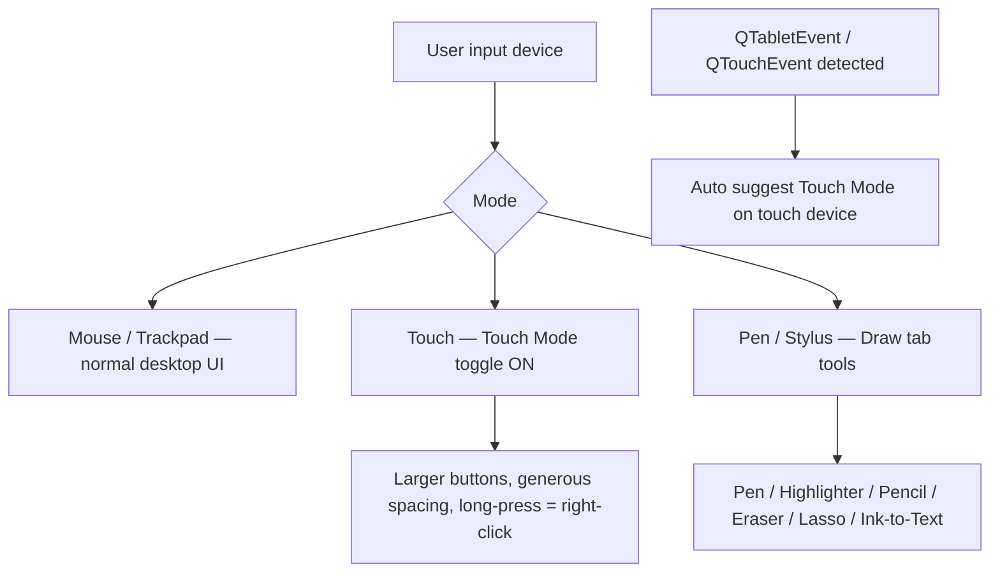
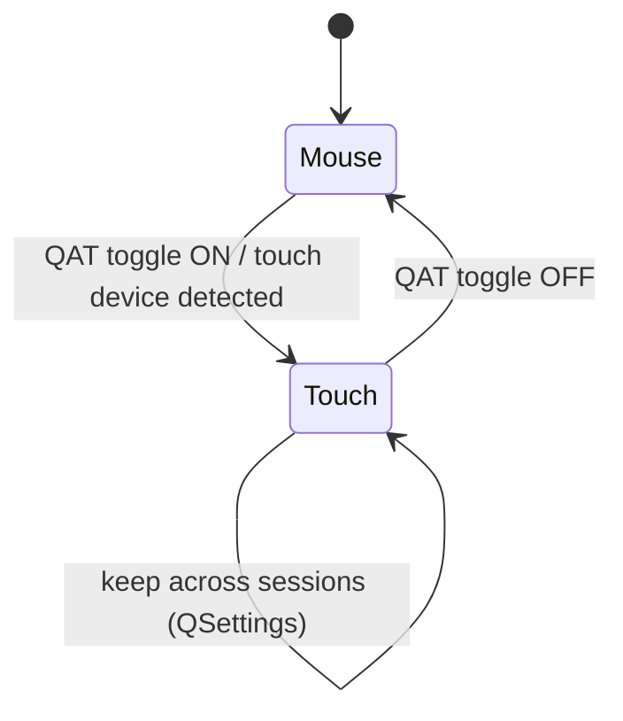
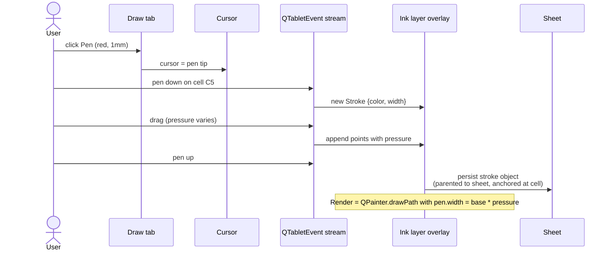
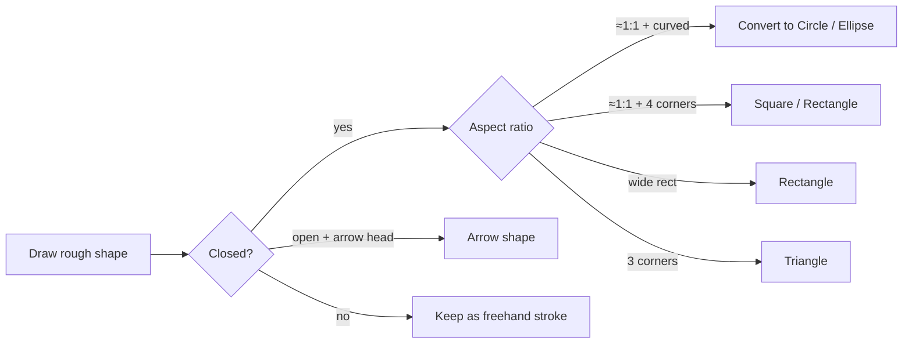
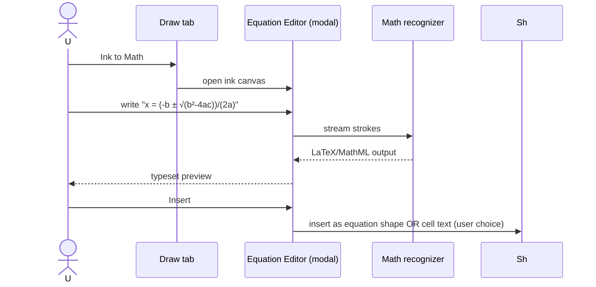
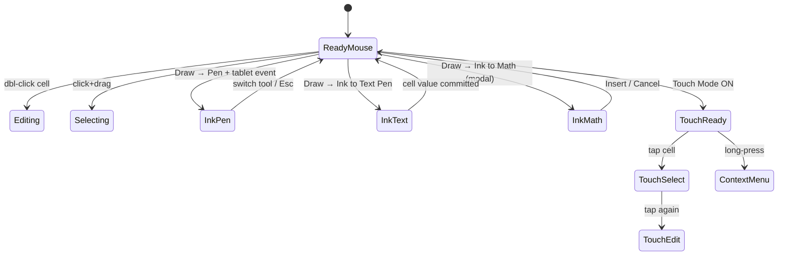

# 48 — Touch / Pen / Ink — UX Flow

> Spec gốc: [48-touch-pen-ink.md](../48-touch-pen-ink.md)

## 1. Three input modes



## 2. Touch Mode toggle

```
QAT dropdown → ☑ Touch/Mouse Mode

   Mouse mode (default):              Touch mode:
   ┌──────────────────────┐           ┌──────────────────────┐
   │ [Bold][Italic][Und.] │           │ [ B ] [ I ] [ U ]    │   ← buttons 1.4×
   │  20px high           │           │   28px high          │
   │  4px spacing         │           │   8px spacing        │
   └──────────────────────┘           └──────────────────────┘

   row height auto 18px               row height auto 28px
```

State diagram:



## 3. Draw tab anatomy

```
┌─ Draw tab ──────────────────────────────────────────────────────────┐
│ Drawing Tools                          Convert       Replay          │
│ ┌──────┬──────┬──────┬─────┐ ┌──────┐ ┌──────┐ ┌──────┐ ┌────────┐│
│ │ Pen  │ Pen  │ Hili │Eras │ │Lasso │ │Ink→  │ │Ink→  │ │ Ink    ││
│ │ blue │ red  │yellow│     │ │Select│ │ Math │ │Shape │ │Replay  ││
│ └──────┴──────┴──────┴─────┘ └──────┘ └──────┘ └──────┘ └────────┘│
│ ── 2024+ also: Ink to Text Pen (Excel for Windows) ────────────────│
│ ┌──────────┐                                                       │
│ │Ink→Text  │   ← writes handwriting into the underlying cell       │
│ │ Pen      │                                                       │
│ └──────────┘                                                       │
└─────────────────────────────────────────────────────────────────────┘
```

### Pen Toolbox (compact, 2024 redesign)

```
┌─ Pen Toolbox ──────────────────────────────┐
│ ●●●●●●●●●●●●●●●● + More Colors            │  ← 16 solid + custom
│ Thickness: ●○○○○ (0.25mm → 3.5mm, 5 stops) │
│ [Eraser ▼]  Object | Stroke                 │
│ [×] Close                                   │
└─────────────────────────────────────────────┘
```

## 4. Inking on grid sequence



## 5. Ink → Text Pen flow (2024+ Win)

```mermaid
flowchart TD
    Pick[Draw → Ink to Text Pen] --> Active[Pen mode active]
    Active --> Write[User writes 'Hello' on cell A2]
    Write --> ML[Handwriting ML recognize]
    ML --> Hit[Hit-test stroke center → anchor cell = A2]
    Hit --> Fill[setData(A2, 'Hello')]
    Fill --> Show[Inline cell value updated; strokes fade out 600ms]
    Write -->|gesture: strikethrough word| Del[Delete that word from cell text]
```

Visual:

```
   A         B
1 ┌────────┬─────────┐
2 │~Hello~ │         │      ← strokes visible briefly
3 └────────┴─────────┘
        ↓ (after recognition)
1 ┌────────┬─────────┐
2 │ Hello  │         │      ← cell value committed
3 └────────┴─────────┘
```

## 6. Ink → Shape



```
   ╲      ╱
    ╲    ╱           →    [Triangle shape inserted]
     ╲  ╱                  with clean lines
      ╲╱
```

## 7. Ink → Math



Mockup:

```
┌─ Ink Equation ─────────────────────────────────────┐
│ Preview:    x = (-b ± √(b² − 4ac)) / (2a)          │
│ ──────────────────────────────────────────────────│
│  ┌────────────────────────────────────────────┐    │
│  │ (handwriting canvas — user draws here)     │    │
│  │                                              │    │
│  └────────────────────────────────────────────┘    │
│  [Write] [Erase] [Select & Correct] [Clear]        │
│                                                      │
│                              [Insert]   [Cancel]   │
└──────────────────────────────────────────────────────┘
```

## 8. Lasso select

```
   ┌──────────────────────────────────┐
   │  ╱ ─ ─ ─ ╲                       │
   │ │ stroke1 │  ─ ─ free hand vẽ   │
   │  ╲ ─ ─ ─ ╱        lasso         │
   │       stroke2 (outside)          │
   └──────────────────────────────────┘
   → only stroke1 selected
```

Sequence: Pen up → strokes whose bounding box centroid is **inside** the lasso polygon are added to selection. Then user can move / delete / change color.

## 9. Ink Replay

```mermaid
sequenceDiagram
    actor U
    participant DT as Draw tab
    participant Rep as Replay engine
    participant Ink as Strokes (ordered by ts)
    U->>DT: Ink Replay
    DT->>Rep: load strokes ordered by ts
    loop each stroke
        Rep->>Ink: clear, redraw strokes[0..i] cumulative
        Rep-->>U: frame at 30 fps
    end
    Note over Rep: end at last stroke; can play again
```

Pane mockup:

```
┌─ Ink Replay ─────────────────────┐
│ [▶ Play] [⏸ Pause] [⏹ Stop]      │
│ Progress: ──────●──────  3.2s/6s │
│ Speed: ◀ 1.0× ▶                  │
└───────────────────────────────────┘
```

## 10. Apple Pencil + iOS specifics (reference, Ezcel desktop NOT)

```
Settings → Draw and Annotate (iOS)

[☑] Apple Pencil Always Draws Ink    ← prevents pencil from selecting/scrolling
[☑] Double-tap toggles pen / eraser  ← 2nd-gen Apple Pencil gesture
[☑] Hover preview (M4 iPad Pro)      ← pencil hover shows cell highlight
```

## 11. State machine — input arbitration



## 12. User journeys

### J1 — Quick annotate with red pen
1. Draw → Pen (red, 1.5mm). 2. Draw circle around D5. 3. Save → reopen → circle persists as ink object.

### J2 — Handwrite into cell
1. Pen on iPad / Surface. 2. Draw → Ink to Text Pen. 3. Write "Hanoi" over cell A2. 4. Strokes fade → A2 = "Hanoi". 5. Type Tab → next cell.

### J3 — Sketch rough rectangle → clean shape
1. Draw → Pen → sketch rough rectangle. 2. Right-click stroke → Convert to Shape. 3. Stroke replaced by clean rectangle; Picture Format ribbon activates.

### J4 — Equation entry
1. Draw → Ink to Math. 2. Sketch quadratic formula. 3. Recognizer parses → typeset preview. 4. Insert → equation shape on sheet.

### J5 — Lasso edit
1. Vẽ vài strokes annotation. 2. Draw → Lasso Select → vẽ vòng quanh nhóm strokes. 3. Click selection → drag move; or Delete.

### J6 — Touch tablet
1. Surface Pro detected → QAT toggle Touch Mode auto-suggest "Yes". 2. Ribbon buttons enlarge. 3. Pinch zoom on grid → zoom slider sync. 4. Long-press cell → context menu.

### J7 — Ink Replay (teach)
1. Solved problem on sheet using ink annotations.
2. Draw → Ink Replay → play → audience watches strokes appear in order.

## 13. Implementation hints

- **Tablet input** (`ui/input/tablet.py`): listen `QTabletEvent`. Track pressure 0..1, tilt x/y, twist. Sampling rate ~120Hz; downsample to ~60 for storage.
- **Stroke model** (`core/ink/stroke.py`): `Stroke { color, base_width, points: list[(x,y,pressure)], ts_start, ts_end }`. Sheet has `_ink_layer: list[Stroke]`.
- **Render**: separate overlay layer above grid (`ui/overlays/ink_layer.py`). `QPainterPath` cubicTo through pressure-modulated widths; antialiased.
- **Hit-test**: bounding box for fast reject; stroke-distance for fine pick. Lasso select uses point-in-polygon over centroid.
- **Touch Mode**: theme override toggle in `ui/theme/touch.qss` — increases button min-size from 20px → 28px, padding 4px → 8px, row height 18 → 28.
- **Long-press**: `QGestureRecognizer` 500ms threshold → emits `contextMenuRequested`.
- **Ink to Shape** (`core/ink/recognize_shape.py`): compute closure + corner count via Ramer-Douglas-Peucker + curvature spikes. Rules sufficient for MVP; no ML needed.
- **Ink to Text Pen** (`core/ink/recognize_text.py`):
  - Windows: try `Windows.UI.Input.Inking.InkAnalyzer` via pywin32.
  - Otherwise: bundle ONNX handwriting recognition model (~10MB). Lazy load.
  - Hit-test: stroke bbox center → anchor cell index → `setData(cell, recognized_text)`.
- **Ink to Math** (`core/ink/recognize_math.py`):
  - MyScript SDK is proprietary → not viable.
  - Open-source: `MathBrush` / `LookML` toolchain — heavy. Phase rất xa; stub button with "Coming soon".
- **xlsx persistence** (`io_utils/ink_io.py`):
  - openpyxl: ink strokes lưu trong `xl/ink/ink1.xml` (Office Open XML extension). Path data theta `m`/`l`/`c` SVG-like commands.
  - On save: write strokes; on load: parse. Round-trip preserves for Excel users.

## 14. Acceptance ↔ flow map

| AC | Where |
|---|---|
| 1 QAT Touch Mode toggle → bigger ribbon | §2 + J6 |
| 2 Pinch zoom syncs slider | §11 + J6 |
| 3 Draw → Pen → stroke on grid | §4 + J1 |
| 4 Eraser clicks stroke | §3 (Eraser tool) |
| 5 Lasso selects strokes | §8 + J5 |
| 6 Rough triangle → clean Triangle | §6 + J3 |
| 7 Save xlsx → reopen → strokes persist | §13 + J1 |
| (new) Ink to Text writes cell | §5 + J2 |
| (new) Ink Replay animates | §9 + J7 |
