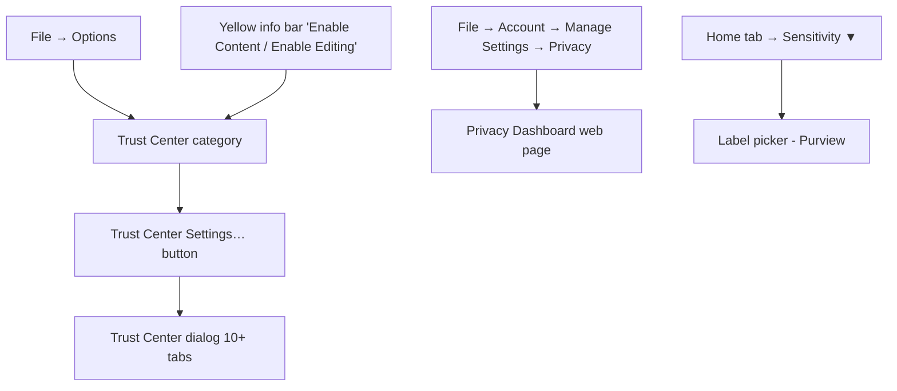
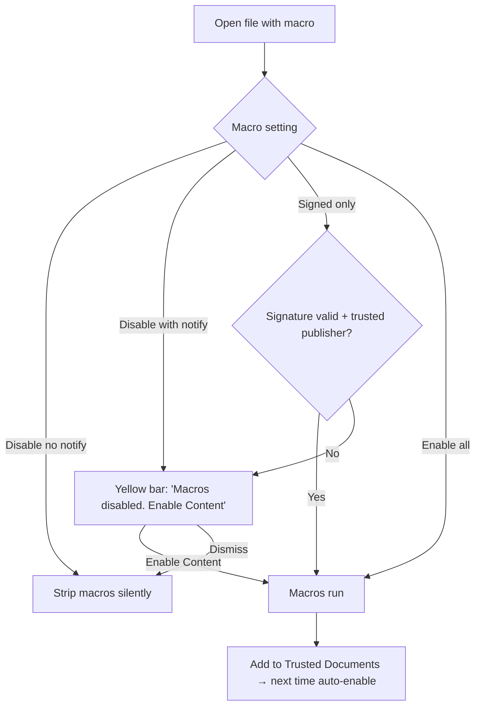
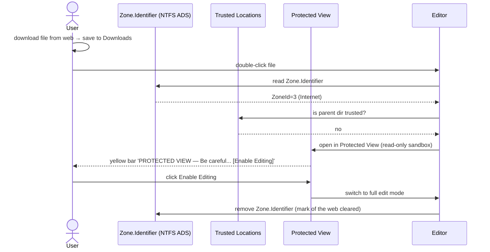
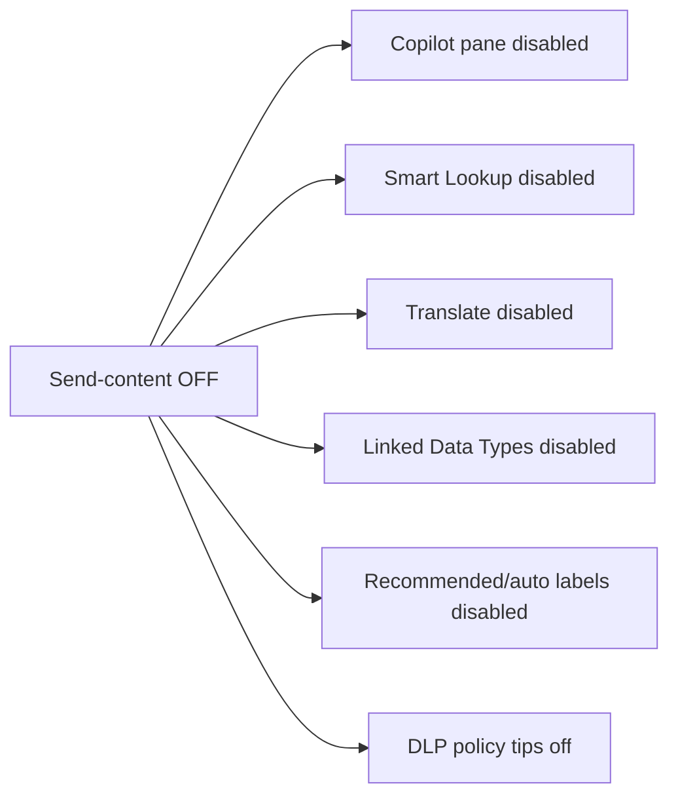
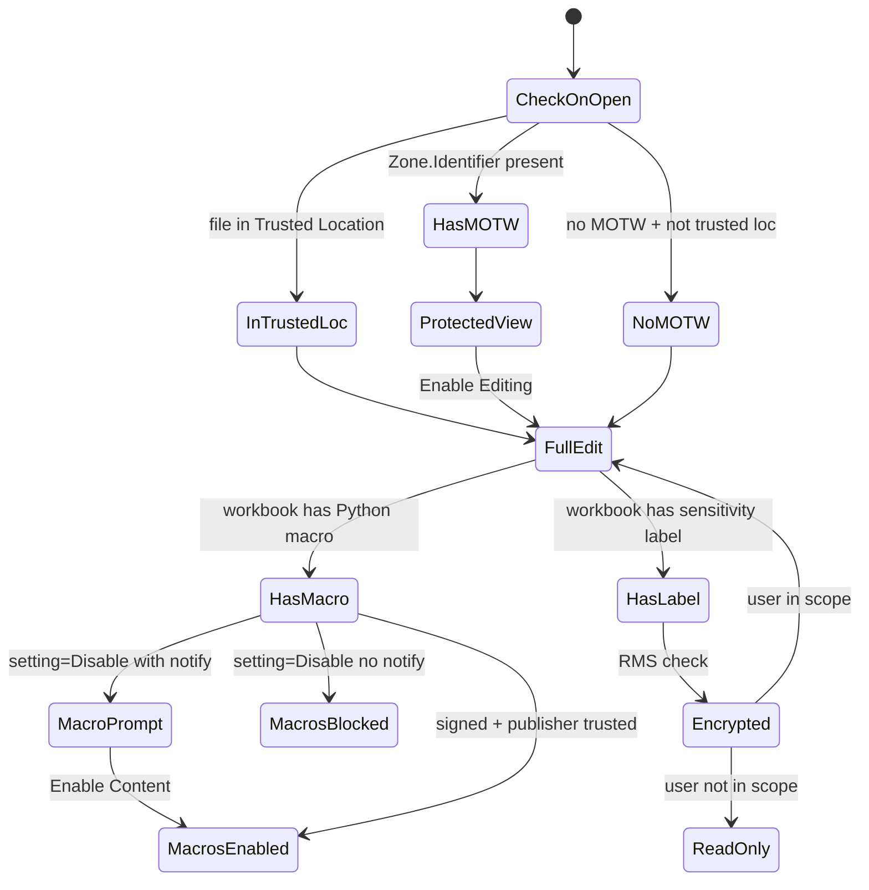

# 49 — Trust Center & Privacy — UX Flow

> Spec gốc: [49-trust-center-privacy.md](../49-trust-center-privacy.md)

## 1. Entry surface



## 2. Trust Center dialog tabs

```
┌─ Trust Center ─────────────────────────────────────────────────────┐
│                                                                      │
│  Trusted Publishers                                                  │
│  Trusted Locations            ◀ list folders, add/remove           │
│  Trusted Documents                                                   │
│  Trusted Add-in Catalogs                                             │
│  Add-ins                      ◀ COM / Excel xlam / Web add-ins      │
│  ActiveX Settings             ◀ (Ezcel: disabled, no ActiveX)       │
│  Macro Settings               ◀ Python macros (4 levels)             │
│  Protected View                                                       │
│  Message Bar                                                         │
│  External Content             ◀ workbook links + linked data types  │
│  File Block Settings          ◀ Open/Save/External link 3 columns   │
│  Privacy Options                                                     │
│  Form-based Sign-in                                                  │
│                                                                       │
│  (Selected tab content right pane)                                   │
│                                                                       │
│                                                  [OK]    [Cancel]   │
└────────────────────────────────────────────────────────────────────────┘
```

## 3. Macro Settings (Python in Ezcel)

```
┌─ Macro Settings ─────────────────────────────────────────────────┐
│ Macro Settings                                                    │
│   ( ) Disable all macros without notification                     │
│   (●) Disable all macros with notification (default)              │
│   ( ) Disable all macros except digitally signed macros           │
│   ( ) Enable all macros (NOT RECOMMENDED)                          │
│                                                                    │
│ Developer Macro Settings                                          │
│   [☐] Trust access to the macro project object model              │
│                                                                    │
│ Note: Ezcel uses Python in place of VBA. Settings apply to        │
│ Python macros bundled with workbooks.                              │
└────────────────────────────────────────────────────────────────────┘
```

State on file open:



## 4. Protected View flow



InfoBar mockup:

```
┌────────────────────────────────────────────────────────────────────┐
│ 🛡 PROTECTED VIEW  Be careful — files from the Internet can       │
│ contain viruses. Unless you need to edit, stay in Protected View. │
│                                                  [ Enable Editing ]│
└────────────────────────────────────────────────────────────────────┘
```

## 5. File Block Settings — extended for external links

New layout 2025-2026 with 3 columns (`Open` / `Save` / `External link`):

```
┌─ File Block Settings ─────────────────────────────────────────────────────┐
│ File type                                  Open       Save     Ext.Link    │
│ ──────────────────────────────────────────────────────────────────────│
│ Excel 4 Workbooks  (.xlw)               [ Block ]  [Block]  [ Block   ▼] │
│ Excel 95 Workbooks                      [ Block ]  [Block]  [ Block   ▼] │
│ Excel 97-2003 Workbook (.xls)           [ Open  ]  [Block]  [ Prompt  ▼] │   ← NEW col
│ dBase III/IV (.dbf)                     [ Block ]  [Block]  [ Block   ▼] │
│ XML 2003 Spreadsheets                   [ Open  ]  [ OK   ]  [ Allow   ▼] │
│ Web Pages                               [ Open  ]  [Block]  [ Allow   ▼] │
│ ... (more rows)                                                            │
│                                                                            │
│ Open behavior for blocked file types                                       │
│   ( ) Do not open selected file types                                      │
│   (●) Open selected file types in Protected View                           │
│   ( ) Open selected file types in Protected View and allow editing         │
│                                                              [OK] [Cancel]│
└──────────────────────────────────────────────────────────────────────────┘
```

External-link column options:

| Option | Result when workbook link references this file type |
|---|---|
| Block | `#BLOCKED!` error in cell; refresh skipped |
| Prompt | InfoBar on open: "External link to risky file type. [Allow] [Block]" |
| Allow | Refresh as normal |

Rollout: October 2025 → July 2026.

## 6. Privacy Options + Connected Experiences

```
┌─ Privacy Options ─────────────────────────────────────────────────┐
│ Privacy Settings:                                                  │
│ [Privacy Settings…]   ← opens privacy dashboard                    │
│                                                                     │
│ Connected experiences                                              │
│ [☑] Enable optional connected experiences                          │
│       (Insights, Recommended Pictures, Smart Lookup,               │
│        Translate, Linked Data Types, Designer)                     │
│                                                                     │
│ [☑] Allow Office to send content to Microsoft for analysis        │
│       (required for: Copilot, DLP policy tips, auto-labeling,      │
│        recommended labels)                                          │
│                                                                     │
│ [☑] Required diagnostic data                                       │
│ [☑] Optional diagnostic data (telemetry)                           │
│                                                                     │
│ Microsoft Privacy Statement →                                       │
└─────────────────────────────────────────────────────────────────────┘
```

Cascade when "Allow send content to Microsoft" = OFF:



## 7. Sensitivity Labels (Microsoft Purview)

```
Home tab → [Sensitivity ▼]

┌─ Sensitivity ──────────────────────────┐
│ Choose a label:                         │
│ ──────────────────────────────────────│
│ ⊙ Public                                │
│ ○ Internal                              │
│ ○ Confidential ▶  (submenu)            │
│      ○ Confidential / All Employees    │
│      ○ Confidential / Anyone (no fwd)   │
│ ○ Highly Confidential ▶                │
│ ──────────────────────────────────────│
│ Show Bar      [Help…]                   │
└─────────────────────────────────────────┘
```

Label apply sequence:

```mermaid
sequenceDiagram
    actor U
    participant H as Home → Sensitivity
    participant P as Purview admin policy
    participant WB as Workbook
    participant RMS as Rights Mgmt Service
    U->>H: choose 'Confidential / All Employees'
    H->>P: lookup label config (encryption, marking, scope)
    P-->>H: { encrypt: true, watermark: 'CONFIDENTIAL', scope: tenant_users }
    H->>WB: set sensitivityLabel = id
    H->>RMS: protect with policy
    H->>WB: add watermark layer
    H->>WB: add status bar badge 🛡 Confidential
    U->>WB: save
    Note over WB: file encrypted via RMS; only tenant users open;<br/>watermark renders on every sheet
```

Status bar:

```
┌────────────────────────────────────────────────────────────────────────┐
│ ... |  🛡 Confidential / All Employees | AutoSave ● On | Page 1 of 3 ...│
└────────────────────────────────────────────────────────────────────────┘
```

## 8. Trusted Locations management

```
┌─ Trusted Locations ────────────────────────────────────────────────┐
│ Path                                                  Date          │
│ ──────────────────────────────────────────────────────────────│
│ %AppData%\Microsoft\Excel\XLSTART\                    built-in    │
│ %ProgramFiles%\Microsoft Office\Templates\            built-in    │
│ C:\Users\you\Documents\Trusted\                       2026-04-01  │
│ ──────────────────────────────────────────────────────────────│
│ Description: Personal trusted area                                  │
│ [☑] Subfolders of this location are also trusted                   │
│                                                                      │
│ [Add new location…] [Modify…] [Remove]                              │
│ [☑] Allow Trusted Locations on my network (not recommended)         │
│                                                            [OK]    │
└──────────────────────────────────────────────────────────────────────┘
```

## 9. State diagram — overall trust evaluation



## 10. User journeys

### J1 — Trust a folder permanently
1. File → Options → Trust Center → Trust Center Settings → Trusted Locations.
2. Add new location → `C:\Users\me\Documents\Work\` → ☑ Subfolders → Description "Work files".
3. Future open of file in that path → no yellow bar.

### J2 — Open downloaded file safely
1. Open `report.xlsx` from Downloads → Zone.Identifier = Internet.
2. Yellow bar Protected View → preview content.
3. Confirm trustworthy → Enable Editing → MOTW cleared; full edit mode.

### J3 — Run a Python macro from a trusted publisher
1. File contains `@macro` script signed by publisher cert.
2. Macro Setting = "Disable except signed" + publisher in Trusted Publishers.
3. Open → macros enabled automatically (no prompt).

### J4 — Disable Copilot via Privacy
1. Trust Center → Privacy Options → uncheck "Allow Office to send content to Microsoft for analysis".
2. Restart → Copilot pane disabled; Translate / Linked Data Types pop "service unavailable".

### J5 — Apply Confidential label
1. Home → Sensitivity → Confidential / All Employees → click.
2. Watermark "CONFIDENTIAL" appears; status bar shows badge; save → file encrypted via RMS.
3. Share with external user → external user gets "You don't have permission" on open.

### J6 — Block external link to .xls
1. Trust Center → File Block Settings → row "Excel 97-2003 (.xls)" → External Link column → set "Block".
2. Existing workbook with link to `legacy.xls` → on refresh → cell shows `#BLOCKED!`.

## 11. Implementation hints

- **Trust Center settings store** (`core/trust_center/settings.py`):
  - Persist in QSettings under `~/.ezcel/trust_center.json`. Mirror Office structure.
  - Schema: trusted_publishers (list of cert thumbprints), trusted_locations (list of {path, subfolders, description}), trusted_documents (set of file hashes), macro_setting (enum), protected_view (3 booleans), file_block (per-format triple), privacy_options.
- **MOTW handling** (`io_utils/motw.py`):
  - Windows: read NTFS Alternate Data Stream `:Zone.Identifier`; values 1-4. ZoneId=3 (Internet) or 4 (Untrusted) → Protected View.
  - Strip MOTW on Enable Editing.
- **Protected View** (`ui/protected_view.py`):
  - First pass: open file with `readonly=True` flag in model + disable all ribbon edit commands. NOT a real OS sandbox.
  - Phase 7+: real sandbox via separate Python subprocess.
- **Yellow bar widget** (`ui/infobar/security_bar.py`): re-usable for Protected View / Macros disabled / Mark as Final / External link warning. Multi-bar stack support.
- **Macro signing** (`core/macros/signing.py`):
  - Generate detached signature using `cryptography` (X.509 + RSA-SHA256). Embedded in macro folder as `<module>.sig`.
  - Verify on open; check cert chain against Trusted Publishers.
- **File Block** (`io_utils/file_block.py`):
  - On open: map extension → block flag → either deny / open in PV / open normal.
  - On formula resolve external link: lookup target extension → if block-ext-link → return `#BLOCKED!`.
- **Sensitivity labels** (`features/sensitivity/`):
  - MVP: stub UI greyed out unless signed in with M365 account (requires MSAL — out of MVP). Persist OOXML `xl/sensitivityLabels.xml` opaque on round-trip.
  - Phase 8+: integrate Microsoft Information Protection SDK (Windows only).
- **Privacy master toggle** (`core/privacy/connected_experiences.py`):
  - Single boolean cascades to: Copilot enabled, Translate provider configured, Linked Data Types refresh, Smart Lookup, Auto-labels.

## 12. Acceptance ↔ flow map

| AC | Where |
|---|---|
| 1 Trust Center dialog tabs | §2 |
| 2 Trusted Locations add folder | §8 + J1 |
| 3 Yellow bar Protected View | §4 + J2 |
| 4 Macro "Disable with notification" → yellow bar | §3 + J3 |
| 5 Privacy disable internet → grayed | §6 + J4 |
| 6 Settings persist via QSettings | §11 |
| (new) Sensitivity label apply | §7 + J5 |
| (new) File Block external link → #BLOCKED! | §5 + J6 |
