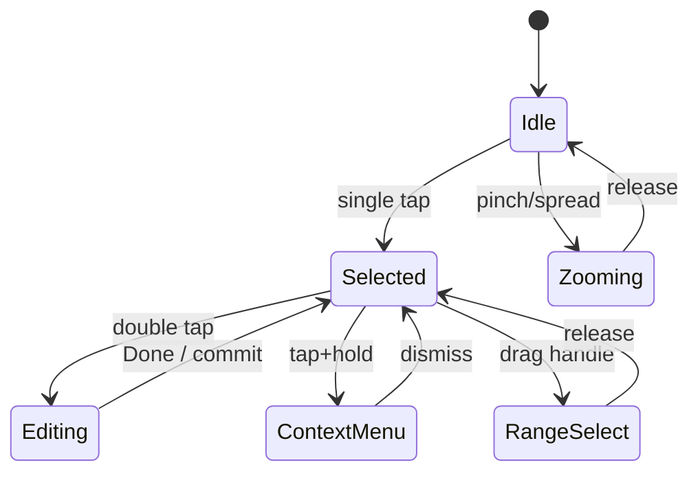
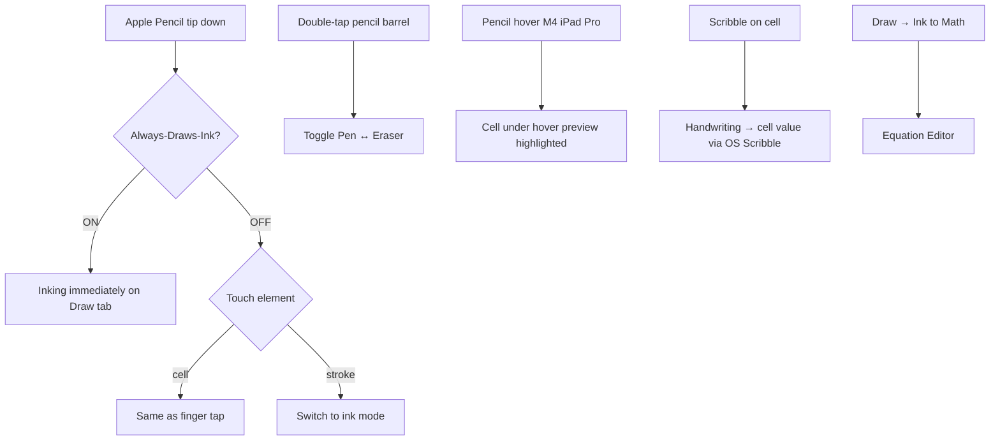
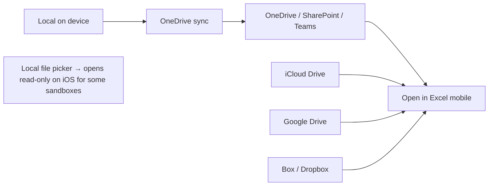

# 52 — Excel Mobile (iOS / iPad / iPhone / Android) — UX Flow

> Spec gốc: [52-mobile-excel.md](../52-mobile-excel.md)
>
> **Status: Out of scope MVP Ezcel (PySide6 desktop).** Flow này là **reference + future-planning** — nếu port qua Qt for Mobile / Flutter / native, pattern UX phải khớp Excel mobile.

## 1. Form-factor differentiation

```mermaid
flowchart TD
    Open[Excel mobile launched] --> Detect{Device}
    Detect -->|iPad / Android tablet 10"+| Tab[Tablet layout — ribbon full compact]
    Detect -->|iPhone / Android phone| Phn[Phone layout — collapsed bottom toolbar]
    Detect -->|iPad + Magic Keyboard| KB[Hybrid: tablet UI + kbd shortcuts]

    Tab --> Apple{Apple Pencil?}
    Apple -->|Yes| Pen[Draw tab + ink-first interactions]
    Apple -->|No| TouchOnly[Touch + on-screen kbd only]

    Phn --> iOS{iOS-only feature}
    iOS -->|Data from Picture| OCR[Camera → table OCR Insert]
    iOS --> Voice[Voice input dictate]
```

## 2. Touch gesture cheat-sheet

```
┌─ Gesture map (chung iPad + iPhone) ─────────────────────────────────┐
│ Gesture                       │ Action                              │
│ ─────────────────────────────┼─────────────────────────────────────│
│ Single tap cell               │ Select (active cell)                │
│ Double tap cell               │ Edit mode + show keyboard           │
│ Tap + hold cell               │ Context menu (right-click equiv.)   │
│ Pinch / spread                │ Zoom 10% – 400%                     │
│ Two-finger drag               │ Scroll                              │
│ Tap selection handle + drag   │ Extend selection                    │
│ Swipe left/right on sheet tab │ Navigate sheets                     │
│ Three-finger swipe up         │ Undo                                │
│ Three-finger swipe down       │ Redo                                │
│ Shake (iOS legacy)            │ Undo prompt                         │
│ Long-press row/col header     │ Resize handle appears               │
└──────────────────────────────────────────────────────────────────────┘
```

State:



## 3. iPad layout (compact ribbon)

```
┌─ iPad Excel ─────────────────────────────────────────────────────────────┐
│ ┌──┬──┬──┬──┬──┬──┬──┬──┐                                                │
│ │File│Home│Insert│Draw│Page│Form│Data│Review│View│           ⌕  ↶ ↷ ⊕ ☰│
│ └──┴──┴──┴──┴──┴──┴──┴──┘                                                │
│ ┌──────┬──────┬──────┬─────────┬──────┬────┬────┐ touch target ≥44pt    │
│ │ B    │ I    │ U    │ Aa font │ Fill │  $ │ %  │                       │
│ └──────┴──────┴──────┴─────────┴──────┴────┴────┘                       │
│ ────────────────────────────────────────────────────────────────────────│
│ fx │ =SUM(B2:B10)                                                       │
│ ────────────────────────────────────────────────────────────────────────│
│      A         B         C         D         E         F                │
│  1                                                                       │
│  2     ...grid...                                                        │
│                                                                          │
│                                                                          │
│ ────────────────────────────────────────────────────────────────────────│
│ [Sheet1] [Sheet2] [+]                              Sum: 1,245 ⓘ Σ      │
└──────────────────────────────────────────────────────────────────────────┘
```

### Split View / Slide Over

```
┌─ iPad (Split View) ──────────────────────────────────────────┐
│ ┌─ Excel ─────────────┐ ┌─ Safari / Notes ─────────────────┐│
│ │ Sheet1 ...           │ │                                   ││
│ │                      │ │   companion app                  ││
│ └──────────────────────┘ └───────────────────────────────────┘│
└───────────────────────────────────────────────────────────────┘
```

## 4. iPhone layout (collapsed)

```
┌─ iPhone Excel ─────┐
│ ◀ MyWorkbook   ⋯  │
│ ─────────────────│
│ fx │ =SUM(B2:B10) │
│ ─────────────────│
│     A     B    C  │
│ 1                 │
│ 2  100  200       │
│ 3  150  220       │
│ 4  180  240       │
│ 5  200  260       │
│                   │
│ ─────────────────│
│  ↶  ↷  Aa  $%  ⋯ │   ← collapsed bottom toolbar (5 icons)
│ ─────────────────│
│ [Sheet1▼]   Σ 1,245│
└────────────────────┘
```

### Cell editor fullscreen

```
┌─ Edit A2 ─────────┐
│ ✕             ✓  │
│                   │
│ ┌───────────────┐│
│ │ =SUM(B2:B10)  ││
│ │               ││
│ └───────────────┘│
│                   │
│  fx insert  Range │
│ ──────────────  │
│ Σ  AVG  COUNT MIN│   ← formula bar quick-access keyboard
│ ──────────────  │
│  1 2 3   +  -    │
│  4 5 6   *  /    │   ← number pad
│  7 8 9   (  )    │
│  . 0 ,   ✓       │
└───────────────────┘
```

## 5. Apple Pencil / S Pen interactions (iPad / Galaxy Tab)



Settings panel:

```
Settings → Draw and Annotate

[☑] Apple Pencil Always Draws Ink
[☑] Double-tap action: Switch eraser
[☑] Scribble in Excel cells              ← iPad OS native
[☑] Hover preview (M4 iPad Pro only)
```

## 6. Capture Data from Picture (iPhone unique)

```mermaid
sequenceDiagram
    actor U as User
    participant Ins as Insert tab
    participant Cam as Camera
    participant OCR as Cloud OCR + structure detect
    participant Sh as Sheet

    U->>Ins: Insert → Data from Picture
    Ins->>Cam: open camera
    U->>Cam: align bounding box around printed table → capture
    Cam->>OCR: send image
    OCR-->>U: detected cells with confidence scores;<br/>low-confidence cells highlighted
    U->>U: review + fix any cell
    U->>Sh: Insert → cells fill in as a Table
```

Mockup capture review:

```
┌─ Review captured data ──────────────┐
│  ┌───────┬───────┬───────┐          │
│  │ Item  │ Qty   │ Price │          │
│  ├───────┼───────┼───────┤          │
│  │ Pen   │ 5     │ 1.5   │          │
│  │ Note  │ 10⚠   │ 2.0   │   ← ⚠ = low confidence, tap to edit
│  │ Eraser│ 3     │ 0.75⚠ │
│  └───────┴───────┴───────┘          │
│  Detected: 3 rows × 3 cols           │
│   [Re-capture]  [Edit]  [Insert ▶]   │
└────────────────────────────────────────┘
```

## 7. Mac shortcut alignment (since 2020+)

When iPad has Magic Keyboard / Mac has Cmd:

| Mac shortcut | Windows | Notes |
|---|---|---|
| ⌘C / ⌘V | Ctrl+C/V | identical |
| ⌘Z / ⇧⌘Z | Ctrl+Z / Ctrl+Y | redo uses Shift+⌘+Z on Mac |
| ⌘B/I/U | Ctrl+B/I/U | aligned (2020+) |
| ⌘1 | Ctrl+1 | Format Cells |
| F4 | F4 | absolute ref toggle (aligned 2020+) |
| Ctrl+⇧+L | Ctrl+Shift+L | filter toggle (aligned) |
| fn+F5 or ⌘G | F5 | Go To |
| Ctrl+click | Right-click | also 2-finger tap on trackpad |
| ⌘, | n/a | Preferences (Mac-only) |
| ⌘Q / ⌘M / ⌘H | n/a | Quit / Minimize / Hide |
| **Alt+H+B** (KeyTips) | **NOT supported on Mac** | use ribbon click instead |

## 8. Mobile limitations matrix

```
┌─ Feature                   │ Phone │ Tablet │ Desktop ─────────┐
│ ──────────────────────────┼───────┼────────┼──────────────────│
│ Read / view                │  ✓    │   ✓    │   ✓               │
│ Cell edit                  │  ✓    │   ✓    │   ✓               │
│ Format cells               │  ✓    │   ✓    │   ✓               │
│ Charts (existing)          │  ✓    │   ✓    │   ✓               │
│ PivotTable view            │  ✓    │   ✓    │   ✓               │
│ PivotTable create          │  ✗    │ limited│   ✓               │
│ Conditional fmt create     │  ✗    │ limited│   ✓               │
│ Data Validation create     │  ✗    │ limited│   ✓               │
│ Power Query / Pivot        │  ✗    │   ✗    │   ✓               │
│ VBA / Office Scripts run   │  ✗    │   ✗    │   ✓               │
│ Forms integration sync     │  ✓    │   ✓    │   ✓               │
│ Capture Data from Picture  │ iPhone│ iPad   │   ✗               │
│ Apple Pencil / S Pen Ink   │  n/a  │   ✓    │   ✗ (only Surface)│
│ Co-authoring               │  ✓    │   ✓    │   ✓               │
└──────────────────────────────────────────────────────────────────┘
```

## 9. File access tiers



OneDrive is primary integration for co-authoring + Version History; other clouds work for open/save only.

## 10. Excel for Mac — Forms real-time sync (May 2026 specific)

```mermaid
sequenceDiagram
    actor R as Respondent
    participant F as Microsoft Forms
    participant Net as Forms sync service
    participant Ex as Excel for Mac workbook

    Note over Ex: workbook contains a Forms-linked sheet
    R->>F: submit response
    F->>Net: response saved
    Net->>Ex: WebSocket push (live)
    Ex->>Ex: append new row to linked sheet
    Ex-->>Note: row highlights with subtle fade animation
```

Win equivalent was GA since 2024 (Build 18227+); Mac caught up May 2026.

## 11. Tech stack options if Ezcel ports mobile

```
┌─ Option         │ Reuse Ezcel core │ UX parity │ Notes ───────────┐
│ ─────────────┼──────────────────┼───────────┼──────────────────│
│ PySide6 Qt    │      ✓           │  medium   │ Qt-for-mobile     │
│ for Mobile     │                  │           │ still beta-ish    │
│ Flutter + py   │      ✗           │  high     │ rewrite UI in     │
│                │                  │           │ Dart, IPC to py   │
│ React Native + │      ✗           │  high     │ same as Flutter   │
│ py backend     │                  │           │                   │
│ Native (Swift  │      ✗           │  highest  │ huge effort, 2×   │
│ + Kotlin)      │                  │           │ codebases         │
└───────────────────────────────────────────────────────────────────┘
```

## 12. User journeys

### J1 — Quick edit on phone
1. Open file from OneDrive on iPhone → tap A2 → double tap → fullscreen editor → type → ✓.

### J2 — Pencil annotation on iPad
1. Open dashboard in iPad → Draw tab → Pen → circle anomaly on chart → save → desktop user opens → sees ink overlay.

### J3 — Scribble into cell (iPad)
1. Pencil down on cell A5 → handwrite "Hanoi" → OS Scribble converts → A5 = "Hanoi".

### J4 — Capture printed table
1. iPhone → Insert → Data from Picture → photograph receipt → review → Insert → table inserted.

### J5 — Forms real-time on Mac (May 2026)
1. Open workbook with Forms-linked sheet on Mac → submit a test response → row appears live.

### J6 — Co-author on tablet
1. iPad opens shared workbook → see colleague's avatar + colored cursor → edit cell → both sees updates live.

## 13. Implementation hints (future port — out of MVP)

- **Layout adaptive**: single source `ui/layout/responsive.py` switching between desktop / tablet / phone based on `QScreen.physicalSize()` + input type. Phone = collapse ribbon → bottom toolbar component.
- **Touch arbitration**: reuse Spec 48 tablet/touch dispatcher; add gestures via `QGestureRecognizer`.
- **Cell editor fullscreen** (phone): modal `QWidget` covering viewport; formula quick-bar at top of keyboard.
- **Capture Data from Picture** (iOS): native bridge to Vision framework (`VNRecognizeTextRequest` + table detector). Android: ML Kit text recognition + custom table detector.
- **Apple Pencil**: PencilKit bridge through Qt; double-tap event from `PKCanvasView`.
- **OneDrive sync**: Microsoft Graph SDK; delta query for changes; conflict resolution per cell.
- **Forms live sync**: subscribe to Forms webhook; push to linked Range via `setData`. Coalesce bursts.

## 14. Acceptance ↔ flow map

Spec 52 acceptance is **post-MVP**. This flow defines:
- Gesture map (§2) — ground-truth for any future implementation.
- Layout adaptivity (§3, §4) — phone vs tablet vs desktop.
- Pencil flows (§5) + Scribble + Math.
- Capture Data from Picture (§6).
- Mac shortcut alignment (§7) — important even if Ezcel only ships desktop, for Mac users.
- Forms integration (§10).
