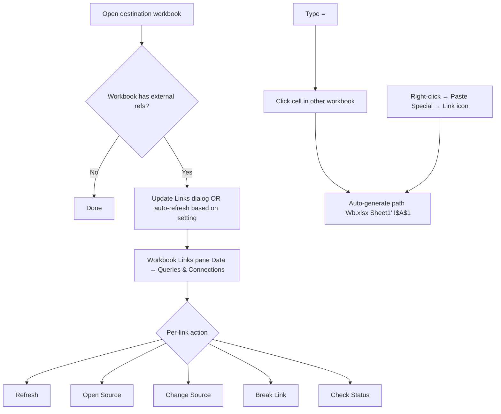
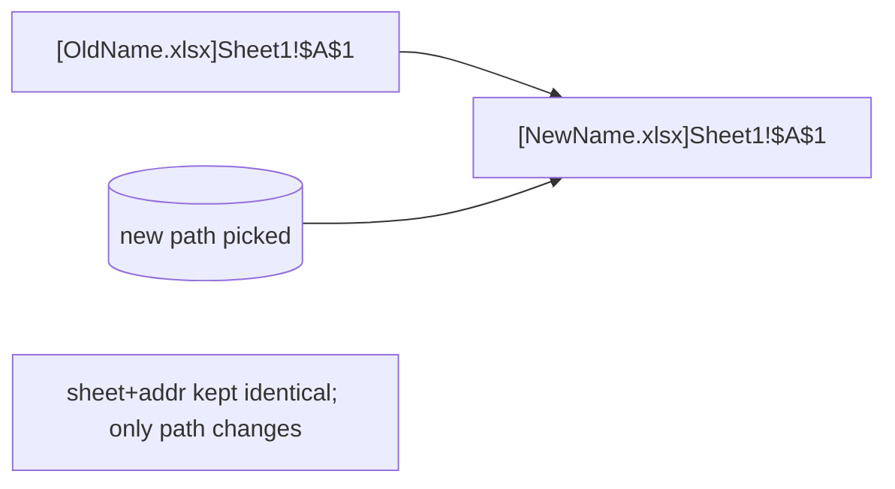
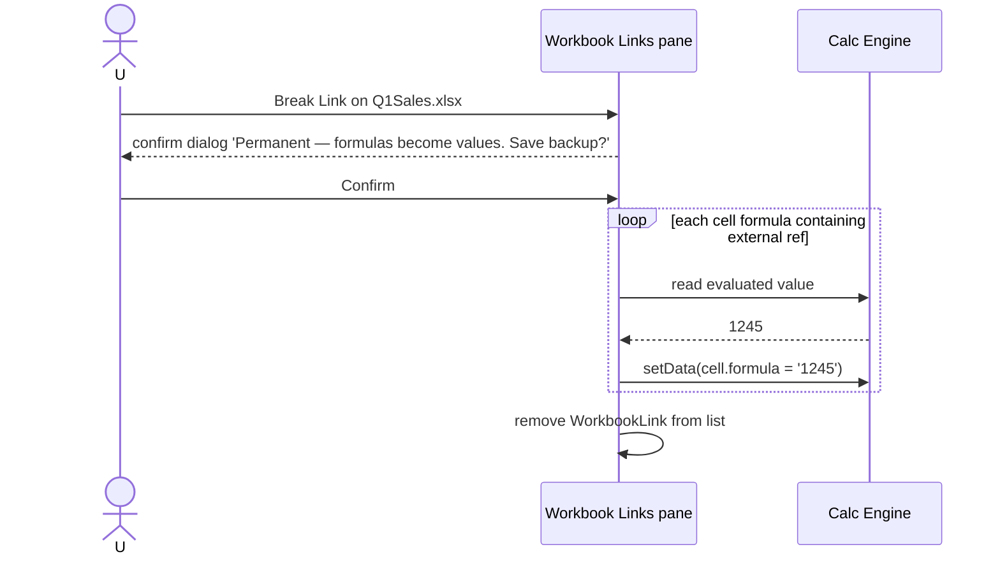
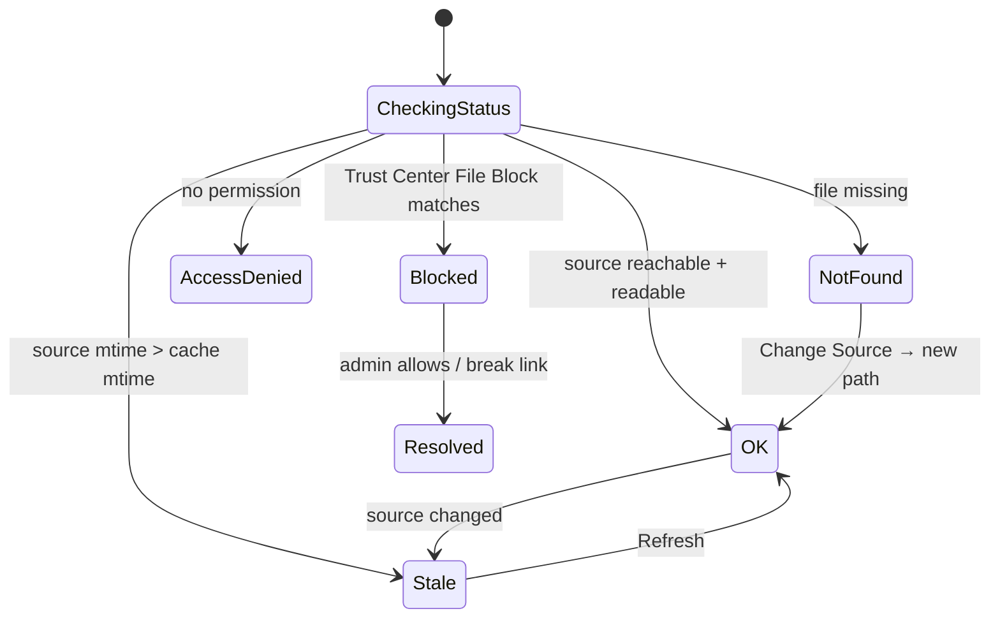
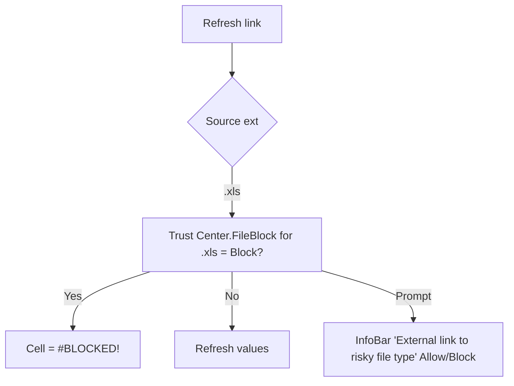

# 53 — Workbook Links / External References — UX Flow

> Spec gốc: [53-workbook-links-external-refs.md](../53-workbook-links-external-refs.md)

## 1. Surface map



## 2. Workbook Links pane (modern 2024, replaces Edit Links dialog)

```
Data → Queries & Connections → Workbook Links

┌─ Workbook Links ──────────────────────────────────────┐
│ [×]                                                    │
│ ──────────────────────────────────────────────────│
│ [🔄 Refresh All]  [⚙ Settings]  [+ Add Link]         │
│ ──────────────────────────────────────────────────│
│ ▼ Workbook1.xlsx                              ⋯     │
│    Status: ✓ OK   Last refresh 14:30                  │
│    Source: C:\Users\you\…\Workbook1.xlsx              │
│    Refresh mode: [ Always refresh                ▼]   │
│    [🔄 Refresh] [Open Source] [Change Source]         │
│    [Break Link] [Check Status]                         │
│                                                        │
│    References (12) ▶                                   │
│ ──────────────────────────────────────────────────│
│ ▼ Q1Sales.xlsx                                 ⋯     │
│    Status: ⚠ Source not found                          │
│    Source: \\share\team\Q1Sales.xlsx                   │
│    [Change Source]   [Break Link]                      │
│                                                        │
│ ▼ legacy.xls                                   ⋯     │
│    Status: 🚫 Blocked by Trust Center File Block       │
│    Cells show #BLOCKED!                                │
│    [Settings → Trust Center] [Break Link]              │
└────────────────────────────────────────────────────────┘
```

### Click "References ▶" → expanded list

```
References (12)
   📄 Sheet1!B3, B4, B5  (cell formula)
   📈 Chart 'Sales' series 2 (chart range)
   🎨 Sheet2!A1:A20 (Conditional formatting rule)
   ✅ Sheet1!E2 (Data validation List)
   🔢 PivotTable 'Pivot1' data source
   🏷 NamedRange 'TotalUS' (defined name)
   …
```

This is the modern improvement over legacy "Edit Links" dialog: it lists external link occurrences across **all 6 surface types**, not just cell formulas.

## 3. Update Links dialog on open

```mermaid
sequenceDiagram
    actor U as User
    participant Ex as Excel open file
    participant TC as Trust Center setting
    participant Link as Each link
    U->>Ex: open dest.xlsx
    Ex->>TC: read external content setting
    alt Disable auto update
        Ex-->>U: keep cached values; no dialog
    else Prompt
        Ex-->>U: 'This workbook contains links... Update?' Y/N/Help
        U->>Ex: Yes
        loop each link
            Ex->>Link: try refresh
            Link-->>Ex: ok / not-found / blocked
        end
    else Auto update
        loop each link
            Ex->>Link: refresh silently
        end
    end
    Ex-->>U: cells render values; Workbook Links pane status updated
```

Dialog mockup:

```
┌─ Microsoft Excel ─────────────────────────────────────────┐
│ This workbook contains links to one or more external      │
│ sources that could be unsafe.                              │
│                                                            │
│ If you trust the links, update them to get the latest     │
│ data. Otherwise, you can keep working with the data        │
│ you have.                                                  │
│                                                            │
│ [Update]   [Don't Update]   [Help]                         │
└────────────────────────────────────────────────────────────┘
```

## 4. Six "where can a link hide" surfaces

```mermaid
mindmap
  root((External Ref<br/>= "[Wb.xlsx]Sheet!A1"))
    Cell formula
      "=[Wb.xlsx]Sheet1!A1+5"
    Defined name
      "TotalUS RefersTo<br/>=[Wb.xlsx]Sheet1!$A$1"
    Chart series
      "Series Values =[Wb.xlsx]Sheet1!$B$1:$B$10"
    Conditional formatting
      "Rule: =[Wb.xlsx]Sheet1!$A$1 > 100"
    Data validation
      "List Source =[Wb.xlsx]Sheet1!$E$1:$E$20"
    PivotTable source
      "External data source"
```

Each surface adds entry to the references list of its Workbook Link, with icon + human-readable location.

## 5. Create external ref interactively

```mermaid
sequenceDiagram
    actor U
    participant D as Dest workbook
    participant S as Source workbook
    U->>S: open Source.xlsx
    U->>D: open Dest.xlsx, click cell A1
    U->>D: type '='
    U->>S: switch window
    U->>S: click cell B5
    U->>D: Enter
    D->>D: parser generates "='C:\path\[Source.xlsx]Sheet1'!$B$5"
    D-->>U: cell shows source value;<br/>Workbook Links pane registers Source.xlsx
```

## 6. Change Source dialog

```
Workbook Links pane → ⋯ → Change Source

┌─ Change Source ──────────────────────────────────────────┐
│ Current source:                                           │
│   \\share\team\Q1Sales.xlsx                               │
│ Status: Source not found                                  │
│                                                            │
│ New source:                                               │
│   [C:\Backup\Q1Sales.xlsx                            ][⤴] │
│                                                            │
│ [☑] Update all references to old source                   │
│                                                            │
│                                       [OK]    [Cancel]   │
└────────────────────────────────────────────────────────────┘
```

Mass-replace logic:



Edge case: if sheet name in new file differs → cells with that sheet ref show `#REF!` warning + dialog lists unresolved refs.

## 7. Break Link



Confirm dialog mockup:

```
┌─ Microsoft Excel ────────────────────────────────────┐
│ Breaking links permanently converts formulas and      │
│ external references to their existing values. Undo   │
│ break links button cannot reverse this action. You   │
│ should save your workbook first.                      │
│                                                        │
│ Are you sure you want to break links?                 │
│                                                        │
│           [Break Links]   [Save Backup] [Cancel]     │
└────────────────────────────────────────────────────────┘
```

## 8. Status states



Visual badges in pane:

| Badge | Status |
|---|---|
| ✓ OK | green |
| ⚠ Source not found | amber |
| 🔒 Access denied | amber |
| 🚫 Blocked | red (Trust Center) |
| 🕓 Stale | grey (refresh due) |
| ⏳ Refreshing | spinner |

## 9. Refresh mode flow

```
Per-link Refresh setting

┌─ Settings for Workbook1.xlsx ─────────────────────┐
│ Refresh mode:                                       │
│   ( ) Ask to refresh on open                        │
│   (●) Always refresh on open                        │
│   ( ) Don't refresh on open                         │
│                                                      │
│ Refresh frequency (if open):                         │
│   ( ) On demand only (default)                       │
│   ( ) Every [ 30 ▼] minutes                          │
│                                                      │
│                                          [OK]      │
└──────────────────────────────────────────────────────┘
```

## 10. Trust Center File Block — external link column

(see [Spec 49 §5](49-trust-center-privacy-flow.md))

If source file extension ∈ block list → cell shows `#BLOCKED!`.



## 11. User journeys

### J1 — Create external link
1. Open Source.xlsx, Dest.xlsx side by side.
2. In Dest A1: type `=` → switch window → click Source!B5 → Enter.
3. Dest A1 shows Source value; Workbook Links pane lists Source.xlsx.

### J2 — Update on open
1. Open Dest.xlsx → "Update links?" dialog (Trust Center = Prompt).
2. Click Update → Source refreshed → values current.

### J3 — Source moved
1. Source moved to backup folder → reopen Dest → Workbook Links pane shows ⚠ Source not found.
2. ⋯ → Change Source → pick new path → refs auto-update.

### J4 — Break a link
1. Need to send Dest standalone → Workbook Links pane → Break Link → confirm → values frozen.
2. Save → file portable, no external refs.

### J5 — External link to `.xls` blocked (2026)
1. Old Dest.xlsx references `legacy.xls`.
2. Trust Center updated → File Block external link `.xls` = Block.
3. Reopen → cells = `#BLOCKED!`; Workbook Links pane shows 🚫 status + link to settings.

### J6 — Hidden link in chart series
1. Workbook Links pane shows Workbook1.xlsx with 12 references.
2. Expand References → spot "Chart 'Sales' series 2".
3. Decide to change source → impacts chart series too.

## 12. Implementation hints

- **Parser** (`core/formula/external_ref.py`):
  - Token `EXTERNAL_REF` regex: `'(?:(?P<path>[^']+)\\\\)?\\[(?P<wbname>[^\\]]+)\\](?P<sheet>[^']+)'!(?P<addr>\\$?[A-Z]+\\$?\\d+(:\\$?[A-Z]+\\$?\\d+)?)`.
  - Resolver: look up `WorkbookLink` by `wbname` → fetch cached value; trigger async refresh if due.
- **Link registry** (`core/links/workbook_links.py`):
  - `Workbook._external_links: dict[wbname → WorkbookLink]`.
  - On formula parse: register/refcount references list with type + location.
- **Status check** (`core/links/status.py`):
  - Async file existence + stat. Watch source mtime to mark Stale.
  - Trust Center File Block check before any open attempt.
- **Cache** (`core/links/cache.py`):
  - Per-link `dict[(sheet, addr) → value]`.
  - Persisted in `xl/externalLinks/externalLink1.xml` of dest workbook on save → values survive when source offline.
- **Refresh engine** (`core/links/refresh.py`):
  - Sequential per-link; background thread.
  - Coalesce multiple refresh requests within 1 second window.
- **UI pane** (`ui/dock/workbook_links_pane.py`):
  - `QDockWidget` right side; `QTreeView` per WorkbookLink → references children.
  - Action buttons per link (Refresh / Open / Change / Break / Check).
- **Update Links dialog** (`ui/dialogs/update_links.py`):
  - Shown on open if Trust Center = Prompt and links present + not all stale.
- **Break Link** (`core/links/break_link.py`):
  - For each formula containing the external ref token → substitute with last cached value (literal); store backup in undo stack.
- **#BLOCKED! error code** (`core/calc/errors.py`):
  - Add to error enum ([Spec 35 §35.A](../35-calculation-engine.md)). Renders as `#BLOCKED!` with error card linking to Trust Center.

## 13. Acceptance ↔ flow map

| AC | Where |
|---|---|
| 1 Open with link → Update dialog → values pull | §3 + J2 |
| 2 Source offline → cached values + Source not found | §8 + J3 |
| 3 Workbook Links pane lists 1 link | §2 + J1 |
| 4 Change Source updates all formulas | §6 + J3 |
| 5 Break Link → values, pane empty | §7 + J4 |
| 6 Always refresh on open | §9 |
| 7 External ref in chart shown in pane | §4 + J6 |
| (new) Blocked external ext → #BLOCKED! | §10 + J5 |
