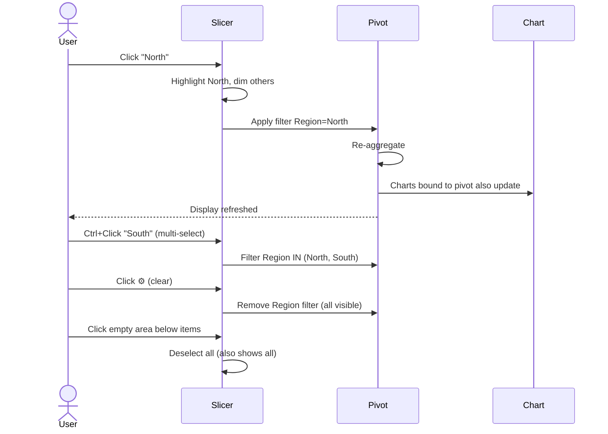
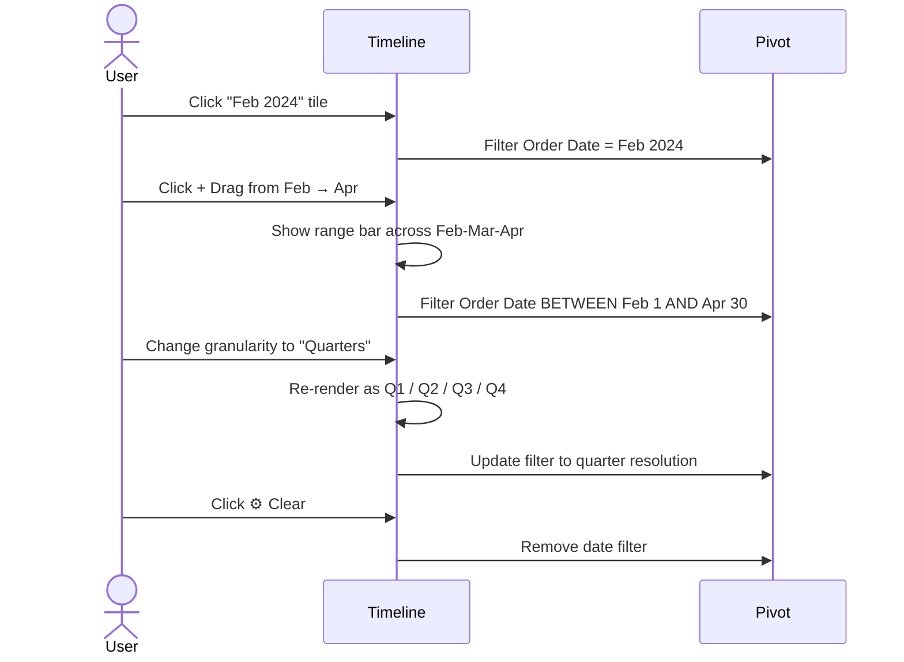

# UX Flow — Spec 54 Slicer & Timeline

> Spec gốc: [../54-slicer-timeline.md](../54-slicer-timeline.md)

## Insert Slicer entry

```
Source must be a Table or PivotTable.

Click in Table/PivotTable → Insert tab → Slicer:

┌─ Insert Slicers ──────────────────────────────┐
│ Choose the fields you want to use as slicers:  │
│ ┌────────────────────────────────────────┐    │
│ │ ☐ ID                                     │    │
│ │ ☑ Region                                 │    │
│ │ ☑ Product                                │    │
│ │ ☐ Date                                   │    │
│ │ ☐ Quantity                               │    │
│ │ ☐ Revenue                                │    │
│ └────────────────────────────────────────┘    │
│                                                  │
│                            [ OK ]   [ Cancel ] │
└──────────────────────────────────────────────────┘

→ For each checked field, one Slicer panel floats on sheet
```

## Slicer panel anatomy

```
┌─ Region ──────────────────⌖──[⚙]─[✕]┐
│                                        │ ← title bar with field name + multi-select toggle + filter-clear + close
│ ┌────────────────────────────────┐   │
│ │ East                              │   │
│ ├────────────────────────────────┤   │
│ │ North                             │ ← currently selected (highlighted blue) │   │
│ ├────────────────────────────────┤   │
│ │ South                             │   │
│ ├────────────────────────────────┤   │
│ │ West                              │   │
│ ├────────────────────────────────┤   │
│ │ (blank)                ░░░░░     │ ← gray = no data for this combo (cross-filter)
│ └────────────────────────────────┘   │
│                                        │
└────────────────────────────────────────┘
   ╲                                  ╱
    ◯ ─── resize handles ─── ◯
    
Buttons:
⌖ Multi-select toggle (Alt+S): tap multiple without Ctrl
⚙ Clear filter (Alt+C): un-select all to show all data
✕ Remove slicer
```

## Filter interaction



## Multi-slicer cross-filter

```
Two slicers connected to same PivotTable:

┌─ Region ──┐  ┌─ Product ────┐
│ ☑ East    │  │ ☑ Apple       │ ← "Apple" has no East data
│ ▒ North   │  │ ▒ Banana      │   so Banana appears gray
│ ▒ South   │  │ ▒ Cherry      │
│ ▒ West    │  │ ▒ Date         │
└────────────┘  └────────────────┘

User clicks "East" in Region:
→ Product slicer dims items with no East data (Banana stays bright if has East data)
→ "No data" items move to bottom + gray out (Show items with no data option in settings)
```

## Slicer settings dialog

```
Right-click Slicer → Slicer Settings:

┌─ Slicer Settings ─────────────────────────────┐
│ Source name: Region                            │
│ Name to use in formulas: Slicer_Region         │
│                                                  │
│ Header:                                          │
│ ☑ Display header                                │
│ Caption: [Region                          ]      │
│                                                  │
│ Item sorting and filtering:                      │
│ ◯ Ascending (A to Z)                            │
│ ● Use Source order                              │
│ ◯ Descending (Z to A)                           │
│ ☑ Visually indicate items with no data         │
│ ☑ Show items with no data last                 │
│ ☑ Hide items with no data                      │
│ ☐ Show items deleted from the data source       │
│                                                  │
│                              [ OK ]   [ Cancel ] │
└──────────────────────────────────────────────────┘
```

## Report Connections (connect slicer to multiple Pivots)

```
Right-click Slicer → Report Connections:

┌─ Report Connections (Region) ─────────────────┐
│ Select which PivotTables connect to this        │
│ slicer.                                          │
│                                                  │
│ ☑ PivotTable1 (Sheet1)                          │
│ ☑ PivotTable2 (Sheet2)                          │
│ ☐ PivotTable3 (Sheet3)                          │
│                                                  │
│                              [ OK ]   [ Cancel ] │
└──────────────────────────────────────────────────┘

→ One slicer filters multiple PivotTables simultaneously (dashboard pattern)
```

## Slicer style picker

```
Slicer Design tab (contextual ribbon when slicer selected):

┌────────────────────────────────────────────┐
│ [Slicer    ] [Slicer Styles            ▼ ] │
│ [Settings  ]                                 │
│ [⚙ Report  ] [Columns: 1▼]  [Height][Width]│
│ Connections                                  │
└──────────────────────────────────────────────┘

Slicer Styles dropdown:
┌──────────────────────────────────────┐
│ Light                                  │
│ ┌──┬──┬──┬──┬──┬──┐                  │
│ │ 1│ 2│ 3│ 4│ 5│ 6│                  │
│ └──┴──┴──┴──┴──┴──┘                  │
│ Dark                                   │
│ ┌──┬──┬──┬──┬──┬──┐                  │
│ │ 7│ 8│ 9│10│11│12│                  │
│ └──┴──┴──┴──┴──┴──┘                  │
│ New Slicer Style...                    │
│ Clear                                   │
└────────────────────────────────────────┘
```

## Timeline (for date fields only)

```
Insert → Timeline (only with Date column in source):

┌─ Insert Timelines ────────────┐
│ ☑ Order Date                    │
│ ☐ Ship Date                     │
│                                  │
│        [ OK ]   [ Cancel ]      │
└──────────────────────────────────┘

→ Timeline panel:

┌─ Order Date ──────────────⌖──[⚙]──[✕]┐
│ [All Periods            ▼]              │ ← caption + selected range
│                                          │
│  ◀  2024     [MONTHS ▼]              ▶ │ ← scroll arrows + granularity
│  ┌─────┬─────┬─────┬─────┬─────┬─────┐ │
│  │ JAN │ FEB │ MAR │ APR │ MAY │ JUN │ │
│  ├─────┼─────┼─────┼─────┼─────┼─────┤ │
│  │     │ ┃▓▓▓▓▓▓▓▓▓▓▓▓┃     │     │ │ ← selected range bar
│  └─────┴─────┴─────┴─────┴─────┴─────┘ │
│  Selected: Feb 2024 — Apr 2024          │
└──────────────────────────────────────────┘

Granularity options: Years / Quarters / Months / Days
```

## Timeline drag selection



## Slicer/Timeline + Sheet View integration (modern)

```
Sheet View (Spec 56) integration:

User A creates personal Sheet View filtering Region=North
User B opens same workbook → unaffected (still sees all)
User A's slicer state remembered per Sheet View → snap back when switching views

Slicer state shared per workbook by default; Sheet View overrides.
```

## Implementation hints cho Slave

- **Slicer data model**:
  ```python
  class Slicer:
      field: str             # field name from source table/pivot
      source: Table | Pivot
      selected_items: set[str]
      connected_pivots: list[Pivot]
      style: SlicerStyle
      anchor: (x, y, width, height)
  ```
- **Slicer widget**: `QFrame` floating overlay; child = `QListWidget` with custom item delegate (gray for no-data items).
- **Title bar**: small `QFrame` with `QLabel` + 3 `QToolButton`s.
- **Cross-filter**: when item clicked → update source data filter mask → all connected pivots re-aggregate → all connected slicers refresh their no-data states.
- **No-data detection**: for each item, check if filtered source has rows with that value → grayscale if zero.
- **Multi-select toggle**: button persists state; when on, single click adds/removes; when off, click replaces selection.
- **Timeline widget**: custom `QWidget` with `paintEvent` rendering tiles for the granularity; mouse drag → rect selection.
- **Granularity switch**: rebuild tile list and re-aggregate based on grouping (Year/Quarter/Month/Day).
- **Report Connections**: many-to-many table `(slicer_id, target_id)`; on filter change → iterate connected targets.
- **Persistence**: serialize slicer config + state to workbook XML (xlsx `slicers/` part) for save/load.
- **Sheet View binding**: slicer state stored per Sheet View key; switch view → restore.
