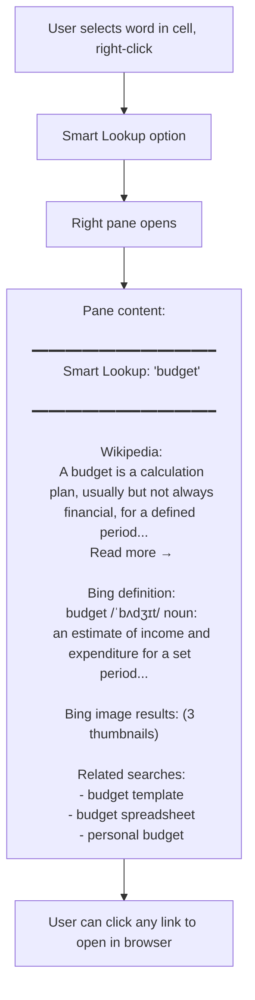

# UX Flow — Spec 55 Tell Me / Search (Microsoft Search)

> Spec gốc: [../55-tell-me-search.md](../55-tell-me-search.md)

## Entry points

```
1. Title bar Search box (Microsoft Search, modern Excel 2019+):
   ┌─ Title Bar ──────────────────────────────────────────────────┐
   │ Sales.xlsx — Excel    🔍 [Search...]     [Sign in] [_][□][×]│
   └────────────────────────────────────────────────────────────────┘

2. Alt+Q (legacy "Tell Me what you want to do")
   → Opens search box with focus

3. Light bulb icon 💡 (older "Tell Me")
```

## Modern Search bar (focused state)

```
User clicks search bar or presses Alt+Q:
┌─ 🔍 Search ───────────────────────────────────────┐
│ [Type to search                              ]    │
│ ────────────────────────────────────────────────  │
│                                                     │
│ ── Suggested actions (based on context) ──         │
│ 🔢 Insert PivotTable                                │
│ 📊 Insert Chart                                     │
│ 🎨 Conditional Formatting                            │
│ 🧮 AutoSum                                          │
│                                                     │
│ ── Recently used ──                                 │
│ 📋 Paste Special                                    │
│ 🔍 Find & Replace                                   │
│                                                     │
│ ── Help & Training ──                                │
│ 📖 What's new in Excel                              │
│ 🎓 Learn Excel                                       │
└──────────────────────────────────────────────────────┘
```

## Live search results

```
User types "sum":
┌─ 🔍 sum ─────────────────────────────────────────┐
│                                                     │
│ ── Actions (run directly) ──                       │
│ 🧮 AutoSum                          Alt+=          │
│ ➕ Insert Function SUM                             │
│ ➕ Insert Function SUMIF                           │
│ ➕ Insert Function SUMIFS                          │
│ ➕ Insert Function SUMPRODUCT                      │
│                                                     │
│ ── Subtotal & Total Row ──                          │
│ 📊 Total Row (in Table)                            │
│ 📊 Subtotal command                                 │
│                                                     │
│ ── Smart Lookup (web) ──                            │
│ 🌐 "sum" — definition, Wikipedia                   │
│                                                     │
│ ── Help articles ──                                 │
│ 📖 Add up numbers in Excel                         │
│ 📖 SUM function help                                │
│ 📖 SUMIF function help                              │
└──────────────────────────────────────────────────────┘
```

## Tell Me — action execution

```mermaid
sequenceDiagram
    actor User
    participant Search as Search Box
    participant Index as Ribbon Index
    participant Engine
    
    User->>Search: Alt+Q
    User->>Search: Type "conditional format"
    
    Search->>Index: Query "conditional format"
    Index->>Index: Match against ribbon action database
    Index-->>Search: Results: 
      - Conditional Formatting → New Rule...
      - Conditional Formatting → Manage Rules...
      - Conditional Formatting → Highlight Cells > Greater Than...
      - Clear Conditional Formatting
    
    User->>Search: ↓ to navigate, Enter on "New Rule..."
    Search->>Engine: Execute action "cf.new_rule"
    Engine->>Engine: Open New Formatting Rule dialog
```

## Search domains

```
Microsoft Search indexes (in order of relevance):

1. Ribbon commands (~1000 actions)
   - Direct execution
   - Shows shortcut if any

2. Functions (~500+ functions)
   - Insert into active cell
   - Or open Function Wizard

3. Recent files (last 25)
   - From File → Recent

4. People (collaborators, when signed in to M365)
   - Names, emails of recent co-editors

5. Help articles (live from support.microsoft.com)
   - Open in browser or sidebar

6. Smart Lookup (web)
   - Wikipedia, Bing definition

7. Cells/sheets matching query (current workbook)
   - Equivalent to Find All result
```

## Search filters (modern)

```
With results showing, user can filter by domain:

┌─ 🔍 budget ─────────────────────────────────────┐
│ [All] [Actions] [Help] [Files] [People] [Web]    │ ← filter tabs
│ ────────────────────────────────────────────────  │
│                                                     │
│ Actions:                                            │
│ - Insert > PivotTable                              │
│                                                     │
│ Files:                                              │
│ - Budget2026.xlsx (Recent)                         │
│ - Annual_Budget.xlsx (Recent)                      │
│                                                     │
│ Help:                                               │
│ - Create a budget template                         │
│ - Budget functions reference                       │
└──────────────────────────────────────────────────────┘
```

## Tell Me keyboard navigation

```
Shortcuts:
- Alt+Q       → Open Tell Me / Search with focus
- ↑/↓         → Navigate suggestions
- Enter       → Execute selected
- Tab         → Filter tabs
- Esc         → Close, return focus to grid

Quick action execution:
- Type partial name + Enter → executes top suggestion
- "freeze" + Enter → Freeze Panes (most common)
- "merge" + Enter → Merge Cells
```

## Smart Lookup integration



## "Tell Me" history & ML personalization

```
Tell Me box "remembers" actions user took before:

After 1 week of using:
┌─ 🔍 Recently used ─────────┐
│ 🧮 AutoSum         12x      │  ← sorted by frequency
│ 📋 Paste Values    8x       │
│ 🎨 Format Cells    7x       │
│ 🔢 Sort A→Z        5x       │
│ 🔽 Filter          5x       │
└──────────────────────────────┘

ML model learns:
- Time of day correlations
- Sequence patterns (after Filter → Sort)
- Sheet type (financial vs project mgmt)
```

## Searching for "Where is...?"

```
Common queries Tell Me answers:

User types "where is solver":
→ Tools > Add-ins > Solver Add-in 
→ "If not enabled, click here to enable"

User types "currency format":
→ Home > Number > Currency (drop-down)
→ Or: Format Cells > Number > Currency

User types "remove blank rows":
→ Suggests: Go To Special > Blanks → Delete Row
→ Or: Filter blanks → Delete

User types "merge & center":
→ Home > Alignment > Merge & Center
```

## Implementation hints cho Slave

- **Search box widget**: `QLineEdit` in title bar/toolbar; `QCompleter` for dropdown suggestions.
- **Action index**: build at startup, `dict[str, ActionDescriptor]` where keys include synonyms.
  ```python
  ACTIONS = {
    "conditional formatting": Action("cf.menu"),
    "cf": Action("cf.menu"),  # short alias
    "highlight": Action("cf.menu"),
    "color cells": Action("cf.menu"),
    ...
  }
  ```
- **Fuzzy matching**: use `rapidfuzz` or `difflib.get_close_matches()` for typo-tolerance.
- **Ranking**:
  ```python
  score = 0.6 * fuzzy_match(query, action.title) \
        + 0.2 * (1 / log(recency_days + 2)) \
        + 0.1 * usage_count_normalized \
        + 0.1 * context_relevance(active_cell, action.scope)
  ```
- **Recent files**: query OS recent docs or app-managed MRU list.
- **Help articles**: cache periodic JSON fetch from Microsoft docs; or use embedded help bundle for offline.
- **Smart Lookup**: optional — call Bing API or local LLM (Spec 39 Copilot pipeline).
- **Personalization**: store per-user `usage_count[action_id]` in QSettings; decay over time.
- **Keyboard shortcut**: register `QShortcut(QKeySequence("Alt+Q"))` → focus search box.
- **Cells/sheets search**: piggyback on Find engine (Spec 32) for cell content search.
- **Performance**: in-memory action index < 5000 entries; sub-millisecond query latency.
