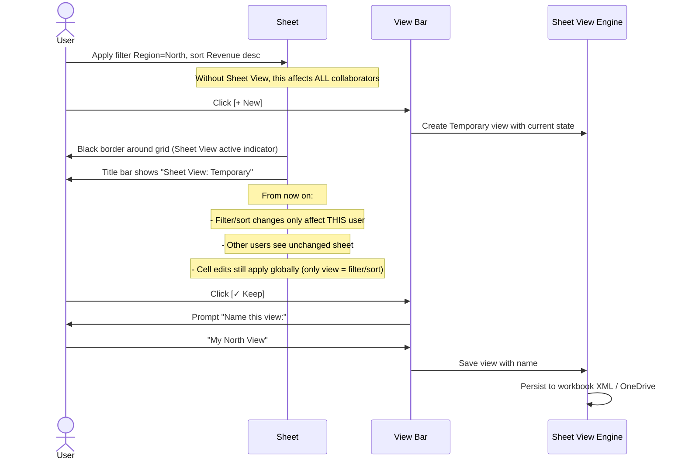
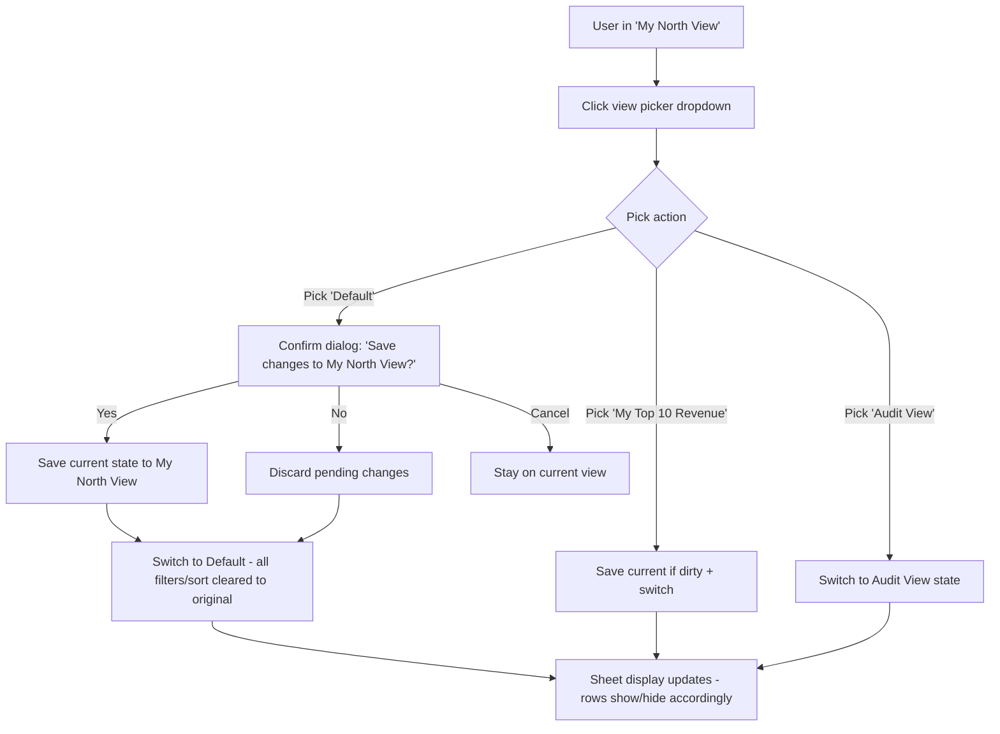
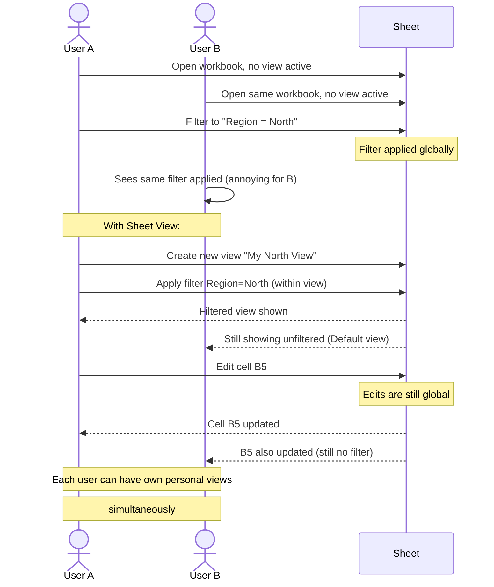

# UX Flow — Spec 56 Sheet View

> Spec gốc: [../56-sheet-view.md](../56-sheet-view.md)

## What is Sheet View?

```
Sheet View = personal view of a shared workbook.
You can sort/filter without affecting other collaborators.

Each user can have multiple named views.
Views are saved per-workbook, per-user (when signed in).
Only available for workbooks stored in OneDrive/SharePoint
and shared with others (collaboration mode).
```

## Sheet View entry

```
View tab → Sheet View group:

┌─────────────────────────────────────────┐
│ [+ New] [✓ Keep] [⌧ Exit] [⚙ Options] │
│                                            │
│  [Sheet View: Default            ▼]      │ ← view picker dropdown
└──────────────────────────────────────────┘

View picker shows:
┌──────────────────────────────┐
│ ✓ Default                     │ ← original shared view
│ ──────────────────────────── │
│ Temporary View                 │ ← unsaved current state
│ ──────────────────────────── │
│ My North Region View          │ ← saved personal view
│ My Top 10 Revenue              │
│ Audit View                     │
│ ──────────────────────────── │
│ ✓ Sheet1 (you are viewing)    │
│ ── Other Users ──             │
│ 👤 Hoang's view (read-only)    │
│ 👤 Trang's view (read-only)   │
└────────────────────────────────┘
```

## Create new view flow



## Active view visual indicator

```
With Sheet View active, grid gets a colored border:

┌─ View: My North View ────────────────────┐
│┃                                          ┃│ ← thin black border 1px
│┃    A    B    C    D    E                ┃│
│┃  1  ID  Name Rev  Date                  ┃│
│┃  2  1   ...   ...   ...                  ┃│
│┃                                          ┃│
│┃    Filtered data                          ┃│
│┃                                          ┃│
│┃                                          ┃│
│┃                                          ┃│
│┃                                          ┃│
│┗━━━━━━━━━━━━━━━━━━━━━━━━━━━━━━━━━━━━━━━━┛│
└──────────────────────────────────────────────┘

Status bar bottom: "You're in a sheet view. Changes won't affect others."
```

## Switching between views



## Sheet View limitations & scope

```
Sheet View IS scoped to:
✓ Filters (column filters, advanced filter)
✓ Sort order
✓ Hidden rows/columns
✓ Slicer/Timeline selections
✓ Selected cell / scroll position

Sheet View is NOT scoped to:
✗ Cell values (edits global)
✗ Formulas (global)
✗ Formatting (global)
✗ Conditional formatting (global)
✗ Charts (global)
✗ Pivot Table structure (global, but slicer state per view)
✗ Cell comments / notes (global)
✗ Print settings (global)
```

## Exit view flow

```
View tab → Exit Sheet View button:

User clicks Exit:
┌─ Exit Sheet View? ─────────────────────────────────┐
│ Do you want to save changes to the sheet view?      │
│                                                       │
│ ◯ Save (overwrite "My North View")                   │
│ ◯ Save as new view: [______________________]         │
│ ● Don't save                                         │
│                                                       │
│            [ OK ]   [ Cancel ]                       │
└───────────────────────────────────────────────────────┘

After OK with "Don't save":
- View deactivated
- Grid border disappears
- View bar dropdown shows "Default"
- Filters/sorts visible reverts to last saved Default state
```

## Manage views dialog

```
View tab → Options ▼ → Manage Sheet Views:

┌─ Manage Sheet Views ────────────────────────────────┐
│ Views on this sheet:                                 │
│ ┌────────────────────────────────────────────────┐  │
│ │ Name              Owner         Last Modified   │  │
│ ├────────────────────────────────────────────────┤  │
│ │ Default           (shared)      —               │  │
│ │ My North View     Giang         2h ago          │  │
│ │ My Top 10 Revenue Giang         Yesterday        │  │
│ │ Audit View        Giang         3 days ago      │  │
│ │ Hoang's view      Hoang         (read-only)     │  │
│ │ Trang's view      Trang         (read-only)     │  │
│ └────────────────────────────────────────────────┘  │
│                                                        │
│ [Rename]  [Duplicate]  [Delete]                       │
│                                                        │
│                              [ OK ]   [ Cancel ]      │
└────────────────────────────────────────────────────────┘

User can view/duplicate other users' views but not edit them.
Delete only own views (or admin can delete any).
```

## Sheet View + collaboration scenario



## View bar always-visible state

```
With at least one view ever created on a sheet:

View bar persists at top of grid:
┌────────────────────────────────────────────────────┐
│ [Sheet View: Default ▼]  [+ New View] [Manage...]  │ ← always visible
├────────────────────────────────────────────────────┤
│ A   B   C   D   E   F                                │
│ 1 ...                                                 │
│ 2 ...                                                 │
│ ...                                                   │
└────────────────────────────────────────────────────────┘

If no views exist, bar is hidden; appears after first view creation.
```

## Implementation hints cho Slave

- **Sheet View data model**:
  ```python
  class SheetView:
      id: UUID
      name: str
      owner: User
      created_at: datetime
      modified_at: datetime
      
      # filter/sort state
      column_filters: dict[int, FilterCriteria]
      sort_levels: list[SortLevel]
      hidden_rows: set[int]
      hidden_cols: set[int]
      slicer_states: dict[slicer_id, set[str]]
      
      # navigation state
      active_cell: (row, col)
      scroll_position: (x, y)
  ```
- **Per-user store**: `sheet._views: dict[user_id, list[SheetView]]`; shared via workbook XML.
- **Default view**: synthetic "Default" view = no filters, no sort, all rows/cols visible (immutable, shared).
- **Active view tracking**: `MainWindow._active_view: SheetView | None`. When `None` → user in shared/default state.
- **Filter/sort interception**:
  - If `_active_view is None` → apply globally (current behavior).
  - If `_active_view is not None` → write changes to view's filter/sort state only; recompute hidden rows for THIS view; emit local repaint signal.
- **Persistence**: serialize views to xlsx `xl/sheetViews.xml` (custom part); reload on workbook open per user.
- **Visual indicator**: `QFrame` with `QSS border: 1px solid #1A1A1A` overlaying viewport; show view name label in status bar.
- **View bar widget**: persistent `QWidget` above viewport when views exist; dropdown = `QComboBox`.
- **Collaboration sync**: views are user-specific; share via M365 Graph if signed in; otherwise local file-bound.
- **Read-only other users' views**: when picking view owned by another user → set readonly flag → user can browse but not modify.
- **Performance**: store hidden rows as `set[int]`; computing visible row count from bitmap should be O(1) cached.
