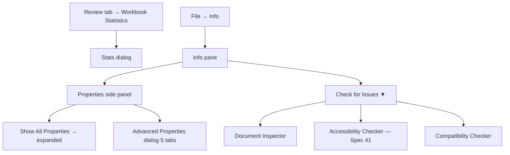
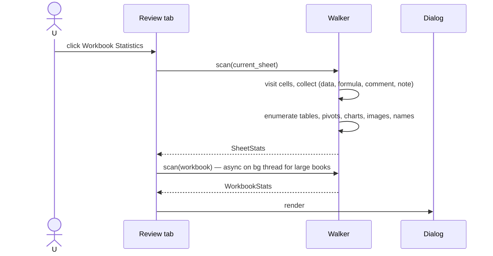
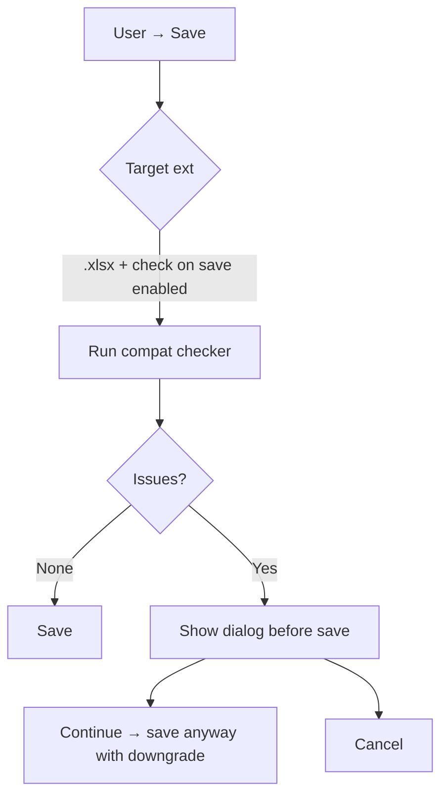
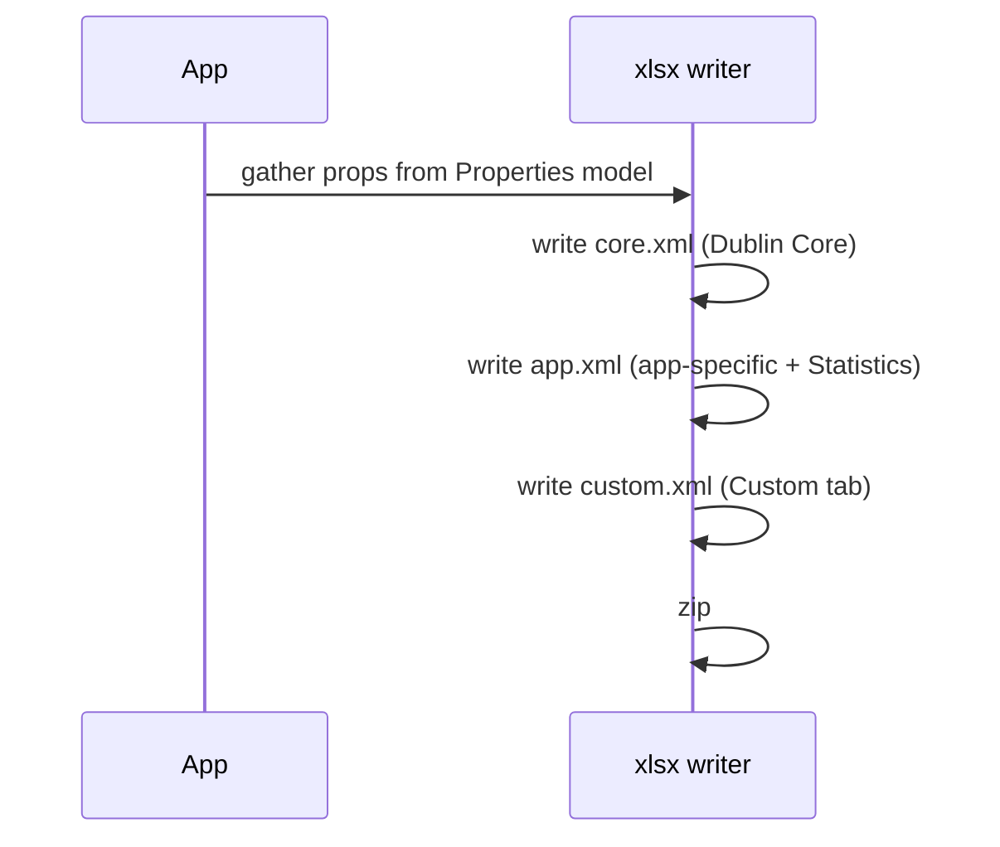

# 57 — Workbook Statistics / Properties / Document Inspector / Compatibility — UX Flow

> Spec gốc: [57-workbook-statistics-properties.md](../57-workbook-statistics-properties.md)

## 1. Surface map



## 2. Workbook Statistics dialog

```
Review → Workbook Statistics

┌─ Workbook Statistics ────────────────────────────────────┐
│ Current sheet: Sheet1                                     │
│ ────────────────────────────────────────────────────────│
│ End of sheet:               AZ150                         │
│ Words:                      1,247                         │
│ Number of cells with data:  387                           │
│ Number of tables:           2                             │
│ Number of PivotTables:      1                             │
│ Number of formulas:         142                           │
│ Number of charts:           3                             │
│ Number of images:           1                             │
│ Number of comments:         8                             │
│ Number of notes:            0                             │
│ Number of named ranges (sheet scope): 4                   │
│ ────────────────────────────────────────────────────────│
│ Workbook:                                                 │
│ ────────────────────────────────────────────────────────│
│ Number of sheets:           5                             │
│ Number of cells with data:  2,103                         │
│ Total words:                5,432                         │
│ Number of tables:           7                             │
│ Number of PivotTables:      3                             │
│ Number of formulas:         678                           │
│ Number of charts:           9                             │
│ Number of images:           4                             │
│ Number of named ranges (workbook scope): 11               │
│                                                  [OK]    │
└────────────────────────────────────────────────────────────┘
```

Sequence:



For large workbooks (>1M cells), scan runs in background with progress bar to keep UI responsive.

## 3. Properties side panel (File → Info)

```
File → Info

┌─ Info pane ──────────────────────────────────────────────────────────┐
│                                                                        │
│ ┌─ Workbook ────────────────────┐  ┌─ Properties ──────────────────┐ │
│ │ 🔒 Protect Workbook ▼          │  │ Size:        1.4 MB           │ │
│ │ 🔍 Check for Issues ▼          │  │ Title:       Q3 Sales Report  │ │
│ │ 🕓 Manage Workbook ▼           │  │ Tags:        sales, q3, 2026  │ │
│ │ 🌐 Browser View Options        │  │ Categories:  Reports          │ │
│ └────────────────────────────────┘  │ ─────────────────────────── │ │
│                                        │ Related Dates                │ │
│                                        │   Last Modified: 2026-06-02 │ │
│                                        │   Created:       2026-04-15 │ │
│                                        │   Last Printed:  2026-05-30 │ │
│                                        │ Related People               │ │
│                                        │   Author:    you            │ │
│                                        │   Last Modified By: you     │ │
│                                        │ Show All Properties ▼       │ │
│                                        └──────────────────────────────┘ │
└──────────────────────────────────────────────────────────────────────────┘
```

### Show All Properties expanded

```
Author:           you
Manager:          [          ]
Company:          [          ]
Subject:          [          ]
Hyperlink base:   [          ]
Template:         Blank.xlsx
Status:           Draft  ▼   (Draft / In Review / Final / custom)
Comments:        [free text…]
Categories:       Reports
```

## 4. Advanced Properties dialog (5 tabs)

```
Properties side panel → click name → Advanced Properties

┌─ Q3SalesReport.xlsx Properties ────────────────────────────────┐
│ [General][Summary][Statistics][Contents][Custom]               │
│ ──────────────────────────────────────────────────────────────│
│  General                                                        │
│    Type:        Microsoft Excel Worksheet                       │
│    Location:    C:\Users\you\Documents\                         │
│    Size:        1.40 MB (1,467,392 bytes)                       │
│    Created:     2026-04-15 09:34                                │
│    Modified:    2026-06-02 11:18                                │
│    Accessed:    2026-06-03 04:00                                │
│    Attributes:  [☑] Read-only [☐] Hidden [☑] Archive            │
│ ──────────────────────────────────────────────────────────────│
│  Summary                                                        │
│    Title       [Q3 Sales Report]                                │
│    Subject     [Quarterly review]                               │
│    Author      [you]                                            │
│    Manager     [                ]                               │
│    Company     [                ]                               │
│    Category    [Reports]                                        │
│    Keywords    [sales, q3, 2026]                                │
│    Comments    […]                                              │
│    Hyperlink base [                ]                            │
│    Template    [Blank.xlsx]                                     │
│ ──────────────────────────────────────────────────────────────│
│  Statistics                                                     │
│    Created      2026-04-15                                      │
│    Last saved   2026-06-02                                      │
│    Last printed 2026-05-30                                      │
│    Last saved by you                                            │
│    Revision number 47                                           │
│    Total editing time 18h 42m                                   │
│ ──────────────────────────────────────────────────────────────│
│  Contents                                                       │
│    Sheets:     Sheet1, Sheet2, Sheet3, Pivot1, Charts          │
│    Named ranges: TotalUS, FX_Rate, …                           │
│ ──────────────────────────────────────────────────────────────│
│  Custom                                                         │
│    Name         Type      Value                                 │
│    ──────────────────────────────────────                     │
│    Project      Text      Q3-2026                               │
│    Reviewer     Text      Alice                                 │
│    Due          Date      2026-06-30                            │
│    Confidential Yes/No    Yes                                   │
│    Approved     Number    1                                     │
│    ──────────────────────────────────────                     │
│    Name: [          ]  Type: [Text ▼]  Value: [          ]      │
│                                            [Add]   [Delete]    │
│                                                                  │
│                                              [OK]    [Cancel]  │
└─────────────────────────────────────────────────────────────────┘
```

Custom property types: **Text / Date / Number / Yes-No**.

## 5. Document Inspector (File → Info → Check for Issues → Inspect Document)

```
┌─ Document Inspector ─────────────────────────────────────────────┐
│ To check the document for the selected content, click Inspect.   │
│                                                                    │
│ [☑] Comments and notes                                             │
│ [☑] Document properties and personal information                  │
│ [☑] Data Model                                                     │
│ [☑] Content add-ins                                                │
│ [☑] Task pane add-ins                                              │
│ [☑] PivotTables, PivotCharts, cube formulas, slicers, timelines   │
│ [☑] Embedded documents                                             │
│ [☑] Macros, forms, and ActiveX controls                            │
│ [☑] Links to other files                                           │
│ [☑] Real-time data functions                                       │
│ [☑] Excel surveys                                                  │
│ [☑] Defined scenarios                                              │
│ [☑] Active filters                                                 │
│ [☑] Custom worksheet properties                                    │
│ [☑] Hidden Names                                                   │
│ [☑] Ink                                                            │
│ [☑] Hidden Worksheets                                              │
│ [☑] Hidden Rows and Columns                                        │
│ [☑] Headers and Footers                                            │
│                                              [Inspect] [Close]    │
└────────────────────────────────────────────────────────────────────┘
```

### After Inspect

```
┌─ Inspection Results ─────────────────────────────────────────┐
│ ✓ Comments and notes  No items found.                         │
│ ⚠ Document properties and personal information                │
│      The following information was found:                     │
│      * Document properties                                     │
│      * Author name                                             │
│      * Related dates                                           │
│      * Printer path                                            │
│                                          [Remove All]         │
│ ⚠ PivotTables, PivotCharts, cube formulas, slicers, timelines│
│      3 PivotTables found.                                     │
│                                          [Remove All]         │
│ ✓ Macros — No items found                                     │
│ ⚠ Hidden Worksheets                                            │
│      1 hidden sheet 'ConfigPrivate'                            │
│                                          [Remove All]         │
│ ⚠ Ink                                                          │
│      4 ink strokes found                                       │
│                                          [Remove All]         │
│ ... (more rows)                                                │
│                                       [Reinspect] [Close]     │
└────────────────────────────────────────────────────────────────┘
```

## 6. Compatibility Checker

```
File → Info → Check for Issues → Check Compatibility

┌─ Compatibility Checker ──────────────────────────────────────────┐
│ The following features in this workbook are not supported by     │
│ earlier versions of Excel.                                        │
│                                                                    │
│ Select target version:                                             │
│   [☑] Excel 2007-2010   [☐] 2013   [☐] 2016   [☐] 2019            │
│                                                                    │
│ Summary                            Occurrences                     │
│ ─────────────────────────────────────────────────────────────────│
│ Significant loss of functionality                                  │
│   • Dynamic array formulas will not   3   Find Sheet1!B2…         │
│     spill in earlier versions.                                     │
│   • PivotTable using Data Model       1   Sheet 'Pivot1'           │
│     not supported in 2007.                                         │
│   • REGEX functions: REGEXEXTRACT…    5   Sheet1!D2:D6             │
│                                                                    │
│ Minor loss of fidelity                                             │
│   • Conditional formatting Icon Sets  2   Sheet2 A2:A50            │
│     show as fill color in 2007.                                    │
│   • Chart styles map to older preset  1   Chart 'Sales'            │
│                                                                    │
│ [☑] Check compatibility when saving this workbook                  │
│                                              [Copy to New Sheet]  │
│                                              [OK]    [Cancel]    │
└────────────────────────────────────────────────────────────────────┘
```



## 7. Storage mapping (OOXML)

```
xl/docProps/
├── core.xml          ← Dublin Core: title, subject, creator, keywords, description
├── app.xml           ← App-level: Manager, Company, total time, sheets list
└── custom.xml        ← Custom properties key=value+type
```

Sequence on save:



## 8. Status field — preset chips

```
Properties → Status dropdown:

[ Draft ▼ ]
   ──────────────
   Draft         ◀ current
   In Review
   Final
   Approved
   ──────────────
   Custom…     → free text dialog
```

Custom value persisted as plain string in `core.xml > Status`.

## 9. Workbook Statistics — visual breakdown (post-MVP enhancement)

A "stats with chart" mode showing a small breakdown alongside the dialog:

```
┌─ Workbook Statistics ────────────────────────────────────┐
│ Stats per sheet                                           │
│ ─────────────────────────────────────────────────────│
│ Sheet1       ▓▓▓▓▓▓▓▓▓▓ 387 cells, 142 fx                │
│ Sheet2       ▓▓▓▓▓ 210 cells, 95 fx                       │
│ Sheet3       ▓▓ 80 cells, 12 fx                           │
│ Pivot1       ▓ 50 cells, 0 fx                             │
│ Charts       1 cell, 0 fx                                 │
│ ─────────────────────────────────────────────────────│
│ Composition (workbook):                                    │
│   data cells   ▰▰▰▰▰▰▰▰▰▰▰▰▰▰  72%                       │
│   formulas     ▰▰▰▰▰          22%                         │
│   objects      ▰▰              6%                          │
└────────────────────────────────────────────────────────────┘
```

## 10. User journeys

### J1 — Quick audit before share
1. Workbook nearly done → Review → Workbook Statistics → see 1,247 words, 678 formulas, 4 images.
2. File → Info → Check for Issues → Inspect Document → remove personal info + hidden rows.
3. Save → portable.

### J2 — Set custom property
1. File → Info → Properties → Advanced Properties → Custom tab.
2. Name "Reviewer" / Type Text / Value "Alice" → Add.
3. Save → `docProps/custom.xml` includes the property.

### J3 — Pre-2019 compatibility check
1. Targeting users on Excel 2016 → Check Compatibility → tick "Excel 2007-2010".
2. Dialog lists "Dynamic array formulas in 3 cells will not spill" → click Find → jumps to first.
3. Refactor or accept downgrade → Save.

### J4 — Set workbook status to Final
1. Status dropdown → Final → adds `<status>Final</status>` to core.xml.
2. (Different from Mark as Final [Spec 29] — Status is metadata only, no read-only behavior.)

### J5 — Document Inspector strip metadata
1. File from external source → Inspect Document → Author, Last modified by, Path detected.
2. Remove All → fields cleared from core.xml + app.xml.

## 11. Implementation hints

- **Walker** (`core/stats/walker.py`):
  - One pass per sheet collecting counters.
  - For large workbook: chunked iteration + progress bar.
- **Dialog** (`ui/dialogs/workbook_statistics.py`): simple grid + per-sheet vs workbook columns.
- **Properties model** (`core/props/properties.py`):
  - 3 sections matching OOXML: `core_props`, `app_props`, `custom_props`.
  - Round-trip: load on file open; write on save.
- **Custom properties typing**:
  - OOXML custom.xml uses `vt:lpwstr` / `vt:filetime` / `vt:r8` / `vt:bool` variant types.
  - UI dropdown 4 types → mapped on write.
- **Document Inspector** (`features/inspect/inspector.py`):
  - Pluggable detectors: each registers `category, find() → list[Item], remove(items)`.
  - Built-in 18+ detectors (mirror Excel list).
  - Categories: Comments / DocProps / DataModel / Add-ins / PivotTables / Embedded / Macros / Links / RTD / Surveys / Scenarios / Filters / Custom worksheet props / Hidden names / Ink / Hidden sheets / Hidden rows&cols / Headers&Footers.
- **Compatibility Checker** (`features/compat/checker.py`):
  - Rule list per target version. Each rule: `applies_to(workbook) → list[Location]` + severity (significant / minor) + description.
  - 2007-2010: dynamic arrays, REGEX functions, GROUPBY/PIVOTBY, Data Model, threaded comments, etc.
  - Persist "check on save" flag in QSettings.
- **Status field**: simple string with chip dropdown of presets + Custom.

## 12. Acceptance ↔ flow map

Spec 57 covers behavior (no AC numbered list). Flow defines:
- Workbook Statistics dialog §2
- Properties panel §3 + Advanced Properties §4
- Document Inspector §5
- Compatibility Checker §6 + on-save flow
- OOXML storage mapping §7
- Custom property types §4 Custom tab
- Status chip §8
