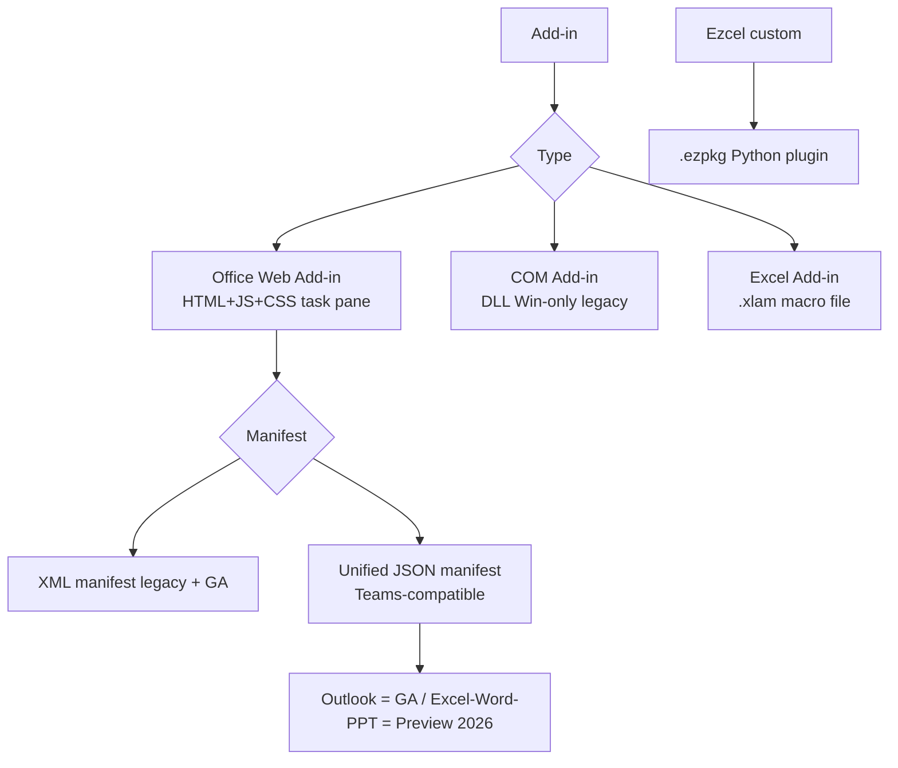
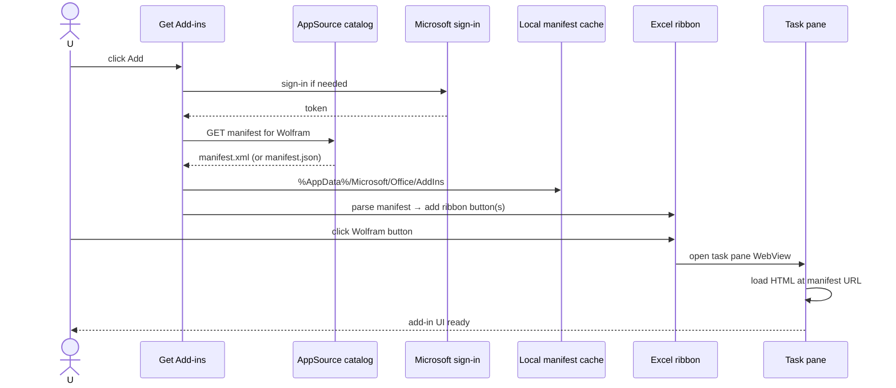
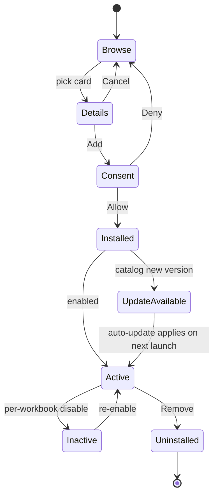

# 58 — Office Add-ins / AppSource Gallery — UX Flow

> Spec gốc: [58-add-ins-appsource.md](../58-add-ins-appsource.md)
>
> **Status**: Office.js compatibility = out of scope MVP. Ezcel cung cấp **Python plugin alternative**. Flow này document cả 2 paths: (a) Excel reference UX, (b) Ezcel `.ezpkg` plugin system.

## 1. Add-in taxonomy



## 2. Get Add-ins dialog (Excel reference)

```
Insert → Get Add-ins

┌─ Office Add-ins ─────────────────────────────────────────────────────┐
│ [Store] [My Add-ins] [Admin Managed]                                  │
│ ────────────────────────────────────────────────────────────────────│
│ Categories       Search: [                                       🔍 ] │
│ ┌──────────────┐ ┌──────────────┐ ┌──────────────┐ ┌──────────────┐ │
│ │ All          │ │ Wolfram Alpha │ │ People Graph │ │ JotForm      │ │
│ │ Editor Picks │ │ ★★★★★ 4.6     │ │ ★★★★ 4.2     │ │ ★★★★★ 4.8    │ │
│ │ Productivity │ │ Free / IAP    │ │ Free          │ │ Free          │ │
│ │ Data         │ │ [Add]         │ │ [Add]         │ │ [Add]         │ │
│ │ Financial    │ └──────────────┘ └──────────────┘ └──────────────┘ │
│ │ Marketing    │                                                      │
│ │ ...          │ ┌──────────────┐ ┌──────────────┐ ┌──────────────┐ │
│ └──────────────┘ │ Bing Maps    │ │ DataXL       │ │ Solver       │ │
│                  │ ★★★★ 4.0     │ │ ★★★★★ 4.7     │ │ ★★★★ 4.1     │ │
│                  │ Free          │ │ Free          │ │ Free          │ │
│                  │ [Add]         │ │ [Add]         │ │ [Add]         │ │
│                  └──────────────┘ └──────────────┘ └──────────────┘ │
└────────────────────────────────────────────────────────────────────────┘
```

Click card → details modal:

```
┌─ Wolfram Alpha ─────────────────────────────────────────────────┐
│ Wolfram Alpha by Wolfram Research                                │
│ ★★★★★ 4.6 (2,140 reviews)                                       │
│ ─────────────────────────────────────────────────────────────│
│ [Screenshot 1] [Screenshot 2] [Screenshot 3]                     │
│ ─────────────────────────────────────────────────────────────│
│ Description: Bring computational intelligence into Excel —       │
│ math, science, data, more.                                       │
│                                                                    │
│ Permissions requested:                                           │
│   • Read and make changes to your document                       │
│   • Send data over the Internet                                  │
│                                                                    │
│ Vendor: Wolfram Research Inc.                                    │
│ Privacy policy → https://...                                      │
│ Terms of use → https://...                                        │
│                                                                    │
│                                       [Add]    [Cancel]         │
└──────────────────────────────────────────────────────────────────┘
```

## 3. Install + activate lifecycle (Office.js path)



## 4. Task pane anatomy

```
┌─ Excel main ─────────────────────────────────────────────┐ ┌─ Wolfram ┐
│       A      B      C                                     │ │  pane   │
│   1                                                        │ │         │
│   2  ...grid...                                            │ │ Query:  │
│                                                             │ │ [    ] │
│                                                             │ │ [Run]   │
│                                                             │ │         │
│                                                             │ │ Result: │
│                                                             │ │  ...    │
│                                                             │ │         │
│                                                             │ │ [Insert │
│                                                             │ │  into   │
│                                                             │ │  A1]    │
└───────────────────────────────────────────────────────────────┴────────┘
```

`QDockWidget` right side. Inside = `QWebEngineView` rendering add-in's HTML. Communication: Office.js bridges to host via custom IPC.

## 5. Manifest types

### XML manifest (legacy, GA)

```xml
<OfficeApp xmlns="http://schemas.microsoft.com/office/appforoffice/1.1"
           xsi:type="TaskPaneApp">
  <Id>guid</Id>
  <Version>1.0.0</Version>
  <ProviderName>Wolfram Research</ProviderName>
  <DefaultLocale>en-US</DefaultLocale>
  <DisplayName DefaultValue="Wolfram Alpha"/>
  <Description DefaultValue="..."/>
  <IconUrl DefaultValue="https://.../icon-32.png"/>
  <SupportUrl DefaultValue="https://..."/>
  <Hosts><Host Name="Workbook"/></Hosts>
  <Requirements>
    <Sets DefaultMinVersion="1.1">
      <Set Name="ExcelApi" MinVersion="1.7"/>
    </Sets>
  </Requirements>
  <DefaultSettings>
    <SourceLocation DefaultValue="https://.../index.html"/>
  </DefaultSettings>
  <Permissions>ReadWriteDocument</Permissions>
</OfficeApp>
```

### Unified manifest (JSON, Teams-compatible)

```json
{
  "$schema": "https://developer.microsoft.com/json-schemas/teams/...",
  "manifestVersion": "1.17",
  "id": "guid",
  "version": "1.0.0",
  "developer": {
    "name": "Wolfram Research",
    "websiteUrl": "https://wolfram.com",
    "privacyUrl": "https://wolfram.com/privacy",
    "termsOfUseUrl": "https://wolfram.com/terms"
  },
  "name": { "short": "Wolfram", "full": "Wolfram Alpha" },
  "description": { "short": "...", "full": "..." },
  "icons": { "color": "icon-color.png", "outline": "icon-outline.png" },
  "extensions": [{
    "requirements": {
      "scopes": ["workbook"],
      "capabilities": [{ "name": "ExcelApi", "minVersion": "1.7" }]
    },
    "runtimes": [{
      "id": "TaskPaneRuntime",
      "type": "general",
      "code": { "page": "https://.../index.html" },
      "lifetime": "short",
      "actions": [...]
    }],
    "ribbons": [...]
  }]
}
```

Status matrix (Microsoft Learn, 2026):

| Host | XML manifest | Unified manifest |
|---|---|---|
| Outlook | GA | **GA** (production + AppSource) |
| Excel | GA | **Preview** |
| Word | GA | Preview |
| PowerPoint | GA | Preview |

## 6. Permission scopes

```
3 levels (declared in manifest, shown in Add dialog):

┌─ Permissions requested ────────────────────────┐
│ ( ) Restricted        — read cell value only   │
│ ( ) ReadDocument      — read all workbook       │
│ (●) WriteDocument     — read + write workbook   │
└────────────────────────────────────────────────┘

User must consent → otherwise install cancelled.
```

## 7. My Add-ins management

```
┌─ My Add-ins ────────────────────────────────────────────┐
│ Installed Office Add-ins                                 │
│ ─────────────────────────────────────────────────────│
│ ┌──────────────────────────────────────────────────┐ │
│ │ Wolfram Alpha          Active  ⋯                  │ │
│ │ Version 1.4.2  Updated 2026-05-01                 │ │
│ │ Permissions: WriteDocument                         │ │
│ │ [Disable for this workbook] [Remove]              │ │
│ └──────────────────────────────────────────────────┘ │
│ ┌──────────────────────────────────────────────────┐ │
│ │ JotForm               Active  ⋯                   │ │
│ │ ...                                                │ │
│ └──────────────────────────────────────────────────┘ │
└────────────────────────────────────────────────────────┘
```

Admin Managed tab: greyed Remove button; user can only disable per-workbook.

## 8. Ezcel Python plugin alternative

```mermaid
flowchart TD
    Insert[Insert → Get Plugins] --> Cat[Ezcel plugin catalog<br/>GitHub Releases or self-hosted]
    Cat --> Pick[Pick plugin]
    Pick --> DL[Download .ezpkg zip]
    DL --> Unpack[Unpack to ~/.ezcel/plugins/{name}/]
    Unpack --> Manifest[Read plugin.json]
    Manifest --> Reg[Ribbon entries + permissions registered]
    Reg --> Ribbon[Ribbon button appears]
    Ribbon --> Click[User clicks → entry point runs Python]
    Click --> Pane[Optional task pane Qt widget]
```

### `plugin.json` schema

```json
{
  "name": "csv_pro_tools",
  "version": "1.2.0",
  "author": "you",
  "description": "Advanced CSV cleaning and import",
  "entry_point": "csv_pro_tools.main:run",
  "ribbon": [{
    "tab": "Data",
    "group": "External",
    "label": "CSV Pro",
    "icon": "icon.svg",
    "callback": "csv_pro_tools.main:open_pane"
  }],
  "permissions": ["read_document", "write_document", "network"],
  "panes": [{
    "id": "csv_pro_pane",
    "widget": "csv_pro_tools.pane:CSVProPane"
  }],
  "min_ezcel_version": "1.0.0"
}
```

### .ezpkg structure

```
csv_pro_tools.ezpkg  (= zip)
├── plugin.json
├── icon.svg
├── csv_pro_tools/
│   ├── __init__.py
│   ├── main.py
│   └── pane.py
└── README.md
```

### Install dialog (Ezcel)

```
┌─ Get Plugins ────────────────────────────────────────────────┐
│ [Catalog] [Installed] [Local file…]                           │
│ ────────────────────────────────────────────────────────────│
│ Search: [csv                                              🔍] │
│ ┌──────────────┐ ┌──────────────┐ ┌──────────────┐           │
│ │ CSV Pro      │ │ CSV Diff     │ │ Big CSV      │           │
│ │ Tools v1.2   │ │ v0.4         │ │ Streamer 0.9 │           │
│ │ ★★★★★         │ │ ★★★★         │ │ ★★★★          │           │
│ │ [Install]    │ │ [Install]    │ │ [Install]    │           │
│ └──────────────┘ └──────────────┘ └──────────────┘           │
└────────────────────────────────────────────────────────────────┘
```

Click Install → permission consent dialog (mirrors Office add-in consent UX):

```
┌─ Install CSV Pro Tools? ─────────────────────────────────────┐
│ This plugin will be able to:                                  │
│   • Read your workbook content                                │
│   • Make changes to your workbook                             │
│   • Connect to the internet                                   │
│                                                                │
│ Author: you (GitHub @userhandle)                              │
│ Source: github.com/userhandle/csv-pro-tools                   │
│                                                                │
│ [☑] Trust this author for future plugins                      │
│                                                                │
│                            [Install]    [Cancel]            │
└────────────────────────────────────────────────────────────────┘
```

## 9. Sideload (developer)

Excel: File → Options → Trust Center → Trusted Add-in Catalogs → add local SharePoint URL.

Ezcel: drop `.ezpkg` (or unpacked folder) into `~/.ezcel/plugins/` + restart, or use `Insert → Get Plugins → Local file…`.

## 10. State diagram



## 11. User journeys

### J1 — Install Wolfram Alpha (Office.js path, hypothetical)
1. Insert → Get Add-ins → Wolfram Alpha → details → Add → Microsoft sign-in → consent → installed.
2. Ribbon Home → Wolfram button → task pane.

### J2 — Install Ezcel Python plugin
1. Insert → Get Plugins → search "csv" → CSV Pro Tools → Install.
2. Consent dialog → Install.
3. Data tab → new "CSV Pro" button → click → pane opens.

### J3 — Sideload dev plugin
1. Built `.ezpkg` locally → Insert → Get Plugins → Local file → pick file → install.
2. Iterate: dev edits Python files in `~/.ezcel/plugins/myplugin/` → "Reload plugin" command in pane.

### J4 — Disable for one workbook
1. My Add-ins → Wolfram → ⋯ → Disable for this workbook.
2. Ribbon button hidden in this workbook; other workbooks unchanged.

### J5 — Update available
1. App launch → catalog check → CSV Pro Tools 1.3 available.
2. Notification balloon → click Update → silent update on relaunch.

## 12. Implementation hints

- **Plugin loader** (`core/plugins/loader.py`):
  - On app start: scan `~/.ezcel/plugins/`, read `plugin.json`, import modules.
  - Each plugin runs in main process (no isolation MVP) but with permission check at each API call.
- **Permission enforcement** (`core/plugins/permissions.py`):
  - Decorator `@requires("write_document")` on internal API methods; raises `PermissionDenied` if plugin's manifest didn't declare.
- **Ribbon integration** (`ui/ribbon/plugin_ribbon.py`):
  - Read `ribbon` field of plugin.json → add buttons to declared tab/group at app start.
- **Pane** (`ui/dock/plugin_pane.py`):
  - For each declared pane class → instantiate when user clicks ribbon button.
- **Catalog client** (`features/plugin_catalog/client.py`):
  - Fetch index from a configurable URL (default: Ezcel-hosted GitHub Pages JSON).
  - Schema: `[{ name, version, description, author, source_url, package_url, icon_url, rating }]`.
- **Install** (`features/plugin_catalog/install.py`):
  - Download `.ezpkg` → verify SHA256 → unpack to `~/.ezcel/plugins/{name}/` → register.
  - Permission consent dialog before extract.
- **Update check**: periodic (daily) catalog poll; show notification when newer version available.
- **Office.js compatibility shim** (out of MVP):
  - Stub `Excel.run(callback)` → callback gets `RequestContext` proxying to Ezcel API.
  - Implement core methods to satisfy ~80% add-ins.

## 13. Acceptance ↔ flow map

### Office.js compatibility (hypothetical, out of MVP):
| AC | Where |
|---|---|
| 1 Insert → Get Add-ins → AppSource browse | §2 |
| 2 Wolfram details → Add → consent → install | §3 + J1 |
| 3 My Add-ins + ribbon entry | §7 |
| 4 Ribbon click → task pane | §4 + J1 |

### Ezcel Python plugin path (in-MVP):
| AC | Where |
|---|---|
| 5 Insert → Get Plugins → catalog | §8 + J2 |
| 6 Install → ribbon entry appears | §8 + J2 |
| 7 Click → pane runs Python | §8 + J2 |
